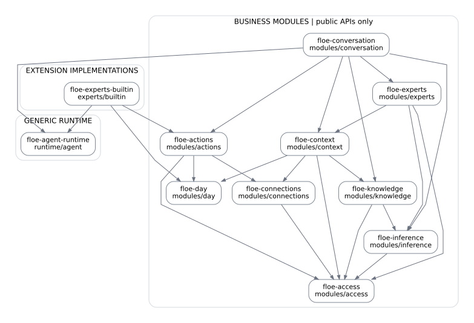
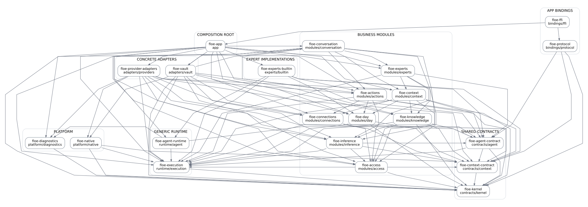

# Floe 안정화 · 모듈형 모놀리스 개선 구현 명세

이 저장소의 구현 명세 사본이다. 원본 첨부와 배정용 자료는 `../../floe-implementation-plan-2026-09-14/`에 보존한다. 본문의 초기 상태 표시는 계획 작성 시점의 값이며, 실제 진행·검증·이동 기록의 유일한 원본은 [migration-ledger.md](migration-ledger.md)다. 실행용 DAG 정책과 검사는 `../../tools/architecture/`를 사용한다.

**문서 버전:** Implementation Plan 1.0 · **작성일:** 2026-09-14 (Asia/Seoul)  
**대상:** `syi0808/floe` · **고정 기준:** `efedfc6089341ed0a480d7401764284fa5e7543e`  
**승인 설계:** 모듈형 모놀리스 아키텍처 v0.2 · **문서 성격:** 구현 작업 지시서. 패치·빌드·실사용 검증 완료 보고서가 아니다.

> 이 문서와 같은 저장소의 코드를 받으면 이전 대화나 설계 문서를 읽지 않고 작업할 수 있도록 요구사항, 변경 경계, 순서, 계약, 금지사항과 검증 조건을 다시 명시한다. 목표는 파일 수를 늘리는 것이 아니라 **대화의 독립적인 가용성, LLM 주도 A2A 위임, 상태의 단일 수정자, 안전한 복구**를 코드와 디렉터리 구조에서 보장하는 것이다.

## 0. 작업자 시작 절차

### 0.1 이 문서가 요청하는 결과

현재 Rust 7개 crate와 Flutter/Go에 분산된 업무 결정을 승인된 Rust 22개 경계, Flutter 읽기 모델, Go 서비스 경계로 재배치한다. 기존 암호화·권한·CAS·외부 실행 기록을 재사용하며, 일반 채팅과 연결 관리가 서로 취소·전역 실패를 일으키는 결합을 제거한다. Calendar를 없애지 않는다. Schedule Expert를 공통 Directory/Task/endpoint 경로로 편입하고 **Calendar 설치 여부에 따른 root 대화 분기**를 없앤다.

이번 범위에는 애플리케이션 소스 리팩터링, 데이터·wire 계약 정리, 회귀 검증, 빌드 경로 갱신, 기존 테스트 및 현행 문서 정리가 포함된다. 새 마이크로서비스, 원격 A2A 서버, 재귀 에이전트 네트워크, 음성·wake·cross-device 신규 기능, Android 기능 확장, Flutter 상태관리 프레임워크 교체는 포함하지 않는다.

### 0.2 먼저 수행할 읽기·확인

1. 작업용 checkout에서 `git status --short`를 확인한다. 기존 사용자 변경을 덮어쓰지 않는다. 이 계획서를 실행한다는 이유로 `git reset --hard`, 데이터 디렉터리 삭제, 외부 provider 해제를 수행하지 않는다.
2. `git rev-parse HEAD`와 아래 기준 커밋을 비교한다. 기준과 같으면 P00부터 시작한다. 달라졌으면 기준→작업 HEAD의 변경을 보존한 채 **심볼과 동작의 차이**를 비교하고 `migration-ledger.md`에 대응 위치를 기록한다. 이전 줄 번호에 텍스트 패치를 강제 적용하지 않는다.
3. 함께 제공한 읽기 전용 도구로 원본 앵커와 목표 DAG를 확인한다. Python 3.11 이상을 사용한다. 코드 변경 전에만 `--check-worktree`를 사용한다.
4. P00의 기존 build/smoke 관측을 기록하고, 작업 패키지 의존 순서대로 진행한다. 모든 패키지를 완료한 뒤에만 테스트하는 방식이 아니다. 각 패키지의 targeted 검증은 해당 패키지 안에서 수행한다.

```bash
# PLAN_DIR은 압축 해제한 이 계획서 폴더, REPO는 실제 Floe checkout이다.
PLAN_DIR=/absolute/path/to/floe-implementation-plan-2026-09-14
REPO=/absolute/path/to/floe

python3 "$PLAN_DIR/scripts/verify_baseline.py" "$REPO" \
  --json-out /tmp/floe-baseline-check.json
python3 "$PLAN_DIR/scripts/check_architecture.py" --policy-only

# 한 변경 지점 확인 예시. 제공 스크립트는 checkout을 수정하지 않는다.
git -C "$REPO" show efedfc6089341ed0a480d7401764284fa5e7543e:crates/floe-agent/src/runtime.rs \
  | nl -ba | sed -n '820,995p'
```

### 0.3 줄 범위와 증거의 의미

`S01` 등의 원본 앵커는 **기준 커밋에서 검토한 1-based inclusive 변경 window**다. 해당 함수의 정확한 전체 시작·종료를 자동 추출한 결과가 아니다. window의 끝이 실제 EOF를 넘으면 EOF까지 읽는다. 각 앵커는 파일, 심볼, 문자 그대로의 검색어, Git blob SHA, 고정 커밋 링크를 갖는다. 새 파일의 미래 줄 번호를 만들어 적지 않는다. 새 코드는 `목표 경로 + 공개 심볼 + 계약`으로 식별한다.

동봉 `verify_baseline.py`는 실제 로컬 Git object에서 SHA와 window 내 검색어를 검사한다. `RANGE_REBASE_REQUIRED`면 같은 기준 파일에서 심볼을 찾아 window를 고치고 그 사실을 기록한다. 이 문서를 작성한 환경에서는 checkout 다운로드의 DNS 제약과 Cargo/Flutter 부재로 **해당 도구를 Floe 원본에 실행하거나 Floe를 빌드하지 않았다**. GitHub 커넥터에서 고정 커밋 소스를 읽어 작성했다. 부록의 소스 window와 작업 처방은 정적 분석이다.

주요 동작 변경은 앵커 단위로 지정한다. 관련 디렉터리 전체의 import·테스트·빌드 경로 이동은 별도 파일 소유권 표로 지정한다. 이것은 전체 파일의 모든 함수가 이미 심층 감사되었다는 주장이 아니다. 현재 코드에 추가 호출자가 있으면 같은 계약으로 이동하고 `migration-ledger`에서 누락 없이 소유권을 배정한다. 소유자를 정하지 않은 파일은 최종 완료에서 허용하지 않는다.

### 0.4 파일 구성과 우선순위

`IMPLEMENTATION_PLAN.md`가 독립형 본문이다. HTML은 같은 내용의 읽기용 표현이다. `work-packages/Pxx.md`는 담당 작업을 분리 배정하기 위한 사본이며, 공통 계약 N01–N12와 검증 Txx는 본문에 포함된다. `data/work-packages.json`, `source-anchors.json`, `acceptance-tests.json`, `module-dependencies.json`은 추적 및 검사에 사용한다.

충돌 시 **보안·복구 불변식 → 승인된 모듈 DAG → 본문의 공개 계약 → 패키지 세부 변경** 순으로 해석한다. 처방이 DAG를 위반하면 무단 의존 추가 대신 owner port를 사용한다. 계약을 바꿔야 하면 이유·대체 불변식·호환 범위를 기록한 작은 ADR로 남긴다. 이전 대화를 다시 묻는 방식으로 작업을 중단할 필요는 없다.

## 1. 제품 요구사항과 실패 정의

### 1.1 해결할 실제 경로

| ID | 현재 경로 | 개선 후 요구 |
|---|---|---|
| F01 | Connect preview → `_perform` → `_drain` → chat stop | 관리 query가 실행을 암묵적으로 취소하지 않는다. |
| F02 | connector catalog 오류 → remote route `null` | 승인된 inference 경로와 소스 관측을 분리한다. |
| F03 | Calendar 활성 → Calendar root 및 Schedule-only cards | 모든 일반 입력은 같은 Manager 경로를 사용한다. |
| F04 | 선택적 memory/tasks/registry 조회 실패 → 시작 실패 | 필수 무결성 실패와 선택적 가용성 실패를 분리한다. |
| F05 | 같은 tool 실패가 발생 위치에 따라 turn halt | 업무 outcome과 경계 fault를 일관되게 해석한다. |
| F06 | 전역 UI busy/fail로 모든 기능 잠금 | 해당 aggregate의 상태와 필요한 공통 gate만 반영한다. |
| F07 | Controller/Gateway/Worker가 각자 run 상태 소유 | Rust Run/Task/Operation별 단일 수정자를 둔다. |
| F08 | Connect 조회에 reconciliation 변경 포함 | query·command·관측·projection 갱신의 성공을 구별한다. |
| F09 | OAuth timer 취소 뒤 Future 미완료 | 모든 소유 task는 종료·취소·중단 상태로 정리된다. |
| F10 | 초기 원인 소실, 최종 reply와 job 완료 혼동 | 원인·영향 범위·복구 결정·응답 결과를 구별해 기록한다. |
| F11 | 영속 transcript와 모델 입력·journal 수명 결합 | 제한된 모델 context와 영속 복구 기록을 분리한다. |
| F12 | UI fake의 보장이 전체 제품 보장으로 오해됨 | 실제 composition 검증과 UI·실제 모델 평가를 구별한다. |
| F13 | README·검증 기록의 현재 상태 불일치 | 현재 코드 설명 한 곳과 날짜 고정 증거를 분리한다. |
| F14 | Widget/FFI에 업무 조립·provider 분기 | 업무 모듈, binding, adapter, composition 책임을 분리한다. |

### 1.2 구현을 제한하는 불변식

| ID | 반드시 유지할 규칙 |
|---|---|
| I01 | root 대화 진입점은 하나다. Calendar 연결·Expert 설치·질문 keyword로 다른 root를 고르지 않는다. |
| I02 | host는 적격성·권한·예산, Manager LLM은 위임 필요성과 대상, dispatcher는 AgentId lookup을 담당한다. |
| I03 | Session/Run, Task, Connection Operation은 각각 하나의 업무 모듈만 수정한다. 읽기 snapshot은 복제 가능하지만 독립적인 사실 확정은 금지다. |
| I04 | 순수 관리 조회·preview·UI unsubscribe·poll timeout은 명시적 cancel이 아니다. |
| I05 | 같은 Session의 root는 하나만 실행한다. 모델 대기 중 전역 Vault lock/DB transaction을 점유하지 않는다. |
| I06 | Person/기기/수신자/자원/목적/consumer/authority·revision 검사를 보존한다. manifest와 모델 출력은 권한을 부여하지 않는다. |
| I07 | source 획득·모델 dispatch·결과 release를 실제 권한으로 검사한다. 철회 강제는 이벤트 listener 성공에 의존하지 않는다. |
| I08 | 파생 artifact와 summary는 provenance·처리 제한을 상속한다. unknown provenance를 independent로 만들지 않는다. |
| I09 | 수락된 command와 task의 ID를 응답 유실에도 유지한다. blind replay로 외부 side effect를 중복 실행하지 않는다. |
| I10 | terminal state와 session claim 해제는 backend 책임이다. UI Release가 다음 대화의 전제가 아니다. |
| I11 | 자식 cancel/timeout은 부모·형제에 역전파하지 않는다. 부모 cancel은 소유 자식에게 전파하고 cleanup을 관측한다. |
| I12 | 실행 실패와 사용자 reply 결과를 구별한다. finalization은 승인된 context·모델·남은 예약 예산에서만 허용한다. |
| I13 | feature는 다른 feature private controller를 import하지 않는다. Flutter는 앱 수명의 읽기 모델과 command facade를 이용한다. |
| I14 | target 업무/runtime crate는 concrete builtin/Vault/provider/FFI에 의존하지 않는다. service locator로 우회하지 않는다. |
| I15 | crypto·키·signed challenge format·source privacy·CAS·action ledger 테스트를 느슨하게 해서 green으로 만들지 않는다. |
| I16 | 실제 장애 재현/host smoke/LLM eval을 실행하지 않았다면 Pending 또는 Blocked로 보고한다. test 개수는 acceptance 대체물이 아니다. |

일부 공통 장애는 넓은 영향을 줄 수 있다. Vault lock/무결성 손상은 그 Vault의 민감 처리 전체를 봉인할 수 있다. 공유 프로세스 OOM·abort·메모리 손상은 이 설계의 오류 격리 범위 밖이다. “어떤 오류에도 LLM이 반드시 답한다”가 아니라 **허용된 처리와 명확한 사용자 결과를 최대한 보존한다**가 목표다.

## 2. 목표 모듈과 단일 수정자

Rust target package와 경로·허용 의존성은 아래 자동 포함 표 및 `data/module-dependencies.json`을 그대로 사용한다. dependency는 허용 목록이지 무조건 전부 Cargo.toml에 추가할 목록은 아니다. 실제로 쓰는 의존성만 선언한다. 내부 implementation/domain은 private로 두고 deliberate `api`, `ports`만 노출한다.

### 목표 22개 crate — 승인된 직접 의존 허용 목록

화살표/목록은 compile-time의 직접 의존이다. 이름이 비슷해도 concrete extension과 Expert 관리 모듈은 다르다.

| package / 목표 경로 | 공개 책임 | 허용 내부 의존 |
|---|---|---|
| `floe-kernel`<br>`crates/contracts/kernel` | IDs, small shared values | 없음 |
| `floe-context-contract`<br>`crates/contracts/context` | Source views, provenance, recipient types | `floe-kernel` |
| `floe-execution`<br>`crates/runtime/execution` | Cancellation, budget, task handles; no business state | `floe-kernel` |
| `floe-agent-contract`<br>`crates/contracts/agent` | Card / Message / Task / Artifact, endpoint ports | `floe-kernel`, `floe-context-contract`, `floe-execution` |
| `floe-diagnostics`<br>`crates/platform/diagnostics` | Safe trace, correlation, diagnostic export | `floe-kernel` |
| `floe-agent-runtime`<br>`crates/runtime/agent` | Role-neutral LLM / Tool / Delegate loop | `floe-agent-contract`, `floe-execution`, `floe-diagnostics` |
| `floe-access`<br>`crates/modules/access` | Authority, dispatch/release permits, vault epoch | `floe-kernel`, `floe-context-contract`, `floe-execution` |
| `floe-connections`<br>`crates/modules/connections` | Connection intent, observations, OAuth / pairing operations | `floe-kernel`, `floe-context-contract`, `floe-execution`, `floe-access` |
| `floe-inference`<br>`crates/modules/inference` | Model profiles, invocation routing, approved dispatch | `floe-agent-contract`, `floe-context-contract`, `floe-execution`, `floe-access` |
| `floe-knowledge`<br>`crates/modules/knowledge` | Memory / Playbook records and bounded learning | `floe-kernel`, `floe-agent-contract`, `floe-context-contract`, `floe-execution`, `floe-access`, `floe-inference` |
| `floe-day`<br>`crates/modules/day` | Calendar mirror, tasks, notes, Day Canvas projection | `floe-kernel`, `floe-context-contract`, `floe-execution` |
| `floe-context`<br>`crates/modules/context` | Authorized projections, lazy source reads, provenance | `floe-agent-contract`, `floe-context-contract`, `floe-execution`, `floe-access`, `floe-connections`, `floe-knowledge`, `floe-day` |
| `floe-actions`<br>`crates/modules/actions` | Proposal review, idempotent actions, reconciliation | `floe-kernel`, `floe-context-contract`, `floe-execution`, `floe-access`, `floe-connections`, `floe-day` |
| `floe-experts`<br>`crates/modules/experts` | Directory, eligibility, task owner, ID-to-endpoint dispatch | `floe-agent-contract`, `floe-execution`, `floe-context`, `floe-inference`, `floe-access` |
| `floe-conversation`<br>`crates/modules/conversation` | Session, root run, transcript, finalization | `floe-kernel`, `floe-agent-contract`, `floe-execution`, `floe-agent-runtime`, `floe-context`, `floe-inference`, `floe-experts`, `floe-knowledge`, `floe-actions` |
| `floe-experts-builtin`<br>`crates/experts/builtin` | 8 independent expert folders; registered endpoint factories | `floe-agent-contract`, `floe-agent-runtime`, `floe-context-contract`, `floe-execution`, `floe-actions`, `floe-day` |
| `floe-native`<br>`crates/platform/native` | Apple / Android host drivers and key access | `floe-kernel`, `floe-context-contract`, `floe-execution` |
| `floe-provider-adapters`<br>`crates/adapters/providers` | models/, sources/, control/; HTTP and OS adapters | `floe-agent-contract`, `floe-context-contract`, `floe-execution`, `floe-diagnostics`, `floe-native`, `floe-inference`, `floe-context`, `floe-connections`, `floe-actions`, `floe-access` |
| `floe-vault`<br>`crates/adapters/vault` | Encrypted engine and module-specific repository adapters | `floe-kernel`, `floe-execution`, `floe-native`, `floe-conversation`, `floe-experts`, `floe-connections`, `floe-inference`, `floe-access`, `floe-knowledge`, `floe-actions`, `floe-day` |
| `floe-app`<br>`crates/app` | Composition root and typed service handles only | `floe-conversation`, `floe-experts`, `floe-connections`, `floe-inference`, `floe-access`, `floe-context`, `floe-knowledge`, `floe-actions`, `floe-day`, `floe-experts-builtin`, `floe-provider-adapters`, `floe-vault`, `floe-diagnostics`, `floe-execution` |
| `floe-protocol`<br>`crates/bindings/protocol` | Versioned app wire DTOs; no execution policy | `floe-kernel`, `floe-agent-contract`, `floe-context-contract` |
| `floe-ffi`<br>`crates/bindings/ffi` | ABI, host lifetime, DTO conversion | `floe-app`, `floe-protocol` |





### 2.1 소유권 세부 규칙

| 사실 | authoritative owner | 다른 모듈이 받는 것 |
|---|---|---|
| Session·transcript·Run·사용자 command receipt | conversation | SessionRef/RunSnapshot/안전한 TranscriptProjection |
| Agent definition/enablement, A2A Task | experts | CardProjection/TaskRef/허용된 TaskReceipt |
| 실제 in-memory task handle·취소·예산 예약 | execution의 기계장치, handle 소유자는 각 업무 모듈 | child scope와 join 관측; 업무 상태 원본 아님 |
| Connection intent·observed state·operation | connections | ConnectionSnapshot/ConnectionRef; 외부 사실은 provider가 원본 |
| profile·model attempt·route decision | inference | PlannedRoute/AttemptReceipt; 원시 credential은 포함하지 않음 |
| grant·권한 epoch·논리적 Vault access gate | access | 불투명 permit와 SafeAccessState |
| 물리적 키·암호화 DB·실제 저장 건강 | vault/native adapter | Access에 보고하는 typed health; 별도 grant 판단 금지 |
| context/provenance/lease | context | AuthorizedProjection/ObservationRef/DependencyCoverage |
| memory·playbook·learner candidate | knowledge | 승인된 revision projection; 독자 transcript 원본 없음 |
| approval/action/external effect receipt | actions | ActionRef/ActionSnapshot; Task 완료와 별개 |
| Calendar mirror·Task·Note·Day Canvas | day | typed query/command DTO; Connection intent 복사 없음 |
| 화면 draft·scroll·focus | Flutter feature | 순수 UI 상태 |

모델 attempt의 lifecycle은 inference가 한 번 기록한다. runtime의 structured-output correction은 **다음 attempt를 요청하는 결정**이며 같은 attempt의 별도 원본 ledger를 만들지 않는다. 부모 Run의 usage는 중앙 budget ledger가 집계한 projection이다. 기존 model journal은 이 소유권으로 이관하되 원격 호출 전 durable intent와 settlement를 잃지 않는다.

### 2.2 DAG 때문에 주의할 경계

`knowledge → conversation`, `connections → day`, `inference → connections`, `builtin → context service`, `protocol → 업무 모듈`은 target 허용 간선이 아니다. 각각 다음 방식으로 해결한다.

- Knowledge가 학습할 대화는 conversation이 발행한 revision·coverage가 있는 **LearningEvidenceSnapshot**으로 받는다. 원본 재검증은 owner-defined evidence port와 동일 Vault의 좁은 storage admission에서 수행한다. Knowledge가 ConversationService를 조회하는 서비스 로케이터는 금지다.
- Connection reconciliation이 Day mirror에 적용될 때는 connection의 변경 결과를 application의 **명시적 통합 adapter**가 `Day.ApplyObservation`에 전달한다. 정책은 Connections·Day가 각자 검증한다. `floe-app`에 provider별 판단 if를 넣지 않는다. 실패는 연결 성공과 mirror 갱신 실패로 따로 기록한다.
- Inference는 model profile과 transport access port를 받는다. 같은 Go 서버의 인증 handle을 재사용할 수 있지만 connector catalog를 호출해 route를 결정하지 않는다.
- Builtin은 contract에 정의된 `ScopedToolPort`, context view 값, `ModelPort`, Action proposal API만 받는다. 전체 ContextService/App/Vault를 주지 않는다.
- Protocol에는 wire 값만 둔다. 업무 DTO 변환은 FFI의 **free function**으로 구현한다. 서로 외부 타입인 `From<Domain> for Wire`를 FFI에서 무리하게 구현해 Rust orphan rule을 피하려 하지 않는다. `floe-app::api`는 필요한 업무 API를 명시적으로 re-export할 수 있다.

### 2.3 저장 projection 및 native의 의존성 해석

Context의 provenance 계산·lease state는 Context가 소유하지만, 대화 output/Task artifact와 함께 영속되는 coverage의 쓰기는 그 output owner의 repository transaction으로 수행한다. Context가 필요로 하는 EvidenceReader/ArchiveReader는 Conversation/Experts가 자기 repository 위에 구현하여 주입한다. 이 둘은 Context에 의존할 수 있다. 반대로 Context는 Conversation/Experts를 import하지 않고, Vault는 Context implementation을 import하지 않는다. read facade는 서비스끼리의 재귀 호출이 아니라 repository-backed projection이다.

`floe-native`에는 kernel/context-contract/execution의 값과 raw OS driver만 들어간다. ModelRunner/ContextService/VaultRepository 구현은 상위 adapter가 감싼다. `floe-app`은 native를 직접 import하는 간선을 추가하지 않고 provider/vault factory를 통해 native handle을 조립한다. 공통 trace 식별 값은 kernel/execution에서 전달하고 diagnostics sink는 App에서 설치한다. 업무 모듈에 새로운 diagnostics 내부 의존을 무조건 추가하지 않는다.

## 3. 공개 계약 N01–N12

아래 이름은 구현에서 사용할 목표 심볼이다. 완성 Rust 코드를 가장한 스케치가 아니라 **입력·출력·상태 전이의 명세**다. 세부 generic lifetime은 실제 기존 port에 맞추되 기능별 변경 권한과 결과 의미를 바꾸지 않는다.

### N01. command 수락 및 멱등성

```text
StartTurn {
  command_id: UUID,
  session_id: UUID,
  expected_revision: u64,
  text: UTF-8,
  mode: NewTurn | Continue { continuation_ref }
}
→ CommandReceipt { command_id, status: Accepted | Rejected,
                   run_id?, aggregate_revision?, issue? }

GetCommand(command_id) → Receipt | Unknown
GetRun(run_id) → RunSnapshot | NotFound | AccessDenied
CancelRun(command_id, run_id, reason: UserRequested)
  → Requested | AlreadyTerminal | NotFound
```

principal/person/device는 AppHost의 검증된 호출 context에서 얻고 DTO와 대조한다. 단순 Person 문자열을 신뢰하지 않는다. 최초 호출 전 command ID를 생성한다. `(principal, command_id)`별 canonical payload digest를 저장한다. 같은 digest면 같은 receipt를 반환하고, 다른 digest면 `CommandIdConflict`로 거절한다. 수락 transaction은 사용자 message, initial Run, session claim, receipt를 함께 저장한 뒤 commit한다. commit 실패 시 Accepted라고 응답하지 않는다. 재전송이 새 turn을 만들면 안 된다.

새 시도와 transport 재시도는 다르다. 사용자가 Retry를 누르면 명시적 새 command를 생성하되 이전 Run과 `retry_of`를 기록한다. 읽기 재시도도 외부 action replay를 포함하지 않는다. 최초 생성 전 실패한 ID는 `Unknown`일 수 있으므로 같은 ID·payload로 수락을 재시도한다.

### N02. Session/Run과 terminalization

```text
RunState = Accepted | Executing | Finalizing | Cancelling | Finished
RunSnapshot { id, session_id, revision, runtime_epoch, executor_generation,
              state, progress, task_refs[], attempt_refs[], report? }
TurnReport { execution: Completed | Partial | Blocked | Failed | Cancelled | Indeterminate,
             reply: Generated | PolicyNotice | NotProduced,
             issues[], action_refs[], final_message_ref? }
```

같은 Session에 active root 하나만 허용한다. 두 번째 신규 command는 `SessionBusy(active_run_id)`로 거절한다. 현재 사용자 요구 범위에서는 암묵적 queue·새 질문으로 기존 실행 취소를 구현하지 않는다. terminal CAS는 Run final report와 session claim 해제를 같은 짧은 저장 경계에서 수행한다. terminal 이벤트가 유실되어도 GetRun으로 결과를 조회한다. 저장 실패 중 영속 Finished를 주장하지 않는다. 재시작 시 이전 runtime epoch의 nonterminal Run은 Interrupted/RecoveryRequired report로 조정하고, 완료된 action/task를 자동 replay하지 않는다.

Run 실행권은 논리적 소유권이다. 모델 HTTP를 기다리는 동안 session claim은 유지해도 전역 Vault mutex/DB transaction은 유지하지 않는다. old `Release`는 관측 handle 해제 의미로만 일시 유지할 수 있고, final target API의 필수 단계가 아니다.

### N03. generic engine / role-neutral journal

```text
AgentEngine.drive(EngineRequest, EnginePorts) → EngineReport
EngineRequest = role_spec + prompt + scope + bounded_context + allowed_catalog
EnginePorts = ModelPort + ToolPort + DelegationPort + ExecutionJournal
EngineStep = Preamble | Answer | CallTool | Delegate
```

runtime은 `manager_prompt()`를 고정 호출하지 않는다. Manager role은 ConversationService가, Expert role은 해당 endpoint가 주입한다. 최종 payload validator도 역할에 따라 주입한다. Manager는 사용자 답변, Expert는 자연어 요약+허용된 artifact를 반환한다. Engine은 Session/Task의 authoritative 상태를 직접 정의·수정하지 않는다. owner가 구현한 `ExecutionJournal`은 `record_intent`, `record_observation`, `record_output`, `checkpoint`를 받아 해당 aggregate revision에서 저장한다.

기존 started/settled 기록과 durable acknowledgement 이전 dispatch 금지는 유지한다. journal ack에 실패하면 다음 외부 호출을 하지 않는다. Context 한도/invalid-output 교정/iteration 제한을 유지하되 미등록 tool은 실행 금지 + bounded correction/안전한 observation으로 다룬다. 잘못된 identity·서명·허가증은 correction으로 정상화하지 않는다.

### N04. Directory·Task·Endpoint

```text
ListCards(scope) → CatalogSnapshot { revision, cards[], issues[] }
Delegate {
  task_id, parent_run_id, invocation_key, selected_agent_id,
  selected_definition_revision, message_parts, context_refs
}
→ TaskReceipt { task_id, revision, state, result_refs?, issue? }
GetTask(task_id) → TaskSnapshot
CancelTask(command_id, task_id) → Requested | AlreadyTerminal
```

Manager가 고른 `AgentId`만 registry에서 resolve한다. arbitrary URL·grant·credential을 모델 출력으로 받지 않는다. 적격성 재검증은 현재 설치/assignment/descriptor revision/consumer/purpose와 필요한 model capability를 확인한다. Directory는 source payload를 선행 읽거나 매 turn builtin install을 하지 않는다.

Task 상태는 `Submitted → Working → Completed | Failed | Rejected | Cancelled | TimedOut | Interrupted`로 소유 모듈에서만 전이한다. 성공 reply는 Completed의 일부 결과이고, 요구 승인/권한 거절은 Rejected와 typed recovery request로 표현한다. 초기에 multi-message input-required workflow는 구현하지 않는다. 외부 A2A binding이 필요해질 때 표준 status 매핑을 따로 검증한다.

endpoint는 `AgentEndpoint::execute(EndpointRequest, ScopedPorts) → EndpointReport`로 결과를 반환한다. object-safe 등록을 위해 `Pin<Box<dyn Future<Output=...> + Send + 'a>>` 경계를 사용하거나 동등한 명시 adapter를 만든다. `impl Future` trait를 확인 없이 `dyn`으로 cast하지 않는다. native thread-affine 구현은 전용 thread mailbox proxy 뒤에 둔다. `unsafe impl Send`는 해결책이 아니다.

TaskId를 부모의 delegation intent에서 먼저 고정·저장하고, Experts가 같은 task/payload의 admission을 멱등 처리한다. 자식 결과 수신 전 parent crash가 발생해도 새 TaskId로 재실행하지 않는다. endpoint는 별도 authoritative Task map을 보유하지 않는다.

### N05. 실행 scope·취소·budget

```text
ExecutionScope { scope_id, parent_scope_id?, root_run_id?, task_id?,
                 cancellation, deadline, budget_lease, trace_context }
```

부모 cancel은 자식에, 자식 cancel은 그 아래에만 전파한다. 기존 watch Sender를 모든 scope에 clone하는 대신 실행 모듈에 child 기능을 구현한다. tokio-util을 채택하면 버전을 검증·고정하고 별도 의존 변경으로 기록한다. custom 구현을 유지하면 동일 cancellation semantics 테스트를 통과해야 한다.

총 허용량 안에서 `work_budget + finalization_reserve`를 배정한다. 초기 reserve는 **최대 1회, 출력 1,024 tokens, 남은 전체 wall deadline 내 최대 10초**를 기본 후보로 두고 configurable하게 한다. 이 수치는 검증된 성능값이 아니라 구현 시작값이다. root budget보다 작게 clamp하며 추가 과금·시간 한도를 늘리지 않는다. 전체 context/input 비용을 포함한 실제 provider usage를 중앙 ledger에 한 번만 settle한다. 한 번의 실패마다 여러 레이어에서 4,096 tokens를 중복 차감하지 않는다. unknown usage는 bounded estimate로 구별해 기록한다.

모델별/제공자별 concurrency, pending queue, context bytes를 제한한다. foreground와 learner는 별도 budget·우선순위를 갖고 learner 취소로 root token을 취소하지 않는다. deadline은 monotonic time, wire expiry는 wall time으로 명시 변환한다.

### N06. 결과·오류·안전한 마무리

```text
CallOutcome<T> = Completed(T, provenance)
              | Denied(ScopedIssue)
              | Unavailable(ScopedIssue)
              | RequiresApproval(ApprovalRequest)
              | TimedOut(ScopedIssue)
              | Cancelled(CancelReason)
BoundaryFault = origin + reason + affected_scope + incident_id + safe_cause
```

업무 실패는 정상 typed outcome이다. transport/protocol fault도 affected scope에 따라 child 또는 root로 격리한다. host integrity/Vault corruption을 빈 결과로 대체하지 않는다. 동일 실패를 stage 문자열로 여러 번 새로 추정하지 않는다. `safe_actions`는 실제 제공하는 API만 포함한다. “continue_without_source”가 반환되면 exclusion된 context를 재구성하는 명령도 있어야 한다.

root는 usable evidence와 승인된 모델이 있으면 제한된 tool-free finalization을 수행한다. 사용자 취소·Vault lock·수신 동의 없음·예산 없음이면 모델을 추가 호출하지 않는다. deterministic notice를 UI에 전달하되 이를 LLM 답변으로 표시하지 않는다. 실행 blocked/failed 사실을 성공으로 덮지 않는다.

### N07. Context·provenance·release

```text
ContextProjection { projection_id, revision, permitted_messages[],
                    dependency_coverage, recipient, purpose, consumer,
                    vault_epoch, authority_versions, byte_budget }
DependencyCoverage = Independent | Dependent(nonempty dependencies) | Unknown
```

사용한 Observation/Grant/Source/Recipient에 대한 dependency만 붙인다. discovery를 위해 읽은 모든 card를 data dependency로 넣지 않는다. summary·artifact·후속 추론에는 입력 dependency를 전이적으로 병합한다. 기존 Calendar-prefix history guard를 제거하기 전에 동일 또는 더 엄격한 source-independent 검증이 있어야 한다.

Access는 불투명 `AcquirePermit`, `DispatchPermit`, `ReleasePermit`를 발급·검증한다. wire Deserialize로 이 permit을 만들지 않는다. Source dispatch, Model dispatch, Artifact→Manager, 출력→UI/저장/검색의 각각 수신 경계에서 검증한다. vault epoch 변경 후 UI가 오래된 sensitive snapshot을 적용하지 않게 한다.

철회는 해당 authority/version과 fence를 저장 경계에서 갱신한 뒤 ack한다. 이후 새로운 dispatch/release는 새 버전으로 거절된다. cancellation 통지는 보조 수단이다. 이미 전송된 데이터는 회수하지 못한다. source 없이 계속하기는 원문·파생 artifact·pending response·모델 대화 state를 버리고 독립 입력부터 재구성한 새로운 inference attempt다.

### N08. Inference 계획

```text
PlanInference { purpose, requested_capabilities, input_classification,
                consumer, recipient_constraints, preferred_profile_id? }
→ PlannedRoute | ConsentRequired | ModelUnavailable
Generate(planned_route, authorized_projection, scope) → ModelResult/AttemptReceipt
```

root와 Expert마다 계획한다. source provider enum이나 parent 모델이 Foundation인지로 자식 모델을 강제하지 않는다. source local-only이면 해당 invocation의 허용 수신자를 제한한다. Local Expert 결과를 원격 Manager에게 보내는 것도 별도의 release다. 같은 서버의 model endpoint가 정상일 때 catalog 403/timeout으로 route를 `None` 처리하지 않는다.

model transport URL·bearer 검증은 adapter에 남긴다. source authorization challenge/read/release는 source/control adapter로 이동한다. 모델 adapter가 Calendar connection 목록을 검증하거나 source 읽기 책임을 갖지 않는다. route 변경은 이유와 consent scope를 기록하며 사전 승인된 후보 내에서만 fallback한다.

### N09. Connection operation

```text
QueryConnections() → snapshots                     # side-effect 없음
RefreshConnections(command_id, selected_refs) → operation_receipt
BeginPairing / BeginOAuth(command_id, config) → operation_id
ConfirmGrant(command_id, reviewed_fingerprint, expected_authority, scope) → receipt
CancelOperation(command_id, operation_id) → receipt
Disconnect(command_id, connection_id, expected_revision) → receipt
```

intent, observed provider state, latest operation, refresh health를 별도 필드로 둔다. refresh 실패는 stale/unknown 관측이지 disconnect가 아니다. command 성공과 파생 read-model/Day 갱신 실패는 별도 상태다. completion은 application 수명으로 유지하며 화면 dispose는 subscription 해제다. 사용자 Cancel은 명시적 operation을 끝낸다. deep link/open URL 요청은 operation_id·expiry와 묶어 전달한다.

원격 provider command를 보냈으나 ack가 유실되면 remote operation_id로 조회한다. 원격 API에 멱등성/조회가 없으면 로컬 commandId만으로 exactly-once라고 하지 않는다. `Indeterminate`와 reconciliation을 사용하고 새로운 외부 command를 자동 제출하지 않는다.

### N10. Action·Knowledge 경계

Action proposal은 typed candidate와 provenance·동결한 payload digest로 저장한다. approval은 그 candidate revision·scope·recipient·expiry에만 적용한다. 실행 전 intent, 이후 confirmed/indeterminate receipt를 기록한다. cancel은 이미 dispatch한 provider write의 미실행 증거가 아니다. 현재 구현된 Calendar create/update 등 실제 지원 action 범위를 그대로 보존하며 새 action을 암묵적으로 허용하지 않는다.

Knowledge 학습에는 completed/settled evidence revision과 접근 범위를 명시한다. 기존 `stage_memory_candidate`의 no-active/pending, 실제 turn membership, Personal class, independent evidence, dedup 및 base revision 검증을 유지한다. Context가 Knowledge를 호출하면서 Knowledge가 다시 Context/Conversation을 호출하는 cycle을 만들지 않는다. 학습 projection은 입력 port로 주입한다. learner의 실패는 지식 후보의 issue이고 chat/Vault 전역 실패가 아니다. 단 Vault 실제 integrity fault는 그대로 propagate한다.

### N11. wire·snapshot·Flutter

새 app JSON envelope의 `schema_version`은 **2**로 고정한다. 이는 앱 내부 command/query/events 계약 버전이며 A2A protocol version이나 Go provider API 버전을 바꾸는 뜻이 아니다. 새 commandId/run/task API는 `floe_core_command_v2`, `floe_core_query_v2`, `floe_core_events_v2`로 노출한다. 입력·출력은 기존 C ABI 문자열 소유 규칙을 유지한다. `floe_core_open`, `floe_core_free`, `floe_string_free`, `libfloe_ffi` 파일명은 유지한다. `floe_protocol_version()`은 전환 후 2를 보고한다. 구형 frontend에는 side-effect 전 명시적인 unsupported-version 오류를 반환한다.

기존 `PROTOCOL_VERSION`을 전역적으로 2로 치환하지 않는다. `APP_WIRE_VERSION = 2`와 provider/control/native/model 계약의 기존 schema 상수를 분리한다. provider request·signed challenge의 schema 1은 바뀌지 않는다. 버전 분리가 끝나기 전에 serializer 공통 상수를 교체하면 정상 연결을 깨뜨릴 수 있다.

Protocol 원본은 `crates/bindings/protocol/src/dto/`의 wire 타입과 직렬화 계약이다. Dart는 해당 공개 wire schema에서 생성하거나 **하나의 정의 + cross-language golden roundtrip** 방식으로 동등성을 검사한다. 초기에는 기존 serializer를 보존하고 신규 subset을 생성 대상으로 좁힌다. 생성 도구 도입 전에 v2 golden 계약부터 고정한다. 여러 Dart feature에 수동 fromJson을 복제하지 않는다.

`Subscribe/ReadEvents`는 cursor 및 aggregate revision/runtime epoch를 제공한다. event lag는 `ResyncRequired`다. snapshot+cursor bootstrap은 동일 관측 경계 또는 subscribe-buffer-snapshot 순서로 유실을 막는다. terminal receipt는 event buffer와 별도로 영속 조회한다. 느린 UI가 모델을 취소하거나 무제한 event buffer를 만들지 않는다.

Flutter `FloeClient`는 요청 map·응답 correlation·subscription만 소유한다. `AppReadModel`은 reducer/selector를 모으며 backend 상태를 임의 확정하지 않는다. 로컬 command ack 대기와 backend Run 실행을 다른 상태로 보여준다. draft/focus/scroll을 제외한 도메인 상태를 Widget lifecycle에 묶지 않는다.

### N12. 검증·로그·문서 계약

첫 실패 경계는 safe cause/incident를 생성하고, 복구를 결정하는 모듈이 recovery decision을 기록한다. request/command/run/task/attempt/operation을 구별한다. 모든 새 로그에 개인정보 원문·token·prompt·model output을 넣지 않는다. 모델 결정을 감사할 때 hidden reasoning이 아니라 선택된 AgentId·공개 작업 목표의 안전한 메타데이터와 결과를 사용한다.

테스트는 보호하는 Ixx/Txx, 실제 통과 모듈, 외부 대역, host 제한을 명시한다. 기존 좋은 CAS/replay/privacy regression은 유지한다. prompt-only/UI fake만으로 제품 acceptance를 선언하지 않는다. 날짜 고정 validation과 현재 architecture는 다른 문서다.

## 4. 저장소·원자성·재시작 명세

### 4.1 초기 물리 저장 결정

암호화된 Agent Vault와 기존 Day store의 물리 분리를 초기에는 유지한다. 이번 리팩터링을 이유로 새 범용 DB·암호화 포맷·마이그레이션 플랫폼을 도입하지 않는다. `floe-vault`는 기존 암호화 엔진과 Day repository adapter를 수용하지만 사용자 데이터의 보안 등급을 낮추지 않는다. 이미 보호된 데이터를 plaintext Day store로 옮기지 않는다.

로컬 테스트 데이터의 구형 payload 호환은 필수가 아니다. **초기 데이터 전환 기본값은 별도 새 개발 DB 경로로 시작하고 구형 디렉터리를 그대로 보존**하는 것이다. 자동 reset/migrate는 하지 않는다. 실제 데이터 import가 요구되면 별도 명시 작업으로 처리한다. signed remote credential/authority가 묶인 저장소를 재생성한 경우 기존 서버 권한은 살아 있을 수 있으므로 새 로컬 identity와 구분·재페어링한다. provider revoke/delete를 자동 수행하지 않는다.

### 4.2 논리 namespace와 transaction

| namespace / record | owner | 원자적으로 묶을 것 |
|---|---|---|
| conversation_commands, sessions, runs, session_claims, transcript_entries | conversation | receipt + user entry + initial Run + claim; terminal report + claim 해제 |
| delegation_intents (parent journal) | conversation 또는 child engine owner | task ID와 replay identity를 모델 다음 진행 전 확정 |
| expert_definitions, expert_tasks, task_receipts | experts | task admission/dedup + initial state; terminal + artifact refs |
| inference_attempts | inference | dispatch intent → usage/result settlement; same AttemptId 재조회 |
| source_grants, authority_versions, cleanup_queue | access | epoch 변경 + invalidation/cleanup intent; release gate 확인 |
| context_dependencies, result_coverage, archives | owner port를 통한 context provenance / conversation archive | output commit과 coverage, archive와 summary coverage |
| connections, connection_operations | connections | explicit intent + operation receipt; refresh state는 별도 |
| action_ledger, action_receipts | actions | approved payload+dispatch generation; confirmation/indeterminate |
| knowledge_candidates/revisions/decisions/learner_jobs | knowledge | evidence check+candidate dedup; approved revision+decision |
| calendar_mirror/tasks/notes/day projection | day | 해당 aggregate revision과 적용된 observation |

표의 이름은 **목표 논리 namespace**다. 물리 table 이름 변경이 필수는 아니다. 기존 SQL/schema를 유지하고 adapter method로 매핑해도 된다. 단 raw SQL connection을 업무 모듈 밖으로 노출하거나 다른 owner의 table을 임의 수정하게 만들지 않는다.

Run repository port는 `admit_turn`, `load_run`, `append_checkpoint`, `finish_run`, `claim_recovery`와 같이 구체적인 원자 작업을 제공한다. generic `save<T>` 조합으로 다중 쓰기를 원자적이라고 부르지 않는다. 단일 물리 DB의 cross-owner validation이 필요하면 **각 owner가 만든 immutable admission payload**를 검증하는 좁은 adapter transaction으로 표현한다. adapter가 새로운 업무 정책을 결정하지 않는다.

### 4.3 실행과 종료 알고리즘

1. Admission은 session revision/claim과 commandId를 transaction에서 검사하고 저장한다.
2. commit 이후 소유 task handle을 spawn하고 Run state를 진행한다. spawn 실패는 저장된 Run에 terminal failure를 기록하고 claim을 해제한다.
3. task/model/tool 외부 dispatch 전에 stable intent ID와 budget reservation을 checkpoint한다. ack 실패면 외부 요청하지 않는다.
4. 응답은 current generation·identity·authority·coverage를 검증하여 commit한다. 늦은 이전 실행자의 응답은 현재 state를 덮어쓰지 못한다.
5. 모든 정상 종료 경로는 idempotent terminal CAS로 모은다. double terminal은 성공처럼 두 번 기록하지 않고 같은 receipt를 반환한다.
6. shutdown은 새 admission을 막고 소유 scope를 취소·join한다. 한도 안에 종료되지 않은 task는 중단 가능 상태로 기록한다. 프로세스 강제 종료 중 저장 성공을 보장하지 않는다.
7. 재시작은 새 runtime epoch로 unfinished record를 조회한다. settled external action은 replay하지 않는다. uncertain action은 Actions가 조회/reconcile하고, 대화는 필요 시 사용자의 새 명시 command로 진행한다.

### 4.4 이행 중 빌드를 유지하는 규칙

P01–P12는 leaf 계약·업무 정책·ports를 먼저 추출해 개별 컴파일 가능하게 한다. concrete store는 P13, provider는 P14에서 연결한다. 이때 구형 production entry는 아직 사용할 수 있으나 신규 target crate가 구형 `floe-core/floe-agent/floe-infra/floe-domain`를 import해서는 안 된다. 필요한 임시 어댑터는 **구형 FFI/composition 쪽**에 두고 종료 패키지를 ledger에 적는다.

같은 package 이름을 두 디렉터리에서 동시에 workspace member로 등록하지 않는다. `floe-agent-contract`, `floe-protocol`, `floe-ffi`는 경로를 옮길 때 기존 manifest 참조를 한 commit에서 갱신한다. 기존 타입 소비자는 명시적 재수출/변환으로 옮기되 타입의 authoritative 정의는 하나다. 신규 업무가 legacy 구현을 다시 호출하는 양방향 bridge는 금지다.

P16에서 신규 AppHost를 실제 ABI에 연결하고, P17–P19에서 같은 배포에 포함될 Flutter client를 전환한다. **출시 가능한 전환 단위는 Rust·Flutter·필요한 Go 계약이 함께 작동하는 통합 게이트**다. 개발 브랜치 중간 commit의 라이브 사용을 강제하지 않는다. 정상 production에서 old/new root를 동시에 실행하거나 결과를 비교한다며 외부 요청을 두 번 보내지 않는다.


## 5. 실행 작업 패키지와 의존 순서

26개 작업 패키지다. 번호는 참조용이며 **선행 dependencies가 먼저**다. P14 native/provider factory가 P13 Vault concrete build보다 먼저 필요한 것처럼 번호와 실제 실행 순서가 다를 수 있다. P20 Go 추출은 공개 계약을 보존하면서 병렬 진행할 수 있다.

**실행 가능한 한 가지 순서:** `P00 → P01 → P02 → P20 → P03 → P04 → P05 → P06 → P07 → P10 → P08 → P09 → P11 → P14 → P12 → P15 → P13 → P16 → P17 → P18 → P19 → P21 → P22 → P23 → P24 → P25`

| ID | 구현 단위 | 선행 패키지 | 주요 코드 지점 |
|---|---|---|
| P00 | 기준 고정·파일 소유권·이행 ledger | 없음 | S01, S72, S77, S76 |
| P01 | 기반 공통 값·오류 계약 추출과 도메인 타입 배정 | P00 | S01, S02, S03, S04, S05, S06, S53 |
| P02 | 실행 scope·취소·usage·diagnostics 기계장치 분리 | P01 | S08, S11, S15, S17, S54 |
| P03 | Agent loop를 역할 중립 엔진과 owner journal로 분리 | P01, P02 | S03, S06, S04, S05, S09, S10, S11, S12, S13, S14, S15, S16, S17, S20 |
| P04 | Access 정책·permit·철회 gate 추출 | P01, P02 | S02, S03, S25, S33, S34, S43, S44, S45, S74 |
| P05 | Day entity·Calendar mirror·Task/Note 소유권 분리 | P01, P02 | S02, S47, S48, S77 |
| P06 | Connection·Pairing·OAuth operation 서비스 | P01, P02, P04 | S35, S37, S39, S57, S64, S65, S66, S67 |
| P07 | Inference routing·attempt ownership·모델/source 분리 | P01, P02, P03, P04 | S16, S23, S28, S49, S50, S55, S67 |
| P08 | Knowledge·Memory·Playbook·Learner 경계 | P01, P02, P04, P07 | S26, S39, S46, S75 |
| P09 | Context·source views·provenance·history projection | P01, P02, P04, P05, P06, P08 | S19, S25, S26, S27, S28, S30, S32, S33, S34, S43, S75 |
| P10 | Action 제안·승인·외부 실행 ledger 분리 | P01, P02, P04, P05, P06 | S73, S30, S39 |
| P11 | Expert Directory·Task owner·등록형 A2A dispatch | P01, P02, P04, P07, P09 | S06, S07, S14, S18, S21, S22, S31, S38, S40 |
| P12 | ConversationService·root Run·finalization 단일 소유권 | P03, P07, P08, P09, P10, P11 | S04, S05, S09, S10, S11, S12, S15, S26, S27, S29, S35, S36, S37, S38, S40 |
| P13 | Vault 저장 어댑터·owner별 repository·원자성 이관 | P04, P05, P06, P07, P08, P09, P10, P11, P12, P14 | S30, S42, S43, S44, S45, S46, S48, S73, S74, S75, S77 |
| P14 | Native·model/source/control adapter 분리 | P02, P04, P06, P07, P09, P10 | S25, S28, S33, S34, S42, S49, S50, S51, S68, S76 |
| P15 | 8개 builtin Expert endpoint 이식 및 Schedule 공통화 | P03, P05, P10, P11 | S18, S20, S21, S22, S23, S24, S25, S29, S30, S31, S32, S38, S40 |
| P16 | App composition·v2 Protocol·얇은 FFI host | P12, P13, P14, P15 | S01, S35, S36, S37, S38, S39, S40, S41, S51, S52, S53, S78 |
| P17 | Flutter typed client·request correlation·native transport | P16 | S55, S56, S57, S58, S67, S68, S78 |
| P18 | 앱 범위 읽기 모델·revision reducer·selector | P17 | S59, S60, S61, S62, S63 |
| P19 | Flutter feature 디렉터리 전환·Connect/Agent UI 분리 | P17, P18 | S55, S59, S60, S61, S62, S63, S64, S65, S66, S67 |
| P20 | Go console에서 서비스·transport·adapter 추출 | P00, P01 | S69, S70, S71 |
| P21 | 네이티브 빌드·ABI 로딩·패키지 경로 정합성 | P16, P19, P20 | S01, S51, S52, S68, S78 |
| P22 | 실제 composition fault-injection 및 LLM 평가 분리 | P13, P14, P15, P16, P19, P20 | S09, S11, S14, S17, S21, S55, S57, S65 |
| P23 | 테스트 정리·DAG/Go/Dart 경계 검사·CI | P00, P21, P22 | S01, S72, S77 |
| P24 | 구형 경로 완전 제거·현행 문서 통합 | P19, P20, P21, P23 | S01, S18, S19, S21, S22, S23, S35, S37, S38, S40, S55, S56, S57, S59, S64, S65, S72, S76, S77, S78 |
| P25 | 최종 인수·운영 복구 runbook·완료 보고 | P24 | S72 |

각 패키지는 원본 window, 새 target path, 순서 있는 변경, 유지할 보호 계약, 회귀 ID, 삭제 조건 및 cutover 조건을 포함한다. 독립 배정 시 같은 내용의 `work-packages/Pxx.md`와 본문 계약을 전달한다.

## P00. 기준 고정·파일 소유권·이행 ledger

**선행:** 없음  
**상태:** Not started · **계약:** 본문 N01–N12 및 I01–I16  
**제품 모듈:** 통합 / 클라이언트 / 서버 / 검증

### 원본 코드 앵커

| ID | 고정 커밋 원본·변경 window | 심볼 |
|---|---|---|
| S01 | [`Cargo.toml:1–12`](https://github.com/syi0808/floe/blob/efedfc6089341ed0a480d7401764284fa5e7543e/Cargo.toml#L1-L12) | `workspace.members` |
| S72 | [`AGENTS.md:1–50`](https://github.com/syi0808/floe/blob/efedfc6089341ed0a480d7401764284fa5e7543e/AGENTS.md#L1-L50) | `repository development rules` |
| S77 | [`crates/floe-core/src/lib.rs:1–65`](https://github.com/syi0808/floe/blob/efedfc6089341ed0a480d7401764284fa5e7543e/crates/floe-core/src/lib.rs#L1-L65) | `core modules and re-exports` |
| S76 | [`crates/floe-infra/src/lib.rs:1–20`](https://github.com/syi0808/floe/blob/efedfc6089341ed0a480d7401764284fa5e7543e/crates/floe-infra/src/lib.rs#L1-L20) | `infra module map` |

### 목표 파일·공개 경계

아래 경로는 새 구현 또는 이동 대상이다. `{a,b}`는 여러 개별 파일을 뜻한다. 비어 있는 계층을 먼저 양산하지 말고 해당 책임을 이식하는 commit에서 생성한다.

```text
docs/architecture/implementation-plan.md
docs/architecture/migration-ledger.md
tools/architecture/module-dependencies.json
tools/architecture/check_boundaries.py
tests/composition/main.rs
```

### 순서대로 수행할 변경

1. S01 workspace manifest와 S72 개발 규칙을 기준으로 SHA·현재 HEAD·dirty 파일·toolchain·실행가능 platform을 ledger 첫머리에 저장한다. 기능 확장이나 의존성 일괄 업그레이드는 하지 않는다.
2. 이 명세의 22 개 target 경로/허용간선을 정책 파일로 복사한다. 신규 crate가 추가되는 각 commit에 서 normal/build/target-specific 내부 경계를 검사한다. dev-only test wiring은 별도 목록으로 표시한다.
3. `git ls-files`로 crates/apps/client/server/tools/scripts/docs의 추적파일을 목록화하고 본문의 파일 소유권 표에 대응시킨다. 직접 감사 anchor와 기계적 이동 파일을 구별한다. 삭제 후보에는 대체 test ID와 종료 패키지를 기록한다.
4. 현재 실행 가능한 baseline build·선별 회귀와 macOS smoke를 한 번 수행한다. 실패도 기록한다. 네트워크/SDK/서명 때문에 불가능하면 Blocked 사유를 남기며 테스트 scaffold를 늘려 증거를 대신하지 않는다.
5. 이행 ledger 열은 old_path, symbol, source_sha, target_path, owner, package_id, temporary_bridge, remove_by, invariant, evidence로 고정한다. PR 마다 실제 targetline과 newcommit을 갱신한다.
6. composition harness의 진입파일을 생성하되 실제 테스트 runner는 floe-app이 생길 때 [[test]]로 연결한다. 별도 test workspace crate를 만들어 승인된22 개 제품 crate 수를 임의로 바꾸지 않는다.

### 유지할 보호 계약

기존 사용자 working tree, 코드·외부 계정·provider data; 현재 pnpm/flutter 패키지 정책.

### 회귀·완료 판정

| 검증 | 관측할 조건 |
|---|---|
| T37 · 구체 builtin없는 headless engine | 정상동작, approvedDAG 준수, feature/private import 위반없음. |

**검증 실행:** 아래 명령은 목표 코드·테스트가 추가된 후 실행할 명령이다. 이 계획서 작성 중 실행했다고 주장하지 않는다. P00/해당 패키지의 target test가 아직 없으면 먼저 실제 보호 계약을 구현한다.

```bash
git status --short
git rev-parse HEAD
python3 tools/architecture/check_boundaries.py --mode migration
```

### 구형 코드 제거 조건

이 패키지는 삭제 작업을 수행하지 않는다. 소유자 미배정 파일과 무기한 bridge가 최종 P24/P25에 서 0이 어야 한다.

### 전환·되돌림 제한

빌드 가능한 기존 경로를 유지한다. 정책 검사는 migration 단계이며 최종 검사는 모든 target 구성 후 활성화한다.

**PR에 남길 증거:** old/new 파일·심볼 및 실제 HEAD, 공개 API diff, 테스트 이름/명령/결과, 금지된 호출 부재, 남은 임시 adapter와 remove_by. 개인정보·토큰은 넣지 않는다.

## P01. 기반 공통 값·오류 계약 추출과 도메인 타입 배정

**선행:** P00  
**상태:** Not started · **계약:** 본문 N01–N12 및 I01–I16  
**제품 모듈:** kernel, context_contract

### 원본 코드 앵커

| ID | 고정 커밋 원본·변경 window | 심볼 |
|---|---|---|
| S01 | [`Cargo.toml:1–12`](https://github.com/syi0808/floe/blob/efedfc6089341ed0a480d7401764284fa5e7543e/Cargo.toml#L1-L12) | `workspace.members` |
| S02 | [`crates/floe-domain/src/lib.rs:1–35`](https://github.com/syi0808/floe/blob/efedfc6089341ed0a480d7401764284fa5e7543e/crates/floe-domain/src/lib.rs#L1-L35) | `domain public exports` |
| S03 | [`crates/floe-agent-contract/src/lib.rs:1–104`](https://github.com/syi0808/floe/blob/efedfc6089341ed0a480d7401764284fa5e7543e/crates/floe-agent-contract/src/lib.rs#L1-L104) | `AgentFailure / classifications` |
| S04 | [`crates/floe-agent/src/contract.rs:1–67`](https://github.com/syi0808/floe/blob/efedfc6089341ed0a480d7401764284fa5e7543e/crates/floe-agent/src/contract.rs#L1-L67) | `AgentSession / AgentSessionScope` |
| S05 | [`crates/floe-agent/src/contract.rs:88–212`](https://github.com/syi0808/floe/blob/efedfc6089341ed0a480d7401764284fa5e7543e/crates/floe-agent/src/contract.rs#L88-L212) | `CapabilityExecution / DelegationExecution / AgentMessage` |
| S06 | [`crates/floe-agent/src/a2a.rs:1–225`](https://github.com/syi0808/floe/blob/efedfc6089341ed0a480d7401764284fa5e7543e/crates/floe-agent/src/a2a.rs#L1-L225) | `AgentCard / A2A task and ports` |
| S53 | [`crates/floe-protocol/src/lib.rs:1–60`](https://github.com/syi0808/floe/blob/efedfc6089341ed0a480d7401764284fa5e7543e/crates/floe-protocol/src/lib.rs#L1-L60) | `protocol exports` |

### 목표 파일·공개 경계

아래 경로는 새 구현 또는 이동 대상이다. `{a,b}`는 여러 개별 파일을 뜻한다. 비어 있는 계층을 먼저 양산하지 말고 해당 책임을 이식하는 commit에서 생성한다.

```text
crates/contracts/kernel/src/lib.rs
crates/contracts/context/src/lib.rs
crates/floe-agent-contract/src/lib.rs  # 한시적 명시 re-export
docs/architecture/migration-ledger.md
```

### 순서대로 수행할 변경

1. S02 exports에 서 Person/Run/Task/Command ID, Revision, 공통 safe reason/value는 kernel; Source/Grant/Recipient/ProcessingRestriction/DependencyCoverage 등의 불변값은 context-contract로 먼저 추출한다. grant 상태 전이는 P04 Access, Calendar/Event/Task/Note 업무 entity는 P05 Day로 배정만 하고 그 패키지가 구현될 때 이동한다. 아직 없는 모듈을 의존성으로 추가하지 않는다.
2. S03 AgentFailure의 wire reason의 미를 유지하되 Access/Day가 Agent crate를 import 하지 않도록 공통 reason·data classification을 kernel/context-contract로 내린다. old AgentFailure는 한 정의를 명시적으로 re-export 하는 임시 이름으로만 둔다.
3. S04 AgentSessionScope::Calendar와 Session 상태가 generic 계약에 남지 않도록 이동표를 확정한다.이 단계에서 전체 agent-contract relocation은 하지 않는다. 실행 Scope가 P02에 정의된 뒤 P03에 서 agent ports와 EngineRequest/Report를 추출한다.
4. S05의 replay 값, TaskRef/AttemptRef와 immutable receipt는 P03/P11/P12의 소유 타입으로 배정한다. ID와 공통 오류는 지금 단일 정의로 만든다. 아직 실제 Run/Task owner가 없는 상태에서 별도 mutable 원본을 추가하지 않는다.
5. S06 Card/Message/Artifact/TaskSnapshot/endpoint port의 P03 추출 목록을 작성한다. P01은 execution에 의존하지 않는 kernel/context 값만 컴파일하며 impl Future/object-safe endpoint 및 runtime handle은 P02이 후 단계로 둔다.
6. 기존 floe-agent-contract/floe-domain은 추출된 공통 값을 명시적으로 재수출해 기존 소비자를 유지한다. 동명 package의 새 경로 이동은 P03(agent-contract), P16(protocol/ffi)에서 각 한 commit으로 수행한다. target crate가 구형 package에 의존하지 않게 한다.
7. S53 protocol의 Day/Access 변환은 wire DTO를 유지한 채 분리한다. shared 계약에 거대한 모든 domain entity를 모으지 않는다.이 후 FFI conversion은 free function, app public DTO는 명시 re-export로 연결한다.

### 유지할 보호 계약

현재 enum/field 직렬화의 의미, bounded Card 크기, control-character·identity 검사, Person UUID·source/recipient 구분. schema2 전환 전 wire를 몰래 재해석하지 않는다.

### 회귀·완료 판정

| 검증 | 관측할 조건 |
|---|---|
| T32 · 한국어·emoji 입력 길이 | trim/byte 정책 동일; 초과는 동일 typed validation; 원문 자동손실 없음. |
| T33 · wire version·identity·unknown필드 | side effect이 전 명확한오류; auth/secret 값 로그없음; snake_case 계약동일. |
| T37 · 구체 builtin없는 headless engine | 정상동작, approvedDAG 준수, feature/private import 위반없음. |

**검증 실행:** 아래 명령은 목표 코드·테스트가 추가된 후 실행할 명령이다. 이 계획서 작성 중 실행했다고 주장하지 않는다. P00/해당 패키지의 target test가 아직 없으면 먼저 실제 보호 계약을 구현한다.

```bash
cargo check -p floe-kernel -p floe-context-contract
python3 tools/architecture/check_boundaries.py --mode migration
```

### 구형 코드 제거 조건

old contract/domain 별도 타입 정의 중복 제거. 구형 re-export는 P24에 서 제거하고 target imports가 구형 4 개 crate에 남지 않는다.

### 전환·되돌림 제한

타입정의 하나만 소유한다. 구형 모듈의 facade re-export는 허용하되 새→구형 dependency 또는 private 전역공개는 금지.

**PR에 남길 증거:** old/new 파일·심볼 및 실제 HEAD, 공개 API diff, 테스트 이름/명령/결과, 금지된 호출 부재, 남은 임시 adapter와 remove_by. 개인정보·토큰은 넣지 않는다.

## P02. 실행 scope·취소·usage·diagnostics 기계장치 분리

**선행:** P01  
**상태:** Not started · **계약:** 본문 N01–N12 및 I01–I16  
**제품 모듈:** execution, diagnostics

### 원본 코드 앵커

| ID | 고정 커밋 원본·변경 window | 심볼 |
|---|---|---|
| S08 | [`crates/floe-agent/src/runtime.rs:1–44`](https://github.com/syi0808/floe/blob/efedfc6089341ed0a480d7401764284fa5e7543e/crates/floe-agent/src/runtime.rs#L1-L44) | `Cancellation / AgentRuntime` |
| S11 | [`crates/floe-agent/src/runtime.rs:405–546`](https://github.com/syi0808/floe/blob/efedfc6089341ed0a480d7401764284fa5e7543e/crates/floe-agent/src/runtime.rs#L405-L546) | `commit / recorded` |
| S15 | [`crates/floe-agent/src/runtime.rs:996–1280`](https://github.com/syi0808/floe/blob/efedfc6089341ed0a480d7401764284fa5e7543e/crates/floe-agent/src/runtime.rs#L996-L1280) | `completion / interrupt_executions` |
| S17 | [`crates/floe-agent/src/capability_execution.rs:1–61`](https://github.com/syi0808/floe/blob/efedfc6089341ed0a480d7401764284fa5e7543e/crates/floe-agent/src/capability_execution.rs#L1-L61) | `execute_recorded` |
| S54 | [`crates/floe-ffi/src/diagnostics.rs:1–100`](https://github.com/syi0808/floe/blob/efedfc6089341ed0a480d7401764284fa5e7543e/crates/floe-ffi/src/diagnostics.rs#L1-L100) | `request guard / panic_error` |

### 목표 파일·공개 경계

아래 경로는 새 구현 또는 이동 대상이다. `{a,b}`는 여러 개별 파일을 뜻한다. 비어 있는 계층을 먼저 양산하지 말고 해당 책임을 이식하는 commit에서 생성한다.

```text
crates/runtime/execution/src/{lib.rs,scope.rs,cancellation.rs,budget.rs,tasks.rs}
crates/platform/diagnostics/src/{lib.rs,context.rs,events.rs,redaction.rs}
```

### 순서대로 수행할 변경

1. S08의 Cancellation을 execution으로 추출하고 parent→child 만 전파하는`child_scope()`를 추가한다. existing clone은 같은 scope의 관측/전파에만 사용한다. scope 별 deadline·trace·budget lease를 묶는다.
2. S15의 bounded guard drop이 부모 token을 취소하는 경로는 child scope cancellation으로 제한한다. timeout과 user cancel을 다른 reason으로 보존하고 token 통지 후 task join/settlement를 관측한다.
3. S17 execution intent/result acknowledgement를 generic ExecutionJournal contract로 보존한다. 외부 invoke 전에 journal ack가 필요하며 시작 ack 실패 시 invoke counter가 0이 어야 한다.
4. UsageLedger/model_usage에 서 amount reservation·settlement·unknown usage estimate를 execution budget 기계장치로 이동한다. root/child/attempt 모두 같은 root ledger에 서 lease를 받아 총합 cap을 지킨다. model attempt lifecycle 상태는 P07 inference 소유다.
5. S54 thread_local request_id를 public`TraceContext`전달과 async tracing span으로 대체한다. thread-bound FFI callback에 는 명시적으로 context를 복원하고, 다른 task의 span을 await 너머 enter guard로 붙잡지 않는다.
6. Panic/error mapping은 safe reason/error_id를 유지한다. payload를 출력하지 않는 정책을 actual panic hook과 stdout/stderr smoke로 검증한다. 글로벌 hook을 무조건 교체해 host 앱의 handler를 망가뜨리지 말고 AppHost가 설치/복원 범위를 소유하게 한다.
7. 실행 모듈에 RunState/ConnectionState/TaskState를 넣지 않는다. task handle registry는 각 owner가 보유하고 execution은 cancel/join/limit helper 만 제공한다.

### 유지할 보호 계약

dispatch 전 durable intent, usage cap, privacy-filtered diagnostics. framework 불필요교체/unsafe Send 금지.

### 회귀·완료 판정

| 검증 | 관측할 조건 |
|---|---|
| T07 · 자식 취소의 역전파 금지 | 그 child 만 cancelled, parent/형제 token 유지; root 추가 답변 가능. |
| T08 · 부모 취소와 새 호출 차단 | 소유 children 취소·join, root Cancelled, 새 model/tool call 0. |
| T22 · 짧은 Vault 요청과 철회 독립 | 모델 응답 barrier를 열지 않아도 revoke commit·query 완료. |
| T29 · finalization reserve·usage 단일 계상 | reserve 내 1 회 tool-free finalization 또는 notice; totalcap 준수; 각 attempt usage 한번 settle. |
| T38 · 진단 privacy·원인 보존 | root cause·incident·recovery 한번, prompt/token 원문 없음, task/attempt correlation 존재. |

**검증 실행:** 아래 명령은 목표 코드·테스트가 추가된 후 실행할 명령이다. 이 계획서 작성 중 실행했다고 주장하지 않는다. P00/해당 패키지의 target test가 아직 없으면 먼저 실제 보호 계약을 구현한다.

```bash
cargo test -p floe-execution
cargo test -p floe-diagnostics
cargo check -p floe-agent-contract
```

### 구형 코드 제거 조건

old agent Cancellation 정의와 FFI-only request correlation 중복을 P16에 서 제거. standalone helper가 업무 state를 소유하면 완료가 아니다.

### 전환·되돌림 제한

기존 calls는 동일 scope wrapper로 우선연결하되 새 child 경계부터 분리한다. dependency 추가(tokio-util 등)는 검증된 버전을 Cargo.lock에 고정한다.

**PR에 남길 증거:** old/new 파일·심볼 및 실제 HEAD, 공개 API diff, 테스트 이름/명령/결과, 금지된 호출 부재, 남은 임시 adapter와 remove_by. 개인정보·토큰은 넣지 않는다.

## P03. Agent loop를 역할 중립 엔진과 owner journal로 분리

**선행:** P01, P02  
**상태:** Not started · **계약:** 본문 N01–N12 및 I01–I16  
**제품 모듈:** agent_contract, agent_runtime

### 원본 코드 앵커

| ID | 고정 커밋 원본·변경 window | 심볼 |
|---|---|---|
| S03 | [`crates/floe-agent-contract/src/lib.rs:1–104`](https://github.com/syi0808/floe/blob/efedfc6089341ed0a480d7401764284fa5e7543e/crates/floe-agent-contract/src/lib.rs#L1-L104) | `AgentFailure / classifications` |
| S06 | [`crates/floe-agent/src/a2a.rs:1–225`](https://github.com/syi0808/floe/blob/efedfc6089341ed0a480d7401764284fa5e7543e/crates/floe-agent/src/a2a.rs#L1-L225) | `AgentCard / A2A task and ports` |
| S04 | [`crates/floe-agent/src/contract.rs:1–67`](https://github.com/syi0808/floe/blob/efedfc6089341ed0a480d7401764284fa5e7543e/crates/floe-agent/src/contract.rs#L1-L67) | `AgentSession / AgentSessionScope` |
| S05 | [`crates/floe-agent/src/contract.rs:88–212`](https://github.com/syi0808/floe/blob/efedfc6089341ed0a480d7401764284fa5e7543e/crates/floe-agent/src/contract.rs#L88-L212) | `CapabilityExecution / DelegationExecution / AgentMessage` |
| S09 | [`crates/floe-agent/src/runtime.rs:1–194`](https://github.com/syi0808/floe/blob/efedfc6089341ed0a480d7401764284fa5e7543e/crates/floe-agent/src/runtime.rs#L1-L194) | `run_turn_with_agents` |
| S10 | [`crates/floe-agent/src/runtime.rs:195–440`](https://github.com/syi0808/floe/blob/efedfc6089341ed0a480d7401764284fa5e7543e/crates/floe-agent/src/runtime.rs#L195-L440) | `continue_turn / recover_interrupted` |
| S11 | [`crates/floe-agent/src/runtime.rs:405–546`](https://github.com/syi0808/floe/blob/efedfc6089341ed0a480d7401764284fa5e7543e/crates/floe-agent/src/runtime.rs#L405-L546) | `commit / recorded` |
| S12 | [`crates/floe-agent/src/runtime.rs:548–720`](https://github.com/syi0808/floe/blob/efedfc6089341ed0a480d7401764284fa5e7543e/crates/floe-agent/src/runtime.rs#L548-L720) | `drive model request` |
| S13 | [`crates/floe-agent/src/runtime.rs:700–831`](https://github.com/syi0808/floe/blob/efedfc6089341ed0a480d7401764284fa5e7543e/crates/floe-agent/src/runtime.rs#L700-L831) | `ModelStep::Call` |
| S14 | [`crates/floe-agent/src/runtime.rs:820–995`](https://github.com/syi0808/floe/blob/efedfc6089341ed0a480d7401764284fa5e7543e/crates/floe-agent/src/runtime.rs#L820-L995) | `ModelStep::Delegate` |
| S15 | [`crates/floe-agent/src/runtime.rs:996–1280`](https://github.com/syi0808/floe/blob/efedfc6089341ed0a480d7401764284fa5e7543e/crates/floe-agent/src/runtime.rs#L996-L1280) | `completion / interrupt_executions` |
| S16 | [`crates/floe-agent/src/model_attempt.rs:1–210`](https://github.com/syi0808/floe/blob/efedfc6089341ed0a480d7401764284fa5e7543e/crates/floe-agent/src/model_attempt.rs#L1-L210) | `generate_with_recovery` |
| S17 | [`crates/floe-agent/src/capability_execution.rs:1–61`](https://github.com/syi0808/floe/blob/efedfc6089341ed0a480d7401764284fa5e7543e/crates/floe-agent/src/capability_execution.rs#L1-L61) | `execute_recorded` |
| S20 | [`crates/floe-agent/prompts/manager_role.txt:1–30`](https://github.com/syi0808/floe/blob/efedfc6089341ed0a480d7401764284fa5e7543e/crates/floe-agent/prompts/manager_role.txt#L1-L30) | `Manager role` |

### 목표 파일·공개 경계

아래 경로는 새 구현 또는 이동 대상이다. `{a,b}`는 여러 개별 파일을 뜻한다. 비어 있는 계층을 먼저 양산하지 말고 해당 책임을 이식하는 commit에서 생성한다.

```text
crates/contracts/agent/src/{lib.rs,message.rs,model.rs,delegation.rs,ports.rs}
crates/runtime/agent/src/{lib.rs,engine.rs,model_attempt.rs,tool_execution.rs,delegation.rs,recovery.rs}
crates/contracts/agent/src/{ports.rs,engine.rs,replay.rs}
```

### 순서대로 수행할 변경

1. P02 execution Scope가 준비된 뒤 S03/S04/S05/S06의 agent 공통 메시지·Card·TaskSnapshot·replay·모델/도구/위임 ports를 contracts/agent로 추출한다. floe-agent-contract package 경로를 이 commit에 서 옮기고 소비 manifest를 함께 바꾼다. provider 별 SessionScope와 실제 Task transition은 계약에 포함하지 않는다. 기존 AgentSession 저장 타입은 owner 추출 전까지 legacy 내부에 남길 수 있으나 새 engine의 입력 타입과 혼동하지 않는다.
2. S09 run_turn_with_agents의 user append·active_turn·session revision·Finished 저장을 engine에 서 분리하여 P12 owner 서비스로 이동한다. 엔진은 owner가 수락한 EngineRequest 만 실행한다. 엔진이 새 Session을 만들지 않는다.
3. S12의`manager_prompt(context.persona...)`를`request.role_spec`의 prompt로 대체하고, active cards/tools도 주입된 snapshot/port에 서 받는다. generic engine은 Schedule/Calendar/Knowledge 구조체를 import 하지 않는다.
4. S11 commit/recorded는 owner`ExecutionJournal`에 위임한다. 기존 model/capability intent→durable ack→실행→result ack 순서를 유지하고 transient progress이 벤트와 committed message를 구분한다.
5. S13에 서 미등록/철회된 descriptor는 실제 provider invoke 없이 typed CallOutcome으로 만든다. 구조상 invalid arguments는 bounded model correction, unknown identity/무결성 fault는 별도 failure 다. 현재 stale descriptor를 임의로 새 descriptor로 바꾸어 실행하지 않는다.
6. S14 Delegate arm은 N04 DelegationPort를 호출한다. task ID는 intent checkpoint 전에 정하고 회복에서 재사용한다. 성공/실패/거절 Task는 정상 outcome으로 처리하고, wrong task/person/agent identity는 폐기한다. 별도 root task map에 mutable Task를 저장하지 않는다.
7. S16 generate_with_recovery는 구조 출력 보정만 담당한다. 실제 transport retry/approved route fallback은 inference가 수행한다. 양쪽 retry count를 통합된 scope budget으로 제한하고 같은 attempt usage를 중복 settle 하지 않는다.
8. S10 continuation/recover는 engine continuation cursor/replay와 owner admission으로 분리한다. 권한 변경을 단순 continuation으로 우회하지 않는다. interrupted settled action/tool을 다시 execute 하지 않는다.
9. S15 완료는 EngineReport를 반환한다. owner가 terminalize 하기 전 엔진이 persisted Completed 라고 이벤트를 보내지 않는다. role 별 final payload 검증을 주입해 Expert도 같은 loop를 사용할 수 있게 한다.

### 유지할 보호 계약

반복·context·output 한도, grouped output/checkpoint 원자성, provider replay identity, durable ack이 전 미실행, 기존 invalid-output correction regression.

### 회귀·완료 판정

| 검증 | 관측할 조건 |
|---|---|
| T01 · Calendar과 무관한 일반 대화 | 같은 root engine/role/approved profile, reply Generated; source payload call 0. |
| T06 · 업무 실패 Task와 transport fault | 업무 실패는 Task outcome으로 유지; transport 별도 issue; 잘못된 identity 결과 폐기; parent가 능한 설명. |
| T12 · 도구 접근 거절·미등록 호출 | provider 0 회; observation/교정 뒤 답변 가능; 반복 횟수와 budget 제한. |
| T19 · Task 결과 응답 유실 | endpoint 재실행 0, 같은 receipt로 합성; action side effect 중복 0. |
| T21 · 저장 실패는 정확히 보고 | admission 실패면 dispatch 0; journal 실패면 후속외부 호출0; terminal 저장실패는 durable Finished 아님. |
| T29 · finalization reserve·usage 단일 계상 | reserve 내 1 회 tool-free finalization 또는 notice; totalcap 준수; 각 attempt usage 한번 settle. |
| T37 · 구체 builtin없는 headless engine | 정상동작, approvedDAG 준수, feature/private import 위반없음. |

**검증 실행:** 아래 명령은 목표 코드·테스트가 추가된 후 실행할 명령이다. 이 계획서 작성 중 실행했다고 주장하지 않는다. P00/해당 패키지의 target test가 아직 없으면 먼저 실제 보호 계약을 구현한다.

```bash
cargo test -p floe-agent-runtime
cargo check -p floe-agent-runtime
python3 tools/architecture/check_boundaries.py --mode migration
```

### 구형 코드 제거 조건

floe-agent 안의 root-owner commit, concrete Expert imports, 고정 Manager prompt 삭제. old crate engine facade는 P24에 종료.

### 전환·되돌림 제한

새 engine 단위/contract 검증 먼저. 구형 production 루프와 신규 루프를 한 요청에서 동시에 실행하지 않는다. P16/P19 전에는 새로운 엔진이 live branch를 대체했다고 선언하지 않는다.

**PR에 남길 증거:** old/new 파일·심볼 및 실제 HEAD, 공개 API diff, 테스트 이름/명령/결과, 금지된 호출 부재, 남은 임시 adapter와 remove_by. 개인정보·토큰은 넣지 않는다.

## P04. Access 정책·permit·철회 gate 추출

**선행:** P01, P02  
**상태:** Not started · **계약:** 본문 N01–N12 및 I01–I16  
**제품 모듈:** access

### 원본 코드 앵커

| ID | 고정 커밋 원본·변경 window | 심볼 |
|---|---|---|
| S02 | [`crates/floe-domain/src/lib.rs:1–35`](https://github.com/syi0808/floe/blob/efedfc6089341ed0a480d7401764284fa5e7543e/crates/floe-domain/src/lib.rs#L1-L35) | `domain public exports` |
| S03 | [`crates/floe-agent-contract/src/lib.rs:1–104`](https://github.com/syi0808/floe/blob/efedfc6089341ed0a480d7401764284fa5e7543e/crates/floe-agent-contract/src/lib.rs#L1-L104) | `AgentFailure / classifications` |
| S25 | [`crates/floe-ffi/src/vault_host/conversation_turn/expert_dispatch/schedule.rs:227–420`](https://github.com/syi0808/floe/blob/efedfc6089341ed0a480d7401764284fa5e7543e/crates/floe-ffi/src/vault_host/conversation_turn/expert_dispatch/schedule.rs#L227-L420) | `BoundAccess / validate_active_connection` |
| S33 | [`crates/floe-core/src/calendar_view.rs:1–420`](https://github.com/syi0808/floe/blob/efedfc6089341ed0a480d7401764284fa5e7543e/crates/floe-core/src/calendar_view.rs#L1-L420) | `CalendarTimelineViews / lease tracking` |
| S34 | [`crates/floe-core/src/calendar_view.rs:633–765`](https://github.com/syi0808/floe/blob/efedfc6089341ed0a480d7401764284fa5e7543e/crates/floe-core/src/calendar_view.rs#L633-L765) | `authorized / revalidate` |
| S43 | [`crates/floe-core/src/agent_vault.rs:109–240`](https://github.com/syi0808/floe/blob/efedfc6089341ed0a480d7401764284fa5e7543e/crates/floe-core/src/agent_vault.rs#L109-L240) | `GovernedAgentSessionStore dependency recording` |
| S44 | [`crates/floe-core/src/agent_vault.rs:520–620`](https://github.com/syi0808/floe/blob/efedfc6089341ed0a480d7401764284fa5e7543e/crates/floe-core/src/agent_vault.rs#L520-L620) | `create/open schema/key checks` |
| S45 | [`crates/floe-core/src/agent_vault.rs:621–820`](https://github.com/syi0808/floe/blob/efedfc6089341ed0a480d7401764284fa5e7543e/crates/floe-core/src/agent_vault.rs#L621-L820) | `session persistence / key availability` |
| S74 | [`crates/floe-core/src/agent_vault/access_grants.rs:1–200`](https://github.com/syi0808/floe/blob/efedfc6089341ed0a480d7401764284fa5e7543e/crates/floe-core/src/agent_vault/access_grants.rs#L1-L200) | `AccessGrantMutation / create_data_access_grant` |

### 목표 파일·공개 경계

아래 경로는 새 구현 또는 이동 대상이다. `{a,b}`는 여러 개별 파일을 뜻한다. 비어 있는 계층을 먼저 양산하지 말고 해당 책임을 이식하는 commit에서 생성한다.

```text
crates/modules/access/src/{lib.rs,api.rs}
crates/modules/access/src/application/{grants.rs,admission.rs,release.rs,revocation.rs}
crates/modules/access/src/ports/{repository.rs,authority.rs,vault_health.rs}
```

### 순서대로 수행할 변경

1. S74 AccessGrantMutation의 Review/Activate/Pause/Revoke 결정과 sourceperson/scope/epoch 검증을 Access policy로 옮긴다. SQL·schema 검사는 P13 adapter로 남길 단위로 분리하고 같은 함수에 계속 혼합하지 않는다.
2. N07 Acquire/Dispatch/Release permit 타입을 Access의 private constructor로 만든다. UI DTO, AgentCard, SourceView를 deserialize 해서 permit이 되는 API를 만들지 않는다. 호출 경계에서 consumer/purpose/recipient 별 검증을 수행한다.
3. S25/S34 native fingerprint·connection scope·resource·revision 검증을 generic authority checker와 provider 증거 port로 분리한다. provider API 차이는 adapter가 처리하고, host trust decision은 Access가 유지한다.
4. 권한 철회는 grant epoch 갱신과 cleanup intent를 같은 transaction으로 저장한다. admission/release는 같은 current authority fence를 확인한다. revoke이 벤트 지연에도 새 release가 막히게 한다.
5. Vault 잠금/키 소실은 concrete health port가 Access에 보고한다. Access가 vault epoch를 올려 민감 processing/export를 봉인하고 완료 ack이 후 과거 epoch output을 거절한다. 일반 provider timeout을 Vault integrity failure로 승격하지 않는다.
6. partial/invalid grant schema, identity mismatch, 서명·digest 오류는 empty permission으로 축소해 통과시키지 않는다. 등록된 source가 일시 unavailable 인 경우만 typed availability로 반환한다.
7. root·child의 실제 dependency 만 영향 대상으로 계산한다. read-only discovery/preview는 grant 생성·source 읽기·run cancel을 하지 않는다. affected run lookup index는 최적화이고 release 결정의 원본이 아니다.

### 유지할 보호 계약

source/Person/owner/incarnation/epoch/recipient/consumer scope와 remote signed challenge 검증, fail-closed integrity, 기존 cleanup/revoke invariants.

### 회귀·완료 판정

| 검증 | 관측할 조건 |
|---|---|
| T05 · 선택 후 Expert 비활성화 | Task rejected/typed stale eligibility; model 재판단 또는 finalization; endpoint 0. |
| T12 · 도구 접근 거절·미등록 호출 | provider 0 회; observation/교정 뒤 답변 가능; 반복 횟수와 budget 제한. |
| T13 · source 사용 중 철회 | dependent output/추가 dispatch 거절, 독립 Run 유지, 안전한 새 context 만 사용. |
| T14 · 이름과 무관한 provenance | 해당 파생 데이터 제외; 독립 user 입력 유지; Unknown summary 보수적 제외. |
| T15 · Manager remote / Expert local | child는 로컬 계획; 민감 artifact의 remote release는 거절/허용 projection 만 반환. |
| T21 · 저장 실패는 정확히 보고 | admission 실패면 dispatch 0; journal 실패면 후속외부 호출0; terminal 저장실패는 durable Finished 아님. |
| T27 · 실제 Vault lock 후 민감 UI 봉인 | 민감 read/export 차단, UI old projection 재적용 안 함; Connection intent는 삭제하지 않음. |
| T33 · wire version·identity·unknown필드 | side effect이 전 명확한오류; auth/secret 값 로그없음; snake_case 계약동일. |

**검증 실행:** 아래 명령은 목표 코드·테스트가 추가된 후 실행할 명령이다. 이 계획서 작성 중 실행했다고 주장하지 않는다. P00/해당 패키지의 target test가 아직 없으면 먼저 실제 보호 계약을 구현한다.

```bash
cargo test -p floe-access
python3 tools/architecture/check_boundaries.py --mode migration
```

### 구형 코드 제거 조건

Calendar이 름을 권한 판단 근거로 쓰는 공용 분기와 FFI stage 문자열 추정 제거는 Context·FFI이 행 시 완료. 보호검증 자체는 삭제하지 않는다.

### 전환·되돌림 제한

legacy Vault grant repository는 구형 composition adapter가 새로운 port를 구현해 주입할 수 있다. Access crate가 legacy Vault를 import 하면 안 된다.

**PR에 남길 증거:** old/new 파일·심볼 및 실제 HEAD, 공개 API diff, 테스트 이름/명령/결과, 금지된 호출 부재, 남은 임시 adapter와 remove_by. 개인정보·토큰은 넣지 않는다.

## P05. Day entity·Calendar mirror·Task/Note 소유권 분리

**선행:** P01, P02  
**상태:** Not started · **계약:** 본문 N01–N12 및 I01–I16  
**제품 모듈:** day

### 원본 코드 앵커

| ID | 고정 커밋 원본·변경 window | 심볼 |
|---|---|---|
| S02 | [`crates/floe-domain/src/lib.rs:1–35`](https://github.com/syi0808/floe/blob/efedfc6089341ed0a480d7401764284fa5e7543e/crates/floe-domain/src/lib.rs#L1-L35) | `domain public exports` |
| S47 | [`crates/floe-core/src/core.rs:1–166`](https://github.com/syi0808/floe/blob/efedfc6089341ed0a480d7401764284fa5e7543e/crates/floe-core/src/core.rs#L1-L166) | `FloeCore / timeline operations` |
| S48 | [`crates/floe-core/src/ports/timeline_repository.rs:1–26`](https://github.com/syi0808/floe/blob/efedfc6089341ed0a480d7401764284fa5e7543e/crates/floe-core/src/ports/timeline_repository.rs#L1-L26) | `TimelineRepository` |
| S77 | [`crates/floe-core/src/lib.rs:1–65`](https://github.com/syi0808/floe/blob/efedfc6089341ed0a480d7401764284fa5e7543e/crates/floe-core/src/lib.rs#L1-L65) | `core modules and re-exports` |

### 목표 파일·공개 경계

아래 경로는 새 구현 또는 이동 대상이다. `{a,b}`는 여러 개별 파일을 뜻한다. 비어 있는 계층을 먼저 양산하지 말고 해당 책임을 이식하는 commit에서 생성한다.

```text
crates/modules/day/src/{lib.rs,api.rs}
crates/modules/day/src/domain/{calendar.rs,event.rs,task.rs,note.rs,capture.rs,projection.rs}
crates/modules/day/src/application/{commands.rs,observations.rs}
crates/modules/day/src/ports/timeline_repository.rs
```

### 순서대로 수행할 변경

1. S02의 capture/entity/calendar/projection 중 Day 업무 정의를 Day로 이동한다. 모든계층이 공유하는 ID와 SourceRef의 참조값만 kernel/context-contract로 내리고 Calendar 비즈니스 규칙을 shared에 넣지 않는다.
2. S47 FloeCore의 직접`TursoStore`필드를 제거한 DayService 생성자에`TimelineRepository`port를 주입한다. open(path)는 concrete adapter/composition으로 이동한다.
3. S48 repository async trait를 실제 동적 주입 방식에 맞추어 BoxFuture object-safe port 또는 구체 generic으로 고정한다. trait가 async 라고 임의 dyn cast 하지 않는다. 공개 DTO는 직렬화 경계와 내부 mutation entity를 구별한다.
4. create/classify/update/set_task_completed의 revision, Pending capture 조건, local event 만 수정 가능 규칙을 그대로 유지한다. repository에 러는 Day origin을 가진 issue로 전달한다.
5. Calendar mirror ApplyObservation은 connection/source identity와 observation revision이 맞는 범위만 수락한다. Connections intent를 Day가 독자 생성/해제하지 않는다. 연결 실패 시 Day가 user Disconnect를 추정하지 않는다.
6. CalendarLeaseRegistry의 동적 접근/권한 의존 관리는 P09 Context로 이동한다. Day에 는 시간범위/recurrence/DST·event projection 관련 순수 규칙만 남긴다.
7. 동일 store의 classify capture+entity 생성 원자성과 optimistic revision을 P13 repository에 요구한다. 일반 도메인기능을 fixture 샘플 구현으로 대체하지 않는다.

### 유지할 보호 계약

Revision conflict, Task/Note 원문, Calendar identity, 시간대·일정범위·직접수정 제약, capture classify 원자성.

### 회귀·완료 판정

| 검증 | 관측할 조건 |
|---|---|
| T23 · Connect 성공·refresh 실패 분리 | operation succeeded 유지, projection stale/issue; 외부 connect 재호출0. |
| T25 · out-of-order source 관측 | 구형 응답 무시, explicit disconnect/revoke 상태 유지. |
| T28 · 긴 대화·compaction | context 한도 유지, tool pairing·archive recovery·provenance 유지, terminal 명확. |

**검증 실행:** 아래 명령은 목표 코드·테스트가 추가된 후 실행할 명령이다. 이 계획서 작성 중 실행했다고 주장하지 않는다. P00/해당 패키지의 target test가 아직 없으면 먼저 실제 보호 계약을 구현한다.

```bash
cargo test -p floe-day
cargo check -p floe-day
```

### 구형 코드 제거 조건

FloeCore day 부분의 concrete store import와 Context lease field는 목적모듈로 이동. 기존 domain 재수출은 최종 P24 제거.

### 전환·되돌림 제한

Day query/command는 기존 UI 호출을 유지한 adapter로 연결할 수 있다. 추출 중 새 UI/Calendar 설계 확장하지 않는다.

**PR에 남길 증거:** old/new 파일·심볼 및 실제 HEAD, 공개 API diff, 테스트 이름/명령/결과, 금지된 호출 부재, 남은 임시 adapter와 remove_by. 개인정보·토큰은 넣지 않는다.

## P06. Connection·Pairing·OAuth operation 서비스

**선행:** P01, P02, P04  
**상태:** Not started · **계약:** 본문 N01–N12 및 I01–I16  
**제품 모듈:** connections

### 원본 코드 앵커

| ID | 고정 커밋 원본·변경 window | 심볼 |
|---|---|---|
| S35 | [`crates/floe-ffi/src/vault_host.rs:107–240`](https://github.com/syi0808/floe/blob/efedfc6089341ed0a480d7401764284fa5e7543e/crates/floe-ffi/src/vault_host.rs#L107-L240) | `VaultBridge / Worker / Job / Progress` |
| S37 | [`crates/floe-ffi/src/vault_host.rs:470–615`](https://github.com/syi0808/floe/blob/efedfc6089341ed0a480d7401764284fa5e7543e/crates/floe-ffi/src/vault_host.rs#L470-L615) | `Worker::request / Release` |
| S39 | [`crates/floe-ffi/src/vault_host.rs:1450–1610`](https://github.com/syi0808/floe/blob/efedfc6089341ed0a480d7401764284fa5e7543e/crates/floe-ffi/src/vault_host.rs#L1450-L1610) | `Memory / Connections / PairingPrepare` |
| S57 | [`apps/client/lib/features/agent/agent_vault_gateway.dart:1570–1640`](https://github.com/syi0808/floe/blob/efedfc6089341ed0a480d7401764284fa5e7543e/apps/client/lib/features/agent/agent_vault_gateway.dart#L1570-L1640) | `_perform / _drain / _finish` |
| S64 | [`apps/client/lib/features/day_canvas/presentation/connector_screen.dart:139–270`](https://github.com/syi0808/floe/blob/efedfc6089341ed0a480d7401764284fa5e7543e/apps/client/lib/features/day_canvas/presentation/connector_screen.dart#L139-L270) | `_loadCatalog / _synchronizeServerCalendar` |
| S65 | [`apps/client/lib/features/day_canvas/presentation/server_connector_panel.dart:110–269`](https://github.com/syi0808/floe/blob/efedfc6089341ed0a480d7401764284fa5e7543e/apps/client/lib/features/day_canvas/presentation/server_connector_panel.dart#L110-L269) | `_connect / _poll / _cancel / _waitForPoll` |
| S66 | [`apps/client/lib/features/server/local_server_panel.dart:77–288`](https://github.com/syi0808/floe/blob/efedfc6089341ed0a480d7401764284fa5e7543e/apps/client/lib/features/server/local_server_panel.dart#L77-L288) | `pairing / polling / abort` |
| S67 | [`apps/client/lib/features/server/local_server_client.dart:540–730`](https://github.com/syi0808/floe/blob/efedfc6089341ed0a480d7401764284fa5e7543e/apps/client/lib/features/server/local_server_client.dart#L540-L730) | `connector operations / purposes` |

### 목표 파일·공개 경계

아래 경로는 새 구현 또는 이동 대상이다. `{a,b}`는 여러 개별 파일을 뜻한다. 비어 있는 계층을 먼저 양산하지 말고 해당 책임을 이식하는 commit에서 생성한다.

```text
crates/modules/connections/src/{lib.rs,api.rs}
crates/modules/connections/src/application/{query.rs,refresh.rs,pairing.rs,oauth.rs,reconciliation.rs}
crates/modules/connections/src/ports/{repository.rs,remote_control.rs,host_interaction.rs}
```

### 순서대로 수행할 변경

1. N09의 read-only Query/Preview와 Refresh/Connect/Disconnect command를 구별하여 API를 만든다. 모든 mutation에 는 command_id·connection_id/operation_id·expected revision을 명시한다.
2. S66 pairing prepare/confirm/status/finalize와 S65 OAuth polling을 application-owned operation으로 옮긴다. operation 시작·remote receipt·대기·성공·취소·실패를 저장하고 Widget의 Timer/Completer를 원본으로 사용하지 않는다.
3. operation 별 child scope와 cancel-aware delay를 사용한다. explicit cancel은 pending wait를 settle 하고 remote cancel best effort의 성공 여부를 별도 기록한다. 화면 닫기는 기본적으로 reader 해제다.
4. S64의 catalog+동기화는 분리한다. Refresh는 관측 generation을 갱신하고 partial provider 오류를 보존한다. connected subset에 서 사라졌다는 이유만으로 disconnect 하지 않는다.
5. remote connection intent의 변경 결과로 local mirror reconcile 제안을 생성하고, 명시적 app 통합 adapter가 Day.ApplyObservation에 전달한다. Connections→Day dependency를 추가하거나 app에 Calendar 별 제품분기를 숨기지 않는다.
6. preview는 Access의 immutable inspection API 만 사용하며 scope 확장이나 grant 활성화는 reviewed fingerprint/authority를 가진 ConfirmGrant 만 수행한다.
7. S57의 _drain-stop은 신규 ConnectionService 경로에서 존재하지 않는다. 원격 command 결과 불명은 같은 remote attempt ID 조회 또는 Indeterminate로 남기고 blindConnect를 하지 않는다. 같은 command payload 재전송에도 operation ID를 유지한다.

### 유지할 보호 계약

페어링 proof/issuer/producer binding·Person/device·source revision·OAuth scope 검증, 외부 credential은 Go 소유. UI로 원시 secret을 불필요하게 왕복시키지 않는다.

### 회귀·완료 판정

| 검증 | 관측할 조건 |
|---|---|
| T09 · 권한 preview와 진행 중 채팅 | 조회/preview 완료; 원 Run 유지; stop counter 0. |
| T10 · connector catalog만 장애 | catalog slice 만 stale/issue, 승인 route 보존, 일반 답변 성공. |
| T22 · 짧은 Vault 요청과 철회 독립 | 모델 응답 barrier를 열지 않아도 revoke commit·query 완료. |
| T23 · Connect 성공·refresh 실패 분리 | operation succeeded 유지, projection stale/issue; 외부 connect 재호출0. |
| T24 · OAuth cancel과 화면 재생성 | dispose는 구독만해제; explicit cancel은 대기 Future/task를 종료하고 terminal 기록. |
| T25 · out-of-order source 관측 | 구형 응답 무시, explicit disconnect/revoke 상태 유지. |

**검증 실행:** 아래 명령은 목표 코드·테스트가 추가된 후 실행할 명령이다. 이 계획서 작성 중 실행했다고 주장하지 않는다. P00/해당 패키지의 target test가 아직 없으면 먼저 실제 보호 계약을 구현한다.

```bash
cargo test -p floe-connections
python3 tools/architecture/check_boundaries.py --mode migration
```

### 구형 코드 제거 조건

P19 UI 전환 후 Widget polling/implicit reconciliation 삭제. 구형 Gateway의 _drain-stop은 P17 전송교체시 제거; sharednative slot은 P16에 서 종료.

### 전환·되돌림 제한

Connections core는 remote control port의 대역으로 구현·검증한다. Go 기존 경로를 P14 adapter로 연결할 때 signed payload bytes는 바꾸지 않는다.

**PR에 남길 증거:** old/new 파일·심볼 및 실제 HEAD, 공개 API diff, 테스트 이름/명령/결과, 금지된 호출 부재, 남은 임시 adapter와 remove_by. 개인정보·토큰은 넣지 않는다.

## P07. Inference routing·attempt ownership·모델/source 분리

**선행:** P01, P02, P03, P04  
**상태:** Not started · **계약:** 본문 N01–N12 및 I01–I16  
**제품 모듈:** inference

### 원본 코드 앵커

| ID | 고정 커밋 원본·변경 window | 심볼 |
|---|---|---|
| S16 | [`crates/floe-agent/src/model_attempt.rs:1–210`](https://github.com/syi0808/floe/blob/efedfc6089341ed0a480d7401764284fa5e7543e/crates/floe-agent/src/model_attempt.rs#L1-L210) | `generate_with_recovery` |
| S23 | [`crates/floe-ffi/src/vault_host/conversation_turn/expert_dispatch/schedule.rs:30–140`](https://github.com/syi0808/floe/blob/efedfc6089341ed0a480d7401764284fa5e7543e/crates/floe-ffi/src/vault_host/conversation_turn/expert_dispatch/schedule.rs#L30-L140) | `schedule::try_run setup/model routing` |
| S28 | [`crates/floe-ffi/src/vault_host/conversation_turn.rs:298–447`](https://github.com/syi0808/floe/blob/efedfc6089341ed0a480d7401764284fa5e7543e/crates/floe-ffi/src/vault_host/conversation_turn.rs#L298-L447) | `Model / GovernedModel / dependency resolver` |
| S49 | [`crates/floe-infra/src/remote_model.rs:20–117`](https://github.com/syi0808/floe/blob/efedfc6089341ed0a480d7401764284fa5e7543e/crates/floe-infra/src/remote_model.rs#L20-L117) | `ServerModelRunner::new` |
| S50 | [`crates/floe-infra/src/remote_model.rs:100–229`](https://github.com/syi0808/floe/blob/efedfc6089341ed0a480d7401764284fa5e7543e/crates/floe-infra/src/remote_model.rs#L100-L229) | `read_authorized_view / source readers` |
| S55 | [`apps/client/lib/features/day_canvas/application/ffi_day_gateway.dart:38–127`](https://github.com/syi0808/floe/blob/efedfc6089341ed0a480d7401764284fa5e7543e/apps/client/lib/features/day_canvas/application/ffi_day_gateway.dart#L38-L127) | `FfiDayGateway / _remoteRoute` |
| S67 | [`apps/client/lib/features/server/local_server_client.dart:540–730`](https://github.com/syi0808/floe/blob/efedfc6089341ed0a480d7401764284fa5e7543e/apps/client/lib/features/server/local_server_client.dart#L540-L730) | `connector operations / purposes` |

### 목표 파일·공개 경계

아래 경로는 새 구현 또는 이동 대상이다. `{a,b}`는 여러 개별 파일을 뜻한다. 비어 있는 계층을 먼저 양산하지 말고 해당 책임을 이식하는 commit에서 생성한다.

```text
crates/modules/inference/src/{lib.rs,api.rs}
crates/modules/inference/src/application/{router.rs,attempt.rs,retry.rs}
crates/modules/inference/src/ports/{models.rs,profiles.rs,transport_access.rs}
```

### 순서대로 수행할 변경

1. S55 _remoteRoute의 inference purposes/consent 정보만 typed profile·capability 관측으로 이식한다. connectorCatalog/calendar_connections는 model plan의 필수 입력에서 제거한다.
2. N08 PlanInference를 profile/purpose/modelcapabilities/consumer/recipient constraints로 결정한다. route 없음으로 모든 failure를 null 표현하지 말고 NotConfigured/ConsentRequired/Unavailable/Denied를 구별한다.
3. S23 provider Google/Microsoft 조건과 S28의 Foundation/server 직접 선택을 generic plan 호출로 대체할 준비를 한다. root와 Expert는 별도 scope에 서 계획하며 부모 placement를 자식가능성의 대리값으로 쓰지 않는다.
4. S49 ServerModelRunner constructor는 adapter로 이동한다. model configuration은`ModelEndpointConfig`와 비노출 credentialhandle로, source binding 목록은 P14 SourceClient로 분리한다. loopback URL/token/목적 유효성 검사는 유지한다.
5. S16 transport 실패 retry는 inference에 서 bounded/backoff·명시승인 fallback 만 적용한다. invalid model output correction은 engine이 결정한다. attemptId·dispatchintent·actualusage/estimate·결과 reason을 authoritative attempt repository에 한 번 저장한다.
6. 프로필의 execution location과 data recipient를 별도 필드로 다룬다. localhost gateway 뒤 외부모델을 로컬처리로 잘못 허용하지 않는다. 동일 Go 인증 transport 포트를 주입받아도 Connections/catalog에 dependency를 추가하지 않는다.
7. 최종 설명예약 예산은 새로운 추가 budget이 아니라 rootledger lease 다. retry 후에도 input/output bytebudget과 recipientconsent를 재검증한다.

### 유지할 보호 계약

기존 URL/bearer/purpose 검증, recipient consent, no unauthorized fallback, bounded token/cost accounting, 실패한 attempt 비용 추정 표시.

### 회귀·완료 판정

| 검증 | 관측할 조건 |
|---|---|
| T10 · connector catalog만 장애 | catalog slice 만 stale/issue, 승인 route 보존, 일반 답변 성공. |
| T15 · Manager remote / Expert local | child는 로컬 계획; 민감 artifact의 remote release는 거절/허용 projection 만 반환. |
| T21 · 저장 실패는 정확히 보고 | admission 실패면 dispatch 0; journal 실패면 후속외부 호출0; terminal 저장실패는 durable Finished 아님. |
| T29 · finalization reserve·usage 단일 계상 | reserve 내 1 회 tool-free finalization 또는 notice; totalcap 준수; 각 attempt usage 한번 settle. |

**검증 실행:** 아래 명령은 목표 코드·테스트가 추가된 후 실행할 명령이다. 이 계획서 작성 중 실행했다고 주장하지 않는다. P00/해당 패키지의 target test가 아직 없으면 먼저 실제 보호 계약을 구현한다.

```bash
cargo test -p floe-inference
python3 tools/architecture/check_boundaries.py --mode migration
```

### 구형 코드 제거 조건

Dart _remoteRoute의 비즈니스 선택·sourcecatalog 결합 제거. ServerModelRunner source read 메서드는 P14에 서 제거. root Calendar placement branch P15/P16 종료.

### 전환·되돌림 제한

실제 source 읽기와 model request를 같은 adapter에 서 분리한 뒤 cutover 한다. 모델 종류추가·가격정책변경·SDKupgrade는 이번리팩터링에 섞지 않는다.

**PR에 남길 증거:** old/new 파일·심볼 및 실제 HEAD, 공개 API diff, 테스트 이름/명령/결과, 금지된 호출 부재, 남은 임시 adapter와 remove_by. 개인정보·토큰은 넣지 않는다.

## P08. Knowledge·Memory·Playbook·Learner 경계

**선행:** P01, P02, P04, P07  
**상태:** Not started · **계약:** 본문 N01–N12 및 I01–I16  
**제품 모듈:** knowledge

### 원본 코드 앵커

| ID | 고정 커밋 원본·변경 window | 심볼 |
|---|---|---|
| S26 | [`crates/floe-ffi/src/vault_host/conversation_turn.rs:49–97`](https://github.com/syi0808/floe/blob/efedfc6089341ed0a480d7401764284fa5e7543e/crates/floe-ffi/src/vault_host/conversation_turn.rs#L49-L97) | `conversation_turn::run` |
| S39 | [`crates/floe-ffi/src/vault_host.rs:1450–1610`](https://github.com/syi0808/floe/blob/efedfc6089341ed0a480d7401764284fa5e7543e/crates/floe-ffi/src/vault_host.rs#L1450-L1610) | `Memory / Connections / PairingPrepare` |
| S46 | [`crates/floe-core/src/agent_vault/learning.rs:20–180`](https://github.com/syi0808/floe/blob/efedfc6089341ed0a480d7401764284fa5e7543e/crates/floe-core/src/agent_vault/learning.rs#L20-L180) | `learning store / stage_memory_candidate` |
| S75 | [`crates/floe-core/src/agent_vault/session_archive.rs:1–200`](https://github.com/syi0808/floe/blob/efedfc6089341ed0a480d7401764284fa5e7543e/crates/floe-core/src/agent_vault/session_archive.rs#L1-L200) | `compact_session / search_sessions` |

### 목표 파일·공개 경계

아래 경로는 새 구현 또는 이동 대상이다. `{a,b}`는 여러 개별 파일을 뜻한다. 비어 있는 계층을 먼저 양산하지 말고 해당 책임을 이식하는 commit에서 생성한다.

```text
crates/modules/knowledge/src/{lib.rs,api.rs}
crates/modules/knowledge/src/application/{memory.rs,review.rs,playbooks.rs,learner.rs}
crates/modules/knowledge/src/ports/{repository.rs,evidence.rs}
```

### 순서대로 수행할 변경

1. S46 learning.rs의 validate_stage_request·evidence 조건·candidate/review/revision 정책을 Knowledge로 옮기고 CREATE/INSERT/SELECT transaction 구현은 P13으로 분리한다.
2. `LearningEvidenceSnapshot`에 person/session/turn refs, source revision, settled outcome, coverage, projectionpurpose를 포함한다. conversation이 owner 검증 후 공급하며 Knowledge는 narrow evidenceport로 현행상태를 확인한다. Knowledge→Conversation/Context cycle을 만들지 않는다.
3. 기존 Personal+Completed, active/pending 없음, 실제 turn membership, independent evidence, contenthashdedup, candidateidempotency, targetbaseversion 검증을 신규 API와 저장 transaction에 서 유지한다. dependentdata 학습을 이번에 새로 허용하지 않는다.
4. MemoryOverview/Review UI query는 Knowledge snapshot으로 반환한다. memory 일시 Unavailable은 optionalcontext issue이 며 vault의 실제 무결성오류와 다르다. candidate 조회때채팅을정지하지 않는다.
5. 기존 floe-agent의 learner/learning/playbook 업무타입과 프롬프트를 Knowledge 내부로 배치한다. 승인 DAG 상 Knowledge는 inference를 직접 사용하며 generic agent-runtime의 존을 추가하지 않는다. 필요한 model request contract 만 사용한다.
6. Learner job은 독립낮은우선순위 scope/lease/최대 attempt·만료로 관리한다. foreground 요청이 있으면 learner 만양보하며 모든 expert/run의 부모 token을 공유하지 않는다.
7. Playbook 수정·rollback은 revision과 사용중 version을 보존한다. raw transcript/credential를 memorydb 나진단에 복사하지 않는다. S75 archive와 learningevidence 참조가 끊기지않게 retention을 검증한다.

### 유지할 보호 계약

Memory inspect/review/reject/rollback, evidence 독립성, idempotency, source/Person boundary, learner lease/attempt 제한.

### 회귀·완료 판정

| 검증 | 관측할 조건 |
|---|---|
| T11 · 선택적 context 장애 | 일반 답변 지속, 자료 요청에는 unavailable/한계 설명; 실제 integrity 오류 변형은 중단. |
| T28 · 긴 대화·compaction | context 한도 유지, tool pairing·archive recovery·provenance 유지, terminal 명확. |
| T31 · 학습 evidence·review 안전 | 유효한 후보만 저장, dedup 1, 승인 revision 원자적; learner 장애와 chat 독립. |

**검증 실행:** 아래 명령은 목표 코드·테스트가 추가된 후 실행할 명령이다. 이 계획서 작성 중 실행했다고 주장하지 않는다. P00/해당 패키지의 target test가 아직 없으면 먼저 실제 보호 계약을 구현한다.

```bash
cargo test -p floe-knowledge
python3 tools/architecture/check_boundaries.py --mode migration
```

### 구형 코드 제거 조건

vault learning 메서드의 제품 판단, FFI learner orchestration, fixture 전용 memorypolicy 중복 종료. 오래된증거를 새 independent summary로 만들지 않는다.

### 전환·되돌림 제한

기존 persistence row namespace를 P13 port로 매핑한다. 승인된 API가 실제복구되기 전 old learner scheduler와 new scheduler 동시 실행 금지.

**PR에 남길 증거:** old/new 파일·심볼 및 실제 HEAD, 공개 API diff, 테스트 이름/명령/결과, 금지된 호출 부재, 남은 임시 adapter와 remove_by. 개인정보·토큰은 넣지 않는다.

## P09. Context·source views·provenance·history projection

**선행:** P01, P02, P04, P05, P06, P08  
**상태:** Not started · **계약:** 본문 N01–N12 및 I01–I16  
**제품 모듈:** context

### 원본 코드 앵커

| ID | 고정 커밋 원본·변경 window | 심볼 |
|---|---|---|
| S19 | [`crates/floe-agent/src/calendar_history.rs:1–45`](https://github.com/syi0808/floe/blob/efedfc6089341ed0a480d7401764284fa5e7543e/crates/floe-agent/src/calendar_history.rs#L1-L45) | `calendar_boundary / project_calendar_history` |
| S25 | [`crates/floe-ffi/src/vault_host/conversation_turn/expert_dispatch/schedule.rs:227–420`](https://github.com/syi0808/floe/blob/efedfc6089341ed0a480d7401764284fa5e7543e/crates/floe-ffi/src/vault_host/conversation_turn/expert_dispatch/schedule.rs#L227-L420) | `BoundAccess / validate_active_connection` |
| S26 | [`crates/floe-ffi/src/vault_host/conversation_turn.rs:49–97`](https://github.com/syi0808/floe/blob/efedfc6089341ed0a480d7401764284fa5e7543e/crates/floe-ffi/src/vault_host/conversation_turn.rs#L49-L97) | `conversation_turn::run` |
| S27 | [`crates/floe-ffi/src/vault_host/conversation_turn.rs:98–275`](https://github.com/syi0808/floe/blob/efedfc6089341ed0a480d7401764284fa5e7543e/crates/floe-ffi/src/vault_host/conversation_turn.rs#L98-L275) | `run_general_turn / optional_task_views` |
| S28 | [`crates/floe-ffi/src/vault_host/conversation_turn.rs:298–447`](https://github.com/syi0808/floe/blob/efedfc6089341ed0a480d7401764284fa5e7543e/crates/floe-ffi/src/vault_host/conversation_turn.rs#L298-L447) | `Model / GovernedModel / dependency resolver` |
| S30 | [`crates/floe-core/src/agent_calendar.rs:780–997`](https://github.com/syi0808/floe/blob/efedfc6089341ed0a480d7401764284fa5e7543e/crates/floe-core/src/agent_calendar.rs#L780-L997) | `CalendarTurn SessionStore` |
| S32 | [`crates/floe-core/src/agent_calendar.rs:1080–1200`](https://github.com/syi0808/floe/blob/efedfc6089341ed0a480d7401764284fa5e7543e/crates/floe-core/src/agent_calendar.rs#L1080-L1200) | `CalendarModel / history boundary` |
| S33 | [`crates/floe-core/src/calendar_view.rs:1–420`](https://github.com/syi0808/floe/blob/efedfc6089341ed0a480d7401764284fa5e7543e/crates/floe-core/src/calendar_view.rs#L1-L420) | `CalendarTimelineViews / lease tracking` |
| S34 | [`crates/floe-core/src/calendar_view.rs:633–765`](https://github.com/syi0808/floe/blob/efedfc6089341ed0a480d7401764284fa5e7543e/crates/floe-core/src/calendar_view.rs#L633-L765) | `authorized / revalidate` |
| S43 | [`crates/floe-core/src/agent_vault.rs:109–240`](https://github.com/syi0808/floe/blob/efedfc6089341ed0a480d7401764284fa5e7543e/crates/floe-core/src/agent_vault.rs#L109-L240) | `GovernedAgentSessionStore dependency recording` |
| S75 | [`crates/floe-core/src/agent_vault/session_archive.rs:1–200`](https://github.com/syi0808/floe/blob/efedfc6089341ed0a480d7401764284fa5e7543e/crates/floe-core/src/agent_vault/session_archive.rs#L1-L200) | `compact_session / search_sessions` |

### 목표 파일·공개 경계

아래 경로는 새 구현 또는 이동 대상이다. `{a,b}`는 여러 개별 파일을 뜻한다. 비어 있는 계층을 먼저 양산하지 말고 해당 책임을 이식하는 commit에서 생성한다.

```text
crates/modules/context/src/{lib.rs,api.rs}
crates/modules/context/src/application/{assembler.rs,projection.rs,coverage.rs,leases.rs,history.rs}
crates/modules/context/src/ports/{sources.rs,evidence_reader.rs,archives.rs}
```

### 순서대로 수행할 변경

1. S26/S27의 memory/task/note 선행조회는 required integrity prerequisite와 optional context 획득으로 분류한다. SourceUnavailable/Denied를 structuredavailability로 반환하고 model에 자료를 읽은 척하지 않는다. malformed trusted store는 여전히 fault 다.
2. S33 CalendarTimelineViews의 observation/lease/freshness/coverage를 provider-agnostic Context source port와 불변 SourceView로 분리한다. CalendarRange 변환은 Day/Calendar adapter에 서 수행하고 Context는 ObservationId/SourceBinding/authority로 판단한다.
3. S43 GovernedAgentSessionStore의 coverage/resultcoverage map은 Context의 실행별 CoverageAccumulator로 이동한다. output은 동일 owner commit에 서 immutable coverage와 저장하고, Context가 Session 본문을 임의 수정하지 않는다.
4. Context의 EvidenceReader/ArchiveReader port는 읽기·projection 용이다. Conversation/Experts가 자기 repository 위에 reader facade를 구현해 주입한다(두 owner는 Context의 존 허용). 물리 output coverage/archive write는 Conversation/Experts/Access repository port가 원자 commit 한다. Vault→Context 새 의존을 추가하지 않는다.
5. S28/S32의 모델 전후검증은 Context projection→Inference dispatch→Access release 경로로 통일한다. 생성 후 currentcoverage 재검증을 없애지 않는다. source payload가 이미 모델에 들어간 경우 새 답변은 contaminatedstate를 재사용하지 않는다.
6. S19 calendar_boundary/has_calendar_history/project_calendar_history의 ID·접두어 판정을 실제 DependencyCoverage로 대체한다. Unknown 또는 provenance 없는기존 compaction은 보수적으로 제외한다. S30 commit hook의 dependent classification도 실제 messagecoverage 기준으로 바꾼다.
7. S34의 freshness·native fingerprint·generation 재검증과 consumedleaseexpiry를 유지하되 source 읽기필요없는인사는 lease를 만들지 않는다. authority version은 실제소비한 dependency 만 고정한다.
8. S75 compact_session/search의 archive·turn coverage 병합·cleanup·recovery pointer를 P12/P13 ownerport와 연결한다. 모델 context는 bytebudget 안에서 최신안전 turn/도구쌍을선택하고 fulltranscript를 매회 복사하지 않는다. 커서상 activecall/result 짝을자르지않는다.
9. 새 source/Expert가 추가되어도 Context는 그 AgentId를 알 필요없다. perconsumer source projection과 result→Manager recipient release를 모두계측한다. privacyfilter가 없는 richUI 단축경로를 만들지 않는다.

### 유지할 보호 계약

Calendar/native source identity·scope/freshness/lease·coverage 검증, archive sanitization, unknownfailclosed, task/response pair, reference integrity.

### 회귀·완료 판정

| 검증 | 관측할 조건 |
|---|---|
| T01 · Calendar과 무관한 일반 대화 | 같은 root engine/role/approved profile, reply Generated; source payload call 0. |
| T11 · 선택적 context 장애 | 일반 답변 지속, 자료 요청에는 unavailable/한계 설명; 실제 integrity 오류 변형은 중단. |
| T13 · source 사용 중 철회 | dependent output/추가 dispatch 거절, 독립 Run 유지, 안전한 새 context 만 사용. |
| T14 · 이름과 무관한 provenance | 해당 파생 데이터 제외; 독립 user 입력 유지; Unknown summary 보수적 제외. |
| T15 · Manager remote / Expert local | child는 로컬 계획; 민감 artifact의 remote release는 거절/허용 projection 만 반환. |
| T27 · 실제 Vault lock 후 민감 UI 봉인 | 민감 read/export 차단, UI old projection 재적용 안 함; Connection intent는 삭제하지 않음. |
| T28 · 긴 대화·compaction | context 한도 유지, tool pairing·archive recovery·provenance 유지, terminal 명확. |

**검증 실행:** 아래 명령은 목표 코드·테스트가 추가된 후 실행할 명령이다. 이 계획서 작성 중 실행했다고 주장하지 않는다. P00/해당 패키지의 target test가 아직 없으면 먼저 실제 보호 계약을 구현한다.

```bash
cargo test -p floe-context
python3 tools/architecture/check_boundaries.py --mode migration
```

### 구형 코드 제거 조건

Calendar-prefix guard는 T13/T14/T28의 대체보호검증 후제거. 기능별 turn이 각자 history를 다르게필터하는경로 종료.

### 전환·되돌림 제한

legacyhistoryfilter를 복사해 새 public 모듈에영구유지하지 않는다. 교체 전에는 보수적가드를 유지하고 생략된 provenance가 있으면 unsafeallow 대신 blocked로 표시한다.

**PR에 남길 증거:** old/new 파일·심볼 및 실제 HEAD, 공개 API diff, 테스트 이름/명령/결과, 금지된 호출 부재, 남은 임시 adapter와 remove_by. 개인정보·토큰은 넣지 않는다.

## P10. Action 제안·승인·외부 실행 ledger 분리

**선행:** P01, P02, P04, P05, P06  
**상태:** Not started · **계약:** 본문 N01–N12 및 I01–I16  
**제품 모듈:** actions

### 원본 코드 앵커

| ID | 고정 커밋 원본·변경 window | 심볼 |
|---|---|---|
| S73 | [`crates/floe-core/src/agent_action.rs:1–235`](https://github.com/syi0808/floe/blob/efedfc6089341ed0a480d7401764284fa5e7543e/crates/floe-core/src/agent_action.rs#L1-L235) | `inspect/prepare/execute_expert_calendar_action` |
| S30 | [`crates/floe-core/src/agent_calendar.rs:780–997`](https://github.com/syi0808/floe/blob/efedfc6089341ed0a480d7401764284fa5e7543e/crates/floe-core/src/agent_calendar.rs#L780-L997) | `CalendarTurn SessionStore` |
| S39 | [`crates/floe-ffi/src/vault_host.rs:1450–1610`](https://github.com/syi0808/floe/blob/efedfc6089341ed0a480d7401764284fa5e7543e/crates/floe-ffi/src/vault_host.rs#L1450-L1610) | `Memory / Connections / PairingPrepare` |

### 목표 파일·공개 경계

아래 경로는 새 구현 또는 이동 대상이다. `{a,b}`는 여러 개별 파일을 뜻한다. 비어 있는 계층을 먼저 양산하지 말고 해당 책임을 이식하는 commit에서 생성한다.

```text
crates/modules/actions/src/{lib.rs,api.rs}
crates/modules/actions/src/application/{proposals.rs,approval.rs,execution.rs,recovery.rs}
crates/modules/actions/src/ports/{repository.rs,provider.rs}
crates/modules/actions/src/domain/{action.rs,origin.rs}
```

### 순서대로 수행할 변경

1. S73 AgentActionOrigin/ExpertProposalReference를 concrete Schedule ExpertResult에 종속되지 않는 ActionOrigin/ProposalRef로 옮긴다. TaskId·AgentId/definition revision·Person·evidence·frozenpayload digest를 보존한다.
2. prepare/inspect에 서 저장된 artifact와 proposal의 reference·state_revision·data_class·time range·expiry·destination 검증을 유지한다. 원래허용하던 Calendar action 만 typedvalidator로 등록하고 임의 artifactJSON을 실행명령으로 승격하지 않는다.
3. approval은 동결된 proposal revision·destination·grant·recipient에 묶는다. 사용자가 preview 한뒤 scope가 바뀌면 re-review 필요로거절한다. 허용버튼이전역 권한 확장이되어서는안 된다.
4. S73 execute path의 Approved, policyallow, Person/provider/calendarid, native sourcevalidation·dependency freshness를 Access/providerports로 분리한다. 외부 호출전에 stableActionId+dispatchgeneration를 저장한다.
5. provider response 유실·cancel 직후 side effect 불명은 Indeterminate로 남긴다. provideridempotency/receipt 조회가있을때만안전재시도하고 그외는 Reconcile을 요청한다. retryRead와 Execute를 동일 Retry 버튼으로묶지않는다.
6. Day에 영향을주는 confirmed action은 명시적인 typedresult로 반영하고 Day 갱신실패를외부 write 실패로돌리지않는다. 두물리 DB/provider까지 원자적인 transaction 인척하지 않는다.
7. 기존 S3 actiontest의 rejection/blocked/expired/duplicateexecution 보호를새 portcomposition으로 옮긴다.이 패키지는새로운 write 권한이나새 provider 지원구현을 추가하지 않는다.

### 유지할 보호 계약

기존 action 허용종류·scope·approval·nativeauthority·idempotency·inspection의 비재실행·uncertain 결과.

### 회귀·완료 판정

| 검증 | 관측할 조건 |
|---|---|
| T13 · source 사용 중 철회 | dependent output/추가 dispatch 거절, 독립 Run 유지, 안전한 새 context 만 사용. |
| T19 · Task 결과 응답 유실 | endpoint 재실행 0, 같은 receipt로 합성; action side effect 중복 0. |
| T21 · 저장 실패는 정확히 보고 | admission 실패면 dispatch 0; journal 실패면 후속외부 호출0; terminal 저장실패는 durable Finished 아님. |
| T23 · Connect 성공·refresh 실패 분리 | operation succeeded 유지, projection stale/issue; 외부 connect 재호출0. |
| T30 · 외부 write 결과 불명 | Indeterminate 보존, provider receipt 조회/reconcile, 중복 execute 없음. |

**검증 실행:** 아래 명령은 목표 코드·테스트가 추가된 후 실행할 명령이다. 이 계획서 작성 중 실행했다고 주장하지 않는다. P00/해당 패키지의 target test가 아직 없으면 먼저 실제 보호 계약을 구현한다.

```bash
cargo test -p floe-actions
python3 tools/architecture/check_boundaries.py --mode migration
```

### 구형 코드 제거 조건

FFI/directExpert 코드의실제 actionexecute 및 Vault 메서드내업무 판단제거. old source handle 검사대신 동등이상 typedprovenance 보호가 있어야 한다.

### 전환·되돌림 제한

P13/P14 연결전까지외부 provider는 통제 대역을 사용한다. 외부 쓰기 legacy/new 동시 실행은금지. rollback은 미확정 actionledger를 보존한상태에서만한다.

**PR에 남길 증거:** old/new 파일·심볼 및 실제 HEAD, 공개 API diff, 테스트 이름/명령/결과, 금지된 호출 부재, 남은 임시 adapter와 remove_by. 개인정보·토큰은 넣지 않는다.

## P11. Expert Directory·Task owner·등록형 A2A dispatch

**선행:** P01, P02, P04, P07, P09  
**상태:** Not started · **계약:** 본문 N01–N12 및 I01–I16  
**제품 모듈:** experts

### 원본 코드 앵커

| ID | 고정 커밋 원본·변경 window | 심볼 |
|---|---|---|
| S06 | [`crates/floe-agent/src/a2a.rs:1–225`](https://github.com/syi0808/floe/blob/efedfc6089341ed0a480d7401764284fa5e7543e/crates/floe-agent/src/a2a.rs#L1-L225) | `AgentCard / A2A task and ports` |
| S07 | [`crates/floe-agent/src/a2a.rs:226–390`](https://github.com/syi0808/floe/blob/efedfc6089341ed0a480d7401764284fa5e7543e/crates/floe-agent/src/a2a.rs#L226-L390) | `InProcessA2ATransport / A2ARouter` |
| S14 | [`crates/floe-agent/src/runtime.rs:820–995`](https://github.com/syi0808/floe/blob/efedfc6089341ed0a480d7401764284fa5e7543e/crates/floe-agent/src/runtime.rs#L820-L995) | `ModelStep::Delegate` |
| S18 | [`crates/floe-agent/src/experts/catalog.rs:1–135`](https://github.com/syi0808/floe/blob/efedfc6089341ed0a480d7401764284fa5e7543e/crates/floe-agent/src/experts/catalog.rs#L1-L135) | `BuiltinExpertKind / BUILTIN_SETUP` |
| S21 | [`crates/floe-ffi/src/vault_host/conversation_turn/expert_dispatch.rs:1–24`](https://github.com/syi0808/floe/blob/efedfc6089341ed0a480d7401764284fa5e7543e/crates/floe-ffi/src/vault_host/conversation_turn/expert_dispatch.rs#L1-L24) | `expert_dispatch::run` |
| S22 | [`crates/floe-ffi/src/vault_host/conversation_turn/expert_dispatch.rs:94–220`](https://github.com/syi0808/floe/blob/efedfc6089341ed0a480d7401764284fa5e7543e/crates/floe-ffi/src/vault_host/conversation_turn/expert_dispatch.rs#L94-L220) | `ConversationExperts::agent_cards / handle_message` |
| S31 | [`crates/floe-core/src/agent_calendar.rs:997–1095`](https://github.com/syi0808/floe/blob/efedfc6089341ed0a480d7401764284fa5e7543e/crates/floe-core/src/agent_calendar.rs#L997-L1095) | `CalendarTurn cards / Expert invocation` |
| S38 | [`crates/floe-ffi/src/vault_host.rs:1270–1395`](https://github.com/syi0808/floe/blob/efedfc6089341ed0a480d7401764284fa5e7543e/crates/floe-ffi/src/vault_host.rs#L1270-L1395) | `ConversationSession / ConversationTurn` |
| S40 | [`crates/floe-ffi/src/vault_host.rs:2390–2550`](https://github.com/syi0808/floe/blob/efedfc6089341ed0a480d7401764284fa5e7543e/crates/floe-ffi/src/vault_host.rs#L2390-L2550) | `ensure_builtin_experts` |

### 목표 파일·공개 경계

아래 경로는 새 구현 또는 이동 대상이다. `{a,b}`는 여러 개별 파일을 뜻한다. 비어 있는 계층을 먼저 양산하지 말고 해당 책임을 이식하는 commit에서 생성한다.

```text
crates/modules/experts/src/{lib.rs,api.rs}
crates/modules/experts/src/application/{directory.rs,eligibility.rs,delegation.rs,dispatcher.rs,lifecycle.rs}
crates/modules/experts/src/ports/{task_repository.rs,definition_repository.rs,endpoint_registry.rs}
```

### 순서대로 수행할 변경

1. S18 중앙 BuiltinExpertKind를 genericregistry에서 제거한다. AgentId/definitionversion/assignment/declaredcapabilities/binding은 정의로 보관하고실행자는 AgentEndpoint로 등록한다. 실제8 개 manifest는 P15가 제공한다.
2. ListCards는 reviewed/enabled/compatible 현재정의를 boundedprojection으로 제공한다. mandatorysource의 허가가없는경우 eligibility 제한을표시하되 livepayloadpre-read 나매 turninstall을 하지 않는다. 선택 가능하지 않은대상은 callablecard로 광고하지 않는다.
3. S22 handle_message의`from_package_id`와업무 match를`registry.resolve(agent_id)`로 대체한다. dispatcher에 는 Calendar/Google/명령 keyword의 미 분기가0이 어야한다. 선택후등록 revision/assignment/consumer를 재검증한다.
4. S07 task map의 authoritative Working/Failed/Cancelled를 TaskRepository로 옮긴다. InProcess endpoint는 실행 handle 만반환/보유하며 TaskService가 transition을 한번수행한다. get/cancel은 same TaskId에 멱등결과를준다.
5. S14 Task 결과 처리: 정상 Failed/Rejected/Cancelled는 typed outcome; timeout·protocolfault·wrongidentity는 별도 reason/affectedscope 다. Task를 실패로 기록하되 parentcontinuation을 일괄막지않는다.
6. Task admission은 principal/taskid/invocationkey/payloadhash로 dedup 하고 parentRunId/definitionrevision/contextrefs를 저장한다. endpoint dispatch 전 admissioncommit이 필요하다. parent가 결과를못받아도새 Task를 만들지 않는다.
7. Taskscope는 parent.child_scope와 할당 budget으로 생성한다. CancelTask는 child 만끝내며 CancelRun은 소유 children을 explicitport로 취소한다. remoteHTTPA2A·재귀위임·multi-turnworkflow를 이번에추가하지 않는다.
8. S38/S40 builtin 설치/refresh는 별도 registrymanagementoperation으로 옮긴다. ConversationSession 열기나매 turnregistry 수정이대화 precondition이 되어서는안 된다.

### 유지할 보호 계약

A2A identity/taskcontext/version, boundeddescription, Personassignment·sourceconsumer, durableTaskidempotency, child scope. Cardtext로 허가증생성금지.

### 회귀·완료 판정

| 검증 | 관측할 조건 |
|---|---|
| T02 · 활성 Calendar에서도 다른 Expert 선택 | Communication endpoint 1 회, Schedule 0 회, parent가 artifact를 합성. |
| T03 · Schedule 공통 경로 | generic TaskService로 완료; 기존 scope/identity/recipient 검증 통과. |
| T04 · 9번째 Expert 확장 | 등록된 endpoint 실행, 변경 표면은 extension·등록·테스트; runtime은 ID를 모름. |
| T05 · 선택 후 Expert 비활성화 | Task rejected/typed stale eligibility; model 재판단 또는 finalization; endpoint 0. |
| T06 · 업무 실패 Task와 transport fault | 업무 실패는 Task outcome으로 유지; transport 별도 issue; 잘못된 identity 결과 폐기; parent가 능한 설명. |
| T07 · 자식 취소의 역전파 금지 | 그 child 만 cancelled, parent/형제 token 유지; root 추가 답변 가능. |
| T19 · Task 결과 응답 유실 | endpoint 재실행 0, 같은 receipt로 합성; action side effect 중복 0. |
| T37 · 구체 builtin없는 headless engine | 정상동작, approvedDAG 준수, feature/private import 위반없음. |

**검증 실행:** 아래 명령은 목표 코드·테스트가 추가된 후 실행할 명령이다. 이 계획서 작성 중 실행했다고 주장하지 않는다. P00/해당 패키지의 target test가 아직 없으면 먼저 실제 보호 계약을 구현한다.

```bash
cargo test -p floe-experts
python3 tools/architecture/check_boundaries.py --mode migration
```

### 구형 코드 제거 조건

generic BuiltinExpertKind dispatch·runtime per-turnTaskmap·Calendar-onlycardhost는 P15/P16 전환 후제거. oldpersistentjournal는 새 Taskref로 그원본연결후이관.

### 전환·되돌림 제한

이단계에서는등록형 TestExpert로 실제 modulecomposition을 검증한다. Schedule 동작은 P15에서 이식되기전까지특수 root 삭제하지 않는다.

**PR에 남길 증거:** old/new 파일·심볼 및 실제 HEAD, 공개 API diff, 테스트 이름/명령/결과, 금지된 호출 부재, 남은 임시 adapter와 remove_by. 개인정보·토큰은 넣지 않는다.

## P12. ConversationService·root Run·finalization 단일 소유권

**선행:** P03, P07, P08, P09, P10, P11  
**상태:** Not started · **계약:** 본문 N01–N12 및 I01–I16  
**제품 모듈:** conversation

### 원본 코드 앵커

| ID | 고정 커밋 원본·변경 window | 심볼 |
|---|---|---|
| S04 | [`crates/floe-agent/src/contract.rs:1–67`](https://github.com/syi0808/floe/blob/efedfc6089341ed0a480d7401764284fa5e7543e/crates/floe-agent/src/contract.rs#L1-L67) | `AgentSession / AgentSessionScope` |
| S05 | [`crates/floe-agent/src/contract.rs:88–212`](https://github.com/syi0808/floe/blob/efedfc6089341ed0a480d7401764284fa5e7543e/crates/floe-agent/src/contract.rs#L88-L212) | `CapabilityExecution / DelegationExecution / AgentMessage` |
| S09 | [`crates/floe-agent/src/runtime.rs:1–194`](https://github.com/syi0808/floe/blob/efedfc6089341ed0a480d7401764284fa5e7543e/crates/floe-agent/src/runtime.rs#L1-L194) | `run_turn_with_agents` |
| S10 | [`crates/floe-agent/src/runtime.rs:195–440`](https://github.com/syi0808/floe/blob/efedfc6089341ed0a480d7401764284fa5e7543e/crates/floe-agent/src/runtime.rs#L195-L440) | `continue_turn / recover_interrupted` |
| S11 | [`crates/floe-agent/src/runtime.rs:405–546`](https://github.com/syi0808/floe/blob/efedfc6089341ed0a480d7401764284fa5e7543e/crates/floe-agent/src/runtime.rs#L405-L546) | `commit / recorded` |
| S12 | [`crates/floe-agent/src/runtime.rs:548–720`](https://github.com/syi0808/floe/blob/efedfc6089341ed0a480d7401764284fa5e7543e/crates/floe-agent/src/runtime.rs#L548-L720) | `drive model request` |
| S15 | [`crates/floe-agent/src/runtime.rs:996–1280`](https://github.com/syi0808/floe/blob/efedfc6089341ed0a480d7401764284fa5e7543e/crates/floe-agent/src/runtime.rs#L996-L1280) | `completion / interrupt_executions` |
| S26 | [`crates/floe-ffi/src/vault_host/conversation_turn.rs:49–97`](https://github.com/syi0808/floe/blob/efedfc6089341ed0a480d7401764284fa5e7543e/crates/floe-ffi/src/vault_host/conversation_turn.rs#L49-L97) | `conversation_turn::run` |
| S27 | [`crates/floe-ffi/src/vault_host/conversation_turn.rs:98–275`](https://github.com/syi0808/floe/blob/efedfc6089341ed0a480d7401764284fa5e7543e/crates/floe-ffi/src/vault_host/conversation_turn.rs#L98-L275) | `run_general_turn / optional_task_views` |
| S29 | [`crates/floe-core/src/agent_calendar.rs:48–317`](https://github.com/syi0808/floe/blob/efedfc6089341ed0a480d7401764284fa5e7543e/crates/floe-core/src/agent_calendar.rs#L48-L317) | `run_calendar_agent_turn` |
| S35 | [`crates/floe-ffi/src/vault_host.rs:107–240`](https://github.com/syi0808/floe/blob/efedfc6089341ed0a480d7401764284fa5e7543e/crates/floe-ffi/src/vault_host.rs#L107-L240) | `VaultBridge / Worker / Job / Progress` |
| S36 | [`crates/floe-ffi/src/vault_host.rs:285–482`](https://github.com/syi0808/floe/blob/efedfc6089341ed0a480d7401764284fa5e7543e/crates/floe-ffi/src/vault_host.rs#L285-L482) | `Worker::with_core loop` |
| S37 | [`crates/floe-ffi/src/vault_host.rs:470–615`](https://github.com/syi0808/floe/blob/efedfc6089341ed0a480d7401764284fa5e7543e/crates/floe-ffi/src/vault_host.rs#L470-L615) | `Worker::request / Release` |
| S38 | [`crates/floe-ffi/src/vault_host.rs:1270–1395`](https://github.com/syi0808/floe/blob/efedfc6089341ed0a480d7401764284fa5e7543e/crates/floe-ffi/src/vault_host.rs#L1270-L1395) | `ConversationSession / ConversationTurn` |
| S40 | [`crates/floe-ffi/src/vault_host.rs:2390–2550`](https://github.com/syi0808/floe/blob/efedfc6089341ed0a480d7401764284fa5e7543e/crates/floe-ffi/src/vault_host.rs#L2390-L2550) | `ensure_builtin_experts` |

### 목표 파일·공개 경계

아래 경로는 새 구현 또는 이동 대상이다. `{a,b}`는 여러 개별 파일을 뜻한다. 비어 있는 계층을 먼저 양산하지 말고 해당 책임을 이식하는 commit에서 생성한다.

```text
crates/modules/conversation/src/{lib.rs,api.rs}
crates/modules/conversation/src/application/{admission.rs,coordinator.rs,runner.rs,finalization.rs,recovery.rs,archive.rs}
crates/modules/conversation/src/ports/{repository.rs,events.rs}
crates/modules/conversation/src/domain/{session.rs,run.rs,receipt.rs}
```

### 순서대로 수행할 변경

1. S09의 userappend/active_turn/revision과 S35–S37 globalworkerjob을 N01/N02에 맞춰 ConversationService로 수렴한다. admit_turn은 receipt+userentry+Run+sessionclaim을 단일 repoport에서 확정한다. globalactivejob을 사용하지 않는다.
2. Root는 P03 Engine을 Manager role로 호출한다. Context 준비·Inference plan·Directory metadata 만필요한범위에서 조립하며 S29 Calendar root를 선택하지 않는다. builtinsetup을 조회 성공조건으로강제하지 않는다.
3. S04/S05 AgentSession의 actualmessages/activeowner는 Conversation으로; Task와 ModelAttempt는 ref/receiptprojection으로 분리한다. user-facinghistory에는 허용된 Taskartifact 만저장하며 childinternalconversation을 복제하지 않는다.
4. Run의 task handle은 privatecoordinator가 관리한다. startedjournal·events·deadline·cancel·join은 same RunId에 묶고모든성공/실패/취소출구를 idempotentfinish_run으로 모은다. get/cancel은 UI 상태와독립이다.
5. S10 recovery는 persistedepoch/generation을 검증한다. Continue는 저장된 continuationref와 승인된 currentcontext가 유효할 때만; 권한재획득을이전 run 전체 replay로 구현하지 않는다. startuprecovery는 settledcalls를 다시실행하지 않는다.
6. N06에 따라 recoverabletool/Expert 실패후 safeobservation을 root에 제공한다. 충분한답변이없으면예약 budget 내1 회 tool-freefinalization; usercancel/consentmissing/Vault 불가 시 deterministicnotice. executionoutcome과 replyoutcome을 분리한다.
7. S75 archive/compaction의 Sessionrevision·active/pending 검증은 Conversation이 소유하고 Context가 sanitizedprojection/mergedcoverage를 계산한다. 물리 archive 쓰기와 CAS는 P13 구현이다. fulltranscript 크기를모델 context로 직과 분리한다.
8. Finished 후 sessionclaim을 backend에서 해제한다. UIRelease는 아무비즈니스역할이없어야 한다. terminal 저장실패는 liveissue로 보고하고 durableFinished를 위조하지 않는다.

### 유지할 보호 계약

기존 immutableuserintent, CAS/revision, replayidentity, actionledger, archivecoverage, 명시적 cancel, blockedexecution 정확한표시.

### 회귀·완료 판정

| 검증 | 관측할 조건 |
|---|---|
| T01 · Calendar과 무관한 일반 대화 | 같은 root engine/role/approved profile, reply Generated; source payload call 0. |
| T08 · 부모 취소와 새 호출 차단 | 소유 children 취소·join, root Cancelled, 새 model/tool call 0. |
| T09 · 권한 preview와 진행 중 채팅 | 조회/preview 완료; 원 Run 유지; stop counter 0. |
| T11 · 선택적 context 장애 | 일반 답변 지속, 자료 요청에는 unavailable/한계 설명; 실제 integrity 오류 변형은 중단. |
| T16 · command ack 유실 | 같은 RunId·한 user entry·한 model dispatch; 다른 payload는 conflict. |
| T17 · 같은 Session 동시 요청 | 같은 session은 SessionBusy, 다른 session은 자원 한도 내 진행. |
| T18 · terminal 뒤 Release 유실 | 신규 Run 수락; 완료된 결과는 query가 능. |
| T19 · Task 결과 응답 유실 | endpoint 재실행 0, 같은 receipt로 합성; action side effect 중복 0. |
| T20 · crash 복구·executor fence | Interrupted/RecoveryRequired 또는 기존 terminal; 늦은 commit 거절; settled action 재실행 안 함. |
| T21 · 저장 실패는 정확히 보고 | admission 실패면 dispatch 0; journal 실패면 후속외부 호출0; terminal 저장실패는 durable Finished 아님. |
| T22 · 짧은 Vault 요청과 철회 독립 | 모델 응답 barrier를 열지 않아도 revoke commit·query 완료. |
| T28 · 긴 대화·compaction | context 한도 유지, tool pairing·archive recovery·provenance 유지, terminal 명확. |
| T29 · finalization reserve·usage 단일 계상 | reserve 내 1 회 tool-free finalization 또는 notice; totalcap 준수; 각 attempt usage 한번 settle. |

**검증 실행:** 아래 명령은 목표 코드·테스트가 추가된 후 실행할 명령이다. 이 계획서 작성 중 실행했다고 주장하지 않는다. P00/해당 패키지의 target test가 아직 없으면 먼저 실제 보호 계약을 구현한다.

```bash
cargo test -p floe-conversation
python3 tools/architecture/check_boundaries.py --mode migration
```

### 구형 코드 제거 조건

Worker global active slot, fixture 기반 root public API, perturnregistrysetup, Calendarroot 분기는실제 AppHost 전환 후삭제. 부모가자식 Task를 직접 transition 하는코드제거.

### 전환·되돌림 제한

repoport 대역으로서비스를 구현하되프로덕션은 P13/P16 연결전까지 oldentry를 유지할 수있다. 신규 root→legacy worker 우회는 허용하지 않는다.

**PR에 남길 증거:** old/new 파일·심볼 및 실제 HEAD, 공개 API diff, 테스트 이름/명령/결과, 금지된 호출 부재, 남은 임시 adapter와 remove_by. 개인정보·토큰은 넣지 않는다.

## P13. Vault 저장 어댑터·owner별 repository·원자성 이관

**선행:** P04, P05, P06, P07, P08, P09, P10, P11, P12, P14  
**상태:** Not started · **계약:** 본문 N01–N12 및 I01–I16  
**제품 모듈:** vault

### 원본 코드 앵커

| ID | 고정 커밋 원본·변경 window | 심볼 |
|---|---|---|
| S30 | [`crates/floe-core/src/agent_calendar.rs:780–997`](https://github.com/syi0808/floe/blob/efedfc6089341ed0a480d7401764284fa5e7543e/crates/floe-core/src/agent_calendar.rs#L780-L997) | `CalendarTurn SessionStore` |
| S42 | [`crates/floe-core/src/agent_vault.rs:1–108`](https://github.com/syi0808/floe/blob/efedfc6089341ed0a480d7401764284fa5e7543e/crates/floe-core/src/agent_vault.rs#L1-L108) | `VaultKeyProvider / EncryptedAgentVault` |
| S43 | [`crates/floe-core/src/agent_vault.rs:109–240`](https://github.com/syi0808/floe/blob/efedfc6089341ed0a480d7401764284fa5e7543e/crates/floe-core/src/agent_vault.rs#L109-L240) | `GovernedAgentSessionStore dependency recording` |
| S44 | [`crates/floe-core/src/agent_vault.rs:520–620`](https://github.com/syi0808/floe/blob/efedfc6089341ed0a480d7401764284fa5e7543e/crates/floe-core/src/agent_vault.rs#L520-L620) | `create/open schema/key checks` |
| S45 | [`crates/floe-core/src/agent_vault.rs:621–820`](https://github.com/syi0808/floe/blob/efedfc6089341ed0a480d7401764284fa5e7543e/crates/floe-core/src/agent_vault.rs#L621-L820) | `session persistence / key availability` |
| S46 | [`crates/floe-core/src/agent_vault/learning.rs:20–180`](https://github.com/syi0808/floe/blob/efedfc6089341ed0a480d7401764284fa5e7543e/crates/floe-core/src/agent_vault/learning.rs#L20-L180) | `learning store / stage_memory_candidate` |
| S48 | [`crates/floe-core/src/ports/timeline_repository.rs:1–26`](https://github.com/syi0808/floe/blob/efedfc6089341ed0a480d7401764284fa5e7543e/crates/floe-core/src/ports/timeline_repository.rs#L1-L26) | `TimelineRepository` |
| S73 | [`crates/floe-core/src/agent_action.rs:1–235`](https://github.com/syi0808/floe/blob/efedfc6089341ed0a480d7401764284fa5e7543e/crates/floe-core/src/agent_action.rs#L1-L235) | `inspect/prepare/execute_expert_calendar_action` |
| S74 | [`crates/floe-core/src/agent_vault/access_grants.rs:1–200`](https://github.com/syi0808/floe/blob/efedfc6089341ed0a480d7401764284fa5e7543e/crates/floe-core/src/agent_vault/access_grants.rs#L1-L200) | `AccessGrantMutation / create_data_access_grant` |
| S75 | [`crates/floe-core/src/agent_vault/session_archive.rs:1–200`](https://github.com/syi0808/floe/blob/efedfc6089341ed0a480d7401764284fa5e7543e/crates/floe-core/src/agent_vault/session_archive.rs#L1-L200) | `compact_session / search_sessions` |
| S77 | [`crates/floe-core/src/lib.rs:1–65`](https://github.com/syi0808/floe/blob/efedfc6089341ed0a480d7401764284fa5e7543e/crates/floe-core/src/lib.rs#L1-L65) | `core modules and re-exports` |

### 목표 파일·공개 경계

아래 경로는 새 구현 또는 이동 대상이다. `{a,b}`는 여러 개별 파일을 뜻한다. 비어 있는 계층을 먼저 양산하지 말고 해당 책임을 이식하는 commit에서 생성한다.

```text
crates/adapters/vault/src/{lib.rs,engine.rs,keys.rs,schema.rs}
crates/adapters/vault/src/repositories/{conversation.rs,experts.rs,connections.rs,inference.rs,access.rs,knowledge.rs,actions.rs,day.rs}
crates/adapters/vault/src/transactions/{admit_turn.rs,finish_run.rs,revoke.rs,task.rs,knowledge.rs}
crates/adapters/vault/src/migrations/README.md
```

### 순서대로 수행할 변경

1. S42 EncryptedAgentVault의 encryption/key/privatefile/hostlock와 S44 open/createidentity 검증을 VaultEngine으로 이식한다. 기존암호화 provider/키길이/constant-timekey 비교/zeroizing/privatepermissions를 보존한다. 제품 policy를 engine에 다시넣지 않는다.
2. S45 SessionStore SQL은 ConversationRepository 구현으로 변경한다. append_checkpoint/admit_turn/finish_run은 owner 정의 port의 의미대로 transaction 한다. 별도`save receipt`와`save session`호출조합으로원자성을 대체하지 않는다.
3. S74 grant/schema/epoch/cleanup SQL은 AccessRepository, S46 candidate/revision/job SQL은 KnowledgeRepository, S75 archive/searchSQL은 ConversationArchiveRepository로 분리한다. owner의 validate 된요청과 revision을 storage에서 다시일관성 검사하되업무 판단새로 만들지 않는다.
4. S43 및 context_dependencies/context_cleanup의 coverage persistence는 owneroutputtransaction과 동시에저장한다. Context 계산값은 검증된출처를따르며 wire의 self-claimedIndependent를 저장하지 않는다.
5. 같은 DB 안의 Taskadmission·parentintent는 stable ID와 멱등성을 연결한다. Taskcompleted→parent 수신은두개결과단계임을 기록하고 ack 유실시 GetTask로 복구한다. parentjournal에 Task의 별도 authoritativecopy를 만들지 않는다.
6. 새 runtimeepoch/claimgeneration과 command receipt namespace를 추가한다. rootclaim은 유일키+CAS, terminal+해제는 same commit; 레이스에서는한 worker 만승리한다. repository의 busyconflict와 corruption을 구별한다.
7. 스레드 affinity가 필요하면전용 Vaultwriter/LocalSet을 유지한다. mailbox에는 짧은 DB 작업만전달하고 LLM/remotepermissionreadfuture를 transaction 안에 await 하지 않는다. queuebounded와 shutdown 정리를포함한다.
8. 데이터전환은기본새개발경로+구형보존이다. oldschema를 조용히새 Task 상태로재해석하지 않는다. import/삭제/재발급/외부권한취소는별도승인범위다. migration 문서에는 key와 remoteenrollment 연결 영향을명시한다.

### 유지할 보호 계약

Encryption, Keychain/person/Vaultidentity, symlink/privatefileguard, atomicity/CAS, journal/command/taskidempotency, independentlearningevidence, revoke cleanup.

### 회귀·완료 판정

| 검증 | 관측할 조건 |
|---|---|
| T13 · source 사용 중 철회 | dependent output/추가 dispatch 거절, 독립 Run 유지, 안전한 새 context 만 사용. |
| T16 · command ack 유실 | 같은 RunId·한 user entry·한 model dispatch; 다른 payload는 conflict. |
| T17 · 같은 Session 동시 요청 | 같은 session은 SessionBusy, 다른 session은 자원 한도 내 진행. |
| T18 · terminal 뒤 Release 유실 | 신규 Run 수락; 완료된 결과는 query가 능. |
| T19 · Task 결과 응답 유실 | endpoint 재실행 0, 같은 receipt로 합성; action side effect 중복 0. |
| T20 · crash 복구·executor fence | Interrupted/RecoveryRequired 또는 기존 terminal; 늦은 commit 거절; settled action 재실행 안 함. |
| T21 · 저장 실패는 정확히 보고 | admission 실패면 dispatch 0; journal 실패면 후속외부 호출0; terminal 저장실패는 durable Finished 아님. |
| T22 · 짧은 Vault 요청과 철회 독립 | 모델 응답 barrier를 열지 않아도 revoke commit·query 완료. |
| T28 · 긴 대화·compaction | context 한도 유지, tool pairing·archive recovery·provenance 유지, terminal 명확. |
| T30 · 외부 write 결과 불명 | Indeterminate 보존, provider receipt 조회/reconcile, 중복 execute 없음. |
| T31 · 학습 evidence·review 안전 | 유효한 후보만 저장, dedup 1, 승인 revision 원자적; learner 장애와 chat 독립. |

**검증 실행:** 아래 명령은 목표 코드·테스트가 추가된 후 실행할 명령이다. 이 계획서 작성 중 실행했다고 주장하지 않는다. P00/해당 패키지의 target test가 아직 없으면 먼저 실제 보호 계약을 구현한다.

```bash
cargo test -p floe-vault
python3 tools/architecture/check_boundaries.py --mode migration
```

### 구형 코드 제거 조건

구형 core/store/agent_vaultSQL의 사용처를 ownerports로 이관한뒤 P24에서 제거. giantEncryptedAgentVault가 모든제품 serviceAPI를 계속노출하면미완료.

### 전환·되돌림 제한

처음에는기존 SQL 형태를가급적유지한다. 포맷/암호화라이브러리교체와기능리팩터링을같은 commit에 하지 않는다. 같은데이터를두 writer로 열지않는다.

**PR에 남길 증거:** old/new 파일·심볼 및 실제 HEAD, 공개 API diff, 테스트 이름/명령/결과, 금지된 호출 부재, 남은 임시 adapter와 remove_by. 개인정보·토큰은 넣지 않는다.

## P14. Native·model/source/control adapter 분리

**선행:** P02, P04, P06, P07, P09, P10  
**상태:** Not started · **계약:** 본문 N01–N12 및 I01–I16  
**제품 모듈:** native, providers

### 원본 코드 앵커

| ID | 고정 커밋 원본·변경 window | 심볼 |
|---|---|---|
| S25 | [`crates/floe-ffi/src/vault_host/conversation_turn/expert_dispatch/schedule.rs:227–420`](https://github.com/syi0808/floe/blob/efedfc6089341ed0a480d7401764284fa5e7543e/crates/floe-ffi/src/vault_host/conversation_turn/expert_dispatch/schedule.rs#L227-L420) | `BoundAccess / validate_active_connection` |
| S28 | [`crates/floe-ffi/src/vault_host/conversation_turn.rs:298–447`](https://github.com/syi0808/floe/blob/efedfc6089341ed0a480d7401764284fa5e7543e/crates/floe-ffi/src/vault_host/conversation_turn.rs#L298-L447) | `Model / GovernedModel / dependency resolver` |
| S33 | [`crates/floe-core/src/calendar_view.rs:1–420`](https://github.com/syi0808/floe/blob/efedfc6089341ed0a480d7401764284fa5e7543e/crates/floe-core/src/calendar_view.rs#L1-L420) | `CalendarTimelineViews / lease tracking` |
| S34 | [`crates/floe-core/src/calendar_view.rs:633–765`](https://github.com/syi0808/floe/blob/efedfc6089341ed0a480d7401764284fa5e7543e/crates/floe-core/src/calendar_view.rs#L633-L765) | `authorized / revalidate` |
| S42 | [`crates/floe-core/src/agent_vault.rs:1–108`](https://github.com/syi0808/floe/blob/efedfc6089341ed0a480d7401764284fa5e7543e/crates/floe-core/src/agent_vault.rs#L1-L108) | `VaultKeyProvider / EncryptedAgentVault` |
| S49 | [`crates/floe-infra/src/remote_model.rs:20–117`](https://github.com/syi0808/floe/blob/efedfc6089341ed0a480d7401764284fa5e7543e/crates/floe-infra/src/remote_model.rs#L20-L117) | `ServerModelRunner::new` |
| S50 | [`crates/floe-infra/src/remote_model.rs:100–229`](https://github.com/syi0808/floe/blob/efedfc6089341ed0a480d7401764284fa5e7543e/crates/floe-infra/src/remote_model.rs#L100-L229) | `read_authorized_view / source readers` |
| S51 | [`crates/floe-ffi/src/lib.rs:1–70`](https://github.com/syi0808/floe/blob/efedfc6089341ed0a480d7401764284fa5e7543e/crates/floe-ffi/src/lib.rs#L1-L70) | `FloeHandle` |
| S68 | [`apps/client/lib/infrastructure/native/native_transport.dart:150–240`](https://github.com/syi0808/floe/blob/efedfc6089341ed0a480d7401764284fa5e7543e/apps/client/lib/infrastructure/native/native_transport.dart#L150-L240) | `NativeTransport / request` |
| S76 | [`crates/floe-infra/src/lib.rs:1–20`](https://github.com/syi0808/floe/blob/efedfc6089341ed0a480d7401764284fa5e7543e/crates/floe-infra/src/lib.rs#L1-L20) | `infra module map` |

### 목표 파일·공개 경계

아래 경로는 새 구현 또는 이동 대상이다. `{a,b}`는 여러 개별 파일을 뜻한다. 비어 있는 계층을 먼저 양산하지 말고 해당 책임을 이식하는 commit에서 생성한다.

```text
crates/platform/native/src/{lib.rs,host.rs,keys.rs,calendar.rs,model.rs}
crates/adapters/providers/src/models/{server.rs,foundation.rs}
crates/adapters/providers/src/sources/{calendar.rs,personal.rs,remote_views.rs}
crates/adapters/providers/src/control/{pairing.rs,connectors.rs,authority.rs}
crates/adapters/providers/src/transport/{http.rs,errors.rs}
```

### 순서대로 수행할 변경

1. S49/S50 remote_model.rs를 실제 모델 generate, sourceviewread, signedauthority/control로 세부분리한다. ServerModelRunner가 Calendarconnection 목록을 보관하지 않게한다. low-levelHTTP 공유는 허용하지만 productstate를 공유하지 않는다.
2. S50 read_authorized_view의 admission/querydigest/read/release/resultdigest/consumer/Person/device 검증을 source/controlportadapter로 이식한다. context와 modelJSON 변환을 분리하고서명 canonicalbytes를 재인코딩해변형하지 않는다.
3. S25 nativecalendar와 local_context의 hostepoch·fingerprintbefore/after·scope 검증을 NativeHostRequest/SourceAdapter로 연결한다. OS 실제읽기/권한은 Swift/Kotlin이 수행하고 consumer 허가는 Access가 수행한다.
4. Model adapter의 LocalhostURL/token/purpose 검증을 유지한다. transport에 OperationFamily를 전달해 generic403→외부동의,429→페어링중으로오분류하지 않는다. status/providercode와 safeorigin을 보존한다.
5. rawKeyring/OSdrivers는 platform/native에, provider 별 request/result normalization은 adapters/providers에 둔다. Native가 업무 crate 나 FFI를 역참조하지 않는다. hostinteraction은 필요한메타만 types로 중계한다.
6. approved DAG 상 floe-native는 kernel/context-contract/execution의 공통 값에만 의존한다. native에 는 OS request/reply·SourceView 값·key driver를 둘 수 있지만 Agent ModelRunner·ContextService·VaultKeyProvider 구현은 각각 provider-adapters 또는 vault가 native driver를 감싸 구현한다. native가 agent-contract/business/Vault를 import 하도록 계층을 역전시키지 않는다.
7. childcancel/deadline이 HTTP/OS 작업에전달되며상위 readtimeout과 실제 operationcancel을 구분한다. 취소후늦은 callback은 generation·epoch로 무시하고 pendingwaiter를 settle 한다.
8. Go의 sharedbearer/transportconfiguration은 각 서비스에좁은 credentialhandleport로 주입한다. Inferenceprofile 생성을위해 Connections.catalog를 부르는코드를 만들지 않는다.
9. private API/unsafeSend 신규도입없이기존 FoundationModels/Calendar/Keychain 경계를 보존한다. Apple-firstbuild를 지원하고 Android 코드는기존 compilationguard를 유지하되새 기능을확장하지 않는다.

### 유지할 보호 계약

nativeauthorization·subjectfingerprint·signedchallenge·HTTPidentity·credential 비노출·hostepoch·threadaffinity·기존제한.

### 회귀·완료 판정

| 검증 | 관측할 조건 |
|---|---|
| T09 · 권한 preview와 진행 중 채팅 | 조회/preview 완료; 원 Run 유지; stop counter 0. |
| T10 · connector catalog만 장애 | catalog slice 만 stale/issue, 승인 route 보존, 일반 답변 성공. |
| T13 · source 사용 중 철회 | dependent output/추가 dispatch 거절, 독립 Run 유지, 안전한 새 context 만 사용. |
| T15 · Manager remote / Expert local | child는 로컬 계획; 민감 artifact의 remote release는 거절/허용 projection 만 반환. |
| T24 · OAuth cancel과 화면 재생성 | dispose는 구독만해제; explicit cancel은 대기 Future/task를 종료하고 terminal 기록. |
| T33 · wire version·identity·unknown필드 | side effect이 전 명확한오류; auth/secret 값 로그없음; snake_case 계약동일. |
| T34 · native worker exit 및 caller timeout | 모든 Future가 settle, ReceivePort 정리, waiter timeout은 Run cancel 아님. |
| T36 · Go authority·HTTP 이동 회귀 | 같은 canonicalbytes/identity/scope/revocation 검증; API path/status 동일. |
| T39 · 실제 Apple host 수직경로 | 실제 libraryload/hostcallback/권한처리·대화·복구 확인, 환경·미검증 분리기록. |

**검증 실행:** 아래 명령은 목표 코드·테스트가 추가된 후 실행할 명령이다. 이 계획서 작성 중 실행했다고 주장하지 않는다. P00/해당 패키지의 target test가 아직 없으면 먼저 실제 보호 계약을 구현한다.

```bash
cargo test -p floe-provider-adapters
cargo check -p floe-native
python3 tools/architecture/check_boundaries.py --mode migration
```

### 구형 코드 제거 조건

floe-infra remote_model의 source 읽기와 concreteVault 결합, FFI의 native 제품 조립은 P16 후제거. raw driver는 안전경계와함께이동한다.

### 전환·되돌림 제한

provider API와 signedpayload 형식을초기에는동일하게유지한다. 외부 host 실행불가 시통제 I/O 검증과 nativePending을 따로 보고한다.

**PR에 남길 증거:** old/new 파일·심볼 및 실제 HEAD, 공개 API diff, 테스트 이름/명령/결과, 금지된 호출 부재, 남은 임시 adapter와 remove_by. 개인정보·토큰은 넣지 않는다.

## P15. 8개 builtin Expert endpoint 이식 및 Schedule 공통화

**선행:** P03, P05, P10, P11  
**상태:** Not started · **계약:** 본문 N01–N12 및 I01–I16  
**제품 모듈:** builtin

### 원본 코드 앵커

| ID | 고정 커밋 원본·변경 window | 심볼 |
|---|---|---|
| S18 | [`crates/floe-agent/src/experts/catalog.rs:1–135`](https://github.com/syi0808/floe/blob/efedfc6089341ed0a480d7401764284fa5e7543e/crates/floe-agent/src/experts/catalog.rs#L1-L135) | `BuiltinExpertKind / BUILTIN_SETUP` |
| S20 | [`crates/floe-agent/prompts/manager_role.txt:1–30`](https://github.com/syi0808/floe/blob/efedfc6089341ed0a480d7401764284fa5e7543e/crates/floe-agent/prompts/manager_role.txt#L1-L30) | `Manager role` |
| S21 | [`crates/floe-ffi/src/vault_host/conversation_turn/expert_dispatch.rs:1–24`](https://github.com/syi0808/floe/blob/efedfc6089341ed0a480d7401764284fa5e7543e/crates/floe-ffi/src/vault_host/conversation_turn/expert_dispatch.rs#L1-L24) | `expert_dispatch::run` |
| S22 | [`crates/floe-ffi/src/vault_host/conversation_turn/expert_dispatch.rs:94–220`](https://github.com/syi0808/floe/blob/efedfc6089341ed0a480d7401764284fa5e7543e/crates/floe-ffi/src/vault_host/conversation_turn/expert_dispatch.rs#L94-L220) | `ConversationExperts::agent_cards / handle_message` |
| S23 | [`crates/floe-ffi/src/vault_host/conversation_turn/expert_dispatch/schedule.rs:30–140`](https://github.com/syi0808/floe/blob/efedfc6089341ed0a480d7401764284fa5e7543e/crates/floe-ffi/src/vault_host/conversation_turn/expert_dispatch/schedule.rs#L30-L140) | `schedule::try_run setup/model routing` |
| S24 | [`crates/floe-ffi/src/vault_host/conversation_turn/expert_dispatch/schedule.rs:130–225`](https://github.com/syi0808/floe/blob/efedfc6089341ed0a480d7401764284fa5e7543e/crates/floe-ffi/src/vault_host/conversation_turn/expert_dispatch/schedule.rs#L130-L225) | `CalendarAgentTurnRequest construction` |
| S25 | [`crates/floe-ffi/src/vault_host/conversation_turn/expert_dispatch/schedule.rs:227–420`](https://github.com/syi0808/floe/blob/efedfc6089341ed0a480d7401764284fa5e7543e/crates/floe-ffi/src/vault_host/conversation_turn/expert_dispatch/schedule.rs#L227-L420) | `BoundAccess / validate_active_connection` |
| S29 | [`crates/floe-core/src/agent_calendar.rs:48–317`](https://github.com/syi0808/floe/blob/efedfc6089341ed0a480d7401764284fa5e7543e/crates/floe-core/src/agent_calendar.rs#L48-L317) | `run_calendar_agent_turn` |
| S30 | [`crates/floe-core/src/agent_calendar.rs:780–997`](https://github.com/syi0808/floe/blob/efedfc6089341ed0a480d7401764284fa5e7543e/crates/floe-core/src/agent_calendar.rs#L780-L997) | `CalendarTurn SessionStore` |
| S31 | [`crates/floe-core/src/agent_calendar.rs:997–1095`](https://github.com/syi0808/floe/blob/efedfc6089341ed0a480d7401764284fa5e7543e/crates/floe-core/src/agent_calendar.rs#L997-L1095) | `CalendarTurn cards / Expert invocation` |
| S32 | [`crates/floe-core/src/agent_calendar.rs:1080–1200`](https://github.com/syi0808/floe/blob/efedfc6089341ed0a480d7401764284fa5e7543e/crates/floe-core/src/agent_calendar.rs#L1080-L1200) | `CalendarModel / history boundary` |
| S38 | [`crates/floe-ffi/src/vault_host.rs:1270–1395`](https://github.com/syi0808/floe/blob/efedfc6089341ed0a480d7401764284fa5e7543e/crates/floe-ffi/src/vault_host.rs#L1270-L1395) | `ConversationSession / ConversationTurn` |
| S40 | [`crates/floe-ffi/src/vault_host.rs:2390–2550`](https://github.com/syi0808/floe/blob/efedfc6089341ed0a480d7401764284fa5e7543e/crates/floe-ffi/src/vault_host.rs#L2390-L2550) | `ensure_builtin_experts` |

### 목표 파일·공개 경계

아래 경로는 새 구현 또는 이동 대상이다. `{a,b}`는 여러 개별 파일을 뜻한다. 비어 있는 계층을 먼저 양산하지 말고 해당 책임을 이식하는 commit에서 생성한다.

```text
crates/experts/builtin/src/lib.rs
crates/experts/builtin/src/{schedule,commitments,communication,relationships,focus_attention,wellbeing,work_context,life_logistics}/{mod.rs,manifest.rs,agent.rs,tools.rs,artifacts.rs,role.md}
crates/experts/builtin/tests/extension_contract.rs
```

### 순서대로 수행할 변경

1. S18 의8 개 id/version/description/skills/declaredsources를 각 Expert 폴더 manifest로 이동한다. BUILTIN_SETUP의 Schedule 제외특수취급을 종료하고모든 Expert는 명시 registration 목록으로설치한다. setup은 관리 operation이 지매 turn 전처리가아니다.
2. 각 endpoint는 S20의 일반위임 원칙과구별된자기 role.md·자연어 assignment·허용 tool/context 만사용한다. typed data artifact는 가능하지만 Manager에 게 domain 별 closedcommand 함수를 노출하지 않는다.
3. 기존7 개 experts 구현의필수/선택 source 조합을 scopedToolPort로 이식한다. 선택적 source는 availabilityoutcome, 실제 무결성오류는 boundaryfault 다. 부모 전체 transcript/전체 AppService를 전달하지 않는다.
4. Schedule는 S24/S29/S31의 grant-boundcalendarviews·ExpertHost의 판단부분·proposal artifact를 새 endpoint로 이동한다. Calendar root의 SessionStore/Managercard/모델선택부분은옮기지않고 P12/P11/P07을 사용한다.
5. S23`remote_acquisition`에따른 Foundation 선택과 S22 supports_device_model 기반 parentmodelfilter를 제거한다. manifest의 modelcapabilities/recipient 제약으로독립된 invocationplan을 요청한다.도 메인 룰은 Schedule 안에서만유지한다.
6. S31`ExpertInput::ProposeFocus {60}`같은고정 Manager 명령분기는일반자연어목표로 변환한다. /focus shortcut은 일반 StartTurn 텍스트로확장하며 LLM이 위임을선택한다. existingtypedactionvalidator는 Actions가 계속검증한다.
7. 먼저 T03으로 Schedule가 commonDirectory에 노출되고정상 delegation으로 실행되는지확인한다. 그다음 S21 try_run 분기와 S22 Scheduledenyarm,S31 singletoncardhost를 같은 cutover에서 삭제한다. 먼저분기를지워 Schedule를 unreachable 하게하지 않는다.
8. 9 번째 TestExpert를 등록해 generic 코드변경없이동작함을 검증한다. engine 내 expert 별 prompt/schema 분기가남아있으면 artifactvalidator/roleport로 이관한다. deferredrecursiveA2A는 활성화하지 않는다.

### 유지할 보호 계약

Schedule source/grant/consumer/nativefingerprint·artifactprovenance·Action proposal/approval, boundedexpertbudget; 8 개기존 Expert가 빠지지않아야한다.

### 회귀·완료 판정

| 검증 | 관측할 조건 |
|---|---|
| T01 · Calendar과 무관한 일반 대화 | 같은 root engine/role/approved profile, reply Generated; source payload call 0. |
| T02 · 활성 Calendar에서도 다른 Expert 선택 | Communication endpoint 1 회, Schedule 0 회, parent가 artifact를 합성. |
| T03 · Schedule 공통 경로 | generic TaskService로 완료; 기존 scope/identity/recipient 검증 통과. |
| T04 · 9번째 Expert 확장 | 등록된 endpoint 실행, 변경 표면은 extension·등록·테스트; runtime은 ID를 모름. |
| T05 · 선택 후 Expert 비활성화 | Task rejected/typed stale eligibility; model 재판단 또는 finalization; endpoint 0. |
| T06 · 업무 실패 Task와 transport fault | 업무 실패는 Task outcome으로 유지; transport 별도 issue; 잘못된 identity 결과 폐기; parent가 능한 설명. |
| T07 · 자식 취소의 역전파 금지 | 그 child 만 cancelled, parent/형제 token 유지; root 추가 답변 가능. |
| T14 · 이름과 무관한 provenance | 해당 파생 데이터 제외; 독립 user 입력 유지; Unknown summary 보수적 제외. |
| T15 · Manager remote / Expert local | child는 로컬 계획; 민감 artifact의 remote release는 거절/허용 projection 만 반환. |
| T37 · 구체 builtin없는 headless engine | 정상동작, approvedDAG 준수, feature/private import 위반없음. |
| T40 · 실제 LLM 위임 품질 | 미위임적절성·대상선택·자연어목표·실패후합성·비밀비노출을 별도기록. |

**검증 실행:** 아래 명령은 목표 코드·테스트가 추가된 후 실행할 명령이다. 이 계획서 작성 중 실행했다고 주장하지 않는다. P00/해당 패키지의 target test가 아직 없으면 먼저 실제 보호 계약을 구현한다.

```bash
cargo test -p floe-experts-builtin
python3 tools/architecture/check_boundaries.py --mode migration
```

### 구형 코드 제거 조건

Calendar-firstroot, genericscheduledeny, 중앙 BuiltinExpertKind 업무 dispatch, Expert이 름기반 rootmodelpolicy 제거. catalog의 정적 registration 만남긴다.

### 전환·되돌림 제한

실제 host 전환은 P16/P19 통합게이트. 보안이식이끝나기전기존 Calendarhistory/권한검사를 제거하지 않는다. 등록된 endpoint와 oldCalendarroot를 함께호출하지 않는다.

**PR에 남길 증거:** old/new 파일·심볼 및 실제 HEAD, 공개 API diff, 테스트 이름/명령/결과, 금지된 호출 부재, 남은 임시 adapter와 remove_by. 개인정보·토큰은 넣지 않는다.

## P16. App composition·v2 Protocol·얇은 FFI host

**선행:** P12, P13, P14, P15  
**상태:** Not started · **계약:** 본문 N01–N12 및 I01–I16  
**제품 모듈:** app, protocol, ffi

### 원본 코드 앵커

| ID | 고정 커밋 원본·변경 window | 심볼 |
|---|---|---|
| S01 | [`Cargo.toml:1–12`](https://github.com/syi0808/floe/blob/efedfc6089341ed0a480d7401764284fa5e7543e/Cargo.toml#L1-L12) | `workspace.members` |
| S35 | [`crates/floe-ffi/src/vault_host.rs:107–240`](https://github.com/syi0808/floe/blob/efedfc6089341ed0a480d7401764284fa5e7543e/crates/floe-ffi/src/vault_host.rs#L107-L240) | `VaultBridge / Worker / Job / Progress` |
| S36 | [`crates/floe-ffi/src/vault_host.rs:285–482`](https://github.com/syi0808/floe/blob/efedfc6089341ed0a480d7401764284fa5e7543e/crates/floe-ffi/src/vault_host.rs#L285-L482) | `Worker::with_core loop` |
| S37 | [`crates/floe-ffi/src/vault_host.rs:470–615`](https://github.com/syi0808/floe/blob/efedfc6089341ed0a480d7401764284fa5e7543e/crates/floe-ffi/src/vault_host.rs#L470-L615) | `Worker::request / Release` |
| S38 | [`crates/floe-ffi/src/vault_host.rs:1270–1395`](https://github.com/syi0808/floe/blob/efedfc6089341ed0a480d7401764284fa5e7543e/crates/floe-ffi/src/vault_host.rs#L1270-L1395) | `ConversationSession / ConversationTurn` |
| S39 | [`crates/floe-ffi/src/vault_host.rs:1450–1610`](https://github.com/syi0808/floe/blob/efedfc6089341ed0a480d7401764284fa5e7543e/crates/floe-ffi/src/vault_host.rs#L1450-L1610) | `Memory / Connections / PairingPrepare` |
| S40 | [`crates/floe-ffi/src/vault_host.rs:2390–2550`](https://github.com/syi0808/floe/blob/efedfc6089341ed0a480d7401764284fa5e7543e/crates/floe-ffi/src/vault_host.rs#L2390-L2550) | `ensure_builtin_experts` |
| S41 | [`crates/floe-ffi/src/vault_host.rs:2640–2940`](https://github.com/syi0808/floe/blob/efedfc6089341ed0a480d7401764284fa5e7543e/crates/floe-ffi/src/vault_host.rs#L2640-L2940) | `failure_envelope / classify_failure / recovery_action` |
| S51 | [`crates/floe-ffi/src/lib.rs:1–70`](https://github.com/syi0808/floe/blob/efedfc6089341ed0a480d7401764284fa5e7543e/crates/floe-ffi/src/lib.rs#L1-L70) | `FloeHandle` |
| S52 | [`crates/floe-ffi/src/lib.rs:73–190`](https://github.com/syi0808/floe/blob/efedfc6089341ed0a480d7401764284fa5e7543e/crates/floe-ffi/src/lib.rs#L73-L190) | `error mapping / c_input / guarded` |
| S53 | [`crates/floe-protocol/src/lib.rs:1–60`](https://github.com/syi0808/floe/blob/efedfc6089341ed0a480d7401764284fa5e7543e/crates/floe-protocol/src/lib.rs#L1-L60) | `protocol exports` |
| S78 | [`crates/floe-ffi/src/abi.rs:1–180`](https://github.com/syi0808/floe/blob/efedfc6089341ed0a480d7401764284fa5e7543e/crates/floe-ffi/src/abi.rs#L1-L180) | `invoke_json / floe_core_open / exported ABI and free` |

### 목표 파일·공개 경계

아래 경로는 새 구현 또는 이동 대상이다. `{a,b}`는 여러 개별 파일을 뜻한다. 비어 있는 계층을 먼저 양산하지 말고 해당 책임을 이식하는 commit에서 생성한다.

```text
crates/app/src/{lib.rs,api.rs,bootstrap.rs,host.rs}
crates/app/src/wiring/{repositories.rs,experts.rs,providers.rs,events.rs}
crates/bindings/protocol/src/dto/{commands.rs,queries.rs,events.rs,errors.rs}
crates/bindings/ffi/src/{lib.rs,abi.rs,conversion.rs,host.rs}
```

### 순서대로 수행할 변경

1. S51 FloeHandle의 FloeCore/agent_runs/VaultBridge/LocalContextStore 제품조합을 AppHost로 옮긴다. floe-app은 repositories/providers/native/8 개 endpoint를 명시적으로주입하며사용자텍스트/Calendar/provider 별업무분기를갖지않는다.
2. App은 승인 DAG에 없는 native 직접 import를 추가하지 않는다. native driver 생성·host callback 연결은 provider-adapters/vault가 제공하는 좁은 factory/handle로 조립한다. Context evidence reader는 Conversation/Experts facade를 주입하며 원본 service가 서로를 재귀 호출하지 않도록 repository-backed reader를 먼저 만든다.
3. S35–S37 전역 Worker.active는 root/Task/Connectionoperation의 ownerhandle로 대체한다. FFI 요청은짧은 admission/query/eventread 만하고 LLM 완료를동기 ABI 안에서기다리지않는다. Vaultwriter는 P13 경계다.
4. S38/S40 매 turn builtinensure, S39 memory/connection/pairing 제어, S41 failureclassify 업무 판단을해당 service로 이관한다. FFI는 검증된 serviceissue를 wire로 변환하며 stage 문자열로새영향 범위를 추정하지 않는다.
5. N11 app schema2 command/query/events DTO를 작성하고각 union의 정확한 requiredfield/enum/identity/retry의 미를 golden 파일로고정한다. wire에 는 permit, rawcredential, 내부 mutablehandle이 없다. Agent/A2A 버전과 appwire 버전을혼동하지 않는다.
6. S52/S78 guarded/CString/free/nullinput/UTF8/protocolvalidation은 binding에 유지한다.`floe_core_open/free`,`floe_string_free`소유규칙과 libfloe_ffi이 름을 보존한다. version 검사후 side effect 전에 mismatch를 거절한다.
7. 기존 PROTOCOL_VERSION을 저장소 전체에서 2로 치환하지 않는다. APP_WIRE_VERSION=2와 기존 provider/control/native/model의 schema version 상수를 분리한다. floe_protocol_version은 app wire를 보고하고, Go signed challenge 및 provider request의 기존 schema1은 그 계약이 변하지 않는 한 유지한다. 서로 다른 버전 혼용을 T33/T36 golden fixture로 검증한다.
8. 새 export floe_core_command_v2/query_v2/events_v2는 AppAPI를 호출한다. 반환은 snapshot/receipt이 고초기 request_id는 transport 요청, command_id는 durableusecase 키다. FFIconvert는 freefunction으로 구현하고 protocol에 businesscrate의 존을 추가하지 않는다.
9. AppHost는 app 수명/정상 shutdown·새 admission 차단·소유 scopejoin·nativecallback 종료를책임진다. 화면생성/제거가 host를 다시열거나 Vault를 임의봉인하지 않도록 한다.
10. S21 Calendar-first 분기와 S22Scheduledeny가 모두제거되고새 entry에 서 Schedule와 다른 Expert가 함께작동하는것을확인한다. legacyABI는 P19client 전환전까지한시보관가능하지만한요청을두 runtime으로 전달하지 않는다.

### 유지할 보호 계약

기존 CABI 문자열소유권·panicguard·privatepayload 비노출·nativehostthreadaffinity·versionidentity 검증. 보안인터페이스권한 확장없음.

### 회귀·완료 판정

| 검증 | 관측할 조건 |
|---|---|
| T01 · Calendar과 무관한 일반 대화 | 같은 root engine/role/approved profile, reply Generated; source payload call 0. |
| T02 · 활성 Calendar에서도 다른 Expert 선택 | Communication endpoint 1 회, Schedule 0 회, parent가 artifact를 합성. |
| T03 · Schedule 공통 경로 | generic TaskService로 완료; 기존 scope/identity/recipient 검증 통과. |
| T09 · 권한 preview와 진행 중 채팅 | 조회/preview 완료; 원 Run 유지; stop counter 0. |
| T16 · command ack 유실 | 같은 RunId·한 user entry·한 model dispatch; 다른 payload는 conflict. |
| T18 · terminal 뒤 Release 유실 | 신규 Run 수락; 완료된 결과는 query가 능. |
| T20 · crash 복구·executor fence | Interrupted/RecoveryRequired 또는 기존 terminal; 늦은 commit 거절; settled action 재실행 안 함. |
| T21 · 저장 실패는 정확히 보고 | admission 실패면 dispatch 0; journal 실패면 후속외부 호출0; terminal 저장실패는 durable Finished 아님. |
| T22 · 짧은 Vault 요청과 철회 독립 | 모델 응답 barrier를 열지 않아도 revoke commit·query 완료. |
| T33 · wire version·identity·unknown필드 | side effect이 전 명확한오류; auth/secret 값 로그없음; snake_case 계약동일. |
| T37 · 구체 builtin없는 headless engine | 정상동작, approvedDAG 준수, feature/private import 위반없음. |

**검증 실행:** 아래 명령은 목표 코드·테스트가 추가된 후 실행할 명령이다. 이 계획서 작성 중 실행했다고 주장하지 않는다. P00/해당 패키지의 target test가 아직 없으면 먼저 실제 보호 계약을 구현한다.

```bash
cargo build -p floe-ffi
cargo test -p floe-app --test composition
python3 tools/architecture/check_boundaries.py --mode migration
```

### 구형 코드 제거 조건

VaultBridge/globalactive/floe-core 조립과 fixturepublicentry는 클라이언트사용처0 확인후 P24 제거. app이 새 GodWorker가 되면실패.

### 전환·되돌림 제한

이후 P17–P19와 동일통합릴리스로 사용자경로를전환한다. 중간개발 commit의 구형 Flutter와 schema2Rust 조합은명시적 mismatch로 거절되어야하며출시하지 않는다.

**PR에 남길 증거:** old/new 파일·심볼 및 실제 HEAD, 공개 API diff, 테스트 이름/명령/결과, 금지된 호출 부재, 남은 임시 adapter와 remove_by. 개인정보·토큰은 넣지 않는다.

## P17. Flutter typed client·request correlation·native transport

**선행:** P16  
**상태:** Not started · **계약:** 본문 N01–N12 및 I01–I16  
**제품 모듈:** 통합 / 클라이언트 / 서버 / 검증

### 원본 코드 앵커

| ID | 고정 커밋 원본·변경 window | 심볼 |
|---|---|---|
| S55 | [`apps/client/lib/features/day_canvas/application/ffi_day_gateway.dart:38–127`](https://github.com/syi0808/floe/blob/efedfc6089341ed0a480d7401764284fa5e7543e/apps/client/lib/features/day_canvas/application/ffi_day_gateway.dart#L38-L127) | `FfiDayGateway / _remoteRoute` |
| S56 | [`apps/client/lib/features/agent/agent_vault_gateway.dart:1000–1138`](https://github.com/syi0808/floe/blob/efedfc6089341ed0a480d7401764284fa5e7543e/apps/client/lib/features/agent/agent_vault_gateway.dart#L1000-L1138) | `begin/poll/stop/releaseConversationTurn` |
| S57 | [`apps/client/lib/features/agent/agent_vault_gateway.dart:1570–1640`](https://github.com/syi0808/floe/blob/efedfc6089341ed0a480d7401764284fa5e7543e/apps/client/lib/features/agent/agent_vault_gateway.dart#L1570-L1640) | `_perform / _drain / _finish` |
| S58 | [`apps/client/lib/features/agent/agent_vault_gateway.dart:1660–1940`](https://github.com/syi0808/floe/blob/efedfc6089341ed0a480d7401764284fa5e7543e/apps/client/lib/features/agent/agent_vault_gateway.dart#L1660-L1940) | `_call / _failureEnvelope` |
| S67 | [`apps/client/lib/features/server/local_server_client.dart:540–730`](https://github.com/syi0808/floe/blob/efedfc6089341ed0a480d7401764284fa5e7543e/apps/client/lib/features/server/local_server_client.dart#L540-L730) | `connector operations / purposes` |
| S68 | [`apps/client/lib/infrastructure/native/native_transport.dart:150–240`](https://github.com/syi0808/floe/blob/efedfc6089341ed0a480d7401764284fa5e7543e/apps/client/lib/infrastructure/native/native_transport.dart#L150-L240) | `NativeTransport / request` |
| S78 | [`crates/floe-ffi/src/abi.rs:1–180`](https://github.com/syi0808/floe/blob/efedfc6089341ed0a480d7401764284fa5e7543e/crates/floe-ffi/src/abi.rs#L1-L180) | `invoke_json / floe_core_open / exported ABI and free` |

### 목표 파일·공개 경계

아래 경로는 새 구현 또는 이동 대상이다. `{a,b}`는 여러 개별 파일을 뜻한다. 비어 있는 계층을 먼저 양산하지 말고 해당 책임을 이식하는 commit에서 생성한다.

```text
apps/client/lib/runtime_client/floe_client.dart
apps/client/lib/runtime_client/commands/{conversation.dart,connections.dart,experts.dart,access.dart}
apps/client/lib/runtime_client/transport/{native_transport.dart,bindings.dart,pending_requests.dart,subscription.dart}
apps/client/lib/runtime_client/generated/
```

### 순서대로 수행할 변경

1. S68 NativeTransport를 runtime_client/transport로 옮기고 dayfeature 아래 bindingimport를 제거한다. 단일 apphostisolate/commandport를 앱 composition에서 한번생성한다. 화면마다새 VaultGateway를 만들지 않는다.
2. requestmap은 request_id 별 Completer와 timer를 가진다. nativeisolateexit/error/close 면모든 pending을 typedTransportError로 settle 하고 ReceivePort를 finally 정리한다. lateReply는 이미 settledrequest에 적용하지 않는다.
3. waitertimeout은 GetCommand/Run 재관측가능성을표시하며 nativeCancelRun을 자동호출하지 않는다. explicitCancel 명령만취소를 요청한다. FFI 호출은 worker에서 빠르게 receipt/query를 반환하도록 P16과 맞춘다.
4. S56–S58 NativeAgentVaultGateway의 _pending/_run/_conversationRun과 _perform/_drain/_finish를 제거한다. 새 client는 여러독립 command를 correlate 하며임의관리요청전 stop이 나 release를 하지 않는다.
5. S55 _remoteRoute/resolveRemoteRoute를 삭제한다. client는 preferredprofile 선택의사용자 의도를전송할 수있지만 model route/sourcecatalog/consent의 최종판단을하지 않는다. S67 providerHTTP 업무요청은 P06/P14를 통한다.
6. N11 단일 wireDTO/validator를 generated 또는 centralcontract 폴더에둔다. nativeSDK 함수명/lib이 름은 P16과 같다. appwire2 협상과 golden fixtures를 Rust/Dart에서 동등검증한다.
7. 오류 envelope의 origin/reason/incident/recoverypolicy를 보존하며 FormatException을 storageUnavailable로 전역변환하지 않는다. 안전한원인로그는발생경계에서한 번만남긴다.
8. 별도화면 subscription 해제와 AppHostclose를 구별한다. hostclose는 앱종료만수행하고 ffi 문자열/handlefree를 한 번만호출한다.

### 유지할 보호 계약

검증된 Person/device, nativeUTF8/free 규칙, commandId 재사용, 정확한 failureorigin, 민감값비노출.

### 회귀·완료 판정

| 검증 | 관측할 조건 |
|---|---|
| T09 · 권한 preview와 진행 중 채팅 | 조회/preview 완료; 원 Run 유지; stop counter 0. |
| T16 · command ack 유실 | 같은 RunId·한 user entry·한 model dispatch; 다른 payload는 conflict. |
| T18 · terminal 뒤 Release 유실 | 신규 Run 수락; 완료된 결과는 query가 능. |
| T19 · Task 결과 응답 유실 | endpoint 재실행 0, 같은 receipt로 합성; action side effect 중복 0. |
| T26 · 이벤트 유실·중복·ack 순서 | aggregate revision 정확, terminal query 유지, backend run 비취소. |
| T32 · 한국어·emoji 입력 길이 | trim/byte 정책 동일; 초과는 동일 typed validation; 원문 자동손실 없음. |
| T33 · wire version·identity·unknown필드 | side effect이 전 명확한오류; auth/secret 값 로그없음; snake_case 계약동일. |
| T34 · native worker exit 및 caller timeout | 모든 Future가 settle, ReceivePort 정리, waiter timeout은 Run cancel 아님. |

**검증 실행:** 아래 명령은 목표 코드·테스트가 추가된 후 실행할 명령이다. 이 계획서 작성 중 실행했다고 주장하지 않는다. P00/해당 패키지의 target test가 아직 없으면 먼저 실제 보호 계약을 구현한다.

```bash
cd apps/client && flutter analyze
flutter test test/runtime_client/transport
flutter test test/runtime_client/contracts
```

### 구형 코드 제거 조건

old AgentVaultGateway lifecycle 필드/implicit drain-stop, FfiDayGateway의 AgentFixture interface·modelrouting 제거. remaining callers는 P19에 서0으로 만든다.

### 전환·되돌림 제한

새 client는 읽기/명령계약을 검증한뒤 app 전체에한번주입한다. oldclient와 newclient가 같은 request를 실행하지 않는다. backendowner 상태를 Dart가 재구성하지 않는다.

**PR에 남길 증거:** old/new 파일·심볼 및 실제 HEAD, 공개 API diff, 테스트 이름/명령/결과, 금지된 호출 부재, 남은 임시 adapter와 remove_by. 개인정보·토큰은 넣지 않는다.

## P18. 앱 범위 읽기 모델·revision reducer·selector

**선행:** P17  
**상태:** Not started · **계약:** 본문 N01–N12 및 I01–I16  
**제품 모듈:** 통합 / 클라이언트 / 서버 / 검증

### 원본 코드 앵커

| ID | 고정 커밋 원본·변경 window | 심볼 |
|---|---|---|
| S59 | [`apps/client/lib/features/agent/agent_controller.dart:1–180`](https://github.com/syi0808/floe/blob/efedfc6089341ed0a480d7401764284fa5e7543e/apps/client/lib/features/agent/agent_controller.dart#L1-L180) | `AgentController dependencies and state` |
| S60 | [`apps/client/lib/features/agent/agent_controller.dart:344–450`](https://github.com/syi0808/floe/blob/efedfc6089341ed0a480d7401764284fa5e7543e/apps/client/lib/features/agent/agent_controller.dart#L344-L450) | `busy / canSend / load / recover` |
| S61 | [`apps/client/lib/features/agent/agent_controller.dart:451–594`](https://github.com/syi0808/floe/blob/efedfc6089341ed0a480d7401764284fa5e7543e/apps/client/lib/features/agent/agent_controller.dart#L451-L594) | `_sendConversationText` |
| S62 | [`apps/client/lib/features/agent/agent_controller.dart:650–950`](https://github.com/syi0808/floe/blob/efedfc6089341ed0a480d7401764284fa5e7543e/apps/client/lib/features/agent/agent_controller.dart#L650-L950) | `event acceptance / lock / _fail` |
| S63 | [`apps/client/lib/features/agent/agent_panel.dart:290–445`](https://github.com/syi0808/floe/blob/efedfc6089341ed0a480d7401764284fa5e7543e/apps/client/lib/features/agent/agent_panel.dart#L290-L445) | `composer / recovery actions` |

### 목표 파일·공개 경계

아래 경로는 새 구현 또는 이동 대상이다. `{a,b}`는 여러 개별 파일을 뜻한다. 비어 있는 계층을 먼저 양산하지 말고 해당 책임을 이식하는 commit에서 생성한다.

```text
apps/client/lib/runtime_client/read_model/app_read_model.dart
apps/client/lib/runtime_client/read_model/slices/{conversation,experts,connections,inference,access,knowledge,actions,day}.dart
apps/client/lib/runtime_client/read_model/{reducers.dart,selectors.dart,resync.dart}
apps/client/test/runtime_client/read_model/
```

### 순서대로 수행할 변경

1. S59/S60에서도 메인원본처럼 보관하는 session/messages/run/registry/memory/connections를 typedbackendSnapshot 별 slice로 옮긴다. 한앱에 AppReadModel 하나를두되각 slice는 별도 revision으로 업데이트한다.
2. S61의 pollingloop는 clientsubscription으로 옮기고 ViewModel은 관측만한다. 임시 commandpending은 ACK 대기표시이며 runrunning의 원본이아니다. finalreport는 Rustsnapshot에서 만확정한다.
3. S62 _acceptEvents의 무조건 append를 eventId/aggregaterevision 기반 reducer로 대체한다. ack보다 event가 먼저오거나중복 event가 와도 sameuser/assistantmessage가 중복되지 않는다.
4. bootstrap은 snapshot+cursor의 일관된계약을 사용한다. Lagged/runtimeEpoch 변경은 ResyncRequired로 처리해상태를다시받으며 backendrun을 cancel 하지 않는다.
5. S60의 globalbusy OR와 S62 _fail의 광범위상태 clear를 제거한다. canSend는 선택 sessionclaim/recovery/Vaultgate/modelpolicy의 projection으로 계산한다. connectionpreviewbusy는 채팅 button을 막지않는다.
6. Vaultepoch이 바뀌면 sensitivecontent 참조를모든해당 slice에서 봉인/무효화한다. legacyStorageError와 실제 VaultLock을 구별하고무관한 Connectionintent를 삭제하지 않는다.
7. S63 recoveryAction을 실제 commandfacade와 연결한다. ContinueWithoutSource는 명시 context 제외명령으로,RetryRead는 새 command+retry_of로,ExportDiagnostics는 안전한 bundle로 매핑한다. 모든버튼은 domainenum 계약에서중앙매핑하고문자열하드코딩을화면마다복제하지 않는다.

### 유지할 보호 계약

읽기권한/vaultepoch, 메시지순서·revision·dup 방지, 기존 recovery 데이터보존. 상태관리 framework 교체는필요조건아님.

### 회귀·완료 판정

| 검증 | 관측할 조건 |
|---|---|
| T17 · 같은 Session 동시 요청 | 같은 session은 SessionBusy, 다른 session은 자원 한도 내 진행. |
| T23 · Connect 성공·refresh 실패 분리 | operation succeeded 유지, projection stale/issue; 외부 connect 재호출0. |
| T25 · out-of-order source 관측 | 구형 응답 무시, explicit disconnect/revoke 상태 유지. |
| T26 · 이벤트 유실·중복·ack 순서 | aggregate revision 정확, terminal query 유지, backend run 비취소. |
| T27 · 실제 Vault lock 후 민감 UI 봉인 | 민감 read/export 차단, UI old projection 재적용 안 함; Connection intent는 삭제하지 않음. |

**검증 실행:** 아래 명령은 목표 코드·테스트가 추가된 후 실행할 명령이다. 이 계획서 작성 중 실행했다고 주장하지 않는다. P00/해당 패키지의 target test가 아직 없으면 먼저 실제 보호 계약을 구현한다.

```bash
cd apps/client && flutter test test/runtime_client/read_model
flutter analyze
```

### 구형 코드 제거 조건

AgentController의 도메인별 mutable 복사본/globalbusy/globalclear 제거. appreadmodel이 새수정권한원본이되지 않아야한다.

### 전환·되돌림 제한

기존 ChangeNotifier를 facade로 얇게남길수있으나새 state를 독자확정하는 setter는 제거한다. P19 전환 후호환 facade는 P24에서 제거한다.

**PR에 남길 증거:** old/new 파일·심볼 및 실제 HEAD, 공개 API diff, 테스트 이름/명령/결과, 금지된 호출 부재, 남은 임시 adapter와 remove_by. 개인정보·토큰은 넣지 않는다.

## P19. Flutter feature 디렉터리 전환·Connect/Agent UI 분리

**선행:** P17, P18  
**상태:** Not started · **계약:** 본문 N01–N12 및 I01–I16  
**제품 모듈:** 통합 / 클라이언트 / 서버 / 검증

### 원본 코드 앵커

| ID | 고정 커밋 원본·변경 window | 심볼 |
|---|---|---|
| S55 | [`apps/client/lib/features/day_canvas/application/ffi_day_gateway.dart:38–127`](https://github.com/syi0808/floe/blob/efedfc6089341ed0a480d7401764284fa5e7543e/apps/client/lib/features/day_canvas/application/ffi_day_gateway.dart#L38-L127) | `FfiDayGateway / _remoteRoute` |
| S59 | [`apps/client/lib/features/agent/agent_controller.dart:1–180`](https://github.com/syi0808/floe/blob/efedfc6089341ed0a480d7401764284fa5e7543e/apps/client/lib/features/agent/agent_controller.dart#L1-L180) | `AgentController dependencies and state` |
| S60 | [`apps/client/lib/features/agent/agent_controller.dart:344–450`](https://github.com/syi0808/floe/blob/efedfc6089341ed0a480d7401764284fa5e7543e/apps/client/lib/features/agent/agent_controller.dart#L344-L450) | `busy / canSend / load / recover` |
| S61 | [`apps/client/lib/features/agent/agent_controller.dart:451–594`](https://github.com/syi0808/floe/blob/efedfc6089341ed0a480d7401764284fa5e7543e/apps/client/lib/features/agent/agent_controller.dart#L451-L594) | `_sendConversationText` |
| S62 | [`apps/client/lib/features/agent/agent_controller.dart:650–950`](https://github.com/syi0808/floe/blob/efedfc6089341ed0a480d7401764284fa5e7543e/apps/client/lib/features/agent/agent_controller.dart#L650-L950) | `event acceptance / lock / _fail` |
| S63 | [`apps/client/lib/features/agent/agent_panel.dart:290–445`](https://github.com/syi0808/floe/blob/efedfc6089341ed0a480d7401764284fa5e7543e/apps/client/lib/features/agent/agent_panel.dart#L290-L445) | `composer / recovery actions` |
| S64 | [`apps/client/lib/features/day_canvas/presentation/connector_screen.dart:139–270`](https://github.com/syi0808/floe/blob/efedfc6089341ed0a480d7401764284fa5e7543e/apps/client/lib/features/day_canvas/presentation/connector_screen.dart#L139-L270) | `_loadCatalog / _synchronizeServerCalendar` |
| S65 | [`apps/client/lib/features/day_canvas/presentation/server_connector_panel.dart:110–269`](https://github.com/syi0808/floe/blob/efedfc6089341ed0a480d7401764284fa5e7543e/apps/client/lib/features/day_canvas/presentation/server_connector_panel.dart#L110-L269) | `_connect / _poll / _cancel / _waitForPoll` |
| S66 | [`apps/client/lib/features/server/local_server_panel.dart:77–288`](https://github.com/syi0808/floe/blob/efedfc6089341ed0a480d7401764284fa5e7543e/apps/client/lib/features/server/local_server_panel.dart#L77-L288) | `pairing / polling / abort` |
| S67 | [`apps/client/lib/features/server/local_server_client.dart:540–730`](https://github.com/syi0808/floe/blob/efedfc6089341ed0a480d7401764284fa5e7543e/apps/client/lib/features/server/local_server_client.dart#L540-L730) | `connector operations / purposes` |

### 목표 파일·공개 경계

아래 경로는 새 구현 또는 이동 대상이다. `{a,b}`는 여러 개별 파일을 뜻한다. 비어 있는 계층을 먼저 양산하지 말고 해당 책임을 이식하는 commit에서 생성한다.

```text
apps/client/lib/features/conversation/{conversation_screen.dart,conversation_view_model.dart}
apps/client/lib/features/connections/{connections_screen.dart,operation_panel.dart,grant_review.dart}
apps/client/lib/features/{experts,knowledge,actions,day,settings}/
apps/client/lib/ui/
apps/client/lib/app/bootstrap.dart
```

### 순서대로 수행할 변경

1. 기존 agent 폴더의 conversationUI는 features/conversation, registry 관리는 experts, memoryreview는 knowledge, proposal/action은 actions, Calendar/Task/Notecanvas는 day, source/pairing 관리는 connections로 이동한다. feature 간 privatecontrollerimport를 typedclient/selector로 대체한다.
2. S61 controller에 서 begin/poll/stop/releasewhileloop를 제거한다. send는 draft 검증 후 StartTurncommand,stop은 explicitCancel,화면 dispose는 subscription/focus/scroll 정리만한다. AppHost/Vaultlock을 화면닫기에묶지않는다.
3. S64 _loadCatalog/_synchronizeServerCalendar를 query/RefreshConnection 버튼과 operationprojection으로 대체한다. GET 실패가 Disconnect를 호출하지 않는다. serverreceipt 성공과 Day/readmodelstale를 다르게표시한다.
4. S65 OAuthTimer/Completer와 S66pairingpoll/abort의 backendlifecycle을 제거한다. operation_id를 관측하고 OpenUrl/comparecode 같은 HostInteraction 만실행한다. 명시 Cancel은 typedcommand를 한번보낸다.
5. S63 sourceDenied/ExpertFailed/modelUnavailable를 단일빨간 Vault 실패로표시하지 않는다.이 미저장된대화는권한허용범위에서남기며‘자료를못읽음’과‘모델이응답못함’을구분한다.
6. source/권한 review 화면은 previewfingerprint·scope·recipient를 사용자가확인한 snapshot으로 유지한다. Confirm은 그 revision을 보내며오래된 preview를 자동확대/수정하지 않는다.
7. S55 FfiDayGateway의 AgentFixture API를 productentry에서 분리한다. fixture는 testsupport 나명시 devtool로 만남긴다. 공용 UI 토큰은 ui/로 이동하고 featurebusinessimport가 없도록한다.
8. 변경 후기본대화·연결·권한·대화닫고다시열기·새대화를실제 앱에서 수행한다. Widgetgolden은 레이아웃용이고 corestate/authority 동작을가짜로 green 만들지 않는다.

### 유지할 보호 계약

사용자 draft/전송의도, explicit consent 화면, 접근불가민감 내용비노출, 기존시각·접근성토큰, 함수이동외디자인변경최소화.

### 회귀·완료 판정

| 검증 | 관측할 조건 |
|---|---|
| T01 · Calendar과 무관한 일반 대화 | 같은 root engine/role/approved profile, reply Generated; source payload call 0. |
| T09 · 권한 preview와 진행 중 채팅 | 조회/preview 완료; 원 Run 유지; stop counter 0. |
| T23 · Connect 성공·refresh 실패 분리 | operation succeeded 유지, projection stale/issue; 외부 connect 재호출0. |
| T24 · OAuth cancel과 화면 재생성 | dispose는 구독만해제; explicit cancel은 대기 Future/task를 종료하고 terminal 기록. |
| T26 · 이벤트 유실·중복·ack 순서 | aggregate revision 정확, terminal query 유지, backend run 비취소. |
| T27 · 실제 Vault lock 후 민감 UI 봉인 | 민감 read/export 차단, UI old projection 재적용 안 함; Connection intent는 삭제하지 않음. |
| T32 · 한국어·emoji 입력 길이 | trim/byte 정책 동일; 초과는 동일 typed validation; 원문 자동손실 없음. |
| T34 · native worker exit 및 caller timeout | 모든 Future가 settle, ReceivePort 정리, waiter timeout은 Run cancel 아님. |
| T39 · 실제 Apple host 수직경로 | 실제 libraryload/hostcallback/권한처리·대화·복구 확인, 환경·미검증 분리기록. |

**검증 실행:** 아래 명령은 목표 코드·테스트가 추가된 후 실행할 명령이다. 이 계획서 작성 중 실행했다고 주장하지 않는다. P00/해당 패키지의 target test가 아직 없으면 먼저 실제 보호 계약을 구현한다.

```bash
cd apps/client && flutter analyze
flutter test test/features
flutter test test/runtime_client
```

### 구형 코드 제거 조건

oldfeaturesagent/day_canvas/server의 중복 gateway/controller/WidgetOAuth 제거. compatibilityreexport로 모든과거폴더를영구보존하지 않는다.

### 전환·되돌림 제한

앱 bootstrap에서 새 client/readmodel을 한 번에주입한다. frontend와 nativev2는 동일릴리스로전환하고 oldABI 사용처0을 확인한다.

**PR에 남길 증거:** old/new 파일·심볼 및 실제 HEAD, 공개 API diff, 테스트 이름/명령/결과, 금지된 호출 부재, 남은 임시 adapter와 remove_by. 개인정보·토큰은 넣지 않는다.

## P20. Go console에서 서비스·transport·adapter 추출

**선행:** P00, P01  
**상태:** Not started · **계약:** 본문 N01–N12 및 I01–I16  
**제품 모듈:** 통합 / 클라이언트 / 서버 / 검증

### 원본 코드 앵커

| ID | 고정 커밋 원본·변경 window | 심볼 |
|---|---|---|
| S69 | [`server/cmd/floe-server/main.go:1–149`](https://github.com/syi0808/floe/blob/efedfc6089341ed0a480d7401764284fa5e7543e/server/cmd/floe-server/main.go#L1-L149) | `main optional provider bootstrap` |
| S70 | [`server/cmd/floe-server/main.go:151–215`](https://github.com/syi0808/floe/blob/efedfc6089341ed0a480d7401764284fa5e7543e/server/cmd/floe-server/main.go#L151-L215) | `legacyGateway / serve` |
| S71 | [`server/internal/console/console.go:91–220`](https://github.com/syi0808/floe/blob/efedfc6089341ed0a480d7401764284fa5e7543e/server/internal/console/console.go#L91-L220) | `Console interfaces / state` |

### 목표 파일·공개 경계

아래 경로는 새 구현 또는 이동 대상이다. `{a,b}`는 여러 개별 파일을 뜻한다. 비어 있는 계층을 먼저 양산하지 말고 해당 책임을 이식하는 commit에서 생성한다.

```text
server/internal/application/{application.go,bootstrap.go}
server/internal/transport/http/{server.go,handlers/,middleware/,web/}
server/internal/{connections,pairing,authorization,inference}/
server/internal/oauth/{google,microsoft,codex,work}/
server/internal/{credentials,config}/
server/cmd/floe-server/main.go
```

### 순서대로 수행할 변경

1. S71 Console에 정의된 AuthRuntime/ConnectorOAuthRuntime/CalendarRuntime/ProviderIdentity 등 ports를 사용서비스의공개 계약으로 추출한다. HTTPhandler가 구체 provider service의 private 상태를 수정하지 않도록 한다.
2. Console.mu 아래 state를 관리 UIsession/CSRF(transport), pairingoperation(pairing), connectionrecords/lifecycle/concurrency(connections), grant/admission/trust(authorization), profile/gateway(inference)로 배정한다. 같은 authoritystate를 각 service가 복사하지 않는다.
3. console.go/authority_handlers.go/client_connectors.go에 서 Request/Response/body/status 변환만 transport/http에 남기고소유권검증·connect/scope/disconnect/pair 작업은 application/해당 module로 이동한다. 정확한 subsymbol이 동은 ledger에 실제행을 기록하며파일명만바꿔 ConsoleGodobject를 보존하지 않는다.
4. calendar_authority/remote_view_authority/source_authority/producer_identity/trust_store는 현재 signature/hash/audience/consumer/resource 검증을 유지해 authorization에 두고 HTTPwrapper 만분리한다. 서명 bytes·TTL·scope 정책을리팩터링중변경하지 않는다.
5. S69 optionalOAuth/connectorinit에 서 log.Fatal 하는경로는 moduleUnavailable+safe diagnostic으로 분류한다. 필수 credential/trust/identity 손상은 serveradmission을 거절한다. 일부오류를무조건삼켜 ready 라고하지 않는다.
6. S70 main은 application/provider를 명시조립하고 HTTPserverstart/shutdown 만수행한다. legacyGateway 설정모드는정식사용여부를 P00inventory에 기록하고현재지원모드라면 typedbootstrapconfig로 연결한다. 사용자설정삭제나묵시모드변환을하지 않는다.
7. web embedFS의 상대 경로·go:embed web/*를새 transportpath와 같은 commit에서 수정한다. OAuth/connectorprovider 내부 구현은가급적그대로옮기고패키지 import/계약만수정한다.
8. 기존 GoHTTPpath/body/status·clientauth/adminauth/CSRF·pairingchallenge는 유지한다. 원격 managementidempotency가 없는곳은 Rust가 Indeterminate+조회로다뤄야한다. optional 새 Idempotencyheader를 이번패키지에서의무화하지 않는다.

### 유지할 보호 계약

Providercredentials, signedchallengecanonicalbytes, person/device/sourceownership, admin/clientauth/CSRF, currentHTTPcompatibility, failclosedrequiredsecurity.

### 회귀·완료 판정

| 검증 | 관측할 조건 |
|---|---|
| T23 · Connect 성공·refresh 실패 분리 | operation succeeded 유지, projection stale/issue; 외부 connect 재호출0. |
| T25 · out-of-order source 관측 | 구형 응답 무시, explicit disconnect/revoke 상태 유지. |
| T30 · 외부 write 결과 불명 | Indeterminate 보존, provider receipt 조회/reconcile, 중복 execute 없음. |
| T35 · 선택적 Go connector 시작 실패 | optional 실패는해당 moduleUnavailable+diagnostic, inferencehealth 유지; 필수 security 실패는 start 거절. |
| T36 · Go authority·HTTP 이동 회귀 | 같은 canonicalbytes/identity/scope/revocation 검증; API path/status 동일. |

**검증 실행:** 아래 명령은 목표 코드·테스트가 추가된 후 실행할 명령이다. 이 계획서 작성 중 실행했다고 주장하지 않는다. P00/해당 패키지의 target test가 아직 없으면 먼저 실제 보호 계약을 구현한다.

```bash
cd server && go test ./...
go list -deps ./...
go vet ./...
```

### 구형 코드 제거 조건

oldconsole의 업무 state·인터페이스·provider 조립제거. console 패키지가 transport를 가리키는단순영구이름바꾸기로끝나면미완료.

### 전환·되돌림 제한

Rust 업무모듈 추출과병렬진행가능하다. Go API 계약을바꾸지않으므로구형 client와 이행기간동작을 유지한다. providercredential/migration은 별도승인없이 reset 하지 않는다.

**PR에 남길 증거:** old/new 파일·심볼 및 실제 HEAD, 공개 API diff, 테스트 이름/명령/결과, 금지된 호출 부재, 남은 임시 adapter와 remove_by. 개인정보·토큰은 넣지 않는다.

## P21. 네이티브 빌드·ABI 로딩·패키지 경로 정합성

**선행:** P16, P19, P20  
**상태:** Not started · **계약:** 본문 N01–N12 및 I01–I16  
**제품 모듈:** 통합 / 클라이언트 / 서버 / 검증

### 원본 코드 앵커

| ID | 고정 커밋 원본·변경 window | 심볼 |
|---|---|---|
| S01 | [`Cargo.toml:1–12`](https://github.com/syi0808/floe/blob/efedfc6089341ed0a480d7401764284fa5e7543e/Cargo.toml#L1-L12) | `workspace.members` |
| S51 | [`crates/floe-ffi/src/lib.rs:1–70`](https://github.com/syi0808/floe/blob/efedfc6089341ed0a480d7401764284fa5e7543e/crates/floe-ffi/src/lib.rs#L1-L70) | `FloeHandle` |
| S52 | [`crates/floe-ffi/src/lib.rs:73–190`](https://github.com/syi0808/floe/blob/efedfc6089341ed0a480d7401764284fa5e7543e/crates/floe-ffi/src/lib.rs#L73-L190) | `error mapping / c_input / guarded` |
| S68 | [`apps/client/lib/infrastructure/native/native_transport.dart:150–240`](https://github.com/syi0808/floe/blob/efedfc6089341ed0a480d7401764284fa5e7543e/apps/client/lib/infrastructure/native/native_transport.dart#L150-L240) | `NativeTransport / request` |
| S78 | [`crates/floe-ffi/src/abi.rs:1–180`](https://github.com/syi0808/floe/blob/efedfc6089341ed0a480d7401764284fa5e7543e/crates/floe-ffi/src/abi.rs#L1-L180) | `invoke_json / floe_core_open / exported ABI and free` |

### 목표 파일·공개 경계

아래 경로는 새 구현 또는 이동 대상이다. `{a,b}`는 여러 개별 파일을 뜻한다. 비어 있는 계층을 먼저 양산하지 말고 해당 책임을 이식하는 commit에서 생성한다.

```text
apps/client/macos/Runner.xcodeproj/project.pbxproj
apps/client/ios/Runner.xcodeproj/project.pbxproj
apps/client/lib/runtime_client/transport/bindings.dart
scripts/run-local.sh
scripts/run-agent-debug.sh
tools/validation/
Cargo.toml
```

### 순서대로 수행할 변경

1. crate 경로가바뀌어도 Rustpackage=floe-ffi와 artifact=libfloe_ffi.dylib/.so를 유지한다. S68 libraryresolution과 iOSFrameworkspath/macOSFrameworkspath를 실제빌드 artifact에 맞춰검증한다.
2. P00 inventory에 서 cargo -p/path/include_str!/build.rs/nativeheader/ffigen/xcodecopyphase를 참조하는모든파일을추적한다. 단순 파일이동으로상대 경로가깨지는 prompt·nativebridge·fixtureinclude 경로를같은 commit에 수정한다.
3. CABIbindings는 S78의 open/free/stringfree/version와 신규 v2 함수시그니처로 갱신한다. CString 할당은 Rust에서 해제,Handle은 한번 free,latecallback은 closedhost에 접근하지 않게한다.
4. macOS/iOSSwift OS 작업은 mainthread requirement를 유지하고 Rustsideopaquehandle의 lifetime과 hostepoch를 검증한다. screenvisibility를 nativeVaultlifetime으로 사용하지 않는다.
5. 기존 debug/run 스크립트를새 workspace·새 binary 위치로바꾸고 Keychain/권한 smoke 순서를문서화한다. localdatareset 스크립트는리팩터링검증에서자동호출하지 않는다.
6. Android는 기존 source/guards를 보존하고불필요한 parity 작업을하지 않는다. 그래도 Rust 폴더이동으로공용 package 경로가깨진것은 정리하고 Android 검증미수행을명시한다.
7. macOS 실제 build/실행·iOS 빌드가능범위/서명 device 제약을증거로구분한다. cargo check 통과만으로 nativegeneration/Keychain 동작완료라고보고하지 않는다.

### 유지할 보호 계약

ABI memoryownership, signing/entitlement/OSpermission, 기존키접근서비스명과 identity, 사용자 데이터안전.

### 회귀·완료 판정

| 검증 | 관측할 조건 |
|---|---|
| T32 · 한국어·emoji 입력 길이 | trim/byte 정책 동일; 초과는 동일 typed validation; 원문 자동손실 없음. |
| T33 · wire version·identity·unknown필드 | side effect이 전 명확한오류; auth/secret 값 로그없음; snake_case 계약동일. |
| T34 · native worker exit 및 caller timeout | 모든 Future가 settle, ReceivePort 정리, waiter timeout은 Run cancel 아님. |
| T39 · 실제 Apple host 수직경로 | 실제 libraryload/hostcallback/권한처리·대화·복구 확인, 환경·미검증 분리기록. |

**검증 실행:** 아래 명령은 목표 코드·테스트가 추가된 후 실행할 명령이다. 이 계획서 작성 중 실행했다고 주장하지 않는다. P00/해당 패키지의 target test가 아직 없으면 먼저 실제 보호 계약을 구현한다.

```bash
cargo build -p floe-ffi
cd apps/client && flutter build macos
flutter run -d macos
```

### 구형 코드 제거 조건

구형 librarycopy/header/fixturebinding 사용처0. 타깃에안쓰이는 artifact 나 framework를 복사하는 phase 제거.

### 전환·되돌림 제한

정확한 Xcode/build 파일의존은 P00 실제 inventory 기준으로 갱신한다.이 window는 해당 projectfile 전체를감사했다는뜻이아니며빌드실패를확인없는경로 추정으로 수정하지 않는다.

**PR에 남길 증거:** old/new 파일·심볼 및 실제 HEAD, 공개 API diff, 테스트 이름/명령/결과, 금지된 호출 부재, 남은 임시 adapter와 remove_by. 개인정보·토큰은 넣지 않는다.

## P22. 실제 composition fault-injection 및 LLM 평가 분리

**선행:** P13, P14, P15, P16, P19, P20  
**상태:** Not started · **계약:** 본문 N01–N12 및 I01–I16  
**제품 모듈:** 통합 / 클라이언트 / 서버 / 검증

### 원본 코드 앵커

| ID | 고정 커밋 원본·변경 window | 심볼 |
|---|---|---|
| S09 | [`crates/floe-agent/src/runtime.rs:1–194`](https://github.com/syi0808/floe/blob/efedfc6089341ed0a480d7401764284fa5e7543e/crates/floe-agent/src/runtime.rs#L1-L194) | `run_turn_with_agents` |
| S11 | [`crates/floe-agent/src/runtime.rs:405–546`](https://github.com/syi0808/floe/blob/efedfc6089341ed0a480d7401764284fa5e7543e/crates/floe-agent/src/runtime.rs#L405-L546) | `commit / recorded` |
| S14 | [`crates/floe-agent/src/runtime.rs:820–995`](https://github.com/syi0808/floe/blob/efedfc6089341ed0a480d7401764284fa5e7543e/crates/floe-agent/src/runtime.rs#L820-L995) | `ModelStep::Delegate` |
| S17 | [`crates/floe-agent/src/capability_execution.rs:1–61`](https://github.com/syi0808/floe/blob/efedfc6089341ed0a480d7401764284fa5e7543e/crates/floe-agent/src/capability_execution.rs#L1-L61) | `execute_recorded` |
| S21 | [`crates/floe-ffi/src/vault_host/conversation_turn/expert_dispatch.rs:1–24`](https://github.com/syi0808/floe/blob/efedfc6089341ed0a480d7401764284fa5e7543e/crates/floe-ffi/src/vault_host/conversation_turn/expert_dispatch.rs#L1-L24) | `expert_dispatch::run` |
| S55 | [`apps/client/lib/features/day_canvas/application/ffi_day_gateway.dart:38–127`](https://github.com/syi0808/floe/blob/efedfc6089341ed0a480d7401764284fa5e7543e/apps/client/lib/features/day_canvas/application/ffi_day_gateway.dart#L38-L127) | `FfiDayGateway / _remoteRoute` |
| S57 | [`apps/client/lib/features/agent/agent_vault_gateway.dart:1570–1640`](https://github.com/syi0808/floe/blob/efedfc6089341ed0a480d7401764284fa5e7543e/apps/client/lib/features/agent/agent_vault_gateway.dart#L1570-L1640) | `_perform / _drain / _finish` |
| S65 | [`apps/client/lib/features/day_canvas/presentation/server_connector_panel.dart:110–269`](https://github.com/syi0808/floe/blob/efedfc6089341ed0a480d7401764284fa5e7543e/apps/client/lib/features/day_canvas/presentation/server_connector_panel.dart#L110-L269) | `_connect / _poll / _cancel / _waitForPoll` |

### 목표 파일·공개 경계

아래 경로는 새 구현 또는 이동 대상이다. `{a,b}`는 여러 개별 파일을 뜻한다. 비어 있는 계층을 먼저 양산하지 말고 해당 책임을 이식하는 commit에서 생성한다.

```text
tests/composition/{main.rs,harness.rs,faults.rs,cases/}
crates/app/Cargo.toml
apps/client/test/runtime_client/
apps/client/integration_test/stabilization_smoke_test.dart
tools/validation/delegation_eval/
docs/validation/stabilization/
```

### 순서대로 수행할 변경

1. T01–T40 매트릭스를중복 fixture 없이 harness로 연결한다. 구성은실제 AppHost+service+encryptedrepository이 며대역은 model/provider/clock/nativekeyport처럼 외부 I/O에 한정한다. ConversationService 나 TaskService를 항상성공 fake로 대체하지 않는다.
2. Rusttests/composition/main.rs를 floe-app의 명시[[test]]로등록한다(path=../../tests/composition/main.rs). 각 case 함수는 t01_ 등안정접두어를 갖는다. 기존 unitinvariant 검증을 삭제하지 않고그위에제품경계를 검증한다.
3. barrier로 dispatch 직전·admissioncommit 직후·source 획득후·modelresponse 전·terminalcommit 전·event 전달유실을결정적으로제어한다. 실제시간 sleep으로 race 성공을기대하지 않는다.
4. stateassert 뿐아니라금지된 side effectcounter, DBreceipt/revision, sameCommand/TaskId, duplicate 없음, sensitiveexport 없음을 assert 한다. 동작오류가예상대로 typedissue가 되었는지도확인한다.
5. Darttests는 actualtypedclient/reducer와 통제 FFItransport에 서 ack/event 순서·exit·latereply를 검증하고,별도몇개 FFIrealintegrationcase는 빌드된 dylib로 실행한다. 플랫폼없을 때동등통과 처리하지 않는다.
6. T39 Applehostsmoke는 서명·기기·OS 권한·Foundation/remoteavailability·계정범위를 기록하고수동결과를 남긴다. 불가한항목은 Pending/Blocked로 정직하게남긴다.
7. T40 실제 LLM eval은 D01–D14 설계의 semantic 목적을 검증한다. 고정 corpus에 서 Agent 선택/불필요위임/목표전달/실패후답변을평가하되 scriptedManager 결과와혼합하지 않는다. privateCoT 원문을수집하지 않는다.
8. 각 패키지의선별테스트는이미그단계에서작성·실행해야한다.이 P22는 그실제 composition을 공통 runner와 증거매트릭스로통합하는종합게이트다. 모든 component에 무차별테스트를쓰는과제가아니다.

### 유지할 보호 계약

기존 security/CAS/replay tests의 핵심 assertions, 실사용검증한계, 전용 계정·비파괴 smoke. 외부 쓰기 test는 명시된테스트계정에서만.

### 회귀·완료 판정

| 검증 | 관측할 조건 |
|---|---|
| T01 · Calendar과 무관한 일반 대화 | 같은 root engine/role/approved profile, reply Generated; source payload call 0. |
| T02 · 활성 Calendar에서도 다른 Expert 선택 | Communication endpoint 1 회, Schedule 0 회, parent가 artifact를 합성. |
| T03 · Schedule 공통 경로 | generic TaskService로 완료; 기존 scope/identity/recipient 검증 통과. |
| T04 · 9번째 Expert 확장 | 등록된 endpoint 실행, 변경 표면은 extension·등록·테스트; runtime은 ID를 모름. |
| T05 · 선택 후 Expert 비활성화 | Task rejected/typed stale eligibility; model 재판단 또는 finalization; endpoint 0. |
| T06 · 업무 실패 Task와 transport fault | 업무 실패는 Task outcome으로 유지; transport 별도 issue; 잘못된 identity 결과 폐기; parent가 능한 설명. |
| T07 · 자식 취소의 역전파 금지 | 그 child 만 cancelled, parent/형제 token 유지; root 추가 답변 가능. |
| T08 · 부모 취소와 새 호출 차단 | 소유 children 취소·join, root Cancelled, 새 model/tool call 0. |
| T09 · 권한 preview와 진행 중 채팅 | 조회/preview 완료; 원 Run 유지; stop counter 0. |
| T10 · connector catalog만 장애 | catalog slice 만 stale/issue, 승인 route 보존, 일반 답변 성공. |
| T11 · 선택적 context 장애 | 일반 답변 지속, 자료 요청에는 unavailable/한계 설명; 실제 integrity 오류 변형은 중단. |
| T12 · 도구 접근 거절·미등록 호출 | provider 0 회; observation/교정 뒤 답변 가능; 반복 횟수와 budget 제한. |
| T13 · source 사용 중 철회 | dependent output/추가 dispatch 거절, 독립 Run 유지, 안전한 새 context 만 사용. |
| T14 · 이름과 무관한 provenance | 해당 파생 데이터 제외; 독립 user 입력 유지; Unknown summary 보수적 제외. |
| T15 · Manager remote / Expert local | child는 로컬 계획; 민감 artifact의 remote release는 거절/허용 projection 만 반환. |
| T16 · command ack 유실 | 같은 RunId·한 user entry·한 model dispatch; 다른 payload는 conflict. |
| T17 · 같은 Session 동시 요청 | 같은 session은 SessionBusy, 다른 session은 자원 한도 내 진행. |
| T18 · terminal 뒤 Release 유실 | 신규 Run 수락; 완료된 결과는 query가 능. |
| T19 · Task 결과 응답 유실 | endpoint 재실행 0, 같은 receipt로 합성; action side effect 중복 0. |
| T20 · crash 복구·executor fence | Interrupted/RecoveryRequired 또는 기존 terminal; 늦은 commit 거절; settled action 재실행 안 함. |
| T21 · 저장 실패는 정확히 보고 | admission 실패면 dispatch 0; journal 실패면 후속외부 호출0; terminal 저장실패는 durable Finished 아님. |
| T22 · 짧은 Vault 요청과 철회 독립 | 모델 응답 barrier를 열지 않아도 revoke commit·query 완료. |
| T23 · Connect 성공·refresh 실패 분리 | operation succeeded 유지, projection stale/issue; 외부 connect 재호출0. |
| T24 · OAuth cancel과 화면 재생성 | dispose는 구독만해제; explicit cancel은 대기 Future/task를 종료하고 terminal 기록. |
| T25 · out-of-order source 관측 | 구형 응답 무시, explicit disconnect/revoke 상태 유지. |
| T26 · 이벤트 유실·중복·ack 순서 | aggregate revision 정확, terminal query 유지, backend run 비취소. |
| T27 · 실제 Vault lock 후 민감 UI 봉인 | 민감 read/export 차단, UI old projection 재적용 안 함; Connection intent는 삭제하지 않음. |
| T28 · 긴 대화·compaction | context 한도 유지, tool pairing·archive recovery·provenance 유지, terminal 명확. |
| T29 · finalization reserve·usage 단일 계상 | reserve 내 1 회 tool-free finalization 또는 notice; totalcap 준수; 각 attempt usage 한번 settle. |
| T30 · 외부 write 결과 불명 | Indeterminate 보존, provider receipt 조회/reconcile, 중복 execute 없음. |
| T31 · 학습 evidence·review 안전 | 유효한 후보만 저장, dedup 1, 승인 revision 원자적; learner 장애와 chat 독립. |
| T32 · 한국어·emoji 입력 길이 | trim/byte 정책 동일; 초과는 동일 typed validation; 원문 자동손실 없음. |
| T33 · wire version·identity·unknown필드 | side effect이 전 명확한오류; auth/secret 값 로그없음; snake_case 계약동일. |
| T34 · native worker exit 및 caller timeout | 모든 Future가 settle, ReceivePort 정리, waiter timeout은 Run cancel 아님. |
| T35 · 선택적 Go connector 시작 실패 | optional 실패는해당 moduleUnavailable+diagnostic, inferencehealth 유지; 필수 security 실패는 start 거절. |
| T36 · Go authority·HTTP 이동 회귀 | 같은 canonicalbytes/identity/scope/revocation 검증; API path/status 동일. |
| T37 · 구체 builtin없는 headless engine | 정상동작, approvedDAG 준수, feature/private import 위반없음. |
| T38 · 진단 privacy·원인 보존 | root cause·incident·recovery 한번, prompt/token 원문 없음, task/attempt correlation 존재. |
| T39 · 실제 Apple host 수직경로 | 실제 libraryload/hostcallback/권한처리·대화·복구 확인, 환경·미검증 분리기록. |
| T40 · 실제 LLM 위임 품질 | 미위임적절성·대상선택·자연어목표·실패후합성·비밀비노출을 별도기록. |

**검증 실행:** 아래 명령은 목표 코드·테스트가 추가된 후 실행할 명령이다. 이 계획서 작성 중 실행했다고 주장하지 않는다. P00/해당 패키지의 target test가 아직 없으면 먼저 실제 보호 계약을 구현한다.

```bash
cargo test -p floe-app --test composition
cd apps/client && flutter test test/runtime_client
cd ../../server && go test ./...
```

### 구형 코드 제거 조건

cannedUIreply를 제품신뢰성근거로쓰는중복 fixture는 대체 composition 확인후 P23에서 통합. 테스트와문서 숫자를성과로 대체하지 않는다.

### 전환·되돌림 제한

fake 계정/키·모델을기본으로하고 network 허용 livecase는 별도옵트인한다. CI가 임의 realproviderwrite를 실행하지 않게한다.

**PR에 남길 증거:** old/new 파일·심볼 및 실제 HEAD, 공개 API diff, 테스트 이름/명령/결과, 금지된 호출 부재, 남은 임시 adapter와 remove_by. 개인정보·토큰은 넣지 않는다.

## P23. 테스트 정리·DAG/Go/Dart 경계 검사·CI

**선행:** P00, P21, P22  
**상태:** Not started · **계약:** 본문 N01–N12 및 I01–I16  
**제품 모듈:** 통합 / 클라이언트 / 서버 / 검증

### 원본 코드 앵커

| ID | 고정 커밋 원본·변경 window | 심볼 |
|---|---|---|
| S01 | [`Cargo.toml:1–12`](https://github.com/syi0808/floe/blob/efedfc6089341ed0a480d7401764284fa5e7543e/Cargo.toml#L1-L12) | `workspace.members` |
| S72 | [`AGENTS.md:1–50`](https://github.com/syi0808/floe/blob/efedfc6089341ed0a480d7401764284fa5e7543e/AGENTS.md#L1-L50) | `repository development rules` |
| S77 | [`crates/floe-core/src/lib.rs:1–65`](https://github.com/syi0808/floe/blob/efedfc6089341ed0a480d7401764284fa5e7543e/crates/floe-core/src/lib.rs#L1-L65) | `core modules and re-exports` |

### 목표 파일·공개 경계

아래 경로는 새 구현 또는 이동 대상이다. `{a,b}`는 여러 개별 파일을 뜻한다. 비어 있는 계층을 먼저 양산하지 말고 해당 책임을 이식하는 commit에서 생성한다.

```text
tools/architecture/{check_boundaries.py,check_dart_imports.dart,check_go_imports.py}
tools/contracts/
docs/architecture/test-ownership.md
.github/workflows/stabilization.yml
tests/fixtures/
```

### 순서대로 수행할 변경

1. target22 개 crate·정확 경로·normal/build/alltarget 간선·금지 transitivepath를 검사한다. 동봉 manifest도 구를출발점으로쓰되실제 cargo metadata의 workspace 구성/renameddependency/features를 대조한다. devdependency는 별도 testharness 허용목록으로 검증한다.
2. Dartanalyzer 기반 importexportpart URI를 해석하여 feature→다른 featureprivate,feature→legacygateway,sharedUI→business 금지를 검사한다. 문자열 grep 만으로 semantic 검증완료라고하지 않는다.
3. Go는 go list -json -deps ./...에서 HTTPconsole/transport를 domainservice가 역참조하는지검사한다. package alias·internal 경계를반영하고 constructorinjection을 기준으로 허용한다.
4. 테스트별 owner/invariant/actualboundary/fixturefamily를 test-ownership 표로 만든다. 같은불변식·같은계층·같은 fault를 복제하는 fixture는 공용 harness로 통합한다. obsoletefixtureAPI 만보호하는 test는 새동등계약 test 확인후삭제한다.
5. 유지목록은 grant/recipient/identity/freshness/cleanup, journalack, settledreplay, actionuncertain, revision/approval, wireidentity와 macOShost 다. expectation을 새버그에맞춰낮추는 PR을 거절한다.
6. CI는 변경 moduleunit+fastcontract/composition을 매 PR,workspace/build/native 별도 job으로 구성한다. 실제 toolchain/지원 host를 pin 하고기존 SDKminimum을 충족한다. 미사용 platformparityjob을 추가하지 않는다.
7. architecture 그림은 policy와 실제 manifest에서 생성비교한다. 파일명정적일치와 importgraph 통과만으로 hardcoding 제거를입증하지 않고 T04/T37 extensiontest를 함께게이트한다.
8. ci 권한/secret 추가없이기본 대역 test가 작동해야한다. provider 실계정 credentials는 일반 PRCI 나 fixture에 넣지 않는다.

### 유지할 보호 계약

안전테스트대체 보장, testfixturesecret 금지, Apple 실증거분리, actualCI 결과 vs 계획구분.

### 회귀·완료 판정

| 검증 | 관측할 조건 |
|---|---|
| T04 · 9번째 Expert 확장 | 등록된 endpoint 실행, 변경 표면은 extension·등록·테스트; runtime은 ID를 모름. |
| T13 · source 사용 중 철회 | dependent output/추가 dispatch 거절, 독립 Run 유지, 안전한 새 context 만 사용. |
| T19 · Task 결과 응답 유실 | endpoint 재실행 0, 같은 receipt로 합성; action side effect 중복 0. |
| T30 · 외부 write 결과 불명 | Indeterminate 보존, provider receipt 조회/reconcile, 중복 execute 없음. |
| T31 · 학습 evidence·review 안전 | 유효한 후보만 저장, dedup 1, 승인 revision 원자적; learner 장애와 chat 독립. |
| T33 · wire version·identity·unknown필드 | side effect이 전 명확한오류; auth/secret 값 로그없음; snake_case 계약동일. |
| T36 · Go authority·HTTP 이동 회귀 | 같은 canonicalbytes/identity/scope/revocation 검증; API path/status 동일. |
| T37 · 구체 builtin없는 headless engine | 정상동작, approvedDAG 준수, feature/private import 위반없음. |
| T38 · 진단 privacy·원인 보존 | root cause·incident·recovery 한번, prompt/token 원문 없음, task/attempt correlation 존재. |

**검증 실행:** 아래 명령은 목표 코드·테스트가 추가된 후 실행할 명령이다. 이 계획서 작성 중 실행했다고 주장하지 않는다. P00/해당 패키지의 target test가 아직 없으면 먼저 실제 보호 계약을 구현한다.

```bash
python3 tools/architecture/check_boundaries.py --mode final
cargo test --workspace
cd apps/client && flutter analyze && flutter test
cd ../../server && go test ./...
```

### 구형 코드 제거 조건

중복 fixture와 구형 API 테스트는 deleteledger에 대체 Txx 기록후삭제. 테스트파일 수/LOC 감축목표로일괄삭제하지 않는다.

### 전환·되돌림 제한

기존 CI가 있으면병합하고없으면새 workflow 추가한다. test/support 패키지는 productionimport가 불가능하게한다.

**PR에 남길 증거:** old/new 파일·심볼 및 실제 HEAD, 공개 API diff, 테스트 이름/명령/결과, 금지된 호출 부재, 남은 임시 adapter와 remove_by. 개인정보·토큰은 넣지 않는다.

## P24. 구형 경로 완전 제거·현행 문서 통합

**선행:** P19, P20, P21, P23  
**상태:** Not started · **계약:** 본문 N01–N12 및 I01–I16  
**제품 모듈:** 통합 / 클라이언트 / 서버 / 검증

### 원본 코드 앵커

| ID | 고정 커밋 원본·변경 window | 심볼 |
|---|---|---|
| S01 | [`Cargo.toml:1–12`](https://github.com/syi0808/floe/blob/efedfc6089341ed0a480d7401764284fa5e7543e/Cargo.toml#L1-L12) | `workspace.members` |
| S18 | [`crates/floe-agent/src/experts/catalog.rs:1–135`](https://github.com/syi0808/floe/blob/efedfc6089341ed0a480d7401764284fa5e7543e/crates/floe-agent/src/experts/catalog.rs#L1-L135) | `BuiltinExpertKind / BUILTIN_SETUP` |
| S19 | [`crates/floe-agent/src/calendar_history.rs:1–45`](https://github.com/syi0808/floe/blob/efedfc6089341ed0a480d7401764284fa5e7543e/crates/floe-agent/src/calendar_history.rs#L1-L45) | `calendar_boundary / project_calendar_history` |
| S21 | [`crates/floe-ffi/src/vault_host/conversation_turn/expert_dispatch.rs:1–24`](https://github.com/syi0808/floe/blob/efedfc6089341ed0a480d7401764284fa5e7543e/crates/floe-ffi/src/vault_host/conversation_turn/expert_dispatch.rs#L1-L24) | `expert_dispatch::run` |
| S22 | [`crates/floe-ffi/src/vault_host/conversation_turn/expert_dispatch.rs:94–220`](https://github.com/syi0808/floe/blob/efedfc6089341ed0a480d7401764284fa5e7543e/crates/floe-ffi/src/vault_host/conversation_turn/expert_dispatch.rs#L94-L220) | `ConversationExperts::agent_cards / handle_message` |
| S23 | [`crates/floe-ffi/src/vault_host/conversation_turn/expert_dispatch/schedule.rs:30–140`](https://github.com/syi0808/floe/blob/efedfc6089341ed0a480d7401764284fa5e7543e/crates/floe-ffi/src/vault_host/conversation_turn/expert_dispatch/schedule.rs#L30-L140) | `schedule::try_run setup/model routing` |
| S35 | [`crates/floe-ffi/src/vault_host.rs:107–240`](https://github.com/syi0808/floe/blob/efedfc6089341ed0a480d7401764284fa5e7543e/crates/floe-ffi/src/vault_host.rs#L107-L240) | `VaultBridge / Worker / Job / Progress` |
| S37 | [`crates/floe-ffi/src/vault_host.rs:470–615`](https://github.com/syi0808/floe/blob/efedfc6089341ed0a480d7401764284fa5e7543e/crates/floe-ffi/src/vault_host.rs#L470-L615) | `Worker::request / Release` |
| S38 | [`crates/floe-ffi/src/vault_host.rs:1270–1395`](https://github.com/syi0808/floe/blob/efedfc6089341ed0a480d7401764284fa5e7543e/crates/floe-ffi/src/vault_host.rs#L1270-L1395) | `ConversationSession / ConversationTurn` |
| S40 | [`crates/floe-ffi/src/vault_host.rs:2390–2550`](https://github.com/syi0808/floe/blob/efedfc6089341ed0a480d7401764284fa5e7543e/crates/floe-ffi/src/vault_host.rs#L2390-L2550) | `ensure_builtin_experts` |
| S55 | [`apps/client/lib/features/day_canvas/application/ffi_day_gateway.dart:38–127`](https://github.com/syi0808/floe/blob/efedfc6089341ed0a480d7401764284fa5e7543e/apps/client/lib/features/day_canvas/application/ffi_day_gateway.dart#L38-L127) | `FfiDayGateway / _remoteRoute` |
| S56 | [`apps/client/lib/features/agent/agent_vault_gateway.dart:1000–1138`](https://github.com/syi0808/floe/blob/efedfc6089341ed0a480d7401764284fa5e7543e/apps/client/lib/features/agent/agent_vault_gateway.dart#L1000-L1138) | `begin/poll/stop/releaseConversationTurn` |
| S57 | [`apps/client/lib/features/agent/agent_vault_gateway.dart:1570–1640`](https://github.com/syi0808/floe/blob/efedfc6089341ed0a480d7401764284fa5e7543e/apps/client/lib/features/agent/agent_vault_gateway.dart#L1570-L1640) | `_perform / _drain / _finish` |
| S59 | [`apps/client/lib/features/agent/agent_controller.dart:1–180`](https://github.com/syi0808/floe/blob/efedfc6089341ed0a480d7401764284fa5e7543e/apps/client/lib/features/agent/agent_controller.dart#L1-L180) | `AgentController dependencies and state` |
| S64 | [`apps/client/lib/features/day_canvas/presentation/connector_screen.dart:139–270`](https://github.com/syi0808/floe/blob/efedfc6089341ed0a480d7401764284fa5e7543e/apps/client/lib/features/day_canvas/presentation/connector_screen.dart#L139-L270) | `_loadCatalog / _synchronizeServerCalendar` |
| S65 | [`apps/client/lib/features/day_canvas/presentation/server_connector_panel.dart:110–269`](https://github.com/syi0808/floe/blob/efedfc6089341ed0a480d7401764284fa5e7543e/apps/client/lib/features/day_canvas/presentation/server_connector_panel.dart#L110-L269) | `_connect / _poll / _cancel / _waitForPoll` |
| S72 | [`AGENTS.md:1–50`](https://github.com/syi0808/floe/blob/efedfc6089341ed0a480d7401764284fa5e7543e/AGENTS.md#L1-L50) | `repository development rules` |
| S76 | [`crates/floe-infra/src/lib.rs:1–20`](https://github.com/syi0808/floe/blob/efedfc6089341ed0a480d7401764284fa5e7543e/crates/floe-infra/src/lib.rs#L1-L20) | `infra module map` |
| S77 | [`crates/floe-core/src/lib.rs:1–65`](https://github.com/syi0808/floe/blob/efedfc6089341ed0a480d7401764284fa5e7543e/crates/floe-core/src/lib.rs#L1-L65) | `core modules and re-exports` |
| S78 | [`crates/floe-ffi/src/abi.rs:1–180`](https://github.com/syi0808/floe/blob/efedfc6089341ed0a480d7401764284fa5e7543e/crates/floe-ffi/src/abi.rs#L1-L180) | `invoke_json / floe_core_open / exported ABI and free` |

### 목표 파일·공개 경계

아래 경로는 새 구현 또는 이동 대상이다. `{a,b}`는 여러 개별 파일을 뜻한다. 비어 있는 계층을 먼저 양산하지 말고 해당 책임을 이식하는 commit에서 생성한다.

```text
README.md
AGENTS.md
PROGRESS.md
docs/architecture/{CURRENT.md,modules.md,contracts.md,migration-ledger.md}
docs/decisions/0018-manager-expert-a2a-delegation.md
docs/history/
Cargo.toml
```

### 순서대로 수행할 변경

1. grep/importgraph/inventory로 oldfloe-core/floe-agent/floe-domain/floe-infra의 production 사용처를0으로 만든다. 같은 package이 름을 유지한 agent-contract/protocol/ffi는 새목표 경로만존재하게한다.
2. Calendar-firstentry/SingletonSchedulecard/genericScheduledeny/BuiltinExpertKind 공용 dispatch/sourceprovider 기반 rootmodelbranch/_remoteRoute/_drain-stop/globalactiveRelease의 존을 제거목록으로확인한다. 필요도메인 룰은 builtin/sourceadapter 폴더에만남긴다.
3. Calendarprefixhistory는 P09의 provenance 보호 T13/T14/T28가 통과했을때만삭제한다. old 정책을삭제했다는이유로 sourceunsafeexport를 허용하지 않는다.
4. AgentFixture를 productcontroller/interface/ABI의 기본형식으로 사용하는경로를 제거한다. testfixture로 재배치한것은 test 전용으로표시하고정식 samplemode는 명시 devtool 일때만남긴다.
5. legacyFacade/temporarybridge 마다 remove_by 패키지충족여부와 incomingreference0을 확인해삭제한다. 빈 crate와 옛것을감싼 Godservice가 남으면22crate 구조완료로치지않는다.
6. README는 현재기능·필수설정·최소 run/debug 방법, CURRENT는 최종모듈/계약, ADR0018은 최종 A2A의 도/이행결과, validation은 실제 commit 날짜증거로 정리한다. 대량 history 문서를현재기능안내로 연결하지 않는다.
7. AGENTS에 모듈별 owner/금지 간선/실제 composition 검증/보안 assert 보존/신규 Expert 변경표면을 기록한다. PROGRESS는 직접 확인된 acceptance 만갱신한다. 0/14 같은과거숫자를의미검토없이완료100%로바꾸지않는다.
8. 최종 fileownershipinventory에서 미배정·중복소유·무기한 bridge 가0 인지확인한다. 다수파일이동은 gitrename 추적과 old→new 표를남기고유용한검증이력을 보존한다.

### 유지할 보호 계약

history 증거무결성, 현재검증한계, 중요한 securitytests, 기존 feature 범위. provider/Userdata 삭제와무관한문서정리.

### 회귀·완료 판정

| 검증 | 관측할 조건 |
|---|---|
| T01 · Calendar과 무관한 일반 대화 | 같은 root engine/role/approved profile, reply Generated; source payload call 0. |
| T02 · 활성 Calendar에서도 다른 Expert 선택 | Communication endpoint 1 회, Schedule 0 회, parent가 artifact를 합성. |
| T03 · Schedule 공통 경로 | generic TaskService로 완료; 기존 scope/identity/recipient 검증 통과. |
| T04 · 9번째 Expert 확장 | 등록된 endpoint 실행, 변경 표면은 extension·등록·테스트; runtime은 ID를 모름. |
| T09 · 권한 preview와 진행 중 채팅 | 조회/preview 완료; 원 Run 유지; stop counter 0. |
| T10 · connector catalog만 장애 | catalog slice 만 stale/issue, 승인 route 보존, 일반 답변 성공. |
| T13 · source 사용 중 철회 | dependent output/추가 dispatch 거절, 독립 Run 유지, 안전한 새 context 만 사용. |
| T18 · terminal 뒤 Release 유실 | 신규 Run 수락; 완료된 결과는 query가 능. |
| T24 · OAuth cancel과 화면 재생성 | dispose는 구독만해제; explicit cancel은 대기 Future/task를 종료하고 terminal 기록. |
| T28 · 긴 대화·compaction | context 한도 유지, tool pairing·archive recovery·provenance 유지, terminal 명확. |
| T37 · 구체 builtin없는 headless engine | 정상동작, approvedDAG 준수, feature/private import 위반없음. |

**검증 실행:** 아래 명령은 목표 코드·테스트가 추가된 후 실행할 명령이다. 이 계획서 작성 중 실행했다고 주장하지 않는다. P00/해당 패키지의 target test가 아직 없으면 먼저 실제 보호 계약을 구현한다.

```bash
python3 tools/architecture/check_boundaries.py --mode final
git diff --check
cargo metadata --no-deps --format-version 1
```

### 구형 코드 제거 조건

P24 완료 조건은구형 루트/의존/소유자중복/bridge=0. docs가 요구하는모듈과실제 Cargo/Dart/Go 구조일치.

### 전환·되돌림 제한

새 schema 데이터가생긴뒤 oldbinary를 같은 DB에 연결하는 rollback 금지.이 전버전은 보존한개발 DB 또는별도경로에서만기동한다.

**PR에 남길 증거:** old/new 파일·심볼 및 실제 HEAD, 공개 API diff, 테스트 이름/명령/결과, 금지된 호출 부재, 남은 임시 adapter와 remove_by. 개인정보·토큰은 넣지 않는다.

## P25. 최종 인수·운영 복구 runbook·완료 보고

**선행:** P24  
**상태:** Not started · **계약:** 본문 N01–N12 및 I01–I16  
**제품 모듈:** 통합 / 클라이언트 / 서버 / 검증

### 원본 코드 앵커

| ID | 고정 커밋 원본·변경 window | 심볼 |
|---|---|---|
| S72 | [`AGENTS.md:1–50`](https://github.com/syi0808/floe/blob/efedfc6089341ed0a480d7401764284fa5e7543e/AGENTS.md#L1-L50) | `repository development rules` |

### 목표 파일·공개 경계

아래 경로는 새 구현 또는 이동 대상이다. `{a,b}`는 여러 개별 파일을 뜻한다. 비어 있는 계층을 먼저 양산하지 말고 해당 책임을 이식하는 commit에서 생성한다.

```text
docs/validation/stabilization/acceptance.md
docs/development/recovery-runbook.md
docs/architecture/implementation-status.md
```

### 순서대로 수행할 변경

1. 최종 HEAD·targetmodulegraph·old→new 파일표·전체패키지 P00–P24 증거를수집한다. 단순코드이동완료와구조 test 통과, 실제 host, LLM 품질평가를별도 상태로표시한다.
2. T01–T38의 관련자동회귀를 실행하고 T39Applehost/T40 실제 모델은환경범위를명시해수행한다. Blocked가 있으면제품 acceptance는 Partial로 남기고무엇이막혔는지기록한다.
3. recoveryrunbook에 beginack 유실→GetCommand,Task 결과유실→GetTask,UIlag→Resync,modelUnavailable→승인 route/설정확인,VaultUnavailable→키/무결성안내,ActionIndeterminate→provider 조회순서를명시한다. reset을 첫번째해결책으로제안하지 않는다.
4. 대화실패 incident를 command/run/task/attempt로 추적해최초원인·복구결정·사용자 reply 결과를확인하는예제를민감 원문없는 fixture로 제공한다.
5. 신규9 번째 Expert의 등록경로를따라업무폴더/manifest/registration/test 만수정했는지 diff로 검증한다. 새 provider를 필요로하는 feature까지 등록한줄이라고과장하지 않는다.
6. 릴리스판정은 I01–I16·고정22modulepolicy·singlewriter·noimplicitcancel·privacymodel·idempotency를 동시에만족할 때통과다.성능은동일환경의측정치가있을때만개선이라고기록한다.
7. 최종보고에는 변경한것,제거한것,직접 실행한것,미검증항목,데이터호환범위,운영제약을각각적는다.이 계획서작성시점의 toolselftest 결과를제품테스트증거로 재사용하지 않는다.

### 유지할 보호 계약

정직한증거/인수기준, plaintext fallback 금지, 임의 providerreplay/reset 금지, liveeval의 privacy.

### 회귀·완료 판정

| 검증 | 관측할 조건 |
|---|---|
| T01 · Calendar과 무관한 일반 대화 | 같은 root engine/role/approved profile, reply Generated; source payload call 0. |
| T02 · 활성 Calendar에서도 다른 Expert 선택 | Communication endpoint 1 회, Schedule 0 회, parent가 artifact를 합성. |
| T03 · Schedule 공통 경로 | generic TaskService로 완료; 기존 scope/identity/recipient 검증 통과. |
| T04 · 9번째 Expert 확장 | 등록된 endpoint 실행, 변경 표면은 extension·등록·테스트; runtime은 ID를 모름. |
| T09 · 권한 preview와 진행 중 채팅 | 조회/preview 완료; 원 Run 유지; stop counter 0. |
| T10 · connector catalog만 장애 | catalog slice 만 stale/issue, 승인 route 보존, 일반 답변 성공. |
| T13 · source 사용 중 철회 | dependent output/추가 dispatch 거절, 독립 Run 유지, 안전한 새 context 만 사용. |
| T16 · command ack 유실 | 같은 RunId·한 user entry·한 model dispatch; 다른 payload는 conflict. |
| T18 · terminal 뒤 Release 유실 | 신규 Run 수락; 완료된 결과는 query가 능. |
| T19 · Task 결과 응답 유실 | endpoint 재실행 0, 같은 receipt로 합성; action side effect 중복 0. |
| T20 · crash 복구·executor fence | Interrupted/RecoveryRequired 또는 기존 terminal; 늦은 commit 거절; settled action 재실행 안 함. |
| T24 · OAuth cancel과 화면 재생성 | dispose는 구독만해제; explicit cancel은 대기 Future/task를 종료하고 terminal 기록. |
| T26 · 이벤트 유실·중복·ack 순서 | aggregate revision 정확, terminal query 유지, backend run 비취소. |
| T30 · 외부 write 결과 불명 | Indeterminate 보존, provider receipt 조회/reconcile, 중복 execute 없음. |
| T37 · 구체 builtin없는 headless engine | 정상동작, approvedDAG 준수, feature/private import 위반없음. |
| T38 · 진단 privacy·원인 보존 | root cause·incident·recovery 한번, prompt/token 원문 없음, task/attempt correlation 존재. |
| T39 · 실제 Apple host 수직경로 | 실제 libraryload/hostcallback/권한처리·대화·복구 확인, 환경·미검증 분리기록. |
| T40 · 실제 LLM 위임 품질 | 미위임적절성·대상선택·자연어목표·실패후합성·비밀비노출을 별도기록. |

**검증 실행:** 아래 명령은 목표 코드·테스트가 추가된 후 실행할 명령이다. 이 계획서 작성 중 실행했다고 주장하지 않는다. P00/해당 패키지의 target test가 아직 없으면 먼저 실제 보호 계약을 구현한다.

```bash
git status --short
git diff --check
python3 tools/architecture/check_boundaries.py --mode final
```

### 구형 코드 제거 조건

미완료인 variant와 Pendinghost를 가리기위한 TODO 삭제·완료퍼센트변경금지. ledgerbridge가 남으면릴리스부적합.

### 전환·되돌림 제한

승인된설계를넘어선새보안정책/기능은별도 ADR와 작업으로 분리한다.이 문서의목표를새프레임워크도입으로치환하지 않는다.

**PR에 남길 증거:** old/new 파일·심볼 및 실제 HEAD, 공개 API diff, 테스트 이름/명령/결과, 금지된 호출 부재, 남은 임시 adapter와 remove_by. 개인정보·토큰은 넣지 않는다.

## 6. 이행 경계에서 반드시 고정할 구현 세부사항

### 6.1 Run admission의 검사 순서

동일 command 재전송 시 Session revision이 이미 증가했을 수 있다. 따라서 **현재 revision 검사보다 동일 command receipt 조회가 먼저**다. 다음 순서로 `ConversationRepository::admit_turn`을 구현한다.

```text
begin short transaction
  authenticate principal / owner
  receipt = lookup(principal, command_id)
  if receipt exists:
      require same canonical payload digest
      return existing receipt (current read authorization still applies)
  require expected session revision matches
  require no active claim for this session
  allocate run_id + executor_generation
  insert user entry + initial run + claim + command receipt
commit
spawn only after commit
```

payload digest는 command kind, canonical user input, explicit preferences, expected revision, continuation reference 등 **사용자가 제출한 의미**에 대해 계산한다. 임의 request_id, 현재시각, 이후 발견한 catalog/route를 digest에 넣어 같은 retry가 다른 요청이 되게 하지 않는다. trim·UTF-8 길이 정책은 Rust/Dart 동일해야 한다. hash가 같다는 것만으로 다른 principal에게 receipt를 공개하지 않는다.

Task도 동일하다. `(principal, task_id, invocation_key)` 재조회는 현재 부모가 Finished여도 기존 receipt로 회복할 수 있어야 한다. 새로운 Task 생성은 부모의 current execution permit/definition revision을 검사한다. 결과를 읽을 때는 현재 권한에 맞는 artifact만 반환한다.

### 6.2 engine journal의 실제 책임 분리

| 기존 필드/동작 | 새 authoritative 위치 | 부모가 저장할 내용 |
|---|---|---|
| `AgentSession.active_turn`, `last_outcome` | Conversation Run + session claim | 해당 RunRef/최종 report |
| `delegation_executions.task`와 in-process `tasks` map | Experts Task repository | TaskId + request digest + 허용 결과 receipt/ref |
| `model_attempts`의 mutable state | Inference Attempt repository | AttemptId + usage projection |
| capability started/settled | 실행을 호출한 owner의 journal | stable CallId, input digest, result/provenance, replay ref |
| `_pending/_run` in Dart | transport waiter map으로 축소 | request/command correlation만 |
| Widget pairing/connector attempt | Connections Operation repository | operation snapshot selector |

일관된 공통 enum을 만든다는 이유로 모든 owner의 record를 `GlobalJob` 한 테이블·한 mutex로 합치지 않는다. 공통 ExecutionScope는 실행 도구이며 aggregate state machine이 아니다.

`recorded()`를 단순히 제거하면 dispatch 전 durable acknowledgement를 잃는다. 새 journal protocol은 intent가 영속화된 뒤 provider를 부르고, result가 영속화된 뒤 다음 모델 iteration에 노출하는 기존 안전성을 유지한다. 소유권 이동은 **기록 제거**가 아니다.

### 6.3 정상 실패와 미등록 tool의 처리

정상 `TaskOutcome::Failed/Rejected`를 받은 root는 실패 상태를 모델의 안전한 observation으로 전달한다. Task가 잘못된 Person/Agent/TaskId를 주장하면 결과를 폐기하고 endpoint protocol fault로 기록한다. 이 경우에도 전체 Vault corruption으로 단정하지 않는다.

LLM이 존재하지 않는 tool 이름을 출력하면 실행은 0회다. 보정 시 “이 tool은 현재 사용할 수 없다”는 호스트 생성 observation 또는 구조 교정 instruction을 사용한다. 모델에게 raw source payload나 credential을 달라고 요청하지 않는다. 같은 unavailable capability의 반복은 범위 제한 후 tool-free finalization으로 끝낸다.

사용자 승인 필요는 해당 action/source를 자동 승인하거나 secret 입력을 대화에 요구하는 기회가 아니다. typed approval request와 Settings/Review 화면으로 연결하고, 승인 후에는 고정된 payload·revision에 대한 새 명시 command를 사용한다.

### 6.4 공통 위임 API의 전후 형태

다음은 **동작 변환 예시**이며 복사해 빌드하는 완성 patch가 아니다.

```rust
// 삭제할 제품 결정: Calendar가 있으면 다른 root를 선택한다.
if let Some(session) = schedule::try_run(...).await? {
    return Ok(session);
}
run_general_turn(...).await

// 목표: root는 항상 ConversationService. Task 선택은 모델의 출력이다.
conversation.start_turn(command, caller).await

// 내부 DelegationService: 의미를 다시 분류하지 않는다.
let definition = directory.resolve_selected(&request.target, request.revision)?;
let scope = admission.authorize_child(&definition, &request).await?;
let endpoint = registry.resolve(&definition.binding)?;
let report = endpoint.execute(request.into_endpoint_input(), scope).await;
tasks.settle(request.task_id, report).await
```

위 식의 `scope`는 동의/자원/recipient를 검증한 좁은 실행 port 묶음이다. `FloeApp`, `EncryptedAgentVault`, 전체 `ConversationService`를 전달하는 별칭이 아니다. endpoint 결과가 Task state를 직접 확정하지 않도록 settlement는 Experts owner에 둔다.

### 6.5 최소 app wire v2 예시

```json
{
  "schema_version": 2,
  "request_id": "transport-request-uuid",
  "command_id": "durable-command-uuid",
  "command": {
    "kind": "conversation.start_turn",
    "session_id": "session-uuid",
    "expected_revision": 12,
    "text": "오늘 할 일의 우선순위를 같이 정리해줘",
    "mode": {"kind": "new_turn"}
  }
}
```

실제 UUID 형식 검증은 필수다. 위 문자열은 필드 설명용 placeholder다. caller identity는 native AppHost context에서 검증한다. wire는 ID/intent만 운반하고 permit·raw token·backend 상태 setter를 노출하지 않는다.

```json
{
  "schema_version": 2,
  "request_id": "transport-request-uuid",
  "status": "ok",
  "result": {
    "kind": "command_receipt",
    "command_id": "durable-command-uuid",
    "admission": "accepted",
    "run_id": "run-uuid",
    "session_revision": 13
  }
}
```

수락 응답은 최종 답변이 아니다. `GetRun` 또는 event snapshot에서 Finished/report를 확인한다. transport timeout은 이 receipt가 없는 것과 다르며 GetCommand로 확인한다. `CancelRun` 역시 요청 수락과 실제 종료를 구분한다.

v2 public union에는 conversation command/query, Expert 설정/query, Connection operation, Access review/revoke, Knowledge review, Action proposal/execute/reconcile, Day command/query, native HostInteraction reply를 명시한다. **LLM용 내부 Delegate API를 외부 UI에 무제한 capability로 공개하지 않는다.** 같은 module API를 사용하더라도 caller capability를 구별한다.

### 6.6 입력과 저장 한도

일반 사용자 text는 trim 후 UTF-8 기준 최대 **8,192 bytes**로 현재 Rust 제한을 유지한다. Dart code-unit/문자 수와 동일하다고 가정하지 않는다. UI는 바이트 한도를 안내하고 전송 전 같은 validator를 사용한다. 서버가 조용히 text를 잘라 다른 요청으로 처리하지 않는다.

session 전체 history 한도, model context 한도, 한 artifact 한도, 실행 journal 보존 한도는 서로 다른 설정으로 둔다. 이번 이행 중 기존 보안상 최대값을 무조건 늘리지 않는다. archive가 있어도 settled external effect의 재조회 식별자를 잃지 않는다. performance tuning은 같은 환경의 측정 후 별도 변경으로 한다.

### 6.7 task·wire·DB 상태와 외부 사실

로컬 typed `TaskOutcome::TimedOut`과 실제 외부 provider가 일을 안 했다는 주장은 다르다. source read의 timeout은 read unavailable로 다룰 수 있지만, action write의 timeout은 Indeterminate로 남긴다. 마찬가지로 `Connection.observed=unavailable`은 사용자의 configured intent 삭제가 아니다.

모든 패키지가 같은 상태 enum을 쓰도록 일반화하지 않는다. 공통으로 쓰는 것은 reason/affected scope/receipt 식별과 실행 기계장치다. 도메인 전이는 owner가 가진다.

## 7. 전체 파일 소유권·이동·분할 규칙

다음 표는 주요 동작 앵커 외 파일의 **정해진 처리 규칙**이다. P00에서 실제 `git ls-files` 결과와 결합해 개별 파일 inventory를 완성한다. 추적 파일마다 정확히 하나의 owner를 지정하되 여러 책임이 섞인 파일은 분할 산출물을 명시한다. import만 수정하는 기계적 이동과 policy 변경을 구분한다.

| 기존 위치 | 목표 위치 / 처리 | 유지·분할·제거 조건 |
|---|---|---|
| `floe-domain/src/id.rs` | contracts/kernel의 ID 값 | 한 canonical 정의. Day-only ID도 generic UUID wrapper의 복제를 만들지 않는다. |
| `floe-domain/src/context_dependency.rs` | 불변 dependency 값은 contracts/context, 검증 orchestration은 modules/context/access | `Unknown`, merge, expiry·replay trust 의미 보존. |
| `floe-domain/src/data_access_grant.rs`, `connection_authority.rs` | 값은 contracts/context, grant 전이는 modules/access | 상태 전이와 transport DTO를 혼합하지 않는다. |
| `floe-domain/src/calendar.rs`, `capture.rs`, `entity.rs`, `projection.rs` | modules/day/domain 및 public DTO | Calendar-specific 계산은 Day/adapter에 남기고 generic Runtime 밖으로 이동. |
| `floe-agent/src/contract.rs`, `a2a.rs` | contracts/agent + modules/conversation/experts + runtime | 데이터/ports, owner state, 실행기계장치 세 갈래 분할. |
| `floe-agent/src/runtime.rs`, `model_attempt.rs`, `capability_execution.rs`, `model_journal.rs`, `model_usage.rs` | runtime/agent, runtime/execution, inference attempt owner | generic engine 밖으로 concrete role/DB/Session mutation 제거. |
| `floe-agent/src/calendar_history.rs` | modules/context/history + coverage 검증 | 동등 보호 후 prefix guard 삭제. |
| `floe-agent/src/*context*.rs` | contracts/context의 bounded view 값 + modules/context의 조립 | Expert별 의미 판단은 builtin, 소스 포맷은 adapter. filename만으로 통째로 shared로 옮기지 않는다. |
| `floe-agent/src/experts/`, `registry/` 및 `registry.rs` | 구체 role은 experts/builtin, 정의·등록·Task·eligibility는 modules/experts | 중앙 builtin enum은 pack registration/manifest에서만 필요하면 private 사용; generic dispatch 의존은 금지. |
| `floe-agent/src/learner.rs`, `learning.rs`, `playbook.rs` | modules/knowledge | generic engine에 memory 학습 정책을 남기지 않는다. |
| `floe-agent/prompts/` | Manager role은 conversation, Expert role은 각 builtin, learner/playbook은 knowledge, 교정은 runtime | `include_str!` 상대 경로와 prompt version fixture 갱신. 파일 복사 후 양쪽 수정은 금지. |
| `floe-core/src/core.rs`, `calendar.rs`, `connected_calendar.rs`, `native_context.rs` | Day/Connections/Context의 소유 경계로 분할 | connected 상태·mirror·authorized view를 분리. |
| `floe-core/src/ports/` | owner module ports | 범용 Repository로 모든 table 권한을 주지 않는다. |
| `floe-core/src/store/` 또는 store 모듈 | adapters/vault/repositories/day 및 owner별 저장 | 기존 물리 Day 저장 보안등급을 유지. |
| `floe-core/src/calendar_lease.rs`, `calendar_view.rs` | Context lease/projection + source adapter + Access checker | permission/generation/freshness 검사 보존. |
| `floe-core/src/agent_calendar.rs` | Schedule endpoint, Conversation/Context generic parts | 특수 root host/SessionStore/singleton card는 제거. |
| `floe-core/src/agent_action.rs`, `calendar_action.rs`, `action_authority.rs` | modules/actions + provider adapter | typed proposal/approval/external action ledger 보존. |
| `floe-core/src/agent_vault.rs` | adapters/vault engine/repos + modules/context | encryption/key/storage와 projection policy 분리. |
| `agent_vault/access_grants.rs`, `calendar_grants.rs`, `personal_grants.rs` | Access grant policy + Vault access repository + source adapters | schema/epoch/cleanup 원자성 보존. |
| `agent_vault/remote_authority.rs`, `remote_calendar_grants.rs`, `remote_view_grants.rs` | Access/Connections public policy·signed control port + Vault repo | 서명·수신자·identity 검증은 owner, signing bytes/key 접근은 좁은 adapter. |
| `agent_vault/context_dependencies.rs`, `context_cleanup.rs` | Context/Access 정책 + Vault transaction | cleanup 때문에 모든 chat state를 임의 초기화하지 않는다. |
| `agent_vault/agent_actions.rs`, `expert_actions.rs` | Actions + Vault ActionRepository | old ExpertResult의 직접 parser와 generic action contract 구분. |
| `agent_vault/registry.rs`, `registry/` | Experts definitions/assignments + Vault repo | Calendar만 별도 setup 체계로 root를 분기하지 않는다. |
| `agent_vault/learning.rs` | Knowledge policy/jobs + Vault repo | 학습 evidence 원본을 Knowledge로 복제하지 않는다. |
| `agent_vault/session_archive.rs` | Conversation archive API + Context projection + Vault archive repo | archive/provenance/CAS/search privacy 보존. |
| `floe-infra/src/local_model*`, `native_calendar*` | platform/native + adapters/providers/models/sources | OS 호출과 제품 inference/권한 결정을 분리. |
| `floe-infra/src/remote_model*`, `remote_authorization*` | adapters/providers의 models/sources/control | 모델 adapter의 catalog/source authority 의존 제거. |
| `floe-ffi/src/vault_host*`, `agent_run*` | Run/Task/Operation owner + AppHost | global active+Release 의존, per-turn ensure 및 fixture root 제거. |
| `floe-ffi/src/local_context*`, `android_vault_keys*` | platform/native 및 source adapter | Android 기능 확장하지 않고 기존 guard·host lifetime 보존. |
| `floe-ffi/src/abi.rs`, `lib.rs`, `diagnostics.rs` | bindings/ffi + app + diagnostics | FFI는 메모리/호출/변환, diagnostics는 공통 safe tracing. |
| `floe-protocol/src/dto*`, `conversion*` | bindings/protocol의 wire + FFI conversion | wire dependency는 contracts까지만. |
| Flutter `features/agent/` | conversation/experts/knowledge/actions/connections feature | controller gateway fixture를 기본 제품 API로 사용하지 않는다. |
| Flutter `features/day_canvas/` | day UI + connection UI + runtime client/transport | Day 화면이 Agent 전체 lifetime의 소유자가 되지 않는다. |
| Flutter `features/server/` | connections/settings UI + Rust remote control | Widget OAuth/lifecycle 및 Dart route policy 제거. |
| Flutter `infrastructure/native/`, OS host channels | runtime_client/transport + OS host implementation | request scope·callback thread·epoch·library 경로 유지. |
| Go `internal/console/console.go` | transport HTTP handler + application wiring + owner service state | Console God object를 이름만 바꿔 재사용하지 않는다. |
| Go `authority_handlers.go` | transport/http/handlers | 검증은 authorization public API를 호출. |
| Go `calendar_authority.go`, `remote_view_authority.go`, `source_authority.go` | authorization + HTTP wrapper 분리 | signed payload bytes·query/result digest·consumer 검증 보존. |
| Go `client_connectors.go`, `connector_config.go`, `person_lifecycle.go` | connections/application + HTTP handler | Person/connection lifecycle·단일 소유권 유지. |
| Go `pairing.go`, `producer_identity.go`, `trust_store.go` | pairing/authorization + credential/trust adapter | app pairing·producer trust·raw secret storage를 구별. |
| Go `provider_profile.go`, `store.go` | inference profile, Connections/Access owner repo, config로 분할 | 같은 diskState를 여러 service가 독자 수정하지 않는다. |
| Go `console/web/` | transport/http/web/ | go:embed와 상대 asset link를 함께 이동. |
| Go `connectors/*`, `googleauth`, `microsoftauth`, `workoauth`, `codexauth`, `credentials` | provider 구현 유지, oauth/credentials 디렉터리와 module ports 연결 | OAuth 재작성/새 scope 추가는 비목표. |
| `fixtures/`, Rust/Dart/Go tests | owner module tests 또는 tests/composition/support | 모든 유지/삭제에 보호 Ixx/Txx와 실제 boundary를 기록. |
| `tools/eventkit-poc`, `tools/s3-validation`, `tools/validation`, `scripts/` | 검증 도구는 유지·경로 수정, 중복 실행 script는 통합 | 제품 entry에 fixture를 연결하지 않는다. |
| `docs/planning`, `decisions`, `validation`, `history`, README/PROGRESS/AGENTS | CURRENT는 한 곳, 결정·계획·증거는 역할별 보존 | 과거 검증을 현행 완료 근거로 자동 승격하지 않는다. |
| 이미지·폰트·로고·라이선스·일반 리소스 | 자산 경로와 라이선스 보존 | 코드 모듈화 때문에 수정·재생성·삭제하지 않는다. |

새 파일 또는 위 분류에 맞지 않는 파일은 “misc/shared”로 넘기지 않는다. 실제 변경하는 업무 사실/외부 구현/표시 목적에 따라 위 22개 owner 중 하나 또는 Flutter/Go/tooling에 배정한다. 전혀 사용하지 않는 파일은 production incoming reference, build include, test protection을 확인한 뒤 별도의 삭제 레코드로 정리한다.

## 8. 검증 운영 방식

### 8.1 runner 구성

Rust 제품 모듈의 unit tests는 해당 crate에서 실행한다. 통합 harness는 `crates/app/Cargo.toml`의 아래 test target으로 실행한다. 승인된 제품 crate를 늘릴 필요가 없다.

```toml
[[test]]
name = "composition"
path = "../../tests/composition/main.rs"
```

`tests/composition/harness.rs`는 실제 AppHost·Access·Conversation·Experts·Connections·Inference·Context·encrypted Vault repository를 조립한다. external model/provider와 clock/key acquisition/native OS만 통제한다. FakeKeyProvider를 쓰더라도 암호화 DB adapter를 plaintext in-memory stub으로 바꾸어 저장 안전성 검증을 통과했다고 하지 않는다.

fault point는 `BeforeAdmissionCommit`, `AfterAdmissionCommitBeforeAck`, `BeforeProviderDispatch`, `AfterProviderCommitBeforeReply`, `BeforeRelease`, `BeforeTerminalCommit`, `BeforeEventDelivery`로 명시한다. fault injection은 test-only port/harness의 barrier로 구현하며 production API에 임의 fail/skip authorization 명령을 노출하지 않는다.

### 8.2 구현자용 실행 명령

```bash
# 모듈 테스트는 각 Pxx의 대상에 맞게 선택한다.
cargo test -p floe-experts
cargo test -p floe-conversation
cargo test -p floe-vault

# 아래 함수명은 이 계획에서 지정한 새 회귀 함수명이다.
cargo test -p floe-app --test composition t02_manager_choice_is_preserved -- --nocapture
cargo test -p floe-app --test composition t09_preview_does_not_stop_chat -- --nocapture
cargo test -p floe-app --test composition t16_lost_ack_reuses_command_receipt -- --nocapture
cargo test -p floe-app --test composition t13_revoke_fences_dependent_release -- --nocapture

cd apps/client
flutter analyze
flutter test test/runtime_client
# 실제 native artifact 및 host가 준비된 별도 환경에서:
flutter test integration_test/stabilization_smoke_test.dart -d macos

# 저장소 루트에서 별도로 실행:
# cd server && go test ./... && go vet ./...
```

Rust/Dart/Go/native 혼합인 Txx는 같은 테스트명 접두어를 여러 runner에서 사용할 수 있다. Rust 단일 test가 OS host나 Flutter UI를 모두 증명한다고 해석하지 않는다. T39/T40은 환경별 opt-in이며 일반 CI에서 실계정 외부 쓰기를 실행하지 않는다.

### 8.3 구조 검증과 실제 모델 평가의 분리

T02가 scripted Manager의 Communication 선택을 올바른 endpoint로 전달했다면 **선택을 존중하는 구조**를 검증한 것이다. 실제 LLM이 Communication을 선택하는 능력을 증명한 것은 아니다. T40은 별도로 질문 corpus, 모델/profile, 카드 revision, 사용 가능한 tool, 권한 상태를 고정하고 결과를 기록한다.

최소 corpus는 인사, 순수 상식, 일정 검토, 메일 응답 필요성, 일정+메일 복합 우선순위, source unavailable, 허가 미보유, source local-only, 엉뚱한 card text, Expert 실패 후 대안, 반복 실패, explicit cancel 상황을 포함한다. 성공률 숫자를 선행 가정하지 말고 각 항목에서 선택·미위임·자연어 목표·근거·최종 응답의 적절성을 기록한다. UI/structural 회귀를 모델 주관 평가로 대체하지 않는다.

## 9. 작업 분할·병렬성·최종 인수

P00 뒤 P01/P02의 공통 타입과 실행 계약을 한 담당자가 먼저 확정한다. Access·Day·Inference·Connections·Knowledge의 owner port가 고정되면 작업을 나눌 수 있다. Vault adapter와 FFI는 여러 owner API가 동시에 변하므로 중앙 통합 담당자가 관리하는 편이 안전하다. Go P20은 현재 wire/signed API를 보존하는 조건으로 병렬화할 수 있다.

번호는 읽기 순서다. 실행 가능 여부는 `dependencies`를 기준으로 판단한다. 작업 패키지 하나가 반드시 PR 하나라는 뜻은 아니다. 큰 작업은 다음과 같이 **기계적 추출 → owner API/동작 변경 → 실제 경로 cutover → 구형 코드 제거**로 나누되 remove_by를 유지한다. 컴파일만 되는 빈 facade를 완료로 인정하지 않는다.

| 게이트 | 포함 조건 | 통과해도 아직 주장하지 않는 것 |
|---|---|---|
| G0 · 기준/계약 | P00–P03, source drift 기록, generic target 금지 간선 없음 | 실제 사용자 경로 안정화 완료 |
| G1 · 소유권/저장 | P04–P14, owner API·transaction·실패 scope 검증 | Apple OS 실제 연동 완료 |
| G2 · 대화/Expert 통합 | P15–P19, Schedule 공통화·Dart single read-model·실제 FFI composition | 실제 LLM 선택 품질 측정 완료 |
| G3 · 프로젝트 통합 | P20–P23, Go/native/build/자동 regression·경계 검사 | Blocked host/eval의 완료 |
| G4 · 최종 인수 | P24/P25, legacy경로·bridge·중복원본 제거, host/eval 상태 명시 | 프로세스 메모리 손상 격리·외부 exactly-once |

### 9.1 각 PR의 필수 완료 기록

```text
Package / substep:
Baseline source anchor IDs:
Actual source commit / target commit:
Moved/split/deleted symbols and current target line ranges:
Owned state and public API changes:
Preserved authorization / atomicity / replay conditions:
Test command + exact outcome + runner/platform:
Forbidden calls proved absent:
Native/model validation performed or blocked:
Temporary adapter and remove_by:
Data/schema/credential compatibility impact:
```

로그에 비밀·원문 prompt를 붙이지 않는다. 장애별 trace ID와 안전한 counter/assertion으로 증거를 남긴다. 테스트 실패가 design violation이면 수정하고, 테스트의 보호 범위를 삭제해 숨기지 않는다.

### 9.2 최종 인수 조건

22개 package 경로와 DAG가 일치해야 한다. generic runtime·Conversation·Dispatcher에는 concrete Expert/provider 선택 분기가 없고, 9번째 Expert 확장이 기존 tool만 사용하면 extension/등록/test 변경에 한정된다. Run/Task/Operation 원본은 각 모듈 하나, UI는 projection이다. 관리 preview와 source catalog failure가 정상 모델/대화를 중단시키지 않는다. source denied/revoked는 실제 금지된 dispatch와 release를 차단한다. command/task ack 유실과 crash recovery에서 외부 작업이 중복 실행되지 않는다.

구형 private 상태, Calendar root, 전역 worker active+Release, Widget polling, Dart model routing, 무기한 facade/bridge가 남아 있으면 완료가 아니다. 다만 코드가 완료되어도 T39/T40이 환경 제약으로 미검증이면 **Implementation complete / Product acceptance partial**처럼 상태를 분리한다. 실제 검증을 하지 않고 모든 항목을 Pass로 채우지 않는다.

### 9.3 제공 도구의 검증 범위

동봉 도구는 읽기 전용이고 애플리케이션 코드를 수정하지 않는다. `verify_baseline.py`는 실제 checkout에서 고정 Git blob과 literal anchor를 확인한다. `check_architecture.py`는 Rust manifest의 normal/build/target-specific 내부 간선과 승인 DAG를 검사한다. **Dart/Go import 분석, Rust visibility, service locator, 의미적 hardcoding 또는 ABI 실행까지 검증하는 도구가 아니다.** P23에서 실제 프로젝트 경계 검사로 보완한다.

이 작성 환경에서 실제 실행한 것은 계획서의 DAG·참조·패키지 연결 검증과 Python 도구 자체 테스트다. Floe checkout 검증, Cargo/Flutter build, OS 권한·Keychain, Go 애플리케이션 테스트, 실제 LLM 평가를 실행한 결과는 아니다. 해당 결과를 `validation-summary.json`에서 명확히 구분한다.


## 부록 A. 고정 커밋 코드 앵커 색인

78개 검토·수정 window, 43개 원본 파일이다. 원본 줄은 GitHub 고정 커밋 링크를 사용한다. 변경 이후 실제 target line은 migration-ledger에 갱신한다. `data/source-anchors.json`과 CSV에 같은 정보를 제공한다. **이 표의 줄은 함수 전체 경계나 적용 가능한 unified diff가 아니라 심볼을 찾는 검토 window다.**

| ID | 파일·줄 window / 심볼 | literal anchor | 관련 작업 | Git blob SHA |
|---|---|---|---|---|
| S01 | [`Cargo.toml:1–12`](https://github.com/syi0808/floe/blob/efedfc6089341ed0a480d7401764284fa5e7543e/Cargo.toml#L1-L12)<br>workspace.members | `members = [` | P00, P01, P16, P21, P23, P24 | `558a8ebf3bd6c8ce3f8d82631d60894ded3507f0` |
| S02 | [`crates/floe-domain/src/lib.rs:1–35`](https://github.com/syi0808/floe/blob/efedfc6089341ed0a480d7401764284fa5e7543e/crates/floe-domain/src/lib.rs#L1-L35)<br>domain public exports | `mod data_access_grant;` | P01, P04, P05 | `f2dd2f81c625b6e1e43752fa4766da3ad4e19765` |
| S03 | [`crates/floe-agent-contract/src/lib.rs:1–104`](https://github.com/syi0808/floe/blob/efedfc6089341ed0a480d7401764284fa5e7543e/crates/floe-agent-contract/src/lib.rs#L1-L104)<br>AgentFailure / classifications | `pub enum AgentFailure` | P01, P03, P04 | `e63baa8117d2bcb9b6bd2381a610f05d740ea1cf` |
| S04 | [`crates/floe-agent/src/contract.rs:1–67`](https://github.com/syi0808/floe/blob/efedfc6089341ed0a480d7401764284fa5e7543e/crates/floe-agent/src/contract.rs#L1-L67)<br>AgentSession / AgentSessionScope | `pub enum AgentSessionScope` | P01, P03, P12 | `1b74a3c6d8b0ea361f9d9dbca0280733aebc2f4b` |
| S05 | [`crates/floe-agent/src/contract.rs:88–212`](https://github.com/syi0808/floe/blob/efedfc6089341ed0a480d7401764284fa5e7543e/crates/floe-agent/src/contract.rs#L88-L212)<br>CapabilityExecution / DelegationExecution / AgentMessage | `pub struct DelegationExecution` | P01, P03, P12 | `1b74a3c6d8b0ea361f9d9dbca0280733aebc2f4b` |
| S06 | [`crates/floe-agent/src/a2a.rs:1–225`](https://github.com/syi0808/floe/blob/efedfc6089341ed0a480d7401764284fa5e7543e/crates/floe-agent/src/a2a.rs#L1-L225)<br>AgentCard / A2A task and ports | `pub trait A2AHost` | P01, P03, P11 | `4b5dc1f8f6eda79d8bb7af29bce78915201be561` |
| S07 | [`crates/floe-agent/src/a2a.rs:226–390`](https://github.com/syi0808/floe/blob/efedfc6089341ed0a480d7401764284fa5e7543e/crates/floe-agent/src/a2a.rs#L226-L390)<br>InProcessA2ATransport / A2ARouter | `stored.cancellation.cancel();` | P11 | `4b5dc1f8f6eda79d8bb7af29bce78915201be561` |
| S08 | [`crates/floe-agent/src/runtime.rs:1–44`](https://github.com/syi0808/floe/blob/efedfc6089341ed0a480d7401764284fa5e7543e/crates/floe-agent/src/runtime.rs#L1-L44)<br>Cancellation / AgentRuntime | `pub struct Cancellation` | P02 | `ad516ff88c3679389ecf1ecc80e8b77b22aac8e0` |
| S09 | [`crates/floe-agent/src/runtime.rs:1–194`](https://github.com/syi0808/floe/blob/efedfc6089341ed0a480d7401764284fa5e7543e/crates/floe-agent/src/runtime.rs#L1-L194)<br>run_turn_with_agents | `pub async fn run_turn_with_agents` | P03, P12, P22 | `ad516ff88c3679389ecf1ecc80e8b77b22aac8e0` |
| S10 | [`crates/floe-agent/src/runtime.rs:195–440`](https://github.com/syi0808/floe/blob/efedfc6089341ed0a480d7401764284fa5e7543e/crates/floe-agent/src/runtime.rs#L195-L440)<br>continue_turn / recover_interrupted | `pub async fn recover_interrupted` | P03, P12 | `ad516ff88c3679389ecf1ecc80e8b77b22aac8e0` |
| S11 | [`crates/floe-agent/src/runtime.rs:405–546`](https://github.com/syi0808/floe/blob/efedfc6089341ed0a480d7401764284fa5e7543e/crates/floe-agent/src/runtime.rs#L405-L546)<br>commit / recorded | `async fn recorded` | P02, P03, P12, P22 | `ad516ff88c3679389ecf1ecc80e8b77b22aac8e0` |
| S12 | [`crates/floe-agent/src/runtime.rs:548–720`](https://github.com/syi0808/floe/blob/efedfc6089341ed0a480d7401764284fa5e7543e/crates/floe-agent/src/runtime.rs#L548-L720)<br>drive model request | `prompt: manager_prompt` | P03, P12 | `ad516ff88c3679389ecf1ecc80e8b77b22aac8e0` |
| S13 | [`crates/floe-agent/src/runtime.rs:700–831`](https://github.com/syi0808/floe/blob/efedfc6089341ed0a480d7401764284fa5e7543e/crates/floe-agent/src/runtime.rs#L700-L831)<br>ModelStep::Call | `let Some(descriptor) = descriptors` | P03 | `ad516ff88c3679389ecf1ecc80e8b77b22aac8e0` |
| S14 | [`crates/floe-agent/src/runtime.rs:820–995`](https://github.com/syi0808/floe/blob/efedfc6089341ed0a480d7401764284fa5e7543e/crates/floe-agent/src/runtime.rs#L820-L995)<br>ModelStep::Delegate | `ModelStep::Delegate { agent_id, message }` | P03, P11, P22 | `ad516ff88c3679389ecf1ecc80e8b77b22aac8e0` |
| S15 | [`crates/floe-agent/src/runtime.rs:996–1280`](https://github.com/syi0808/floe/blob/efedfc6089341ed0a480d7401764284fa5e7543e/crates/floe-agent/src/runtime.rs#L996-L1280)<br>completion / interrupt_executions | `fn interrupt_executions` | P02, P03, P12 | `ad516ff88c3679389ecf1ecc80e8b77b22aac8e0` |
| S16 | [`crates/floe-agent/src/model_attempt.rs:1–210`](https://github.com/syi0808/floe/blob/efedfc6089341ed0a480d7401764284fa5e7543e/crates/floe-agent/src/model_attempt.rs#L1-L210)<br>generate_with_recovery | `pub async fn generate_with_recovery` | P03, P07 | `69fc0443fe68a497f8c3c7a9cb51c253b8068e4a` |
| S17 | [`crates/floe-agent/src/capability_execution.rs:1–61`](https://github.com/syi0808/floe/blob/efedfc6089341ed0a480d7401764284fa5e7543e/crates/floe-agent/src/capability_execution.rs#L1-L61)<br>execute_recorded | `pub(crate) async fn execute_recorded` | P02, P03, P22 | `6cf38a1dbb1aede36a40425edebeb0aa6b1f55cf` |
| S18 | [`crates/floe-agent/src/experts/catalog.rs:1–135`](https://github.com/syi0808/floe/blob/efedfc6089341ed0a480d7401764284fa5e7543e/crates/floe-agent/src/experts/catalog.rs#L1-L135)<br>BuiltinExpertKind / BUILTIN_SETUP | `pub const BUILTIN_SETUP` | P11, P15, P24 | `2b20b62540bbc0174bfffa559abf00f555164a1b` |
| S19 | [`crates/floe-agent/src/calendar_history.rs:1–45`](https://github.com/syi0808/floe/blob/efedfc6089341ed0a480d7401764284fa5e7543e/crates/floe-agent/src/calendar_history.rs#L1-L45)<br>calendar_boundary / project_calendar_history | `fn calendar_boundary` | P09, P24 | `922fd3a7f4b7fe919bb661d949f47c069a13a3c3` |
| S20 | [`crates/floe-agent/prompts/manager_role.txt:1–30`](https://github.com/syi0808/floe/blob/efedfc6089341ed0a480d7401764284fa5e7543e/crates/floe-agent/prompts/manager_role.txt#L1-L30)<br>Manager role | `Use the active Expert descriptions` | P03, P15 | `26ef7955a23fe46a89b86a0b7985c602b5a25f49` |
| S21 | [`crates/floe-ffi/src/vault_host/conversation_turn/expert_dispatch.rs:1–24`](https://github.com/syi0808/floe/blob/efedfc6089341ed0a480d7401764284fa5e7543e/crates/floe-ffi/src/vault_host/conversation_turn/expert_dispatch.rs#L1-L24)<br>expert_dispatch::run | `schedule::try_run` | P11, P15, P22, P24 | `c317b373ddb7a65cf4332e206f6f01876da10b0e` |
| S22 | [`crates/floe-ffi/src/vault_host/conversation_turn/expert_dispatch.rs:94–220`](https://github.com/syi0808/floe/blob/efedfc6089341ed0a480d7401764284fa5e7543e/crates/floe-ffi/src/vault_host/conversation_turn/expert_dispatch.rs#L94-L220)<br>ConversationExperts::agent_cards / handle_message | `BuiltinExpertKind::from_package_id` | P11, P15, P24 | `c317b373ddb7a65cf4332e206f6f01876da10b0e` |
| S23 | [`crates/floe-ffi/src/vault_host/conversation_turn/expert_dispatch/schedule.rs:30–140`](https://github.com/syi0808/floe/blob/efedfc6089341ed0a480d7401764284fa5e7543e/crates/floe-ffi/src/vault_host/conversation_turn/expert_dispatch/schedule.rs#L30-L140)<br>schedule::try_run setup/model routing | `let remote_acquisition` | P07, P15, P24 | `abf062625b973b8b3d29d76b070c815109b39dec` |
| S24 | [`crates/floe-ffi/src/vault_host/conversation_turn/expert_dispatch/schedule.rs:130–225`](https://github.com/syi0808/floe/blob/efedfc6089341ed0a480d7401764284fa5e7543e/crates/floe-ffi/src/vault_host/conversation_turn/expert_dispatch/schedule.rs#L130-L225)<br>CalendarAgentTurnRequest construction | `core.run_calendar_agent_turn` | P15 | `abf062625b973b8b3d29d76b070c815109b39dec` |
| S25 | [`crates/floe-ffi/src/vault_host/conversation_turn/expert_dispatch/schedule.rs:227–420`](https://github.com/syi0808/floe/blob/efedfc6089341ed0a480d7401764284fa5e7543e/crates/floe-ffi/src/vault_host/conversation_turn/expert_dispatch/schedule.rs#L227-L420)<br>BoundAccess / validate_active_connection | `fn validate_active_connection` | P04, P09, P14, P15 | `abf062625b973b8b3d29d76b070c815109b39dec` |
| S26 | [`crates/floe-ffi/src/vault_host/conversation_turn.rs:49–97`](https://github.com/syi0808/floe/blob/efedfc6089341ed0a480d7401764284fa5e7543e/crates/floe-ffi/src/vault_host/conversation_turn.rs#L49-L97)<br>conversation_turn::run | `memories: vault.personal_memory_context` | P08, P09, P12 | `d258069c0afe9d642cef4ffc250677988db91950` |
| S27 | [`crates/floe-ffi/src/vault_host/conversation_turn.rs:98–275`](https://github.com/syi0808/floe/blob/efedfc6089341ed0a480d7401764284fa5e7543e/crates/floe-ffi/src/vault_host/conversation_turn.rs#L98-L275)<br>run_general_turn / optional_task_views | `async fn optional_task_views` | P09, P12 | `d258069c0afe9d642cef4ffc250677988db91950` |
| S28 | [`crates/floe-ffi/src/vault_host/conversation_turn.rs:298–447`](https://github.com/syi0808/floe/blob/efedfc6089341ed0a480d7401764284fa5e7543e/crates/floe-ffi/src/vault_host/conversation_turn.rs#L298-L447)<br>Model / GovernedModel / dependency resolver | `struct GovernedModel` | P07, P09, P14 | `d258069c0afe9d642cef4ffc250677988db91950` |
| S29 | [`crates/floe-core/src/agent_calendar.rs:48–317`](https://github.com/syi0808/floe/blob/efedfc6089341ed0a480d7401764284fa5e7543e/crates/floe-core/src/agent_calendar.rs#L48-L317)<br>run_calendar_agent_turn | `pub async fn run_calendar_agent_turn` | P12, P15 | `3d2f73795ffe674f530292a45855db7b4475e7a1` |
| S30 | [`crates/floe-core/src/agent_calendar.rs:780–997`](https://github.com/syi0808/floe/blob/efedfc6089341ed0a480d7401764284fa5e7543e/crates/floe-core/src/agent_calendar.rs#L780-L997)<br>CalendarTurn SessionStore | `SessionStore for CalendarTurn` | P09, P10, P13, P15 | `3d2f73795ffe674f530292a45855db7b4475e7a1` |
| S31 | [`crates/floe-core/src/agent_calendar.rs:997–1095`](https://github.com/syi0808/floe/blob/efedfc6089341ed0a480d7401764284fa5e7543e/crates/floe-core/src/agent_calendar.rs#L997-L1095)<br>CalendarTurn cards / Expert invocation | `vec![self.card.clone()]` | P11, P15 | `3d2f73795ffe674f530292a45855db7b4475e7a1` |
| S32 | [`crates/floe-core/src/agent_calendar.rs:1080–1200`](https://github.com/syi0808/floe/blob/efedfc6089341ed0a480d7401764284fa5e7543e/crates/floe-core/src/agent_calendar.rs#L1080-L1200)<br>CalendarModel / history boundary | `struct CalendarModel` | P09, P15 | `3d2f73795ffe674f530292a45855db7b4475e7a1` |
| S33 | [`crates/floe-core/src/calendar_view.rs:1–420`](https://github.com/syi0808/floe/blob/efedfc6089341ed0a480d7401764284fa5e7543e/crates/floe-core/src/calendar_view.rs#L1-L420)<br>CalendarTimelineViews / lease tracking | `pub struct CalendarTimelineViews` | P04, P09, P14 | `dbdef95306aa5962450238cc0d19a0488954681a` |
| S34 | [`crates/floe-core/src/calendar_view.rs:633–765`](https://github.com/syi0808/floe/blob/efedfc6089341ed0a480d7401764284fa5e7543e/crates/floe-core/src/calendar_view.rs#L633-L765)<br>authorized / revalidate | `pub async fn revalidate` | P04, P09, P14 | `dbdef95306aa5962450238cc0d19a0488954681a` |
| S35 | [`crates/floe-ffi/src/vault_host.rs:107–240`](https://github.com/syi0808/floe/blob/efedfc6089341ed0a480d7401764284fa5e7543e/crates/floe-ffi/src/vault_host.rs#L107-L240)<br>VaultBridge / Worker / Job / Progress | `struct Worker` | P06, P12, P16, P24 | `d65715611a0f6c21688e1b22ce43ff98a11630bc` |
| S36 | [`crates/floe-ffi/src/vault_host.rs:285–482`](https://github.com/syi0808/floe/blob/efedfc6089341ed0a480d7401764284fa5e7543e/crates/floe-ffi/src/vault_host.rs#L285-L482)<br>Worker::with_core loop | `runtime.block_on` | P12, P16 | `d65715611a0f6c21688e1b22ce43ff98a11630bc` |
| S37 | [`crates/floe-ffi/src/vault_host.rs:470–615`](https://github.com/syi0808/floe/blob/efedfc6089341ed0a480d7401764284fa5e7543e/crates/floe-ffi/src/vault_host.rs#L470-L615)<br>Worker::request / Release | `*active = None;` | P06, P12, P16, P24 | `d65715611a0f6c21688e1b22ce43ff98a11630bc` |
| S38 | [`crates/floe-ffi/src/vault_host.rs:1270–1395`](https://github.com/syi0808/floe/blob/efedfc6089341ed0a480d7401764284fa5e7543e/crates/floe-ffi/src/vault_host.rs#L1270-L1395)<br>ConversationSession / ConversationTurn | `ensure_builtin_experts` | P11, P12, P15, P16, P24 | `d65715611a0f6c21688e1b22ce43ff98a11630bc` |
| S39 | [`crates/floe-ffi/src/vault_host.rs:1450–1610`](https://github.com/syi0808/floe/blob/efedfc6089341ed0a480d7401764284fa5e7543e/crates/floe-ffi/src/vault_host.rs#L1450-L1610)<br>Memory / Connections / PairingPrepare | `AgentVaultActionDto::RemotePairingPrepare` | P06, P08, P10, P16 | `d65715611a0f6c21688e1b22ce43ff98a11630bc` |
| S40 | [`crates/floe-ffi/src/vault_host.rs:2390–2550`](https://github.com/syi0808/floe/blob/efedfc6089341ed0a480d7401764284fa5e7543e/crates/floe-ffi/src/vault_host.rs#L2390-L2550)<br>ensure_builtin_experts | `async fn ensure_builtin_experts` | P11, P12, P15, P16, P24 | `d65715611a0f6c21688e1b22ce43ff98a11630bc` |
| S41 | [`crates/floe-ffi/src/vault_host.rs:2640–2940`](https://github.com/syi0808/floe/blob/efedfc6089341ed0a480d7401764284fa5e7543e/crates/floe-ffi/src/vault_host.rs#L2640-L2940)<br>failure_envelope / classify_failure / recovery_action | `fn classify_failure` | P16 | `d65715611a0f6c21688e1b22ce43ff98a11630bc` |
| S42 | [`crates/floe-core/src/agent_vault.rs:1–108`](https://github.com/syi0808/floe/blob/efedfc6089341ed0a480d7401764284fa5e7543e/crates/floe-core/src/agent_vault.rs#L1-L108)<br>VaultKeyProvider / EncryptedAgentVault | `pub struct EncryptedAgentVault` | P13, P14 | `e45aaaf27d1108bd786ccedc0b38973821451705` |
| S43 | [`crates/floe-core/src/agent_vault.rs:109–240`](https://github.com/syi0808/floe/blob/efedfc6089341ed0a480d7401764284fa5e7543e/crates/floe-core/src/agent_vault.rs#L109-L240)<br>GovernedAgentSessionStore dependency recording | `pub async fn record_dependency` | P04, P09, P13 | `e45aaaf27d1108bd786ccedc0b38973821451705` |
| S44 | [`crates/floe-core/src/agent_vault.rs:520–620`](https://github.com/syi0808/floe/blob/efedfc6089341ed0a480d7401764284fa5e7543e/crates/floe-core/src/agent_vault.rs#L520-L620)<br>create/open schema/key checks | `pub async fn open` | P04, P13 | `e45aaaf27d1108bd786ccedc0b38973821451705` |
| S45 | [`crates/floe-core/src/agent_vault.rs:621–820`](https://github.com/syi0808/floe/blob/efedfc6089341ed0a480d7401764284fa5e7543e/crates/floe-core/src/agent_vault.rs#L621-L820)<br>session persistence / key availability | `fn connection(&self)` | P04, P13 | `e45aaaf27d1108bd786ccedc0b38973821451705` |
| S46 | [`crates/floe-core/src/agent_vault/learning.rs:20–180`](https://github.com/syi0808/floe/blob/efedfc6089341ed0a480d7401764284fa5e7543e/crates/floe-core/src/agent_vault/learning.rs#L20-L180)<br>learning store / stage_memory_candidate | `pub async fn stage_memory_candidate` | P08, P13 | `838fd5826993abf7b97d3cbbfbc35ddda64fcd56` |
| S47 | [`crates/floe-core/src/core.rs:1–166`](https://github.com/syi0808/floe/blob/efedfc6089341ed0a480d7401764284fa5e7543e/crates/floe-core/src/core.rs#L1-L166)<br>FloeCore / timeline operations | `pub struct FloeCore` | P05 | `4c9a3b19ec91c550ffc43d46a8af28a7df5b41e6` |
| S48 | [`crates/floe-core/src/ports/timeline_repository.rs:1–26`](https://github.com/syi0808/floe/blob/efedfc6089341ed0a480d7401764284fa5e7543e/crates/floe-core/src/ports/timeline_repository.rs#L1-L26)<br>TimelineRepository | `pub trait TimelineRepository` | P05, P13 | `42cf0eb09ee424b3ff3ea753a2793a6fff6d579a` |
| S49 | [`crates/floe-infra/src/remote_model.rs:20–117`](https://github.com/syi0808/floe/blob/efedfc6089341ed0a480d7401764284fa5e7543e/crates/floe-infra/src/remote_model.rs#L20-L117)<br>ServerModelRunner::new | `pub fn new(route: AgentRemoteRouteDto)` | P07, P14 | `8c944a9c7f4bfcf293b0535439fdd0ca1823b101` |
| S50 | [`crates/floe-infra/src/remote_model.rs:100–229`](https://github.com/syi0808/floe/blob/efedfc6089341ed0a480d7401764284fa5e7543e/crates/floe-infra/src/remote_model.rs#L100-L229)<br>read_authorized_view / source readers | `pub async fn read_authorized_view` | P07, P14 | `8c944a9c7f4bfcf293b0535439fdd0ca1823b101` |
| S51 | [`crates/floe-ffi/src/lib.rs:1–70`](https://github.com/syi0808/floe/blob/efedfc6089341ed0a480d7401764284fa5e7543e/crates/floe-ffi/src/lib.rs#L1-L70)<br>FloeHandle | `pub struct FloeHandle` | P14, P16, P21 | `61be0d6824c81115dc9fb410cc4d05227d5b2a6b` |
| S52 | [`crates/floe-ffi/src/lib.rs:73–190`](https://github.com/syi0808/floe/blob/efedfc6089341ed0a480d7401764284fa5e7543e/crates/floe-ffi/src/lib.rs#L73-L190)<br>error mapping / c_input / guarded | `fn guarded` | P16, P21 | `61be0d6824c81115dc9fb410cc4d05227d5b2a6b` |
| S53 | [`crates/floe-protocol/src/lib.rs:1–60`](https://github.com/syi0808/floe/blob/efedfc6089341ed0a480d7401764284fa5e7543e/crates/floe-protocol/src/lib.rs#L1-L60)<br>protocol exports | `AgentVaultActionDto` | P01, P16 | `a6e5c8dd2a182d597296d53dda3179eca9cd02b2` |
| S54 | [`crates/floe-ffi/src/diagnostics.rs:1–100`](https://github.com/syi0808/floe/blob/efedfc6089341ed0a480d7401764284fa5e7543e/crates/floe-ffi/src/diagnostics.rs#L1-L100)<br>request guard / panic_error | `thread_local!` | P02 | `a5d74afd7efae74124b183727b78d59f8e0b8f43` |
| S55 | [`apps/client/lib/features/day_canvas/application/ffi_day_gateway.dart:38–127`](https://github.com/syi0808/floe/blob/efedfc6089341ed0a480d7401764284fa5e7543e/apps/client/lib/features/day_canvas/application/ffi_day_gateway.dart#L38-L127)<br>FfiDayGateway / _remoteRoute | `Future<Map<String, Object?>?> _remoteRoute` | P07, P17, P19, P22, P24 | `090eb1464898e53995a2adce3f3ce596b3f571c2` |
| S56 | [`apps/client/lib/features/agent/agent_vault_gateway.dart:1000–1138`](https://github.com/syi0808/floe/blob/efedfc6089341ed0a480d7401764284fa5e7543e/apps/client/lib/features/agent/agent_vault_gateway.dart#L1000-L1138)<br>begin/poll/stop/releaseConversationTurn | `Future<AgentRunUpdate> beginConversationTurn` | P17, P24 | `e14901a17c874221ab6dae5da7ee2e8c5aa430d6` |
| S57 | [`apps/client/lib/features/agent/agent_vault_gateway.dart:1570–1640`](https://github.com/syi0808/floe/blob/efedfc6089341ed0a480d7401764284fa5e7543e/apps/client/lib/features/agent/agent_vault_gateway.dart#L1570-L1640)<br>_perform / _drain / _finish | `Future<void> _drain()` | P06, P17, P22, P24 | `e14901a17c874221ab6dae5da7ee2e8c5aa430d6` |
| S58 | [`apps/client/lib/features/agent/agent_vault_gateway.dart:1660–1940`](https://github.com/syi0808/floe/blob/efedfc6089341ed0a480d7401764284fa5e7543e/apps/client/lib/features/agent/agent_vault_gateway.dart#L1660-L1940)<br>_call / _failureEnvelope | `Future<Map<String, dynamic>> _call` | P17 | `e14901a17c874221ab6dae5da7ee2e8c5aa430d6` |
| S59 | [`apps/client/lib/features/agent/agent_controller.dart:1–180`](https://github.com/syi0808/floe/blob/efedfc6089341ed0a480d7401764284fa5e7543e/apps/client/lib/features/agent/agent_controller.dart#L1-L180)<br>AgentController dependencies and state | `final class AgentController` | P18, P19, P24 | `1c47def26723d9e318f284ef4abbcdbda4a60bd4` |
| S60 | [`apps/client/lib/features/agent/agent_controller.dart:344–450`](https://github.com/syi0808/floe/blob/efedfc6089341ed0a480d7401764284fa5e7543e/apps/client/lib/features/agent/agent_controller.dart#L344-L450)<br>busy / canSend / load / recover | `bool get busy` | P18, P19 | `1c47def26723d9e318f284ef4abbcdbda4a60bd4` |
| S61 | [`apps/client/lib/features/agent/agent_controller.dart:451–594`](https://github.com/syi0808/floe/blob/efedfc6089341ed0a480d7401764284fa5e7543e/apps/client/lib/features/agent/agent_controller.dart#L451-L594)<br>_sendConversationText | `Future<void> _sendConversationText` | P18, P19 | `1c47def26723d9e318f284ef4abbcdbda4a60bd4` |
| S62 | [`apps/client/lib/features/agent/agent_controller.dart:650–950`](https://github.com/syi0808/floe/blob/efedfc6089341ed0a480d7401764284fa5e7543e/apps/client/lib/features/agent/agent_controller.dart#L650-L950)<br>event acceptance / lock / _fail | `void _fail(` | P18, P19 | `1c47def26723d9e318f284ef4abbcdbda4a60bd4` |
| S63 | [`apps/client/lib/features/agent/agent_panel.dart:290–445`](https://github.com/syi0808/floe/blob/efedfc6089341ed0a480d7401764284fa5e7543e/apps/client/lib/features/agent/agent_panel.dart#L290-L445)<br>composer / recovery actions | `controller.failureSafeActions` | P18, P19 | `18c23e046b521e53c5fca9852de82412d792498c` |
| S64 | [`apps/client/lib/features/day_canvas/presentation/connector_screen.dart:139–270`](https://github.com/syi0808/floe/blob/efedfc6089341ed0a480d7401764284fa5e7543e/apps/client/lib/features/day_canvas/presentation/connector_screen.dart#L139-L270)<br>_loadCatalog / _synchronizeServerCalendar | `Future<void> _synchronizeServerCalendar` | P06, P19, P24 | `ff13c33d3894b8c296cf1e49a5f571d8135a0925` |
| S65 | [`apps/client/lib/features/day_canvas/presentation/server_connector_panel.dart:110–269`](https://github.com/syi0808/floe/blob/efedfc6089341ed0a480d7401764284fa5e7543e/apps/client/lib/features/day_canvas/presentation/server_connector_panel.dart#L110-L269)<br>_connect / _poll / _cancel / _waitForPoll | `Future<void> _waitForPoll()` | P06, P19, P22, P24 | `c94a666f7634711aa578daa245bac6386b6670e8` |
| S66 | [`apps/client/lib/features/server/local_server_panel.dart:77–288`](https://github.com/syi0808/floe/blob/efedfc6089341ed0a480d7401764284fa5e7543e/apps/client/lib/features/server/local_server_panel.dart#L77-L288)<br>pairing / polling / abort | `Future<void> _pair()` | P06, P19 | `1d3698c3f4bd53c56065e4a769db31b92a301810` |
| S67 | [`apps/client/lib/features/server/local_server_client.dart:540–730`](https://github.com/syi0808/floe/blob/efedfc6089341ed0a480d7401764284fa5e7543e/apps/client/lib/features/server/local_server_client.dart#L540-L730)<br>connector operations / purposes | `Future<ServerConnectorAttempt> connectConnector` | P06, P07, P17, P19 | `fc654876ca9df72b12561f11cbdef80451759176` |
| S68 | [`apps/client/lib/infrastructure/native/native_transport.dart:150–240`](https://github.com/syi0808/floe/blob/efedfc6089341ed0a480d7401764284fa5e7543e/apps/client/lib/infrastructure/native/native_transport.dart#L150-L240)<br>NativeTransport / request | `final class NativeTransport` | P14, P17, P21 | `10e88491d38884f3dc65ca3f16fc1ba60d8f5161` |
| S69 | [`server/cmd/floe-server/main.go:1–149`](https://github.com/syi0808/floe/blob/efedfc6089341ed0a480d7401764284fa5e7543e/server/cmd/floe-server/main.go#L1-L149)<br>main optional provider bootstrap | `func main()` | P20 | `53cfb12f213af7e2e2353eac6380eca3c092e538` |
| S70 | [`server/cmd/floe-server/main.go:151–215`](https://github.com/syi0808/floe/blob/efedfc6089341ed0a480d7401764284fa5e7543e/server/cmd/floe-server/main.go#L151-L215)<br>legacyGateway / serve | `func serve(` | P20 | `53cfb12f213af7e2e2353eac6380eca3c092e538` |
| S71 | [`server/internal/console/console.go:91–220`](https://github.com/syi0808/floe/blob/efedfc6089341ed0a480d7401764284fa5e7543e/server/internal/console/console.go#L91-L220)<br>Console interfaces / state | `type Console struct` | P20 | `fcb6a925c2bcd0f2544dd883e8b36190ac16ebcf` |
| S72 | [`AGENTS.md:1–50`](https://github.com/syi0808/floe/blob/efedfc6089341ed0a480d7401764284fa5e7543e/AGENTS.md#L1-L50)<br>repository development rules | `Preserve essential authorization` | P00, P23, P24, P25 | `d09521326e189436b77d7e1ae6b40495180c60bb` |
| S73 | [`crates/floe-core/src/agent_action.rs:1–235`](https://github.com/syi0808/floe/blob/efedfc6089341ed0a480d7401764284fa5e7543e/crates/floe-core/src/agent_action.rs#L1-L235)<br>inspect/prepare/execute_expert_calendar_action | `pub async fn prepare_expert_calendar_action` | P10, P13 | `20ae22244cd1665e07faa2de1f0efe9625fa2978` |
| S74 | [`crates/floe-core/src/agent_vault/access_grants.rs:1–200`](https://github.com/syi0808/floe/blob/efedfc6089341ed0a480d7401764284fa5e7543e/crates/floe-core/src/agent_vault/access_grants.rs#L1-L200)<br>AccessGrantMutation / create_data_access_grant | `pub async fn create_data_access_grant` | P04, P13 | `66d47bf53c8ac2e87576e3f0baea42b04975c83a` |
| S75 | [`crates/floe-core/src/agent_vault/session_archive.rs:1–200`](https://github.com/syi0808/floe/blob/efedfc6089341ed0a480d7401764284fa5e7543e/crates/floe-core/src/agent_vault/session_archive.rs#L1-L200)<br>compact_session / search_sessions | `pub async fn compact_session` | P08, P09, P13 | `51ace67141460f29703644258a32e08354746e2f` |
| S76 | [`crates/floe-infra/src/lib.rs:1–20`](https://github.com/syi0808/floe/blob/efedfc6089341ed0a480d7401764284fa5e7543e/crates/floe-infra/src/lib.rs#L1-L20)<br>infra module map | `pub mod remote_model;` | P00, P14, P24 | `d5f7ee28d3f4f2cc6c4024dd40b29fca654d16a4` |
| S77 | [`crates/floe-core/src/lib.rs:1–65`](https://github.com/syi0808/floe/blob/efedfc6089341ed0a480d7401764284fa5e7543e/crates/floe-core/src/lib.rs#L1-L65)<br>core modules and re-exports | `pub mod ports;` | P00, P05, P13, P23, P24 | `37b9d3d5e5e99626f888e0520e00be35bbf1fe5d` |
| S78 | [`crates/floe-ffi/src/abi.rs:1–180`](https://github.com/syi0808/floe/blob/efedfc6089341ed0a480d7401764284fa5e7543e/crates/floe-ffi/src/abi.rs#L1-L180)<br>invoke_json / floe_core_open / exported ABI and free | `pub unsafe extern "C" fn floe_core_open` | P16, P17, P21, P24 | `2cff98e4e6384fad50bef1c92a817883798ab080` |

## 부록 B. 회귀·인수 시나리오의 정확한 조건

T01–T40은 구현 후 실행할 요구사항이며 이 보고서에서 통과한 Floe 테스트가 아니다. 사례별 대역과 경계를 지키고 status·금지된 호출·durable receipt를 함께 검증한다.

### T01. Calendar과 무관한 일반 대화

**runner:** Rust composition · **test name:** `t01_general_chat_is_source_independent` · **작성 시점 상태:** Not run

**준비·fault:** Calendar 없음/활성 EventKit/활성 Google/권한 거절 4 개 설정; 모델은 동일 Answer 반환.
**실행:** 각 설정에서 같은 StartTurn("안녕") 실행.
**필수 assertion:** 같은 root engine/role/approved profile, reply Generated; source payload call 0.
**금지 assertion:** calendar-first root, setup에 따른 모델 강제 변경
**연결 작업:** P03, P09, P12, P15, P16, P19, P22, P24, P25

### T02. 활성 Calendar에서도 다른 Expert 선택

**runner:** Rust composition · **test name:** `t02_manager_choice_is_preserved` · **작성 시점 상태:** Not run

**준비·fault:** Schedule와 Communication 카드 등록; Manager 모델은 Communication으로 Delegate.
**실행:** Calendar 활성 상태에서 위임 요청 실행.
**필수 assertion:** Communication endpoint 1 회, Schedule 0 회, parent가 artifact를 합성.
**금지 assertion:** 선택 AgentId 재지정, Schedule-only catalog
**연결 작업:** P11, P15, P16, P22, P24, P25

### T03. Schedule 공통 경로

**runner:** Rust composition · **test name:** `t03_schedule_uses_generic_task` · **작성 시점 상태:** Not run

**준비·fault:** Schedule endpoint와 허용 Calendar source를 일반 registry에 등록.
**실행:** 일반 StartTurn → Manager Delegate(Schedule).
**필수 assertion:** generic TaskService로 완료; 기존 scope/identity/recipient 검증 통과.
**금지 assertion:** 특수 Calendar root 또는 generic Schedule deny arm
**연결 작업:** P11, P15, P16, P22, P24, P25

### T04. 9번째 Expert 확장

**runner:** Rust composition · **test name:** `t04_ninth_expert_without_runtime_change` · **작성 시점 상태:** Not run

**준비·fault:** 기존 ToolPort를 사용하는 TestExpert 등록; generic crate에 는 test-specific enum 없음.
**실행:** Manager가 TestExpert 선택.
**필수 assertion:** 등록된 endpoint 실행, 변경 표면은 extension·등록·테스트; runtime은 ID를 모름.
**금지 assertion:** runtime/FFI/Conversation 전용 분기
**연결 작업:** P11, P15, P22, P23, P24, P25

### T05. 선택 후 Expert 비활성화

**runner:** Rust composition · **test name:** `t05_revoked_card_is_not_dispatched` · **작성 시점 상태:** Not run

**준비·fault:** 카드 snapshot 뒤, admission 직전 definition revision을 바꾸거나 disable.
**실행:** 동일 selected revision으로 Delegate.
**필수 assertion:** Task rejected/typed stale eligibility; model 재판단 또는 finalization; endpoint 0.
**금지 assertion:** 오래된 카드로 강제 실행
**연결 작업:** P04, P11, P15, P22

### T06. 업무 실패 Task와 transport fault

**runner:** Rust composition · **test name:** `t06_task_outcome_is_not_transport_error` · **작성 시점 상태:** Not run

**준비·fault:** 동일 구조로 Failed, Rejected, endpoint unreachable, identity-mismatched result를 각각 주입.
**실행:** 각 child 결과를 root에 전달.
**필수 assertion:** 업무 실패는 Task outcome으로 유지; transport 별도 issue; 잘못된 identity 결과 폐기; parent가 능한 설명.
**금지 assertion:** Failed Task를 성공으로 바꾸거나 모든 Ok(noncompleted)를 root invalid-output로 종료
**연결 작업:** P03, P11, P15, P22

### T07. 자식 취소의 역전파 금지

**runner:** Rust composition · **test name:** `t07_child_cancel_is_isolated` · **작성 시점 상태:** Not run

**준비·fault:** 두 형제 child와 parent scope; 한 child가 cancellation 대기.
**실행:** 한 Task 만 CancelTask.
**필수 assertion:** 그 child 만 cancelled, parent/형제 token 유지; root 추가 답변 가능.
**금지 assertion:** 공유 clone token의 parent cancel
**연결 작업:** P02, P11, P15, P22

### T08. 부모 취소와 새 호출 차단

**runner:** Rust composition · **test name:** `t08_parent_cancel_joins_children` · **작성 시점 상태:** Not run

**준비·fault:** LLM 또는 child 대기 상태; dispatch counter 계측.
**실행:** CancelRun 요청 후 barrier 해제.
**필수 assertion:** 소유 children 취소·join, root Cancelled, 새 model/tool call 0.
**금지 assertion:** 사용자 취소 뒤 자동 finalization/model retry
**연결 작업:** P02, P12, P22

### T09. 권한 preview와 진행 중 채팅

**runner:** Rust composition · **test name:** `t09_preview_does_not_stop_chat` · **작성 시점 상태:** Not run

**준비·fault:** 모델 응답을 barrier에 서 대기. 실제 공통 AppHost 사용.
**실행:** 다른 commandId로 PreviewGrant/QueryConnections 수행.
**필수 assertion:** 조회/preview 완료; 원 Run 유지; stop counter 0.
**금지 assertion:** 관리 query의 _drain/stop 및 global slot 충돌
**연결 작업:** P06, P12, P14, P16, P17, P19, P22, P24, P25

### T10. connector catalog만 장애

**runner:** Rust composition · **test name:** `t10_catalog_failure_preserves_model_route` · **작성 시점 상태:** Not run

**준비·fault:** 모델 profile·inference 정상; catalog에 403/timeout/invalid JSON 변형.
**실행:** RefreshConnections와 일반 대화 수행.
**필수 assertion:** catalog slice 만 stale/issue, 승인 route 보존, 일반 답변 성공.
**금지 assertion:** null route 및 Foundation 강제 fallback
**연결 작업:** P06, P07, P14, P22, P24, P25

### T11. 선택적 context 장애

**runner:** Rust composition · **test name:** `t11_optional_context_failure_is_scoped` · **작성 시점 상태:** Not run

**준비·fault:** 정상 Vault/identity; tasks·notes·memory의 가용성 실패를 각각 주입.
**실행:** 일반 대화와 해당 source 요청을 구분해 실행.
**필수 assertion:** 일반 답변 지속, 자료 요청에는 unavailable/한계 설명; 실제 integrity 오류 변형은 중단.
**금지 assertion:** 모든 오류를 빈 배열 처리 또는 전체 Vault 오류로 분류
**연결 작업:** P08, P09, P12, P22

### T12. 도구 접근 거절·미등록 호출

**runner:** Rust composition · **test name:** `t12_denied_tools_never_execute` · **작성 시점 상태:** Not run

**준비·fault:** 모델이 unknown tool 또는 권한 없는 known tool을 요청.
**실행:** engine bounded recovery 실행.
**필수 assertion:** provider 0 회; observation/교정 뒤 답변 가능; 반복 횟수와 budget 제한.
**금지 assertion:** 미등록 호출 실행·무한 correction
**연결 작업:** P03, P04, P22

### T13. source 사용 중 철회

**runner:** Rust composition · **test name:** `t13_revoke_fences_dependent_release` · **작성 시점 상태:** Not run

**준비·fault:** source 결과 획득 후 model reply 전 barrier; independent 다른 Run도 준비.
**실행:** grant revoke commit 후 응답 release.
**필수 assertion:** dependent output/추가 dispatch 거절, 독립 Run 유지, 안전한 새 context 만 사용.
**금지 assertion:** 철회 이벤트 처리 지연을 권한 허용 근거로 사용
**연결 작업:** P04, P09, P10, P13, P14, P22, P23, P24, P25

### T14. 이름과 무관한 provenance

**runner:** Rust composition · **test name:** `t14_provenance_is_agent_independent` · **작성 시점 상태:** Not run

**준비·fault:** TestExpert의 임의 ID로 source-derived artifact와 후속 summary 생성.
**실행:** 권한 철회 후 history projection.
**필수 assertion:** 해당 파생 데이터 제외; 독립 user 입력 유지; Unknown summary 보수적 제외.
**금지 assertion:** calendar/schedule 접두어만 보호
**연결 작업:** P04, P09, P15, P22

### T15. Manager remote / Expert local

**runner:** Rust composition · **test name:** `t15_child_route_and_release_are_independent` · **작성 시점 상태:** Not run

**준비·fault:** Expert source local-only; Manager 원격 profile.
**실행:** 로컬 Expert 결과를 parent에 전달하려 시도.
**필수 assertion:** child는 로컬 계획; 민감 artifact의 remote release는 거절/허용 projection 만 반환.
**금지 assertion:** local 요약을 무조건 remote 허용
**연결 작업:** P04, P07, P09, P14, P15, P22

### T16. command ack 유실

**runner:** Rust composition · **test name:** `t16_lost_ack_reuses_command_receipt` · **작성 시점 상태:** Not run

**준비·fault:** admit_turn transaction 완료 직후 transport 응답 유실.
**실행:** 같은 principal/commandId/payload 재전송·GetCommand.
**필수 assertion:** 같은 RunId·한 user entry·한 model dispatch; 다른 payload는 conflict.
**금지 assertion:** 새 Run/중복 user message
**연결 작업:** P12, P13, P16, P17, P22, P25

### T17. 같은 Session 동시 요청

**runner:** Rust composition · **test name:** `t17_session_claim_is_not_global` · **작성 시점 상태:** Not run

**준비·fault:** root 하나 running, 다른 session 하나 available.
**실행:** 같은 session 신규 command와 다른 session command 동시 제출.
**필수 assertion:** 같은 session은 SessionBusy, 다른 session은 자원 한도 내 진행.
**금지 assertion:** 기존 root 자동 cancel 또는 전역 busy
**연결 작업:** P12, P13, P18, P22

### T18. terminal 뒤 Release 유실

**runner:** Rust composition · **test name:** `t18_terminal_releases_backend_claim` · **작성 시점 상태:** Not run

**준비·fault:** Run Finished와 claim 해제 저장; client는 release/unsubscribe를 보내지 않음.
**실행:** 동일 session 다음 StartTurn.
**필수 assertion:** 신규 Run 수락; 완료된 결과는 query가 능.
**금지 assertion:** completed job의 전역 슬롯 점유
**연결 작업:** P12, P13, P16, P17, P22, P24, P25

### T19. Task 결과 응답 유실

**runner:** Rust composition · **test name:** `t19_lost_task_reply_does_not_redispatch` · **작성 시점 상태:** Not run

**준비·fault:** Task completed artifact 저장 뒤 parent 응답 유실.
**실행:** parent가 같은 TaskId GetTask/Delegate idem 조회.
**필수 assertion:** endpoint 재실행 0, 같은 receipt로 합성; action side effect 중복 0.
**금지 assertion:** 새 TaskId로 blind retry
**연결 작업:** P03, P10, P11, P12, P13, P17, P22, P23, P25

### T20. crash 복구·executor fence

**runner:** Rust composition · **test name:** `t20_restart_fences_old_executor` · **작성 시점 상태:** Not run

**준비·fault:** intent/settlement/terminal 직전 각각 저장된 DB snapshot으로 runtime 재생성.
**실행:** unfinished Run/Task 회복 후 이전 generation 응답 주입.
**필수 assertion:** Interrupted/RecoveryRequired 또는 기존 terminal; 늦은 commit 거절; settled action 재실행 안 함.
**금지 assertion:** 이전 executor가 최신 상태 덮어쓰기
**연결 작업:** P12, P13, P16, P22, P25

### T21. 저장 실패는 정확히 보고

**runner:** Rust composition · **test name:** `t21_durability_failures_are_not_success` · **작성 시점 상태:** Not run

**준비·fault:** admission/journal ack/final commit에 각각 storage fault.
**실행:** 대화·도구 호출 실행.
**필수 assertion:** admission 실패면 dispatch 0; journal 실패면 후속외부 호출0; terminal 저장실패는 durable Finished 아님.
**금지 assertion:** 미저장 성공 receipt 또는 plaintext fallback
**연결 작업:** P03, P04, P07, P10, P12, P13, P16, P22

### T22. 짧은 Vault 요청과 철회 독립

**runner:** Rust composition · **test name:** `t22_network_wait_does_not_hold_vault` · **작성 시점 상태:** Not run

**준비·fault:** 모델 대기 상태, Vault writer 정상.
**실행:** access revoke 및 connection read 수행.
**필수 assertion:** 모델 응답 barrier를 열지 않아도 revoke commit·query 완료.
**금지 assertion:** network await 동안 DB transaction/global Vault 점유
**연결 작업:** P02, P06, P12, P13, P16, P22

### T23. Connect 성공·refresh 실패 분리

**runner:** Rust composition · **test name:** `t23_mutation_success_survives_refresh_failure` · **작성 시점 상태:** Not run

**준비·fault:** 원격 Connect 성공 receipt 후 Day/readmodel refresh 실패.
**실행:** 같은 operation 조회·화면 재진입.
**필수 assertion:** operation succeeded 유지, projection stale/issue; 외부 connect 재호출0.
**금지 assertion:** onChanged 오류로 mutation 실패 처리
**연결 작업:** P05, P06, P10, P18, P19, P20, P22

### T24. OAuth cancel과 화면 재생성

**runner:** Rust operation + Flutter composition · **test name:** `t24_oauth_lifetime_is_not_widget_lifetime` · **작성 시점 상태:** Not run

**준비·fault:** poll delay 중 operation, 별도 reader 두 개.
**실행:** 한 화면 dispose; 이후 explicit CancelOperation.
**필수 assertion:** dispose는 구독만해제; explicit cancel은 대기 Future/task를 종료하고 terminal 기록.
**금지 assertion:** 취소된 Timer 뒤 미완료 Completer
**연결 작업:** P06, P14, P19, P22, P24, P25

### T25. out-of-order source 관측

**runner:** Rust composition · **test name:** `t25_stale_refresh_cannot_restore_connection` · **작성 시점 상태:** Not run

**준비·fault:** connection revision 변경 후 이전 refresh 응답 지연.
**실행:** 새 응답 반영 뒤 구형 generation도 착.
**필수 assertion:** 구형 응답 무시, explicit disconnect/revoke 상태 유지.
**금지 assertion:** stale ready가 최신 철회 덮어쓰기
**연결 작업:** P05, P06, P18, P20, P22

### T26. 이벤트 유실·중복·ack 순서

**runner:** Rust events + Dart reducer · **test name:** `t26_event_lag_requires_resync_not_cancel` · **작성 시점 상태:** Not run

**준비·fault:** bounded event buffer를 넘긴 reader, duplicate event, ack이 전 event.
**실행:** snapshot resync + 이벤트 재적용.
**필수 assertion:** aggregate revision 정확, terminal query 유지, backend run 비취소.
**금지 assertion:** 중복 message·UI 장애로 실행실패
**연결 작업:** P17, P18, P19, P22, P25

### T27. 실제 Vault lock 후 민감 UI 봉인

**runner:** Rust access + Dart reducer · **test name:** `t27_vault_epoch_seals_sensitive_projection` · **작성 시점 상태:** Not run

**준비·fault:** sensitive snapshot과 pending model output 존재.
**실행:** Vault epoch 변경 후 old epoch snapshot/event도 착.
**필수 assertion:** 민감 read/export 차단, UI old projection 재적용 안 함; Connection intent는 삭제하지 않음.
**금지 assertion:** 다른 slice에 서 sensitive text 재노출
**연결 작업:** P04, P09, P18, P19, P22

### T28. 긴 대화·compaction

**runner:** Rust composition · **test name:** `t28_compaction_preserves_recovery_and_provenance` · **작성 시점 상태:** Not run

**준비·fault:** 대화 한도 경계, tool call/result pair·source-derived summary·action receipt 포함.
**실행:** bounded context 조립/compaction 후 다시 조회·대화.
**필수 assertion:** context 한도 유지, tool pairing·archive recovery·provenance 유지, terminal 명확.
**금지 assertion:** side effect journal 삭제 또는 summary 권한해제
**연결 작업:** P05, P08, P09, P12, P13, P22, P24

### T29. finalization reserve·usage 단일 계상

**runner:** Rust composition · **test name:** `t29_finalization_is_bounded_and_accounted` · **작성 시점 상태:** Not run

**준비·fault:** 반복 unavailable tool과 bounded model correction; fake actual usage.
**실행:** 작업예산 소진까지 진행.
**필수 assertion:** reserve 내 1 회 tool-free finalization 또는 notice; totalcap 준수; 각 attempt usage 한번 settle.
**금지 assertion:** 예산 초과 무한 마무리·이중 과금계상
**연결 작업:** P02, P03, P07, P12, P22

### T30. 외부 write 결과 불명

**runner:** Rust composition · **test name:** `t30_external_write_uncertainty_is_preserved` · **작성 시점 상태:** Not run

**준비·fault:** Action 승인 후 provider가 commit 하고 response 유실.
**실행:** cancel/retry/recover command 수행.
**필수 assertion:** Indeterminate 보존, provider receipt 조회/reconcile, 중복 execute 없음.
**금지 assertion:** 취소=미실행·exactly-once 추정
**연결 작업:** P10, P13, P20, P22, P23, P25

### T31. 학습 evidence·review 안전

**runner:** Rust composition · **test name:** `t31_learning_preserves_evidence_guards` · **작성 시점 상태:** Not run

**준비·fault:** completed independent evidence, active/source-dependent/foreignperson evidence 변형.
**실행:** stage candidate·동일 key 재시도·approve/reject·revision 경쟁.
**필수 assertion:** 유효한 후보만 저장, dedup 1, 승인 revision 원자적; learner 장애와 chat 독립.
**금지 assertion:** Knowledge가 transcript 권한을 자체 생성
**연결 작업:** P08, P13, P22, P23

### T32. 한국어·emoji 입력 길이

**runner:** Cross-language contract · **test name:** `t32_utf8_limits_match` · **작성 시점 상태:** Not run

**준비·fault:** NFC 변환 없이 UTF-8 8,192bytes 경계와 8,193bytes, 공백·emoji surrogate 변형.
**실행:** 동일 wire를 Rust·Dart validator에 전달.
**필수 assertion:** trim/byte 정책 동일; 초과는 동일 typed validation; 원문 자동손실 없음.
**금지 assertion:** Dart code-unit 길이로 다른 허용 범위
**연결 작업:** P01, P17, P19, P21, P22

### T33. wire version·identity·unknown필드

**runner:** FFI + Dart + Go contract · **test name:** `t33_wire_rejects_before_side_effect` · **작성 시점 상태:** Not run

**준비·fault:** v1↔v2 mismatch, wrongprincipal, invalidenum, missingfield, malformed JSON.
**실행:** FFIcommand/query/Dartdecode/Go 기존 API golden 검증.
**필수 assertion:** side effect이 전 명확한오류; auth/secret 값 로그없음; snake_case 계약동일.
**금지 assertion:** 잘못된 DTO를 정상허가증으로 deserialize
**연결 작업:** P01, P04, P14, P16, P17, P21, P22, P23

### T34. native worker exit 및 caller timeout

**runner:** Flutter transport · **test name:** `t34_worker_exit_settles_waiters` · **작성 시점 상태:** Not run

**준비·fault:** isolate onExit/onError 또는 요청 timeout과 late reply.
**실행:** client pendingrequests 종료·GetCommand 재관측.
**필수 assertion:** 모든 Future가 settle, ReceivePort 정리, waiter timeout은 Run cancel 아님.
**금지 assertion:** pending map 누수·같은 command 새 ID 재전송
**연결 작업:** P14, P17, P19, P21, P22

### T35. 선택적 Go connector 시작 실패

**runner:** Go service composition · **test name:** `t35_optional_connector_does_not_kill_server` · **작성 시점 상태:** Not run

**준비·fault:** invalidoptionalOAuth config와 validinference; 별도 trust/credentialcorruption.
**실행:** serverbootstrap.
**필수 assertion:** optional 실패는해당 moduleUnavailable+diagnostic, inferencehealth 유지; 필수 security 실패는 start 거절.
**금지 assertion:** 모든설정오류무시 또는 optional 오류 log.Fatal
**연결 작업:** P20, P22

### T36. Go authority·HTTP 이동 회귀

**runner:** Go contract · **test name:** `t36_go_boundary_preserves_authority` · **작성 시점 상태:** Not run

**준비·fault:** 기존 signedpair/challenge/recipientfixtures와 CSRF/admin/client 인증.
**실행:** 새 transport→service 경로에서 동일요청.
**필수 assertion:** 같은 canonicalbytes/identity/scope/revocation 검증; API path/status 동일.
**금지 assertion:** 패키지이동중서명 규칙·authmiddleware 손실
**연결 작업:** P14, P20, P22, P23

### T37. 구체 builtin없는 headless engine

**runner:** Rust composition · **test name:** `t37_generic_runtime_is_extension_independent` · **작성 시점 상태:** Not run

**준비·fault:** App composition에 서 builtin pack 주입 없이 customendpoint 만등록.
**실행:** headless StartTurn/Delegate 실행.
**필수 assertion:** 정상동작, approvedDAG 준수, feature/private import 위반없음.
**금지 assertion:** runtime service locator로 builtin 접근
**연결 작업:** P00, P01, P03, P11, P15, P16, P22, P23, P24, P25

### T38. 진단 privacy·원인 보존

**runner:** Rust/Dart diagnostics · **test name:** `t38_diagnostics_preserve_cause_without_payload` · **작성 시점 상태:** Not run

**준비·fault:** model/source/control/storage가 각 safe 원인오류, 민감문자포함 panic testhost.
**실행:** 같은 run을 여러번 poll 하고 bundleexport.
**필수 assertion:** root cause·incident·recovery 한번, prompt/token 원문 없음, task/attempt correlation 존재.
**금지 assertion:** poll 마다동일오류신규 incident·panicpayload 노출
**연결 작업:** P02, P22, P23, P25

### T39. 실제 Apple host 수직경로

**runner:** Manual/native host acceptance · **test name:** `t39_apple_host_vertical_smoke` · **작성 시점 상태:** Not run

**준비·fault:** 전용 macOS/iOS 빌드·허용 계정·Keychain/OS 권한/선택 model 환경.
**실행:** 신규대화·연결 preview·권한거절·앱재진입·승인 action의 비파괴 smoke.
**필수 assertion:** 실제 libraryload/hostcallback/권한처리·대화·복구 확인, 환경·미검증 분리기록.
**금지 assertion:** fake 통과를 signed physical-device 증거로 대체
**연결 작업:** P14, P19, P21, P22, P25

### T40. 실제 LLM 위임 품질

**runner:** Live model evaluation · **test name:** `t40_live_delegation_evaluation` · **작성 시점 상태:** Not run

**준비·fault:** 인사/일정/메일/복합질문/권한없는자료/동의필요 등 고정 corpus; 카드·모델·설정기록.
**실행:** 동일 corpus를 실제 모델에 실행해 action trace와 최종 답변평가.
**필수 assertion:** 미위임적절성·대상선택·자연어목표·실패후합성·비밀비노출을 별도기록.
**금지 assertion:** scriptedManager 테스트를 semantic 품질성공률로 보고
**연결 작업:** P15, P22, P25

## 부록 C. 작성 시점에 실제 수행한 검증

| 항목 | 결과 | 의미 |
|---|---|---|
| 고정 커밋 주요 소스 읽기 | GitHub 커넥터로 수행 | 정적 분석; 실행 재현 아님 |
| 승인 module policy DAG | 22 nodes / 105 allowed edges / cycle 0 | 설계 정책 파일 검사 |
| 작업 패키지·앵커·검증 참조 | P00–P25 / S01–S78 / T01–T40 연결, 오류 0 | 문서 구조 검사 |
| 읽기 전용 도구 자체 테스트 | 14 tests passed | 합성 Git text/manifest fixtures; 제품 테스트 아님 |
| Floe checkout의 실제 anchor verifier | 미실행 | checkout 다운로드 DNS 제약 |
| Cargo/Flutter build 및 Floe 테스트 | 미실행 | 해당 도구·host 검증 미수행 |
| Go 앱 테스트·실계정 native·실제 LLM eval | 미실행 | 구현 인수 단계의 별도 증거 필요 |

상세 구조 검사는 `data/plan-check.json`, DAG는 `data/policy-check.json`, 도구 테스트는 `data/helper-tests.log`, 전체 범위는 `data/validation-summary.json`에 기록한다. 이 파일들을 제품 acceptance Pass의 근거로 사용하지 않는다.
