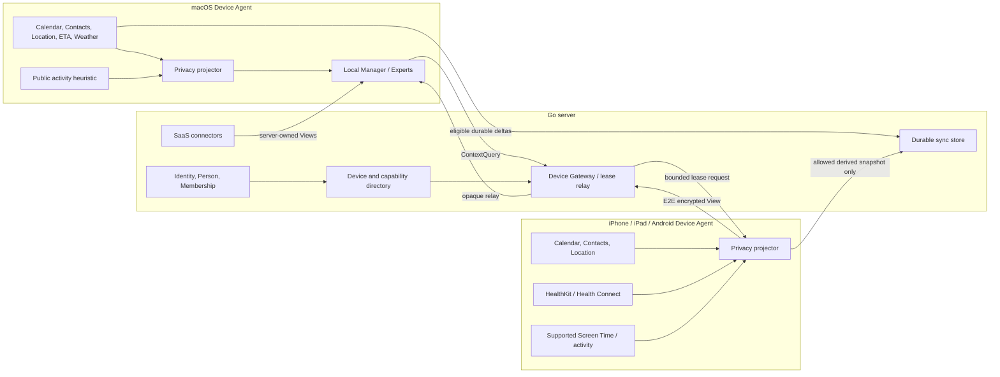
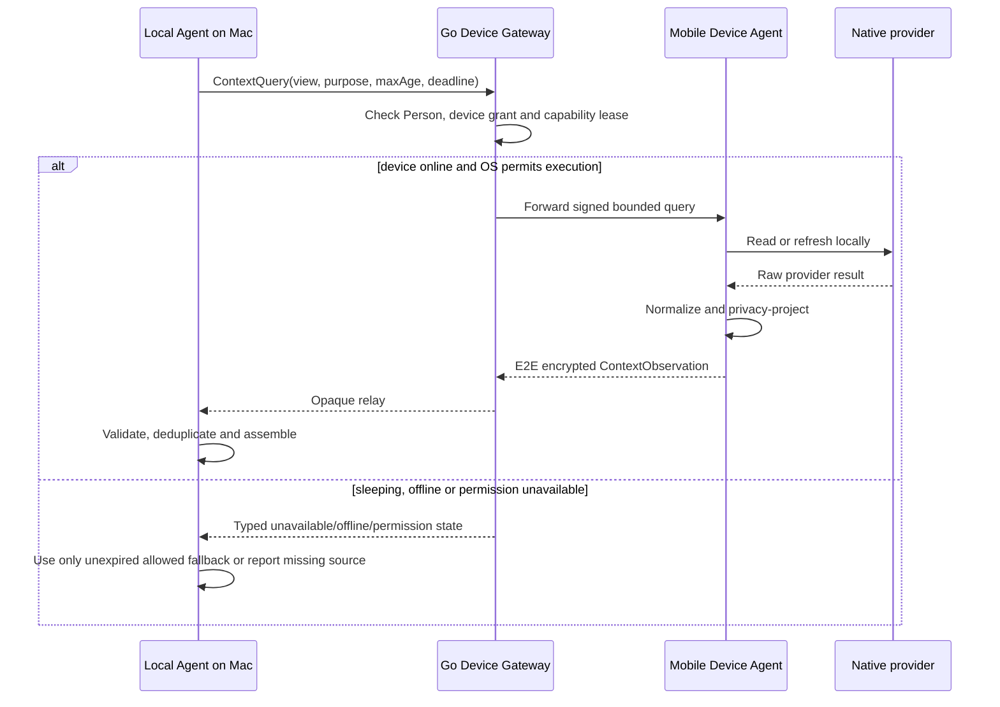
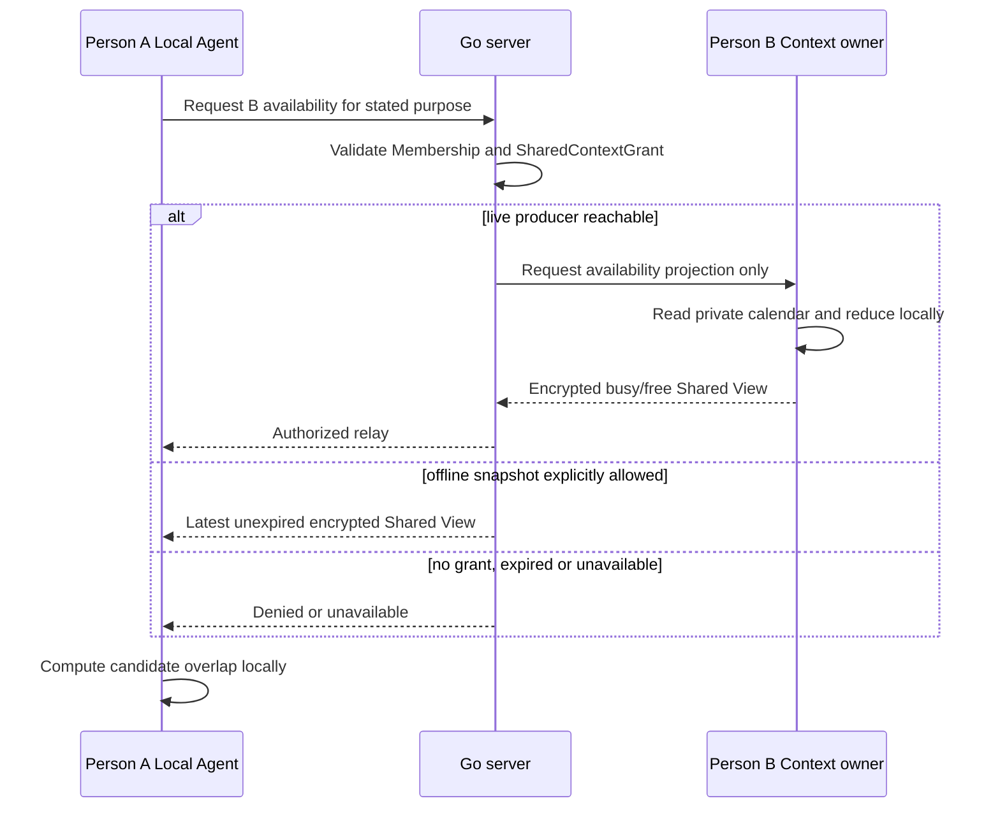

# ADR 0024: Device context collection, routing and convergence policy

- **Status:** accepted
- **Date:** 2026-09-11
- **Amends:** ADR 0014 source placement, ADR 0015 sensitive routing and ADR 0021 S5.5 rollout

## Context

Floe can observe different data on each execution host. A Mac can expose Calendar, Contacts,
location, weather and public desktop-activity signals, but it has no readable HealthKit store and
cannot use the iPhone/iPad Screen Time entitlement as a native macOS Screen Time connector. An
iPhone or iPad can expose HealthKit and supported Screen Time APIs, while Android exposes Health
Connect and different calendar/contact providers. SaaS sources are often more reliable from the
server.

The current documents define connector placement and retention classes, but do not completely
define:

- which device is authoritative for a context question;
- when a source is observed, cached, synchronized or queried on demand;
- how freshness and device availability affect a Manager turn;
- how duplicate or disagreeing device/provider observations converge;
- what may cross a device boundary before local or remote inference; or
- how a macOS Attention signal differs from Apple Screen Time evidence.

Without one policy, cross-device expansion could accidentally synchronize raw Health, location or
activity history, select the wrong device's location, treat an offline source as empty, or infer Act
authority from whichever replica happens to be reachable.

## Decision

### 1. Separate four planes

Floe separates observation, replication, decision and action. No plane implicitly grants authority
to the next one.

```text
Provider / OS source
       │
       ▼
Observation plane on the owning host
raw read → local normalization → privacy projection
       │
       ├── local ephemeral View
       ├── eligible encrypted derived snapshot
       └── durable canonical/mirror mutation
                         │
                         ▼
Replication plane
authenticated device relay or durable sync
                         │
                         ▼
Decision plane
purpose query → route → validate → deduplicate → expose disagreement → assemble context
                         │
                         ▼
Action plane
proposal → policy → exact-target review → authority owner → provider result
```

An observation is evidence, not a command. A synchronized View is not a new source of truth. An
Expert result is not permission to notify the user or execute an action.

### 2. Use the Go server as control plane, relay and durable sync host

The local Agent remains the owner of its active session and final context assembly. The Go server
does not become a universal raw-context collector.



The server owns:

- Account/Person/Membership authorization and device revocation;
- short-lived device presence and capability advertisements;
- routing an authorized `ContextQuery` to an eligible online Device Agent;
- opaque relay of end-to-end encrypted device context;
- durable convergence of records whose retention policy permits sync;
- server-native SaaS connectors and their credentials; and
- action idempotency and routing metadata.

The server does not own raw Health, raw activity/Screen Time, precise location, local provider
credentials or an always-growing history of ephemeral Context Views. A self-hosted deployment uses
the same boundary; deployment ownership does not weaken data policy.

### 3. Describe every source using the same policy dimensions

Every connector or device provider declares:

| Dimension | Required meaning |
| --- | --- |
| logical source | Provider-neutral question answered, such as `calendar.timeline` or `attention.coarse` |
| authority owner | External provider, Floe canonical store, or a specific device/provider instance |
| execution owner | Server or `device_id` that can perform the read/action |
| scope | Selected accounts, calendars, contacts, workspaces, entities or device scope |
| trigger | User action, foreground query, OS event, provider push, polling or bounded schedule |
| freshness | Observation time, expiry and maximum acceptable age for the purpose |
| retention | Mirror, index/on-demand, identity reference, derived-only, short-lived cache or ephemeral |
| transfer | Device-only, opaque relay, encrypted derived sync or declared server processing |
| sensitivity | Device-only, Highly Sensitive, Personal or Temporary AI Context |
| authority class | Observe, Act or Interact; grants remain separate |

Capability discovery synchronizes this policy metadata and health state, not credentials, raw
provider identifiers or source content.

### 4. Use a common observation envelope

A produced View carries a runtime-owned envelope equivalent to:

```text
ContextObservation {
  schemaVersion
  observationId
  personId
  logicalSource
  viewId
  viewVersion
  sourceHandle
  scopeHandle
  producerDeviceId?
  connectorConnectionId
  observedAt
  expiresAt
  sourceRevision?
  retentionClass
  sensitivityClass
  transferClass
  provenance[]
  coverage
  payload
}
```

Provider-native IDs may be kept in the connector's private state but do not cross the View boundary.
`producerDeviceId` identifies an execution/privacy boundary and is not evidence that the device
currently represents the person's location or attention.

An unavailable source publishes typed lifecycle state, never a fabricated empty View. Required
states include `permission_required`, `revoked`, `offline`, `stale`, `no_data`, `rate_limited`,
`partial`, `entitlement_unavailable`, `region_unsupported`, `clock_skew` and `conflicting`.

### 5. Choose collection mode from source semantics

| Source | Execution and trigger | Retention and cross-device rule |
| --- | --- | --- |
| Calendar | Direct SaaS server push/poll where available; otherwise device OS change plus bounded re-query | Normalized mirror may sync; one selected canonical route per external calendar |
| Mail/message | Server incremental sync or selected-channel foreground read | Metadata index may persist; body/content remains on-demand and purpose-bound |
| Contacts | Device permission/change event, then selected/bounded identity lookup | Only identity references may sync; no address-book mirror or contact notes |
| Current location | Foreground, purpose-bound one-shot read from the interaction or designated carried device | Ephemeral; coordinates and location history never sync |
| ETA | On demand after a specific origin, destination, mode and event are known | Ephemeral/short-lived; query-bound result, never a travel-history mirror |
| Weather | On demand for the relevant place/time window; device or server implementation is allowed | Short-lived cache with required attribution; no location history |
| HealthKit/Health Connect | Native device read followed by local derivation; foreground refresh first, OS-compliant bounded refresh later | Raw samples stay device-only; only an explicitly allowed derived state may relay/sync |
| iPhone/iPad Screen Time | Public entitlement and user authorization only; extension/event/report mechanism where supported | Raw app/domain activity stays inside the extension/device; only coarse Attention state leaves it |
| macOS activity heuristic | Opt-in public desktop events reduced locally while the Device Agent runs | Raw events remain memory-only and unsynchronized; only coarse device-scoped Attention state exists |
| Work/home SaaS | Server push, polling or foreground read according to provider support | Selected scope only; bounded View/cache according to its descriptor |

Background collection does not imply background intervention. Before S9, it may refresh a View or
connector health state but cannot independently contact the user.

### 6. Apply purpose-specific freshness profiles

`expiresAt` in the View remains authoritative. The following are initial policy profiles rather
than provider guarantees:

| Freshness profile | Typical sources | Initial maximum age |
| --- | --- | --- |
| immediate device state | current location, attention, lock/idle state | 1–2 minutes |
| active feasibility | ETA | 5 minutes |
| event-window context | current/hourly weather | 15 minutes |
| derived capacity | wellbeing/recovery | 30 minutes |
| operational mirror | calendar/mail/work/home | connector descriptor, normally 5 minutes at View publication |
| durable reference | selected contact identity, confirmed Memory | revision-driven, with explicit revalidation |

A consumer may demand a shorter age than the source default. It may not extend expiry. Offline
cached evidence is usable only until expiry and is labeled degraded. Wall-clock skew outside the
accepted bound produces `clock_skew`; it does not make a future-dated View fresher. Local producers
use monotonic elapsed time while running, and a relay validates wall-clock observations at receipt.

### 7. Route by meaning, scope and presence—not by newest timestamp alone

The Context Router applies this order:

1. Match Person, logical View, requested scope, purpose and sensitivity policy.
2. Reject unauthorized, expired, nonconforming or unreachable candidates.
3. Apply source-of-truth and user-selected route rules.
4. Apply device-presence rules for person-state observations.
5. Prefer healthy coverage, then freshness, configured priority and stable ID.
6. Keep disagreeing evidence visible to the evaluator instead of silently overwriting it.

Special rules are mandatory:

- **Location:** use the invoking mobile device or an explicitly designated carried device with
  recent local user presence. A desktop's location never wins merely because it is newer.
- **Attention:** it is device-scoped. Use the interaction device, or the active desktop session for
  a desktop focus question. Do not average phone and desktop activity into a fictional global state.
- **Health:** use the user-selected primary health authority for overlapping signals. A secondary
  HealthKit/Health Connect result is disagreement evidence, not a value to average automatically.
- **Calendar:** prefer a selected direct Google/Microsoft route for the same external calendar;
  exclude its EventKit/OS duplicate. Keep iCloud/local calendars on the device route.
- **Weather:** deduplicate by coarse place cell, forecast window and provider policy; never expose
  the location used to fetch it as history.
- **Contacts:** merge only confirmed identity links. Ambiguous identities remain separate until the
  user or a governed resolver confirms them.

If required sources disagree materially, the Expert returns uncertainty, alternatives or no
conclusion. It does not pick the most convenient claim invisibly.

### 8. Make cross-device access query-first and data-minimal

Fast-changing device context is not database replication. A cross-device request uses a bounded
lease:

```text
Manager/Context Assembler
  → ContextQuery(purpose, required View/version, scope, max age, deadline)
  → Device directory selects an eligible producer
  → producer performs or reuses an allowed local observation
  → local privacy projection
  → encrypted response to the authorized consumer, optionally through an opaque relay
  → consumer validates envelope, freshness, provenance and policy
  → View expires and ephemeral payload is discarded
```



“Real-time” therefore means **deadline-bounded best effort**, not guaranteed synchronous access.
Desktop Device Agents can maintain a foreground connection to the gateway. Mobile operating systems
may suspend network execution; a push can be only a wake hint, not proof that a fresh View will be
returned. The Agent must finish with remaining evidence or report the missing source when the lease
deadline expires.

Durable synchronization is reserved for canonical Floe records, normalized mirrors, selected
identity references and explicitly allowed derived snapshots. Location, ETA, raw activity, raw
Health, credentials and Temporary AI Context are never durable sync records.

Device-only raw data never leaves its producer. When policy permits a bounded Highly Sensitive
derived projection to cross devices, it defaults to an end-to-end encrypted device-to-device
payload with the server acting only as an authenticated relay. A server-readable projection
requires a separate declared processing policy. Sending any resulting View to a remote model is
another transfer decision; cross-device permission does not imply remote-model consent.

Revoking a device stops new leases immediately. Revoking a connector invalidates its capability
advertisement and future reads. Ephemeral Views expire; synchronized durable projections follow a
provenance-linked tombstone policy instead of being silently resurrected by an offline device.

### 9. Do not periodically upload every collected value

The periodic unit is normally **capability health metadata**, not source content.

| Data | Delivery | Server persistence |
| --- | --- | --- |
| device presence/capability health | bounded heartbeat with TTL | ephemeral directory state only |
| Floe canonical records and allowed mirrors | event-driven delta plus reconnect catch-up | durable encrypted record/revision/tombstone |
| slow-changing derived state | on meaningful change or bounded OS-compliant refresh, only when cross-device use is enabled | latest encrypted snapshot only, with expiry; no history by default |
| location, ETA and Attention | foreground/on-demand query lease | no content persistence; relay metadata only |
| raw Health, Screen Time/activity and credentials | never uploaded | prohibited |
| shared cross-Person projection | on demand, or latest encrypted snapshot when the grant explicitly allows offline use | grant-bounded payload with expiry and revocation tombstone |

Reconnect does not dump a device's historical raw observations. It uploads capability state and
eligible durable deltas since the acknowledged revision, then answers new context queries. Scheduled
refresh is allowed only when the source semantics and OS lifecycle justify it; it is not a generic
“send everything to Go every N minutes” loop.

### 10. Share with another Person through explicit projections

Another Person's source is never attached directly to the requesting Person's Agent. The source
Person owns the data and issues a revocable `SharedContextGrant` for a purpose-specific projection.

```text
SharedContextGrant {
  ownerPersonId
  recipientPersonId or recipientAccountId
  viewType
  purpose
  allowedGranularity
  maximumAge
  offlineSnapshotAllowed
  validUntil
  revocationRevision
}
```

Initial shared Views are deliberately narrower than the owner's internal Views:

| Need | Shareable projection | Excluded |
| --- | --- | --- |
| scheduling | busy/free intervals, timezone, optional named availability window | event title, attendees, location, notes |
| coordination | accepted commitment or response-needed state explicitly shared for that purpose | mailbox/message body and unrelated commitments |
| mood/social availability | self-declared coarse state such as `available`, `needs_space` or `support_requested`, with short expiry | inferred mood, raw Health, private Memory and diagnostic claims |
| caregiving | separately consented status/check-in claim and escalation preference | manager-role access to Health, Memory or Mail by implication |

Inferred mood is not shared in the initial model. A Person may explicitly publish a coarse social
availability claim; a local model cannot turn private behavior or Health into a cross-Person mood
feed without a new reviewed grant.



The recipient receives only the Shared View, not the owner's connector capability, credential or
internal provenance. A resulting action against the other Person's calendar requires that Person's
own policy and transaction-bound approval. `manager` Membership can manage devices or connectors but
does not imply a Shared Context grant.

### 11. Use a public macOS Attention provider, not a Screen Time workaround

The macOS provider is named and presented as a **local activity heuristic**, not Screen Time. It may
use public signals such as:

- frontmost-application activation changes from `NSWorkspace`;
- elapsed idle time from public Core Graphics event-source state;
- session active/inactive, screen lock/sleep and an explicit Floe focus session; and
- the current calendar/work context already granted to the relevant Expert.

The reducer maintains at most a 15-minute in-memory window and exports categories such as `focused`,
`active`, `interrupted`, `idle` or `unknown`, plus interruption pressure, confidence and coarse
provenance. Bundle IDs, application names, window titles, URLs, keystrokes, screenshots and a raw
activation timeline do not leave the reducer and are not persisted.

It must not request Full Disk Access, Accessibility, screen-recording permission or read
`knowledgeC.db`, ScreenTimeAgent databases, Biome streams or other private/undocumented stores.
Those paths violate ADR 0014, are unstable across OS releases and would turn an Attention View into
surveillance infrastructure.

On macOS, the Apple Screen Time capability itself reports `entitlement_unavailable` or
`unsupported`. The local activity heuristic may satisfy Focus & Attention product value, but it does
not masquerade as successful Apple Screen Time API evidence. On iPhone/iPad, the public Screen Time
feasibility gate remains a separate provider and may validly resolve to supported or unsupported.

### 12. Keep action authority at the execution owner

Cross-device observation never moves provider authority. An action targeting a device-native
calendar or OS capability is routed to the device that owns the Act grant. If that device is
offline, Floe returns or queues a typed pending result according to action policy; it does not
silently execute through a duplicate connector.

Review binds the exact Person, target connection/resource, source revision, proposal payload,
executor device and idempotency key. A review may occur on another authenticated device, but the
executor revalidates permission, freshness and provider state immediately before mutation.

### 13. Expose policy and failures to the user

Connections/Data & privacy shows, per source:

- which device or server performs the read;
- selected resources and granted data types;
- collection mode and last successful observation;
- freshness/expiry and retention class;
- whether derived data may cross devices;
- whether a remote model may receive a further projection; and
- current unsupported, offline, stale, partial or revoked state.

Source enablement, selected scope, cross-device use and remote-model transfer are distinct controls.
Permission is requested progressively when a scenario needs the value, not as one installation-time
bundle.

## Current implementation gap

This ADR defines the target contract; it is not a claim that cross-device access exists today. The
current Go routes serve paired server connector Views, and Rust validates a `device_id` in connector
descriptors, but the repository does not yet implement:

- authenticated multi-device Account/Person enrollment;
- Device Gateway, presence heartbeat or capability directory;
- `ContextQuery`/lease wire protocol and mobile wake handling;
- end-to-end encrypted opaque relay or derived snapshot sync;
- `SharedContextGrant` and Shared View projection; or
- revoked-device/tombstone convergence across two physical devices.

These are S8 implementation work. S5.5 should add the envelope and routing fixtures needed to keep
its device-local source work compatible with this policy.

## S5.5 and S8 rollout boundary

S5.5 implements each source on its valid host and verifies provider-neutral Views, Expert
consumption, failure isolation and privacy capture. It does not claim cross-device delivery.
Contract fixtures must nevertheless include device identity, transfer class, freshness and
device-scoped routing so S8 does not require a semantic rewrite.

S8 adds authenticated device registration, capability advertisements, bounded query leases,
encrypted relay/sync, revocation, convergence and two-physical-device evidence. Its first required
scenario is:

```text
iPad/iPhone Health or Screen Time-derived View
  → local privacy projection
  → authorized cross-device lease
  → macOS Context Assembler
  → local Expert judgment
  → no raw source or server-readable copy
```

The scenario must also prove offline, stale, revoked-device, duplicate-provider, disagreement,
clock-skew and deletion/tombstone behavior.

## Consequences

- iPadOS can be the complete Apple-native sensitive-context validation host; macOS remains a strong
  Calendar/Contacts/feasibility host with a separate public Attention heuristic.
- Fast device state is queried through expiring leases instead of copied into a general sync DB.
- Source-specific collection schedules remain possible without giving each connector different
  cross-device semantics.
- Device presence becomes part of correctness for Location and Attention.
- The server can coordinate availability without automatically receiving Highly Sensitive content.
- S8 requires a real device protocol and key/revocation PoC, but its semantic boundary is now fixed.

## References

- [ADR 0014: bounded real-world sources](0014-s4-connected-agent-sources.md)
- [ADR 0015: privacy-aware inference](0015-s4-privacy-aware-inference.md)
- [ADR 0020: ambient assistant model](0020-ambient-assistant-expert-connector-model.md)
- [ADR 0021: S5.5 connected domains](0021-s5-5-connected-domain-expansion.md)
- [Device Agent](../planning/04-platform/device-agent.md)
- [Connector data policy](../planning/05-integrations/connector-data-policy.md)
- [Sync and multi-device](../planning/07-server/sync-and-multi-device.md)
- [Apple Contacts](https://developer.apple.com/documentation/contacts)
- [Core Location](https://developer.apple.com/documentation/corelocation/cllocationmanager)
- [MapKit directions and ETA](https://developer.apple.com/documentation/mapkit/mkdirections)
- [WeatherKit](https://developer.apple.com/weatherkit/)
- [HealthKit platform availability](https://developer.apple.com/documentation/healthkit/about-the-healthkit-framework)
- [Family Controls configuration](https://developer.apple.com/documentation/xcode/configuring-family-controls)
- [Device Activity](https://developer.apple.com/documentation/deviceactivity)
- [NSWorkspace frontmost application](https://developer.apple.com/documentation/appkit/nsworkspace/frontmostapplication)
- [Core Graphics idle time](https://developer.apple.com/documentation/coregraphics/cgeventsource/secondssincelasteventtype(_:eventtype:))
