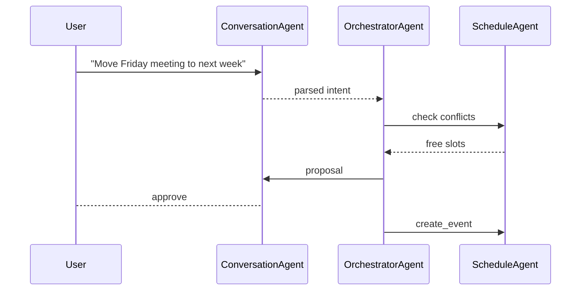

# OrchestratorAgent Specification

## Purpose

Central brain that parses user intent, resolves ambiguities, sequences domain agents, and enforces ask‑to‑act governance.

## Key Responsibilities

* Intent classification & slot filling (LLM or regex shortcuts).
* Dependency graph planning: chooses agent order, passes outputs.
* Conflict resolution (e.g., overlapping calendar events).
* Error aggregation & fallback messaging to user.

## Skills

| Skill              | Args                            | Returns    |
| ------------------ | ------------------------------- | ---------- |
| `route_task`       | `task: string`, `due?: ISODate` | `taskId`   |
| `plan_sequence`    | `intent: string`, `context`     | `plan[]`   |
| `resolve_conflict` | `entityType`, `candidates[]`    | `decision` |

## Workflow Example

## Performance Targets

* Intent routing latency < 150 ms.
* 98 % successful plan execution without manual override.

## Error Handling

* Unknown intent → request clarification via ConversationAgent.
* Downstream agent error → retry 2× then notify user with summary.

## Security & Privacy

* Pass only minimal necessary context to downstream agents.
* Strip personally sensitive data before logging.
