# Floe architecture refactor: target and execution contract

## Active P3 implementation update — 2026-10-09

P3 implementation and caller cutover is now present on the exact verified base commit `98c463ec3ce80ff329119dcacbf0f37975e5a710` (parent `b871c89a7d5ac8ec59e5eb445d77d89443f49465`; base tree `246ebfc1fc5d42a9d38ab559c2d092959aa7799a`). Calendar Operations owns immutable effect normalization, identity, dispatch intent, provider receipts, uncertainty and reconciliation. Access owns immutable operation subjects, policy, review and decision receipts. The existing encrypted Vault composes operation and Conversation approval-interaction admission atomically; dispatch intent and Access receipt consumption are later committed with current local checks, while external source continuity remains an adapter fence. Conversation publishes and resolves the approval interaction and resumes the same operation without submitting its effect again. Day calls through its inward port without holding its local admission lock across external work; direct Day commands retain actor/source/OS authority independently of Expert Allow/Ask/Deny policy. The four product route groups are Conversation, Connections, Day and Memory. Conversation routes include `conversation.calendar_policy.get/set`, `conversation.calendar_proposal.submit`, `conversation.interaction.resolve/refresh` and `conversation.experts.*`; Day routes include `day.calendar_destinations` and `day.external_calendar_operation.*`. Runtime/native control routes remain separate. No `access.*`, `actions.*`, top-level `experts.*` or top-level Calendar Operations namespace is exposed.

P3 implementation and the actual caller cutover are complete on this candidate. Calendar Operations owns immutable effect normalization, identity, dispatch intent, provider receipts, uncertainty and reconciliation; Access owns the operation authorization subject, policy, review and decision receipts. The existing encrypted Vault composes owner transitions, including Conversation approval publication, in the same immediate transaction. Access decision consumption and dispatch intent commit with live local checks; external-source continuity remains an adapter fence. Conversation presents and resumes the exact existing operation from canonical owner receipts. Day calls through its inward external-operation port without holding its local lock across external work; direct manual Day commands preserve actor/source/OS authority independently of Expert Allow/Ask/Deny policy.

History projection now omits a derived historical entry only when its individual dependency reauthorization returns `StaleContext` or `AccessReviewRequired`. Ambiguous authority, corrupt proofs, source acquisition failures, storage errors, and current-turn required-source failures retain their failure semantics. Each typed history entry retains its own coverage, ToolExchange removal stays atomic, the linked Resume retains the original input in `current_turn`, and live operation status remains honest through Unknown/Executing/Succeeded. The current scripted Calendar Operations/Conversation matrix passes 4/4 and direct Day matrix 2/2; the exact linked approval/Resume scenario passes with the lost-decision-ACK crash cut point and post-write stale-history check. The full Conversation integration passes 30/30 on the final candidate (403.77s). `CARGO_INCREMENTAL=0 cargo test --workspace --no-fail-fast`, eight FFI QA tests, production and QA FFI builds, the 26-node architecture boundary check, its negative-fixture test, formatting, and `git diff --check` pass. The original retry/ACK-loss failure logs remain in the review archive. Flutter format/analyze/tests produced no result because Dart/Flutter initialization was denied while attempting to write `/home/agent/.dart-tool`; that path was not retried or redirected. Rust tests are not screen/macOS QA or CI evidence; neither is claimed.

This update governs the P3 candidate only. The following earlier active-stage and dated execution records are retained as historical context; their branch baselines and validation results do not describe this P3 candidate.

## Active execution update — 2026-10-09

This section is the single current sequence for remaining work. The dated R0–R3 and bounded-slice records below remain historical evidence and do not describe the current production cutover status where they say Manager callers are disconnected. This update supersedes overlapping old stage-order, Session-import and Actions-retention language below; preserved owner and custody invariants remain mandatory. Historical validation is not proof for the active candidate.

**Active source baseline:** exact commit `8d0f7f72913a1a6c5f38ed67ebf7fc831c5183e4`, tree `01c2f238d4417d113e74b7acd4b5dab8798b2d3f`, fetched and verified in a clean worktree. The earlier 1,172-file ledger belongs to the October 2 baseline and does not establish exhaustive reading of this snapshot. For each implementation scope, read affected bodies and reconcile caller, import and deletion paths before editing.

### R4 — functional production Manager Conversation cutover (2026-10-09)

**Active scope decision:** follow current `AGENTS.md` fresh-development-profile policy. Do not implement the older standalone frozen Session import/activation branch: it is not a prerequisite for this cutover. Do not add backward compatibility for obsolete local profiles, migration chains, permanent old decoders, dual reads/writes, automatic reset/import or key/database deletion. Existing incompatible profiles stay untouched and fail closed. Remove inert legacy preparation code and tests once no supported route uses them. The existing layout/version checks remain the explicit compatibility boundary.

Conversation owns Manager product admission, Run lifecycle, interactions, cancellation and recovery. Core owns neutral transcript integrity and recorder custody. Vault commits owner changes, typed entries, Core custody and evidence links in one transaction. Run journals remain the only effect and Task execution journals. Continue and linked Resume reuse the exact original User input while admitting fresh Run and recorder identities; New appends one User entry. Preserve command identity, exact ACK receipt replay, bounded Session metadata/CAS and busy rejection. Continue keeps an exact pending batch, cursor and model pin through empty or batch-only ancestors until a child claims that cursor. A linked Resume retains its source/input and interaction lineage and begins fresh model work. Preserve source revocation and explicit cancellation direction.

The default Manager has a stable per-Person identity, independent of Run/Task IDs and Expert registry revision. Pin definition `manager-role` at `MANAGER_ROLE_REVISION` (currently 8). Persist the exact Session-to-Conversation/branch binding; a definition policy change selects a new conversation. Replace the live growing `AgentSession.messages` route with normalized typed history plus the bounded owner shell. Connect Session head, reverse and exact reads to normalized storage and stable public aliases. Missing, ambiguous, stale or mismatched aliases are explicit; no message is skipped or duplicated. Include evidence hydration in byte limits. Preserve textless Interaction and structured Delegation evidence. Manager-only learning discovery reads a bounded normalized history suffix in its owner transaction; scoped Expert Sessions stay outside Manager learning.

Record every supported Manager-produced contribution with deterministic contribution and alias identity, actual Task/interaction proof, and owner/Core transaction ordering. For blocked publication and late recovery, commit owner publication, typed recording and terminal/custody settlement in the required order. A narrow Core recovery contribution is authorized only for the exact authenticated TaskResult under its existing open recorder after terminal recovery has committed; a separate unresolved model attempt may keep that recorder in custody. Do not fabricate Working state or grant general post-terminal output authority. If another real Core contract gap appears, stop that path and report it rather than weakening proof rules.

Compaction is an exact committed prefix and summary with live coverage; it must not prune payloads in this milestone or rewrite Unknown coverage as Independent. Protect Continue origins, pending batches, open interactions, Resume slots, uncertain effects and archive references. Preserve new-profile cursor and archive behavior. Existing Expert execution remains a genuine Task owner and Manager evidence source. The next functional milestone is persistent isolated Expert conversations plus Task-to-Run/history-pin cutover; do not add Expert learning or change A2A into a lifecycle owner.

**Acceptance gate for this slice:** run real App/Conversation/Engine/Vault integration with scripted external model/source seams for a text turn, normalized multi-turn history across reopen, New/Continue/Resume input reuse, delegated Task result, blocked textless interaction, cancellation/uncertain recovery, exact ACK replay, bounded cursors and the combined first-insertion late Task result with unresolved model accounting. Follow with Rust/App/FFI and architecture checks, residual searches proving old Manager history routes are gone, and one final aggregate build/test gate. Report GUI, macOS, provider and native QA limits plainly; no premium model or real-provider dispatch. Keep exact base/candidate trees, complete patch, raw logs, manifest and SHA-256 hashes in the reviewable Library archive. No commit or push before root review.

### R5 — persistent isolated Expert Task conversations

**Owner and identity contract:** Experts remains the sole Task lifecycle and execution owner. One admitted `TaskExecutionKey` opens exactly one fresh logical Expert Run segment in Conversation Core; Task's existing journal, terminal receipt, executor generation and recovery remain the only execution authority. Core records transcript custody only. It does not create a second Task/Run journal, scheduler, cancellation authority or dispatch route. Persist a unique mapping from the complete `TaskExecutionKey` (Task ID, execution ID and Task executor generation) to its Core `RunId`, exact Person, Expert Core identity, Conversation/branch and input reference. A different Task ID for the same verified Person, registry instance, installation, assignment, package kind/ID/version and definition revision continues that assignment's exact conversation after prior custody settles. A changed identity field, package/version or definition revision selects new conversation custody. Task ID, Manager Run ID, A2A peer ID, mutable registry revision and model environment digest never select or merge conversation identity. Package version must be checked against the admitted installation and included in the definition identity. Existing Tasks keep their recorded identity and pin.

**Admission and history pin:** store the canonical host Expert execution input with the immutable Task record: exact `TaskExecutionKey`, original `request_digest`, delegated message, input coverage/provenance, Expert conversation identity, Task-to-Run mapping, input message/command IDs, and the exact pre-input Core head (empty head is revision zero plus the Core empty-prefix digest; otherwise exact `TranscriptReference`, head revision and prefix digest). Vault issues a separate immutable `ExpertTaskAdmissionReference` from a domain-separated commitment over that complete local input and persists its canonical receipt atomically with Task admission. The reference binds the exact Task execution, request digest, logical Run, conversation/branch, pin and host-input commitment; it is not part of `delegation_request_digest`, so parent/A2A requests do not fabricate local transcript state. `TaskAdmission::Created` and `Existing` return the unchanged TaskRecord plus that owner-issued reference. Lost admission acknowledgement readback returns the stored canonical reference, never a reconstruction from mutable input JSON or today's head. Working CAS requires the exact reference. Replay, history and terminal receipt verification resolve the same canonical owner evidence and fail closed for missing/mismatched evidence. For a Task ID already stored, resolve its immutable record, owner admission receipt and terminal receipt before consulting today's Directory, conversation head, binding or enable state; exact replay returns that receipt and never repins. For a new Task, one Vault transaction verifies/creates the assignment binding, checks there is no competing reservation for that conversation, pins the current head, reserves the conversation, and admits `Submitted`. The reservation prevents a second Task from pinning the same head until the first Task's Core custody has settled. Do not reopen a terminal Task, including `Blocked`; a later Task ID starts one fresh Core Run segment and may continue the settled assignment transcript.

**Working and output custody:** preserve `Submitted -> Working`. The existing Working CAS transaction verifies the supplied reference against the canonical admission receipt, request digest and current input commitment; it then revalidates the stored reservation and pinned prefix, appends the exact delegated input as `Host` provenance with the host-input commitment linked in Core evidence, and opens its `TaskExecution` recorder atomically before any endpoint/model dispatch. Output, successful or failed ToolResult, typed payload, Core entry/receipt, Task journal watermark and contribution link are one Vault owner transaction. Exact journal replay may return its original revision after terminal state or generation fencing only after verifying the existing typed/Core proof; changed payload or missing proof fails without repair. Blocked terminal state, Task receipt, any textless blocked evidence, recorder close/retirement and reservation release compose in the terminal owner transaction. Task proof is resolved from the actual Task record, canonical admission receipt, complete bounded Task journal, terminal receipt and durable Task executor generation in that transaction; never infer it from caller digests. `HostRun` proof guards remain unchanged. A never-started Submitted Task recovery releases only its exact proven reservation and does not append input, open a recorder or invent output. Unknown Task/model outcomes keep their Task receipt accounting and conversation custody until an authentic owner settlement or Task-generation fence proves the old writer cannot act; timeout, observer cancellation and screen disposal are not proof.

**Bounded history and authorization:** read only the exact pinned prefix under one Vault snapshot. The owner/Core resolver verifies the chained prefix and performs entry-count plus cumulative byte accounting over Core envelopes, typed references, typed payloads and current owner coverage before payload hydration. Enforce both `MAX_AGENT_MESSAGES` and `MAX_MODEL_CONVERSATION_BYTES`; never build an unbounded message vector first. The Engine receives the bounded typed history for its own assignment only. Context reauthorizes every historical coverage record against current source/grant/processing authority before projection; revoked or `Unknown` derived evidence is omitted and cannot be converted to `Independent`. Person-originated historical input may remain. Do not import the Manager transcript, another Expert's history, or Manager-only learning. A2A remains a request/receipt transport and identifier mapper, not a Task/Conversation lifecycle owner.

```mermaid
flowchart LR
  Host[Verified host Task input] -->|new Task: exact identity + message| Admission[Vault admission transaction]
  Admission -->|canonical admission receipt + pinned head + reservation| Submitted[Task Submitted]
  Submitted -->|Working CAS requires exact receipt| Working[Task Working]
  Working -->|same transaction: Core input + TaskExecution recorder| Engine[Expert Engine]
  Engine -->|bounded pinned typed history| Context[Context live coverage reauthorization]
  Context --> Engine
  Engine -->|tool/output journal + typed/Core receipt| Vault[Vault Task owner transaction]
  Vault -->|terminal Task receipt + close/fence + release| Settled[Settled assignment transcript]
  Settled -->|new Task ID, same verified assignment/definition| Admission
  A2A[A2A mapping] -. request/receipt only .-> Host
  Manager[Manager Run] -. authenticated Task receipt only .-> Host
```



```mermaid
sequenceDiagram
  participant T as Experts TaskCoordinator
  participant V as Vault Task owner
  participant C as Conversation Core
  participant E as Expert Engine
  T->>V: Admit(TaskRecord proposal, host input)
  V->>V: Exact Task replay lookup before mutable identity/head checks
  V->>C: Pin bounded head/prefix and reserve exact assignment
  V->>V: Persist canonical admission receipt with request and host-input commitment
  V-->>T: Unchanged Submitted TaskRecord + owner-issued input reference
  T->>V: Submitted -> Working CAS with exact input reference
  V->>C: Append committed Host input + open mapped TaskExecution Run
  V-->>T: Working Task and recorder fence
  T->>V: Resolve bounded history at stored pin
  T->>E: Execute once with that history
  E->>V: Journal events; typed/Core writes share each owner transaction
  T->>V: Settle terminal Task and immutable receipt
  V->>C: Verify Task proof; close or retain/retire custody by owner evidence
  V-->>T: Stored immutable Task receipt
```

**Cutover and deletion gate:** add the Experts-owned history/input/recovery ports over the existing Task owner; add the Task-specific Core proof path without routing through `floe-conversation`; compose admission/reservation, Working/input/open, journal/typed/Core and terminal/custody changes at the encrypted Vault transaction boundary; then replace the Engine's empty history with the exact bounded assignment history. Migrate real App wiring and owner tests, then delete any unpinned/empty-history fallback. Keep Manager Session/learning callers and A2A mapping unchanged. Fresh development profiles are the supported scope; incompatible stored Task/profile meaning is untouched and fails closed, with no automatic reset or migration.

**Required behavior evidence:** two terminal Tasks on one assignment see the correct prior history; different Person, assignment, installation, package/version or definition is isolated; exact Task replay after head advance preserves its original pin/receipt; duplicate and concurrent admissions cannot reserve one head twice; lost admission, Working, journal-output and terminal acknowledgements recover without duplicate dispatch/contribution; cancellation and old-generation recovery preserve uncertainty; a Blocked Task remains terminal and a later Task starts a new Run; revocation/Unknown history is filtered and byte/count limits reject before hydration; no Expert learning is invoked. Use real App/Experts/Engine/Task/Vault paths with scripted model/source seams only. Preserve Manager integration cases. Do not invoke premium models, real providers, deployment or native GUI QA in this executor.

**Current checkpoint — verified 2026-10-07:** P1a's five owner-path Conversation cases now run alongside real Schedule Expert/tool-source and Day refresh/query cases over the opt-in Linux Calendar fixture: 7 passed, 0 failed in the final focused target. External model/acquisition facts are synthetic; Connections, Access, Context, Inference, owner journals and encrypted storage are real. The shared-grant consumer bug, repeated full model-budget reservation, and divergent acquisition/commit Calendar inventory were corrected at their owning contracts. This closes the bounded T1 fixture happy path, not the entire P1/P6 matrix. Process-crash recovery, full owner-level denial/race cases, T2 cross-process client/server transport, real LLM and native-platform qualification remain open.

### R0 — integrated session-payload and model-catalog changes (2026-10-08)

**Base and sources:** the new integration is based on `43430bf338b4aa1be9b3fdf8087e5f46f59b593b` (`codex/owner-command-dispositions`). It combines `codex/session-payload-limit` through `d0640ddfbea85c0498616ad79918d46a46c3b61d` (including `6109e8bd2360eb5ee2baf8c6349356d7b98be748`) and `codex/model-catalog-data` through `fa3dfad27cac2d965b2d6d463d2450326c7fc43e` (including `6e1e182a8999f4cbe263331056bd346d1f510b1c`). Their production paths apply cleanly and match the approved branch tips; no `main` merge or conflict-driven production edits were needed.

- **Vault session payload:** Conversation owns the semantic Session lifecycle. Vault supplies encrypted session custody and storage through its existing ports, retaining key custody and the compare-and-swap path. Reads and writes enforce `AgentBudget.max_session_bytes` against serialized UTF-8 bytes: exactly 2 MiB is accepted, 2 MiB plus one byte is rejected as `BudgetExceeded` before JSON decoding or write. A bounded 64-message history above the former 256 KiB query threshold now loads and updates through the same store.
- **Model catalog:** `server/internal/modelcatalog` owns validated, descriptive suggestion data; provider configuration, selected models, credentials and capabilities remain with their current owners. Reloads publish only validated revisions after persisting last-good data. Local install/rollback preserves previous and pending snapshots, advances rollback revisions monotonically, and recovers an interrupted rollback at startup. These file operations require the existing private profile and do not replace profile data or keys.
- **Existing command guarantees:** the owner-command disposition base remains the parent. Conversation, Day, Actions, Knowledge/Memory and Experts receipt/replay classification remains covered by the workspace and App QA tests. No command identity or key-custody implementation was replaced.
- **R1 design context only:** Expert is a conversational agent, not a Tool or module boundary. Hosted Manager and Expert share Conversation/Runtime/Context implementation while keeping isolated records and authority. Agent identity, Conversation, Run and A2A Task have distinct lifetimes. Self-improvement is Manager-only: there is no separate Expert learning loop or autonomous Expert prompt change. The parent designs R1 directly; this integration does not implement R1–R6.

**Validation on the integrated source tree:** Rust 1.93.0 passed `CARGO_INCREMENTAL=0 cargo test --workspace --no-fail-fast` (37 passed), the explicit Vault target `cargo test -p floe-vault --tests` (10 passed), App Linux QA `CARGO_INCREMENTAL=0 cargo test -p floe-app --no-default-features --features qa-fixtures --tests --no-fail-fast` (28 passed, including 19 Conversation integration cases), and FFI QA `CARGO_INCREMENTAL=0 cargo test -p floe-ffi --no-default-features --features qa-fixtures --tests --no-fail-fast` (7 passed). Both `cargo build -p floe-ffi` and `cargo build -p floe-ffi --no-default-features --features qa-fixtures` passed. Go 1.25.0 passed `go test ./...`, `go test -race ./...`, and `go vet ./...`; a fresh `go test -json -count=1 ./...` run counted 44 passed tests across 3 packages. Flutter 3.47.6/Dart 3.13.5 passed lock-enforced dependency resolution and `flutter test` (22 passed); `flutter analyze` exited 1 with 151 info-level lints and no warning/error diagnostics. Dashboard dependencies installed from the frozen lockfile with pnpm 11.19.0 (39 locked entries), and `node --test` passed all 9 tests. `python3 tools/architecture/check_boundaries.py`, `rustfmt --edition 2024 --check crates/adapters/vault/src/vault.rs crates/adapters/vault/src/vault/registry.rs`, `gofmt -d` on changed Go files, and `git diff --check` passed.

**Environment limits:** Flutter and dashboard QA used workspace-local HOME, XDG, Dart pub cache and pnpm store paths; no user profile data was read or modified. The Flutter analyzer remains non-clean because it exits 1 on 151 info-level lints. The bundled Linux GUI build and visible GUI startup remain unqualified because this executor lacks CMake, Ninja, GTK 3 development files and a display. No prior binary was used as GUI evidence; GUI qualification remains outstanding.

### R1 — conversation contracts and A2A boundary (2026-10-08)

**Status:** parent-reviewed bounded contract slice only; this does not complete the broader R1 production work or R2. `floe-conversation-contract` contains role-neutral identity, message, admission, transcript, checkpoint and content-addressed evidence-reference values; `floe-conversation-core` owns deterministic New/Continue, replay/conflict, FIFO inbox, single-writer and completed-prefix checkpoint transitions and the future store port. Core admission queues inbound work for a Run; it is not an assistant/Tool output-recording API. A message's delivery digest includes its evidence reference. Checkpoints reject active/pending input and regression while allowing a completed prefix with a later queued tail. Fixtures exercise Manager and Expert identities through the same transitions while keeping their conversations and message provenance isolated. Their per-Core in-memory command map cannot prove repository-wide uniqueness; the encrypted Vault command receipt later binds each Person's CommandId across this new Core owner. A changed definition revision selects a new conversation. Existing `floe-conversation`, Expert execution, Run journals, V1 Task receipts and stored sessions are not migrated or connected; no production persistence or Expert resume behavior is claimed. Existing owner receipt families stay unchanged pending explicit R2b migration.

`floe-a2a` is a separate transport-neutral exchange/mapping module that depends on neutral Agent and Conversation contracts, not Conversation Core, Experts, Vault or Manager Conversation. It owns version/extensions, peer-scoped identifiers, explicit peer/local mappings, remote Task observations, bounded cancellation requests that return observations, and ports to the peer binding and host Task owner. Inbound mapping commits all artifact semantics to a role-neutral evidence digest and validates the full host admission before use. `HostedTaskAdmission::validate` gives a future host Task adapter the check needed before evidence storage; no production host adapter is connected in this slice. Provisional part-count, aggregate artifact and serialized envelope limits are framing guards, not product context or user-content budgets. A2A has no production dependency on Conversation Core, owns no authoritative Task state and implements no remote HTTP or standard conformance. The existing `floe-agent-contract` AgentCard/AgentMessage remain unchanged. Directory/discovery, host Task lifecycle and A2A binding stay distinct. Model roles and identity values are not authenticated origins or grants. Learning remains Manager-only; generic Runtime/Conversation has no learning hook, no per-Expert Learner is introduced, and Expert prompts/roles/tools do not self-change.

**Required future work:** connect Conversation persistence and session migration; implement Expert conversation resume; integrate host-owned Task authority/lifecycle without duplicating it in A2A; and add fault, restart, replay, and recovery tests over those connected production paths. Remote HTTP binding and protocol conformance are also future work.

**R1 validation on this follow-up candidate:** focused contract/Core/A2A tests passed (21 tests). `CARGO_INCREMENTAL=0 cargo test --workspace --no-fail-fast --quiet` passed; App QA passed 9 unit and 19 Conversation integration tests; FFI QA passed 7 tests; production and `qa-fixtures` FFI builds passed. `python3 tools/architecture/check_boundaries.py` passed with 26 nodes, 134 edges, no warnings/errors, and no A2A-to-Core edge; the negative architecture fixture suite passed all five forbidden-path cases. Changed Rust files pass `rustfmt --edition 2024 --check`; `git diff --check` passed. The repository-wide `cargo fmt --all -- --check` still reports one unrelated pre-existing formatting difference at `crates/adapters/vault/src/repositories/connections.rs:480`; this R1 slice leaves that file unchanged. Workspace compilation emits existing warnings in unrelated packages. No Flutter, dashboard or GUI checks were run for this non-UI slice. The contracts remain unconnected to production Conversation callers, durable storage, session migration, Expert resume, or remote HTTP and do not replace or reinterpret existing Task receipts or Run journals.

### R2a — encrypted Conversation Core storage port (2026-10-08)

**Status:** parent-reviewed and approved as an adapter-only R2a storage slice. The Core-owned port and encrypted Vault adapter store each validated message as an independent ordered row and keep the head, message/command receipts, FIFO pending inputs, active writer fence, completed writer receipts and checkpoint in separate normalized tables. Admission, claim, completion and checkpoint behavior reuses Conversation Core's bounded pure transitions. Pages are sequence-cursor based with a 128-entry cap and a 4 MiB UTF-8 message-byte cap; an item larger than the requested budget fails without advancing the cursor. Admission atomically records the inbound message, head, Task link, pending marker and idempotency receipts. A Person's CommandId is globally unique across this new owner and binds to its original agent/conversation/branch/message/evidence delivery; exact replay is recognized before mutable revision checks, and changed target or body conflicts. MessageId remains conversation-local. Rollback failures are reported as not committed; post-commit acknowledgement loss is reported as unknown. Bounded read-only writer observations recover one exact Run receipt alongside the current head, active claim and executor generation, distinguishing absent, current-generation active, interrupted and completed states without releasing claims or authorizing dispatch. These are scoped storage observations, not permission to restart effects; absence in one target branch is not evidence of global nonexecution.

The Conversation Core family is encrypted and independently versioned. Candidate schema revision 1 was experimental and unshipped. Revision 2 makes CommandId unique by Person across Conversation Core scopes; it does not drop, migrate or reinterpret any present revision-1 family, and schema-family verification fails closed on a version mismatch. Layout-3 Vaults without this family remain openable without startup DDL; the new family is initialized only when the new storage port is first used. Existing Session rows, keys, Run journals and legacy V1 Task/owner receipts are not migrated, rewritten or deleted. Open-time validation checks exact stored identities, each message and chained prefix commitment, receipt/pending/writer links, and completed-prefix checkpoint state in an O(number of stored Core entries and receipts) full integrity scan. This startup scan is separate from the bounded hot-path reads used for admission, transcript pages, claim, completion and exact writer observation.

**Scope:** this is an adapter capability, not production Manager session migration/caller cutover, generated assistant/Tool output recording, Expert resume or Run-journal dispatch recovery. The port admits inbound work only and cannot enqueue output as a new Run. Checkpoints accept a caller-provided summary but perform no model summarization. No per-Expert learning loop is introduced. R2b/R4 must bind recovery to the actual owner Run lineage and journal; a target-scoped absent receipt cannot prove that an effect did not execute elsewhere. Existing production paths and records remain on their current implementations until later cutover work.

### R2 follow-up — generated output and contiguous-prefix custody (2026-10-08)

**Status:** parent-reviewed and approved generic Core/Vault slice. Generated assistant, Tool or host output is recorded against the exact active `WriterClaim`, with explicit entry kind and producer Run, in the same ordered transcript as inbound work. It does not enqueue a Run or create a Person-global CommandId receipt. Exact output receipts recover lost acknowledgements before mutable writer checks; new output still requires the current writer fence. Completion advances the checkpoint-eligible boundary to the contiguous settled prefix, keeping active and queued inputs unfinished even when output follows them.

The encrypted Vault keeps Core schema revision 2 and adds a separately marked normalized output extension. Existing entries remain implicit inbound/v1 and retain their original prefix commitments; new entries use v2 commitments binding entry kind and producer Run. Extension creation, output entries, metadata and receipts are transactional. Full workspace and focused encrypted Vault/Core tests, App QA (28), FFI QA (7), both FFI builds, architecture boundary/negative-fixture checks, Rust formatting and diff checks passed on the reviewed candidate.

**Scope:** this is generic Core custody only. Production Manager/Conversation and Expert caller cutover, legacy Session migration, and Run-journal effect authority remain future work with their existing owners. It adds no per-Expert learning behavior and does not change inference or model-profile policy.

### R3a — bounded model budget profile and execution selection pin (2026-10-08)

**Publication base and acceptance:** the initial candidate began at `b5a028c3006296fa72bd3172cab6c70e260c73a8`, retaining the reviewed R2 output-custody tree. After parent publication advanced `main`, the candidate was reconciled onto verified `main` `d3b2d4521b7c7aa04c0deebec7c0c8a03e9d038d`; the parent-reviewed source tree is `211de261e29e425635231e7dac9d7a8f156efe8a`. Parent review is complete and accepts this bounded R3a slice for direct normal fast-forward publication to `main` after the focused final gate below. No new branch, reset, force push or production deployment is part of publication.

The candidate carries schema-1 non-secret budget profiles through Go inference inventory schema 3, Rust `PreparedModelPlan` and the canonical provider request. Catalog facts and provenance remain descriptive, operator limits are separately versioned, and unknown provider limits remain unknown. Token estimation keeps its explicit UTF-8-byte method and uncertainty; existing byte, message, tool, output and request caps remain in force. Profile input preflight runs before Access dispatch consumption. The selected provider/model configuration and existing Primary/fallback policy remain unchanged.

The first acknowledged `ModelIntent` pins the opaque provider target/revision commitment, caller, purpose, consumer, capabilities, processing boundary, Access binding digest and exact effective profile for the logical Agent execution. Runtime compares every later preparation before Context projection or provider handoff. Manager Run and Expert Task journals own separate pins. Continue restores a pin with pending-batch lineage; explicit Resume and Continue without pending work start fresh; finalization inherits the work pin. Historical plans without complete evidence remain readable, preserve their old serialized bytes and cannot start another model attempt; an already validated pending batch remains replayable. Selection digests correlate a plan and do not grant dispatch authority.

The candidate adds contract/journal/continuation selection tests and a mock Calendar Expert flow for independent Manager/Task pins and same-budget model-revision drift before a later handoff. Run and Task append owners reject incomplete or changed `ModelIntent` selections before commit; the Vault Run owner check runs in the same immediate transaction as its journal append and retains the pin across a simulated lost ACK. A real Vault Continue fixture reprojects a persisted tool result from the parent's pending batch, replays it through the child's cursor, accepts the inherited selection and rejects a changed selection. Finalization tests keep that settled observation while denying handoff to a changed model; Unproven selection stops before model preparation.

**Previously reported validation on the initial `b5a028c3006296fa72bd3172cab6c70e260c73a8` candidate:** the full `cargo test --workspace --no-fail-fast` gate passed with Rust 1.93.0; App QA (`--no-default-features --features qa-fixtures --tests`) passed 9 unit and 20 integration tests, including `manager_rejects_same_budget_model_change_before_second_dispatch`; FFI QA passed 7 tests. Both `cargo build -p floe-ffi` and the QA-fixtures FFI build passed. Go 1.25.0 `go test ./...`, `go test -race ./...`, and `go vet ./...` passed. `TestSchema3GatewayBudgetPreflightAndMockProviderPath` passed through the Go HTTP handler, Rust Gateway transport and HTTP mock provider, with no paid model call. Changed Rust and Go files passed `rustfmt --check` and `gofmt -d`; dashboard tests passed 12 cases with Node 24; `git diff --check HEAD` and `python3 tools/architecture/check_boundaries.py` passed (26 nodes, 136 edges, no warnings/errors). These are historical results for the initial candidate and do not qualify the reconciled d3 tree.

**Continuation ancestry follow-up (2026-10-08, based on `d3b2d4521b7c7aa04c0deebec7c0c8a03e9d038d`):** Conversation recovery now uses one pure oldest-to-newest `ResumeLineageFold` for pending batches and model selection. Vault's transactional Run append owner validates every child→parent identity, session, device, executor-generation and continuation-level link, then applies that same fold across all ancestors under a 512-entry aggregate journal guard. The carried pin survives empty or batch-only intermediate Runs until a child claims the exact batch/cursor. That child's execution pin remains through batch completion while the carry pin resets for later work. Vault regressions cover A pending→B empty→C claimed and A pending→B batch-only→C claimed; unchanged target acceptance, changed target rejection before commit, and malformed unpinned intermediate-link rejection are checked against real encrypted test Vaults.

**Previously reported full validation on the parent-reviewed d3 tree (not rerun as the final publication gate):** `CARGO_INCREMENTAL=0 cargo test --workspace --no-fail-fast` exited 0. App QA passed 9 unit and 20 integration tests; FFI QA passed 8 tests; production and `qa-fixtures` FFI builds passed. Go 1.25.0 `go test ./...`, `go test -race ./...` and `go vet ./...` passed. The no-paid-call `TestSchema3GatewayBudgetPreflightAndMockProviderPath` passed across the Rust Gateway transport, Go HTTP handler and mock provider. Dashboard `pnpm test` passed 12/12 on Node 24. `rustfmt --edition 2024 --check` passed for all 26 changed Rust files; `gofmt -d` passed for all 22 changed Go files. The architecture boundary check reported 26 nodes, 136 edges, zero warnings/errors, and `git diff --check HEAD` passed. The workspace build reported unused-import/dead-code warnings in existing unrelated files.

**Fresh final focused revalidation on the exact reviewed tree:** `cargo test -p floe-conversation --tests` exited 0 (6/6), including `shared_lineage_fold_carries_pin_across_unclaimed_runs_and_resets_after_claim`; `cargo test -p floe-vault --lib model_selection_owner_tests -- --nocapture` exited 0 (4/4), including the empty and batch-only A→B→C ancestry cases and malformed intermediate-link rejection. Complete stdout/stderr and both exit codes were captured in a separate Library log. No workspace-wide suite was rerun for this final gate. The reviewed tree is accepted for direct fast-forward publication from `d3b2d4521b7c7aa04c0deebec7c0c8a03e9d038d`; no paid model was called.

The follow-up still has no single end-to-end test through `finalize_exhausted_run`; finalization inheritance is covered by owner tests. Later published bounded ordinary-parent finalization evidence is recorded under “Bounded P1 follow-up — exhausted parent finalization” below; it qualifies ordinary parent only. Child pending-Continue with no local Manager intent and historical Unproven cases remain unqualified today. The candidate does not alter Conversation Core or the conversation-contract schema. The only Vault file touched is the Run journal append owner for transactional model-selection validation; R2 custody/schema code remains unchanged.

### Manager custody target and implementation contract

**Current status:** this section is the active Manager contract and replaces the earlier import-based root proposal. The exact active base and scope decision are recorded under R4 above. Prior R1/R2/R3 review records remain historical; their statements that Manager callers are not cut over do not describe this candidate.

#### Authority and transaction boundary

Conversation owns product admission, Manager Session/Run lifecycle, command identity, interaction status and links, cancellation, recovery, and terminal disposition. Neutral Core owns transcript integrity, typed recorder custody, contribution identity, checkpoints and bounded transcript reads. Vault composes owner and Core transitions in one bounded local transaction. Model, provider and source I/O occur outside it. Run journals remain the sole authority for model-effect accounting and Task execution; Core does not schedule work, dispatch effects or duplicate Task journals.

A Manager identity is deterministic for each Person, with distinct instance, assignment and pinned definition identity. The default definition is `manager-role` at `MANAGER_ROLE_REVISION` (currently 8), not the mutable Expert environment revision. Persist one exact Session-to-Conversation/branch binding. Definition changes choose a new identity-bound conversation and never reinterpret the old transcript.

#### Admission, history and contribution behavior

Preserve product Session IDs, command IDs, bounded owner metadata and compare-and-swap behavior, exact ACK replay, busy rejection and explicit cancellation direction. New appends one User input. Continue and linked Resume resolve their exact original User input, append none, and admit a fresh Run and recorder. Continue carries a pending batch, cursor and model selection only through exact lineage until a child claims it; empty and batch-only intermediates preserve that pin. Continue without pending work and linked Resume start fresh model work. No retry redispatches a settled effect or an uncertain effect.

The Manager Session row is a bounded shell, not a second transcript. Store typed User, Assistant, Capability, Delegation, Interaction and Compaction records in normalized history with stable public aliases, owner links and neutral Core entries. Use exact producer/Task evidence for Delegation, preserve textless Interaction records, and derive contribution/alias identities deterministically. Existing supported Expert Task execution remains a genuine Task owner and source of Manager evidence.

Head, reverse and exact reads resolve normalized storage. Reverse cursors are pinned and exclusive; absent, ambiguous, stale or cross-target aliases return explicit errors. Enforce entry and byte caps over the Core envelope, typed payload, owner evidence and live coverage before returning a page. Do not hydrate a full stored message vector before paging.

#### Settlement, recovery and archive custody

Record each supported Manager-produced contribution with its owner journal or interaction change and its typed Core entry in the same Vault transaction. Blocked publication writes owner interaction evidence, typed contribution and Core entry before final terminal/custody settlement. Late Task recovery verifies the actual TaskResult against the producing Run's journal and Task receipt. The explicit recovery contribution rule permits that first TaskResult insertion while existing recorder custody remains open for a separate unresolved model attempt, including a terminal or pending-terminal Run. It is fenced to that exact Task evidence and current custody; it cannot create Working authority or settle the unrelated uncertainty. Close or stale retirement still requires its distinct owner proof.

Compaction commits an exact completed Core prefix, summary, current merged coverage, archive manifest and Session CAS. Archive reads resolve the exact normalized entries and validate the archive pointer. Protect active turns, pending batches, open interactions, Continue origins, Resume slots, uncertain effects and archive references. Do not physically prune transcript payloads here. Coverage Unknown remains Unknown, and source revocation remains effective for summaries.

#### Fresh-profile scope and next milestone

Follow the repository's fresh-development-profile policy. Do not import or activate obsolete Session vectors, migrate old profiles, retain a permanent legacy decoder, add dual read/write paths, automatically reset, or delete a database/key. An incompatible profile remains untouched and fails closed through existing stored-meaning/version validation. The legacy snapshot preparer and its tests are removed when unused by supported paths; the frozen-import proposal is not an activation prerequisite.

The next functional milestone is persistent isolated Expert conversations keyed by verified Person, instance, assignment and definition. Pin the exact admitted history reference/head and digest in Task execution input and replay identity; preserve the original Task producer and sole Task journal. Do not reopen terminal Tasks, add Expert learning, or make A2A a lifecycle owner. Multi-segment Task and later-Task assignment-continuation policy remain design gates for that next milestone.

#### Current implementation and aggregate acceptance

The Manager caller cutover connects the real Conversation repository, Session/history and archive adapters, Vault owner/Core composition, ReadyGeneration identity and Manager configuration, and recovery callers. Evidence must exercise real App/Conversation/Engine/Vault paths with only external model/source seams scripted: normal text; multi-turn and reopen history; New and Continue/Resume input reuse; actual delegated result and blocked textless interaction; cancellation and uncertain recovery; exact ACK replay; bounded cursor paging; and the first-insertion late TaskResult with unresolved model accounting. Then run the dependency-closed Rust/App/FFI and architecture checks, old-route residual searches, and one final aggregate gate. Unqualified GUI/macOS/provider/native scenarios remain explicitly unqualified. No paid provider dispatch, commit or push is part of this cutover.

#### Historical prerequisite evidence (2026-10-08)

**Bounded typed-evidence custody prerequisite (2026-10-08, accepted):** Conversation now owns the canonical versioned `AgentMessage` envelope/reference, and the optional normalized Vault V1 family resolves one encrypted payload by trusted Person/Session/owner namespace plus the opaque Core digest through a unique scoped digest index. The resolver validates stored metadata and the complete payload-plus-reference budget before hydration, then returns current owner coverage. This completes only the storage/resolver prerequisite: production caller cutover, Session projection migration, dual writes, and historical snapshot import remain pending.

### Bounded checkpoint — shared transactional linked Resume composition (2026-10-08, local candidate)

On exact base `20593b58b007d2332dc71bffd0a6687cfc35ece7` (tree `b07a0e94acced9b9d0ff95e14ebe250e53fc036a`), Vault now has one transaction-scoped linked-Resume owner implementation: the existing public `claim_conversation_resume` wrapper and internal Core composer both invoke the extracted public claim transaction body. It retains persisted request/group validation, device/person/session/origin/lineage checks, slot uniqueness, current-generation admission, Session CAS, claimed-child replay and durable supersession. The Core path requires the origin Run's exact persisted owner/Core binding and retained input receipt; it does not synthesize source evidence from caller digests. For composed custody, the child Run, Resume slot, owner/Core binding, zero-append input replay and fresh recorder receipt commit in one Immediate transaction. A stale request's `Superseded` state commits before the composer returns its typed outcome. Exact claimed-child replay recovers the immutable owner, input and recorder receipts after reopen and Session/generation changes.

The bounded Vault tests use real encrypted test Vault APIs and a minimal synthetic resolved-interaction fixture. They cover successful Resume composition; injected post-commit acknowledgement loss with reopen and exact recovery of the child, slot, retained input and original recorder receipt after Session/generation changes; concurrent replay; rollback after owner/slot writes; Session/device/group/source-binding denial; committed supersession after real New or stale Session state; legacy owner-only Resume without Core retrofit; and no duplicate User input or child dispatch. The standalone owner-only API remains supported. No Manager or Expert production caller was moved; this checkpoint does not import history, advance settled prefixes, add queue UI, redesign Task journals, take over pending Continue work, or claim completion of the full custody refactor.

Validation on the candidate: `cargo test -p floe-vault --tests` passed 54/54; `CARGO_INCREMENTAL=0 cargo test --workspace --no-fail-fast` passed, including doctests and default example compilation; `python3 tools/architecture/check_boundaries.py` passed with 26 nodes, 136 edges and no errors or warnings; changed Rust `rustfmt --check` and `git diff --check` passed. `cargo fmt --all -- --check` exited 1 only on pre-existing formatting drift in untouched `crates/adapters/vault/src/repositories/connections.rs`. Parent review accepted this bounded candidate for publication; validation applies to the reviewed source.

### Bounded checkpoint — Core/Vault transcript reads (2026-10-08, parent-reviewed implementation)

On main `b3bcc916671f36a22008e23eeed98b2f73e6dda8` (tree `2960c61ece2026efbc8e0b58acab8e70050742a4`), Conversation Core and encrypted Vault now provide a read-only exact head boundary, exact MessageId or TranscriptReference lookup, and reverse sequence paging. A boundary pins the exact current head reference (or an empty transcript); the reverse cursor carries that boundary and an exclusive `before` reference. Pages are returned oldest-to-newest, and a later append cannot enter the pinned read. Vault scans at most the requested entry cap plus one sequence key, bounded to 128 entries, and loads only records needed for the page. Entry and encoded-byte budgets are independent; bytes count each serialized `TranscriptEntry` envelope, including its message and stored Core/evidence references, but exclude cursor metadata and hydrated owner evidence. An oversized first record fails without advancing; a later oversized record ends the page. Exact MessageId absence and stale or mismatched references are typed outcomes. Reads require the existing Core family and do not initialize or repair it; no schema, index, or family-version change was made.

Generated Task entries continue to undergo exact producing Run, Task and execution-receipt validation. Separately, that validator can read the producing Run and its journal (512 entries, bounded by `MAX_RUN_RECORD_BYTES` and `MAX_JOURNAL_ENTRY_BYTES`), plus the Task record and its journal (512 entries, bounded by `MAX_TASK_RECORD_BYTES` and `MAX_TASK_JOURNAL_ENTRY_BYTES`) and validates the Task output under `MAX_OUTPUT_BYTES`. The chain runs for at most one point-read entry or 128 reverse-page entries; these owner-validation reads and payloads are excluded from the transcript envelope byte count. This does not claim that hydrated historical evidence fits that budget. This prerequisite does not cut over Manager Session projection or product paging, import historical Session data, or finish typed history migration. Combined-tree validation passed Core tests (10), focused encrypted Vault read tests (6), the Vault library suite (60, including Resume and compaction), the full workspace gate, the 26-node/136-edge architecture boundary check, changed-file Rust formatting and `git diff --check`. Workspace formatting still reports only the existing unrelated drift at `crates/adapters/vault/src/repositories/connections.rs:480`.

### R2d — owner-to-transcript binding prerequisite (2026-10-08, candidate on exact base `c025a6fdd820615b38dc81ee208c546a7b32db0d`)

**Status:** accepted for publication after root review. It is based directly on the exact fetched base; it does not reuse the separate unpublished hydrated-reader candidate. The optional, explicitly marked owner-custody-v1 family leaves neutral Core v3 and output v2 meanings unchanged. Its named unique Core-input key maps an exact inbound transcript reference to the owner Session, retained User message and original admission Run. A Person/Run point-key table lets New, Continue and Resume Runs share that immutable mapping without scanning prior Run bindings. The family is created only by the composed owner/Core write. Exact replay validates the original map; an unbound legacy row is not retrofitted. A disposable cross-version harness built from exact c025 source verified that its layout inspector rejects a fixture containing this family as `catalog/unexpected_object`, and old Vault open returns UnsupportedVersion. The fixture writer and its `host.lock` were released first; database bytes and the complete schema catalog matched before and after. The harness is kept as review evidence rather than permanent production code.

The owner writer composes typed payload, Core output/receipts and a separate immutable evidence link in one owner transaction. The link binds the full typed reference and digest, exact transcript entry, owner Session/turn, logical contribution, first producer and original Task receipt separately from any current replay recorder. The composer derives the Core digest and Task reference; Delegation must match the actual Task snapshot, execution receipt and parent Run journal. Its current live writer supports Assistant, Capability and Delegation only. It rejects User, Preamble, Compaction and Interaction, even though the typed codec preserves all variants; no textless Interaction write path is provided here. Re-recorded contribution replay validates the original link and producer and returns the original receipt without rewriting either identity. A Delegation replay from Continue revalidates the original receipt under the first producer, rejects a substituted Continue Run Task, and preserves the original transcript/payload/link and contribution counts. Bounded reverse-input and exact-entry proof helpers do not create schema. New inbound mappings deliberately do not create typed evidence. No production Manager/Expert caller, importer, profile mutation, provider call, scheduler or second journal authority is added. The mapping and typed composer implementation now live in `vault/owner_custody.rs`; focused owner-custody regressions are in a separate test submodule and reuse the existing Core Scenario fixture.

Focused regressions cover indexed reverse lookup with unrelated owner Runs; retained New/Continue/Resume mappings; rollback after input-map, typed-payload, Core-receipt and link writes; exact mapping and typed-output replay after reopen/ACK loss; wrong turn/kind, unrelated same-Session payload and cross-Session digest rejection; actual Task snapshot/receipt mismatch; original producer preservation on contribution replay; and no read/open schema mutation. Final validation on this exact candidate passed `cargo test -p floe-vault conversation_core::tests::owner_custody:: -- --nocapture` (11/11), `cargo test -p floe-vault --tests` (81/81), and `CARGO_INCREMENTAL=0 cargo test --workspace --no-fail-fast` (160 test cases across all targets, zero failures). The architecture boundary checker reported 26 nodes and 136 edges with zero warnings/errors; changed Rust files passed `rustfmt --edition 2024 --check`, and `git diff --check` passed. Workspace compilation emitted unused/dead-code warnings for existing and still-unconnected internal APIs. No publication has occurred.

### Bounded terminal-output writer completion (2026-10-08, candidate on exact base `8ce83984a35bf3007435c77f1724e55f226b4c24`)

This writer-only completion extends the same owner-custody-v1 transaction/link shape; Core v3, output v2 and owner-custody-v1 markers retain their meanings. Interaction output requires the current validated owner row via `read_interaction`, matched to the producer Person, Session, Run/turn and kind. It writes a textless Host transcript record and retains the typed reference, but never copies Interaction status or grants a decision. Replay reads today's owner state. Unadmitted Delegation output requires exactly one matching DelegationIntent/DelegationResult pair in the first producer Run journal, a validated Unadmitted TaskReceipt, matching Task ID/principal/selected agent/definition/snapshot, and no Task owner record. Its typed snapshot preserves the attempted Task ID with `execution_receipt=None`; Core output has neither a producing-Task reference nor `task_id`. Admitted Delegation retains its stronger actual Task snapshot, execution receipt and parent-journal checks. User, Preamble and Compaction remain outside this generated terminal-output slice. Continue replay preserves the original link and first journal producer. No production caller cutover, import/activation, real-profile mutation, provider call, scheduler or push is included.

Verification on this candidate: `cargo test -p floe-vault conversation_core::tests::owner_custody:: -- --nocapture` passed 13/13; `cargo test -p floe-vault --tests` passed 83/83; `CARGO_INCREMENTAL=0 cargo test --workspace --no-fail-fast` exited 0 across all targets; `python3 tools/architecture/check_boundaries.py` reported 26 nodes, 136 edges, zero warnings/errors; changed Rust files passed `rustfmt --edition 2024 --check`; `git diff --check` passed. Workspace compilation reported existing unused/dead-code warnings. The exact command log summaries and patch are included in the review handoff; publication remains with root review.


### Accepted prerequisite — atomic Run Output composition (2026-10-08)

Vault shares one transaction-taking Run journal append path for public appends and owner composition. The owner composer commits the validated `Output` event, typed Assistant entry, Core receipt and immutable owner link together. Exact ACK replay recovers the original Output revision and receipt only within the same owner Run, with text and artifact equality; partial or mismatched evidence conflicts. Production Manager/Expert caller cutover remains follow-up; this prerequisite does not switch production callers.

### Final-state decisions

- Keep `floe-app` responsible for composition, verified request admission, runtime lifetime and one typed stateless product router. Do not remove lifecycle correctness merely because it remains in App.
- Product command/query groups converge to Conversation, Day, Connections and Memory. Native-host callbacks and runtime readiness are explicit non-business control/observation contracts. No public Calendar Operations, Experts registry or Vault lifecycle namespace.
- Re-scope and rename Rust Actions to Calendar Operations. Existing Access owns a bounded operation-policy/approval subdomain. Calendar Operations owns exact immutable effects, dispatch intent, receipt validation and lookup-only uncertainty recovery. Day keeps its projection/local-command role.
- Distinguish source/processing grants, one-operation consent and direct product-user intent. Ordinary Gateway LLM invocation does not gain an approval prompt. Direct Day edits must not depend on the unrelated Expert calendar-create policy revision.
- Keep operation consent and effect aggregates in the same encrypted Vault custody. The storage adapter applies owner-defined transitions in one local transaction for live local policy/consent checks and dispatch intent. External source/OS continuity retains separate preflight/native fences; it is not globally transactional.
- Conversation owns interaction display/correlation and linked Run continuation, not a second approval truth. Resume/approval never resends an uncertain external effect.
- Preserve command/request identity, admission disposition, generation fences, CAS, signed Gateway identity, source authority and lookup-only recovery. No automatic data/key reset, compatibility wrapper, restored product CLI or production test backdoor.

### QA layers and the first executable slice

1. **T1, primary regression:** real Conversation/RunCoordinator/Engine/Experts/Inference/Access and temporary encrypted Turso/Vault; scripted external model provider and source/tool I/O only. No GUI, real provider account or Go process required.
2. **T2, transport:** real Rust and Go pairing/authority/HTTP/provider decoding, with external LLM/source endpoints mocked. T1 does not certify these wire paths.
3. **T3, limited UI:** production Flutter widgets/controllers and FFI for a few startup/conversation/approval/Day scenarios, headless or actual desktop.
4. **T4, macOS:** EventKit, TCC, signing and production Keychain; no iOS/Android expansion in this checkpoint.

**P1a contract:** make the existing `ModelProvider` boundary object-safe with boxed prepared transports; retain actual `InferenceService` and Access admission. Freeze a required model-provider factory in App open options through VaultBridge/ReadyGeneration. Production constructs CompositeModelProvider and test composition supplies a scripted provider through the same installation/activation path. No global mutable hooks, environment model overrides, fake ModelPort/ConversationOwner/repository, or FFI injection knob.

**P1a initial cases:** persisted text turn; primary error without fallback; cancellation at a model barrier; close/reopen without redispatch; unsupported Manager tool rejection where the current output contract supports it. Run the completed slice with `cargo test -p floe-app --no-default-features --features development-storage --test conversation_integration`.

**P1b:** real Expert delegation/tool-source path with a scripted external acquisition host. Current Manager uses `NoManagerTools`; do not grant it tool powers just to make a test pass. `ExpertTools` and Context policy/journal logic remain real. Operation approval cases follow the P3 contract rather than blocking P1 on a not-yet-implemented target.

### Linux QA fixture and desktop contract — 2026-10-07

The user requested an explicit Linux-only fake Calendar connector and visible QA in dot's desktop environment. This is a bounded P1b prerequisite, not a claim that Linux production support or Floe GUI qualification is complete.

- **Connector identity:** reuse `calendar.fixture` / `CalendarProvider::Fixture`, visibly labeled synthetic QA data, with a distinct device-bound `fixture:<device-id>` execution owner. Never impersonate EventKit, an Apple owner or a paired Gateway.
- **Authority path:** real Connections review/configuration, Access source/processing grants, Context selection/provenance/dependency reauthorization and Expert bindings remain mandatory. Native/local Calendar connector/provider/owner classification must be coherent across these owners; a non-EventKit source must not accidentally enter the remote Gateway branch. No raw-SQL authority seeds or allow-all fixtures.
- **External seam:** deterministic synthetic catalog/events and permission outcomes belong to the provider adapter. Platform availability facts belong behind an external adapter contract, not compile-target checks inside a business owner. Preserve current Apple support limits and source/person/device/revision/subject fences. This slice does not simulate external write effects.
- **Opt-in:** use an explicit Linux `qa-fixtures` build feature tied to development storage. Ordinary production builds must not expose or activate the fixture backend. Existing shared enum values do not by themselves authorize or provision a source. Do not add a mutable FFI switch, environment authority override or product test CLI.
- **Qualification:** require actual connection/resource selection/read, denied/no-payload and unselected-resource exclusion before claiming the fixture foundation complete. Then test real Schedule Expert delegation/tool reads through Conversation, with scripted model requests bound to consumer/run/task/attempt. Keep T1 distinct from HTTP, actual Flutter GUI and native-platform evidence.
- **Desktop host:** add a minimal Flutter Linux runner and same-snapshot `libfloe_ffi.so` bundling. Preserve product UI and existing Apple behavior. Debug QA uses encrypted development storage; release/Profile must not silently select weaker storage. The runner and fixture changes have disjoint implementation scopes and require root review before integration.
- **Execution environment:** root performs actual GUI/server QA in the visible dot Linux desktop under its existing user environment. Preserve its HOME and XDG configuration; do not copy credentials or create a second login context. Toolchain/cache files and explicit Floe test profiles may remain project-scoped. Cloud implementation-task builds are not desktop GUI evidence.

**Status — 2026-10-07:** root qualified the fixture implementation through `fa780647d3802852b513daca02eb4255c7c061ee` plus same-snapshot formatting, lockfile resolution and qualified Calendar-label test expectations. Focused Rust checks passed: Conversation/Day 7, budget 4, Context 2, provider 5, protocol 1, QA FFI 1, and the supported-product-Calendar mapping in both ordinary and QA configurations. Ordinary development FFI also type-checked after the final shared-inventory correction. Flutter's two parser/presentation tests passed. Whole-client analysis reported 157 informational lints with no errors/warnings, so it is not a clean lint gate. The final opt-in Linux bundle built successfully; its Rust library hash matched Cargo's artifact. On the visible desktop, real Connections setup, team-only resource selection and DeviceOnly processing review succeeded; after an orderly restart, October 7 showed synchronized empty coverage and October 8 displayed the fixed event at 19:00–19:30 in UTC+09. October 9 remained synchronized and empty with the private sentinel calendar unselected. Existing synthetic note data survived. This does not qualify real pairing, inference, Apple permissions or external writes. Browser dashboard inspection remains blocked and is not required for these checks.

Browser-free dashboard QA is separately published at `93855fe2825a82478e42accf1bbc375d85636fcf`: eight actual HTML/JavaScript DOM scenarios passed with mocked fetch, and in-process real Go HTTP/Trust/Pairing tests passed, including signed enrollment approval and host/origin/session/CSRF failures. `go test -race ./...` and `go vet ./...` passed. Browser cookie enforcement, visual layout, and Go reject/recovery scenario expansion remain unqualified.

### Remaining ordered slices

Where P0-P6 would otherwise cut over production Manager/Expert Run custody, import Session history, change Core compaction, or remove a legacy Conversation path, apply the ordered gates in the root-proposed Conversation custody contract above first. Keep unrelated P0-P6 work in its existing order; this clarification changes no slice status.

#### P0 — 기준과 계약 고정

코드 이동보다 먼저 최종 owner·제품 계약·원자성의 경계를 고정한다.

Prerequisite: current source and accepted target.

- **단일 계획:** 기존 docs/plans/2026-10-02-architecture-refactor.md의 남은 실행 순서를 현재 a31 기준으로 갱신한다. 새 계획을 또 활성화하지 않는다. 과거 1,172개 baseline 읽기 기록은 이번 snapshot 전수 읽기 증거로 재사용하지 않는다.
- **제품 계약:** conversation / day / connections / memory 네 제품 경계와 별도의 runtime readiness/native-host lane을 확정한다. request_id·command_id·disposition·CAS·cursor는 제품 의미이므로 유지한다.
- **권한 계약:** source/processing grant, operation consent, 직접 사용자 명령을 별도 타입으로 둔다. Access operation authorization과 Calendar Operations는 동일 암호화 Vault에 저장한다. local policy·consent 검증/사용과 dispatch intent를 단일 transaction에서 확정한다.
- **수명 결정:** Vault를 UI에서 숨기되 암호화 owner generation은 유지한다. 수동 외부 Calendar 변경도 준비된 runtime을 사용한다. locked 상태에서도 쓰기 위해 별도 평문 저장소나 두 번째 실행 경로를 만들지 않는다.
- **실행 전 파일 대조:** 아래 파일 앵커와 실제 caller/import를 기준으로 이관 표를 확정한다. 아직 개별 body가 미검토인 영향 파일은 읽기 전 구현 대상으로 넘기지 않는다. 범위가 달라지면 root가 판단하고 계획에 반영한다.

**Source anchors and disposition:**

- `docs/architecture/modules.md` — 각 owner의 최종 책임과 수명 수정
- `docs/architecture/authority-recovery.md` — operation 승인·dispatch·recovery 불변식 명시
- `tools/architecture/module-dependencies.json` — 새 Calendar Operations와 허용 의존 방향 설계
- `docs/plans/2026-10-02-architecture-refactor.md` — 기존 활성 계획의 남은 단계만 현재 기준으로 개정

**Delete after caller cutover:** 이전 계획을 근거로 새 설계를 덮는 설명; 별도 active migration plan / 진행 원장 중복

**UI impact:** UI 변경 전후를 구현 전에 해당 slice에 기록한다. 기존 카드·기능을 단순화 명목으로 삭제하지 않는다.

**Completion evidence:**

- 각 상태·판단의 owner가 하나로 지정됨
- 모든 slice에 caller 이관·폐기·완료 조건이 있음
- 그대로 둘 코드와 변경할 코드가 구분됨

**Constraint:** 계획 완성도를 구현 완료율로 표현하지 않는다. 이 HTML은 설계/실행 초안이며 새 commit이나 실제 QA 통과가 아니다.

#### P1 — 화면 없는 Conversation 통합 테스트

LLM/provider와 tool의 외부 경계만 mock하고 실제 Conversation 실행·권한·저장·복구를 반복 검증한다.

Prerequisite: P0.

- **실제 owner graph:** 실제 ConversationService·RunCoordinator·Engine·Experts·Inference·Access와 임시 encrypted Turso/Vault repository를 함께 사용한다. App/ReadyGeneration의 공통 조립 helper에 외부 adapter 입력만 주입하며 테스트용 별도 domain graph를 만들지 않는다.
- **LLM mock 위치:** Conversation의 ModelPort 전체를 성공 stub으로 바꾸지 않는다. 실제 InferenceService 아래 ModelProvider / PreparedModelTransport에 scripted adapter를 넣어 primary/fallback·capability·Access dispatch를 그대로 통과시킨다. provider JSON/HTTP codec은 다음 T2 계층에서 검증한다.
- **Tool mock 위치:** 현재 Manager는 NoManagerTools로 direct tool을 거부하고 ExpertTools가 source read를 담당한다. 생산 경로에 없는 manager tool 실행을 테스트 때문에 열지 않는다. 실제 Experts/Context/권한/CalendarOps를 통과시킨 뒤 OS·remote source·외부 effect I/O만 fake한다.
- **시나리오와 기록:** 텍스트 응답, 실제 Expert 위임/tool 결과, 허용되지 않은 tool, invalid output, budget/cancel, provider failure와 valid absence의 차이, 중복 command·중단·reopen을 검사한다. run/task/attempt별 모델 요청과 tool attempt/effect ledger를 둔다. 전역 응답 큐로 Learner/Expert 응답이 섞이지 않게 한다.
- **시간과 crash:** sleep 추측 대신 barrier·bounded deadline을 사용한다. orderly close와 process kill을 별개로 검증하고 provider 상태는 client 재시작과 독립시킨다. 승인/CalendarOps의 새 target 시나리오는 P3 계약 구현과 함께 추가하며 미구현 case를 통과로 세지 않는다.
- **반복 실행 단위:** 새 테스트는 crates/app/tests/conversation_integration.rs 및 support에 배치하는 안이다. cargo test -p floe-app --no-default-features --features development-storage --test conversation_integration 으로 GUI/Go/OAuth 없이 실행하는 것을 첫 완료 조건으로 둔다. mock은 외부 adapter만; synthetic authority fixture는 owner contract로 구성한다.

**Source anchors and disposition:**

- `crates/modules/conversation/src/application/service.rs` — 실제 owner/Run/interaction 실행 경로 유지
- `crates/modules/conversation/src/application/manager_policy.rs` — NoManagerTools 제한과 금지 tool 회귀 확인
- `crates/modules/inference/src/ports/model_provider.rs` — scripted ModelProvider/PreparedModelTransport 구현
- `crates/modules/inference/src/application/service.rs` — 실제 selector·projection·Access dispatch 보존
- `crates/modules/experts/src/application/engine_endpoint.rs` — 실제 ExpertTools와 journal 경로
- `crates/app/src/ready_generation.rs` — 외부 adapter만 주입하는 공통 조립 helper
- `crates/app/src/composition.rs` — 실제 임시 development installation 경로
- `crates/adapters/vault/src/vault/agent_actions.rs` — 실제 transaction/replay/recovery adapter
- `crates/app/Cargo.toml` — 격리 integration-test target/dev dependencies

**Delete after caller cutover:** Conversation 결과를 통째로 돌려주는 fake owner; 권한을 무조건 허용하는 fake; model 출력으로 direct-user intent 위조; 테스트마다 실제 클라이언트/Go/OAuth 기동을 요구하는 조건; 테스트용 제품 CLI / 두 번째 domain 실행 경로

**UI impact:** 제품 UI 변경 없음. 자주 반복할 검증을 Rust 통합 테스트로 옮겨 사용자와 GUI를 병목에서 뺀다. Flutter headless/desktop은 이후 소수의 화면-계약 연결 시나리오에 사용한다.

**Completion evidence:**

- 실제 Conversation+Inference+Access+Vault가 실행된 텍스트/위임 경로 증거
- 예상하지 않은 model/tool 요청은 fail, 금지 경로는 zero I/O
- command replay·cancel·reopen에서 상태/ledger 일치
- GUI·Go server·실사용 OAuth 없이 반복 가능
- provider protocol·UI·native OS 미검증 범위를 별도로 표기

**Constraint:** P1a 및 P1b의 Schedule/source·Day 기본 경로는 위 검증 범위까지 통과했다. P1 전체의 실패·경합·강제 종료 복구 행렬이 완료된 것은 아니다. orderly close/reopen 통과를 강제 종료 복구나 외부 효과 exactly-once 증거로 사용하지 않는다. 도구 설치와 Flutter desktop sample 성공은 실제 Floe GUI 통과 증거가 아니다. 전체 legacy suite 재작성과도 구분한다.

**Bounded P1 follow-up — exhausted parent finalization (2026-10-08, parent-reviewed and published bounded coverage, base `6b2d2ad5012f9fe454cf896a0ca0d5ee6903bef6`):** a five-call App integration scenario now completes one real Schedule delegation with an Independent no-payload result, then has the external `PreparedModelTransport` return `BudgetExceeded` on the next Manager dispatch. The encrypted Conversation journal records the failed attempt's `ModelResult` with conservative unknown accounting before `FinalizationStarted`, demonstrating that this transport error settles the attempt and reaches `finalize_exhausted_run`. Stable Manager selection returns a final reply; changed finalizer model target/binding, catalog-provenance-only profile drift, and a structurally valid operator-configured context/output/reservation drift all fail closed before a finalization `ModelIntent` or provider handoff. Connections, Experts, Conversation, Engine, Inference, Access, accounting, and encrypted Vault remain real; only external model and Calendar I/O are scripted. The QA journal readback helpers are gated with Linux `qa-fixtures`. App QA passed 9 unit and 24 integration tests; the four focused finalization cases passed; production and QA `cargo check`, changed-file rustfmt, architecture boundaries (26 nodes/136 edges, no errors/warnings), and `git diff --check` passed. This is ordinary parent finalization only: pending-batch Continue with no local Manager intent and historical `Unproven` evidence remain untested and are not qualified by this checkpoint. No workspace-wide gate was run.

#### P2 — 앱 준비와 제품 Router 정리

Vault 내부 lifecycle을 숨기고 transport 독립 제품 dispatch를 한 경로로 만든다.

Prerequisite: P1.

- **공유 client bootstrap:** `main._start`는 `ClientAppBootstrap.openDefault`만 호출한다. 기존 `AppRuntime.openDefault`가 support directory·library resolution의 canonical path로 남고, OS reader construction은 platform acquisition adapter가 맡는다. Production/headless/desktop QA가 같은 registration·runtime preparation·close 경로를 사용한다. Floe Linux runner는 제한된 QA host로 유지한다.
- **Rust 준비 수명:** VaultBridge/ReadyGeneration의 create/open/activate/retire/drain을 App runtime 내부로 둔다. callback host 준비 뒤 기동하며 준비 상태·실패·진단 ID·허용 복구 행동만 Flutter에 제공한다. 자동 reset은 없다.
- **Typed Router:** crates/app/src/api.rs에 transport-neutral ProductCommand/Query/Outcome를 정리하고 새 router.rs가 host admission 뒤 owner API로 dispatch한다. FFI는 DTO 구조 검증·변환·메모리/ABI만 담당한다. App이 serde wire DTO나 FFI에 역의존하지 않는다.
- **한 dispatch 경로:** Conversation/Connections의 FFI 직접 owner 호출과 나머지 App *_services forwarding을 차례로 동일 router로 이관한다. routing 검증 이후 기존 중복 enum/trait/scope 생성 경로를 제거한다. 새 forwarding facade를 겹치지 않는다.
- **Flutter 분리:** VaultController/AgentVaultGateway 대신 RuntimeReadiness 관찰 모델로 교체한다. NativeCommandDisposition 의미는 product-level CommandOutcome로 이동해 feature가 NativeTransport 구현 타입을 import하지 않게 한다.
- **Memory 제품화:** knowledge.memory.*를 memory.* 제품 의도로 교체하되 overview/review/decide 의미·불명 command identity를 보존한다. 기존 소비자를 함께 이관한다.

**Bounded checkpoint 1 — shared Flutter bootstrap (2026-10-07):** the candidate adds `app/bootstrap.dart` as the owner of the real `AppRuntime`, Day gateway and startup-created native callback services. Production enters through `AppRuntime.openDefault`; `platform_acquisition_services.dart` keeps the existing OS reader evidence checks and platform selection at the native boundary. Applicable callback registrations run before the one nonblocking Vault start. Optional registration failures are diagnosed and disposed independently. Shutdown closes local runtime admission, observes all native disposals concurrently for at most five seconds, then always awaits `AppRuntime.close`; an observation timeout is not evidence that native retirement drained. Focused native-lifetime tests cover coalesced start, optional-service failure cleanup, close during a registration barrier, start-after-close rejection, disposal attempts and repeated close. They do not stand in for `ClientAppBootstrap` runtime-unwind or desktop startup qualification; root performs same-snapshot desktop startup and retention qualification separately. This checkpoint does not complete P2.

**Root qualification — bootstrap checkpoint (2026-10-07):** reviewed the candidate and corrected an unintended whole-app wait for Vault preparation, the native adapter’s dependency on AppRuntime, start/close races, and swallowed shutdown errors. The final native collection exposes only native transport/device inputs; bootstrap starts Vault asynchronously after registration so Day retains independent availability. `flutter test` passed all seven currently reconstructed Flutter tests (five native-collection lifetime tests and two synthetic-Calendar presentation/parser tests). `flutter analyze` reported 152 info-level lints, no warnings/errors, and exited 1; this is not a clean lint gate. The Linux `qa-fixtures` Debug bundle built successfully. The actual rebuilt Floe client and development Go server ran on the visible desktop with the existing profile: `qa-note`, the selected synthetic team calendar and active Use with Floe state survived startup, and the fixed Oct 8 synthetic event was displayed after a completed Calendar sync. The unchanged bundled Rust library SHA-256 remained `c022c50ad5b85cd65384e1be623479eb53402f91f33ba31b8410d730a34f6b5d`. No data/key reset or browser-based dashboard test was used. Full bootstrap failure-unwind/timeout behavior and a complete new-build shutdown/reopen cycle are not qualified by the native-collection unit tests or this startup observation. macOS/native permission checks and the full P2 readiness/router cutover remain pending.

**Bounded checkpoint 2 — Rust-owned preparation, implemented contract (2026-10-07):**

The next cutover removes the client's physical storage decisions without replacing the existing encrypted generation, serialized lifecycle queue or durable receipt store. This is a complete Runtime control slice; the general product router and Memory namespace remain the following checkpoint.

- **Owner and path:** `ClientAppBootstrap` registers native callbacks, starts the one app-lifetime readiness observer asynchronously, and returns the independent Day UI. The observer requests Runtime preparation; Rust alone chooses create versus open inside the existing serialized queue after inspecting storage presence. A healthy current generation is a no-op. A sealed generation is fenced and drained before reopening. Missing keys, malformed data, incomplete creation and access errors never authorize replacement keys or reset.
- **Runtime wire boundary:** add Runtime variants beside Product and NativeHost in the existing admitted AppWire envelopes, not a second C ABI. Commands are `runtime.prepare` and `runtime.preparation.acknowledge`; queries are `runtime.readiness` and `runtime.preparation.get`. Runtime commands use the same client UUID-v4 identity requirement as Product commands. The independent native callback lane must still reject non-native requests.
- **Current state versus historical result:** readiness projects `ready`, `preparation_required`, or `unavailable` with a typed owner failure. Physical Missing/Locked states are private. A preparation result carries its operation identity, pending/completed state and optional typed failure; it does not prove that the current generation is ready. After settling an old receipt the client must query current readiness. Queries neither create/open a generation nor acknowledge a receipt.
- **Acknowledgement and uncertainty:** preparation retains its original UUID across timeouts, malformed responses and lost acknowledgements. A pure get may read its exact immutable archive when it is absent from the bounded cache; it never re-executes work. Only an explicit retry of the same prepare command may recover an unknown admission. Acknowledge only a durable completed receipt, remains idempotent after cache eviction, and does not execute or retire a generation. Foreign Person/device/runtime-epoch references fail closed. Keep bounded pending/cache capacity, archival-before-ack and shutdown retention.
- **Storage meaning:** new preparation jobs have one immutable `prepare` intent even when their internal physical action is create or open. Existing historical lifecycle receipts and their original key custody stay intact. Historical create/unlock/lock payloads may remain readable as archived facts, but no API or queue path may execute those old client commands. Do not add a migration chain, reset or a second table merely to rename this infrastructure artifact.
- **Failure ownership:** one Runtime preparation/readiness projection determines safe preparation recovery. Intrinsic VaultLocked/VaultUnavailable failures crossing Conversation must retain that physical readiness projection; `conversation_wire::failure_dto` currently overwrites it with a Turn-domain failure, which `VaultController.reportFailure` then ignores. Ordinary provider/storage/turn errors must not be relabeled as shared readiness loss. Preserve correlation, incident, admission disposition, reload and seal flags. A permanently failed lifecycle worker must not advertise another prepare on the same unusable host; diagnose that state without an infinite reopen button.
- **Flutter boundary:** replace `features/vault`, `AgentVaultGateway` and `VaultController` with app-runtime readiness observation and a narrowly scoped preparation gateway/observer. `OwnerOperationObserver` currently has only the Vault gateway as a consumer; do not turn it into a generic product orchestrator. Replace its obsolete 15-field physical failure decoder with the existing strict OwnerFailure contract. Move generic owner request exceptions out of the Vault-named file and migrate their actual callers, with no compatibility alias. A failure from a later feature observation must invalidate an older successful startup observation. Closing app admission prevents late results from re-enabling features.
- **UI:** normal startup, Calendar cards, pairing and navigation stay unchanged. Do not introduce profile setup, a manual Vault unlock flow or a whole-app readiness gate. Shared unavailable/retry presentation exposes safe reason/incident and explicitly permitted preparation/reobservation, not physical create/unlock/lock choices. Screen disposal remains observation disposal, not Run cancellation.

**Checkpoint 2 file order and deletion gate:**

1. `crates/app/src/vault_lifecycle.rs`, `vault_services.rs`, `ready_generation.rs`, and `crates/adapters/vault/src/repositories/lifecycle_receipts.rs`: define the internal Prepare queue operation, current-readiness projection, exact archived observation and explicit acknowledgement. Keep retirement, owner activation ordering and budgets; make old physical lifecycle commands inaccessible to callers.
2. `crates/app/src/api.rs`/a focused runtime-control module and `lib.rs`: expose only transport-neutral Runtime control/readiness contracts and the canonical App composition methods. Do not add serde/FFI dependencies or a forwarding-only compatibility trait.
3. `crates/bindings/protocol/src/dto/{commands,queries,errors,agent,mod}.rs` and a Runtime DTO module: separate Runtime from Product, validate its complete tagged shapes and remove `dto/vault.rs`, Vault result variants and legacy physical failure DTOs. Preserve shared wire version identity; this is a coordinated same-snapshot local cutover, not a dual decoder.
4. `crates/bindings/ffi/src/app_wire.rs`, `conversion/owners.rs`, and `conversation_wire.rs`: translate Runtime values and errors mechanically, preserve command admission evidence, and preserve physical readiness failure projection for both command failures and Run-report issues. Native callback routing is unchanged.
5. `apps/client/lib/app/{bootstrap.dart,runtime/*}` and `features/{vault,conversation,connections,actions,experts,knowledge}` callers: install the shared readiness observer, migrate generic errors and safe recovery consumers, and delete the old Vault workflow. Retain command IDs, feature observation generations, session barriers, disposal fences and diagnostic records.
6. `crates/app/tests/{conversation_integration.rs,support/mod.rs}` and `crates/app/examples/local_model_smoke/learner.rs`: use the same preparation entry for fresh and existing profiles; no test-only physical command route. Reconstruct focused Runtime/FFI and Flutter-observer tests against the canonical contracts. Update current runtime/authority documentation only after the behavior changes.

**Checkpoint 2 required evidence:** fresh create and existing reopen through one prepare intent; duplicate prepare with the same ID; completed archive replay after cache acknowledgement without current-generation mutation; stale completion never asserting readiness; malformed response and lost acknowledgement retaining identity; wrong Person/device/epoch and non-v4 client IDs rejected; key/incomplete-creation failures preserving data; poisoned/permanently failed worker not offering impossible recovery; shared readiness invalidation from Conversation without reclassifying a provider failure; query and screen disposal performing no preparation/cancellation; final old-symbol/namespace search across App, protocol, FFI, Dart, examples and tests. Run dependency-closed checks, actual Linux startup/retention and the available platform gates; explicitly distinguish never-run failure/native scenarios.

**Root qualification — Runtime preparation checkpoint (2026-10-07):** the local candidate moves preparation ownership to the App Runtime queue and moves Flutter to an app-runtime observer. The serialized Rust lane owns create/open, generation retirement and drain; preparation uses one immutable `prepare` receipt with UUID-v4 identity, while current readiness stays a separate query. The existing encrypted receipt store is retained with archive-before-ACK and idempotent explicit acknowledgement. Conversation projects intrinsic Vault readiness failures to Runtime without promoting provider/storage/turn failures. The old product lifecycle DTOs, App lifecycle service, Flutter Vault controller/gateway and physical-unlock UI were removed. Focused Rust integration/unit tests and Flutter observer tests cover same-ID replay, acknowledgement, healthy no-op/readiness separation, reopen of a persisted profile, scope and ID validation, uncertain-admission identity retention, malformed responses, and provider-failure isolation.

The candidate was based on `0493793a3f19832fba3d01593c6079e6f8875572`; its original final local review snapshot is `9047b0a03e7335fcd312bc14e38fe17c4b2f51c7`, now qualified separately below. `cargo test --workspace --no-fail-fast`, `cargo build -p floe-ffi`, Flutter's 16 tests, the architecture boundary check, changed-Rust-file formatting, and `git diff --check` were the implementation gates for that snapshot. A workspace-wide `cargo fmt --all -- --check` also reported formatting differences in unchanged Vault connection/Conversation files; the changed Rust files passed the targeted check. `flutter analyze` had 153 info-level lints and no analyzer errors or warnings, and exited 1; this is not a clean lint gate. Native GUI startup/retention was not run in this executor: Flutter Linux build was blocked because CMake was unavailable, and the installed Flutter SDK did not expose a macOS build target. At that original review snapshot the poison-worker, injected key-loss and incomplete-creation preservation cases had not yet been exercised end to end; the worktree-based test follow-up is recorded below. No data/key reset or mobile-platform expansion was performed.

**Root GUI qualification — source snapshot `9047b0a03e7335fcd312bc14e38fe17c4b2f51c7` (2026-10-07):** the parent reports a Linux `qa-fixtures` Debug bundle built from this exact source commit, with client SHA-256 `146c1ae1469cf0cc25132677b29f5d0b89ff0efdf1d5f18b7f85876ed4351842c` and bundled FFI SHA-256 `cf081a86b4c59837d19b828a6532be46f304bdb6fed19523c5ea4a481fd65462`. At 09:00 UTC it ran in the visible dot desktop with a separate client data profile: Day displayed, Settings → Experts loaded its owner list, and the UI saved synthetic note `qa-runtime-retention-9047`. At 09:03 UTC the exact app window closed and returned the terminal prompt; relaunching the same launcher/profile displayed Day and the saved note. This is orderly startup, close, reopen and local retention evidence for snapshot `9047b0a` only. No data/key reset or production credential/provider was used. It does not establish process-kill recovery, an actual poisoned worker thread, Keychain behavior or pairing success, and it does not cover the later test-only source changes below.

**Lifecycle test follow-up — source changes based on `9047b0a` (2026-10-07):** the changed Rust files pass targeted `rustfmt --edition 2024 --check`. With Rust 1.93.0, `cargo test -p floe-app --no-default-features --features development-storage --lib runtime_preparation::tests -- --nocapture` passes 5/5, and `cargo test -p floe-app --no-default-features --features development-storage --test conversation_integration` passes 6/6. These development-storage commands intentionally exclude the default OS-keyring feature. The added owner tests cover archived replay and rejection after a test-injected terminal `Worker.health` flag (no worker panic, poison or thread crash), missing-key and incomplete-creation file preservation, a delayed archive across caller-budget timeout through actual retirement completion, and same-host recovery through `execute()`: the test seals only `Published.current`, submits a new UUID under the same caller epoch, observes old admission fenced while the execute-path drain is paused, then verifies successful old-generation drain before the replacement becomes ready. The archive/drain gates and shorter shutdown budget are test-only; production shutdown behavior is unchanged. The default-feature `CARGO_INCREMENTAL=0 cargo test --workspace --no-fail-fast`, `cargo build -p floe-ffi`, and `python3 tools/architecture/check_boundaries.py` also pass on this follow-up source state. This follow-up does not upgrade GUI evidence from snapshot `9047b0a` to the later source snapshot.

**Review follow-up — Runtime controller and wire lanes (2026-10-07):** every readiness application is fenced by the observer operation epoch, feature-failure revision and close/dispose state. An invalidation that arrives during another operation leaves a queued pure readiness query, which runs after the older observer settles. Recovery captures owner-approved Retry before clearing the displayed error. A failed archived receipt is retained in diagnostics while the post-ACK readiness snapshot remains the current-state truth. RuntimeCommandDto and RuntimeQueryDto are separate AppWire lanes beside NativeHost and Product, keep the existing `runtime.*` wire kinds, and dispatch directly to the Runtime API after AppHost admission; the native callback lane rejects both Runtime types. Flutter tests cover these barriers and recovery paths; Rust protocol/FFI tests cover lane serialization and callback rejection.

**Bounded checkpoint 3 — typed product router and Memory namespace (2026-10-07, local candidate):** `HostRequest` now exposes a stateless typed App router for product commands, queries and bounded observations after AppHost admission. Conversation, Connections, Day, Memory, Actions and Experts share it; Actions and Experts remain supported through this same router until their planned P3/P4 owner cutovers. This is an interim single dispatch path, not final four-product convergence. Day still calls its owner independently of ready-generation readiness. Runtime and NativeHost stay in their separate lanes. FFI converts product DTOs around the typed App API; product API types do not depend on serde DTOs, protocol or FFI. The client command outcome moved to the AppWire contract so feature callers do not import the native transport implementation. Product protocol routes use `memory.*`; old `knowledge.memory.*` spellings have no decoder alias. Validation on the exact `00850f04149b442f646ff356e3ff0d5a25d16589` base passed `CARGO_INCREMENTAL=0 cargo test --workspace --no-fail-fast`, `cargo build -p floe-ffi`, the 11-case App router integration target, FFI observe conversion tests, targeted changed-Rust rustfmt, architecture boundaries (23 nodes/126 edges, zero errors or warnings), changed-Dart formatting, and Flutter's 16 tests. `flutter analyze` reported 153 info-level lints, no warnings/errors, and exited 1; this is not a clean analyzer gate. The supplied WIP bundle could not be materialized after the supported Library transfer returned 403, so this candidate was reconstructed from the exact published base and current task contract; its bytes/checksum were not verified here. The candidate remains unpublished pending root design review.

**Focused reviewer evidence — typed failures and admission (2026-10-07):** `typed_connections_observe_command_reaches_connections_owner_after_admission` verifies route-level `NotApplied` and `NotAdmitted`. `product_command_disposition_survives_ffi_and_app_wire_projection` covers lossless `NotAdmitted`, `NotApplied`, `Admitted` and `Indeterminate` serialization. `vault_failure_and_model_provider_failure_keep_distinct_owner_projections` verifies Vault lock remains Vault-domain/reobserve while model-provider unavailability remains a turn-local transient without session reload/seal. `runtime_caller_scope_fails_closed_for_person_device_and_epoch` covers foreign person, device and epoch; `app_host_rejects_a_product_request_before_admitting_a_nil_request_identity` verifies nil request rejection and the admitted request identity. The full workspace test suite and these focused tests pass on the follow-up source state.

**Checkpoint 3 review fixes — validation (2026-10-08):** the strict interaction DTO now uses Flutter's `target_digest`; the Linux fixture test routes Day refresh, polling and snapshot through `HostRequest`; Day snapshot dispatch has a 30-second owner deadline under the 35-second Flutter query timeout; and client pending-command recovery follows AppWire disposition rather than owner error-code heuristics. Rust protocol, FFI, router and Flutter regression tests were added. `CARGO_INCREMENTAL=0 cargo test --workspace --no-fail-fast` passed; `cargo test -p floe-app --no-default-features --features qa-fixtures --test conversation_integration` passed all 13 tests; `cargo build -p floe-ffi` passed; the targeted protocol and FFI interaction-resolve tests passed; and `flutter test` passed all 22 tests. Changed Rust and Dart formatting, `python3 tools/architecture/check_boundaries.py` (23 nodes, 126 edges, no warnings/errors), and `git diff --check` passed. `flutter analyze` could not start because the analysis server tried to create `/home/agent/.dartServer`, which this environment mounts read-only; no home-directory redirect was used. Parent desktop GUI QA remains pending. The Linux `qa-fixtures` matrix is explicit because the default workspace gate does not compile that Linux-only test.

**Checkpoint 3 owner-command disposition correction — validation (2026-10-08, local candidate):** on branch `codex/owner-command-dispositions`, based on `2dd4a1d27157b5877309ec8f6e6fb3a95586ac1b`, the Conversation, Day, Actions, Knowledge/Memory and Experts owners now classify command results from receipt/occupancy and transaction evidence. The stateless App router and FFI preserve those owner variants in AppWire; Connections and Session Start keep their existing typed contracts. Exact receipt replay precedes mutable preconditions where the command is already occupied; `NotApplied` requires proven absence and a clean precommit/rollback boundary, while uncertain commit or rollback remains `Indeterminate`. A direct-owner example caller was migrated, and weak per-command lock maps prune dead keys after a bounded threshold. Regression coverage includes a lost Conversation ACK with in-flight Run replay and changed-body reuse, corrected intent after a definitive stale-revision rejection, Day receipt replay before body validation, Actions authority receipt replay before revision validation, Experts conflict and receipt replay, and Knowledge-owned Memory rejection. Validation passed: `CARGO_INCREMENTAL=0 cargo test --workspace --no-fail-fast`; the explicit Linux `qa-fixtures` Conversation integration target (19/19); full App QA package (9 unit + 19 integration tests); FFI QA tests (7/7); `cargo build -p floe-ffi`; Vault's `development-storage` target; targeted changed-Rust formatting; `python3 tools/architecture/check_boundaries.py` (23 nodes, 126 edges, no warnings/errors); and `git diff --check`. No Flutter sources changed, so Flutter gates were not rerun. This branch remains local pending parent design review; no merge or deployment occurred.

**Review follow-up — Actions command-ID race (2026-10-08, local candidate):** `ActionsService` now holds a weakly indexed owner command lock from before the initial replay lookup through submit source/policy validation, durable admission and projection. Submit, decision, reconciliation and authority mutation share the same Person-local command-ID lock namespace; submit digest failures for valid IDs remain `Indeterminate` until a receipt lookup can prove otherwise. The Actions regression pins and polls the actual `ActionsService::submit` future once while a fake repository semaphore holds an authority write before its durable receipt; it uses no sleep or scheduler yield. That exact test, with only the test module hook and test file added in an isolated worktree at pre-fix `01d344cc` and no baseline production edits, returned before the authority receipt and failed the `Pending` assertion. The candidate passes; after the gate opens, the changed-body cross-family collision returns `Indeterminate(Conflict)`. The direct Vault conversation-turn entry point now rejects linked-resume mode as `Indeterminate` for valid command IDs; production linked-resume retries continue through the atomic `claim_resume` path. Focused Actions tests passed on the candidate; earlier focused Vault tests, the explicit Linux Conversation integration target, and the full workspace gate passed. The changes remain local for parent review; no push occurred.

**Base reproduction:** a temporary test against archived commit `19e3af41b972818e5dc770563a191a05cbbe3bbb` confirmed that the existing `interaction_resolve.json` request fails protocol deserialization. Running the baseline Linux `qa-fixtures` target with a fresh Cargo target exited 101: it could not import `DayCommands`/`DayQueries` or find the removed `refresh_day`, `get_day_refresh` and `read_day` methods. That compile also exposed the base's missing test-helper `LIFECYCLE_TIMEOUT`; the candidate defines it as 60 seconds, matching App's lifecycle limit.

**Still pending in P2:** root design review and parent-owned desktop QA for this router/namespace candidate. Runtime readiness and Flutter projection are implemented in checkpoint 2; the known qualification gaps recorded above remain distinct from this product-router checkpoint.

**Source anchors and disposition:**

- `apps/client/lib/app/bootstrap.dart` — production과 QA가 공유할 runtime/native-resource bootstrap
- `apps/client/lib/infrastructure/native/platform_acquisition_services.dart` — 실제 OS reader 및 callback-service boundary
- `apps/client/lib/main.dart` — bootstrap 호출 및 FloeApp 구성만 유지
- `crates/app/src/api.rs` — 제품 intent/outcome canonical 계약
- `crates/app/src/host.rs` — verified request admission 유지
- `crates/app/src/owner_handles.rs` — scope/actor/generation 전달의 단일화
- `crates/app/src/runtime_preparation.rs` — Rust-owned prepare queue, readiness, retirement, drain and receipt handling
- `crates/app/src/runtime_control.rs` — transport-neutral Runtime readiness/result contract; later product dispatch remains separate
- `crates/app/src/router.rs` — 한 typed product dispatch path; `Day` readiness independence and bounded observation scope
- `crates/app/src/{action_services,day_services,expert_services,knowledge_services}.rs` — forwarding modules deleted after router cutover
- `crates/bindings/ffi/src/{app_wire,product_wire,conversation_wire,connections_wire,actions_wire,experts_wire,memory_wire}.rs` — DTO validation/conversion around App APIs; no owner dispatch in FFI
- `crates/bindings/protocol/src/dto/{commands,queries}.rs` — `memory.*` public routes, no old namespace decoder
- `crates/bindings/protocol/src/dto/runtime.rs` — Runtime control DTOs; Runtime stays separate from Product dispatch
- `apps/client/lib/app/runtime/app_runtime.dart` — readiness observation owner
- `apps/client/lib/app/runtime/runtime_controller.dart` — readiness observation and preparation identity retention
- `apps/client/lib/app/runtime/app_wire_transport.dart` — product `CommandOutcome` and transport-neutral AppWire errors
- `apps/client/lib/app/runtime/owner_operation.dart` — stable caller command identity and AppWire envelope construction
- `apps/client/lib/app/startup_view.dart` — 준비·실패·다시 확인 제품 projection

**Removed by checkpoint 2:** product vault.create/unlock/lock/status/read_result routes; Flutter `features/vault`, `VaultController` and `AgentVaultGateway` workflow. **Removed by checkpoint 3 candidate:** App product forwarding modules and duplicated FFI owner routing; old `knowledge.memory.*` protocol routes. Actions and Experts public DTOs and callers remain until their planned P3/P4 redesign.

**UI impact:** 앱은 자동 준비. profile 설정이나 수동 Vault unlock을 정상 onboarding으로 요구하지 않는다. 실패 화면은 데이터 보존, 이유·진단 ID·가능한 재시도를 안내한다. Memory 기능과 기존 navigation은 유지한다.

**Completion evidence:**

- fresh install·reopen·startup failure·retirement·재시도 QA 통과
- UI disposal이 owner cancellation을 만들지 않음
- 삭제 namespace를 protocol/Dart/FFI caller에서 찾을 수 없음
- 진단·indeterminate command 재관찰이 보존됨

**Constraint:** App의 lifetime 코드 자체는 삭제 대상이 아니다. owner publish 전에 callback과 custody를 준비하고, 종료 때 admission fence를 먼저 닫는다.

#### P3 — 권한·일정·대화 승인 완결 slice

Actions를 역할에 맞게 재편하고 수동/에이전트 일정 경로를 하나의 안전한 실행 owner로 모은다.

Prerequisite: P2.

- **Owner 재편:** crates/modules/actions를 calendar_operations로 바꾸고 effect normalization·operation identity·dispatch·receipt·Unknown/reconcile은 남긴다. authority 정책·검토 결정은 기존 Access의 operation_authorization 하위 책임으로 이관한다.
- **권한 aggregate:** Access의 OperationSubject/ApprovalRef/DecisionReceipt는 exact operation ID·effect digest·actor·policy revision·expiry에 묶인다. Calendar Operations가 만든 불변 subject와 owner-defined 검증을 사용한다. UI/model이 approved=true나 임의 JSON으로 권위를 만들 수 없다.
- **원자적 저장:** Vault adapter가 owner별 순수 transition을 같은 Immediate tx에서 적용한다. initial operation+review 연결, approval 결정 replay, live local policy 재검증+approval 사용+dispatch intent CAS를 각각 명시한다. 외부 OS/source의 연속성 검사는 preflight/실행 adapter fence로 별도 보존한다.
- **수동 Day 명령:** Day에 external calendar command용 inward port를 두고 Calendar Operations가 구현한다. Day가 concrete CalendarOperations crate를 import해 역방향 cycle을 만들지 않는다. Day mutex/transaction을 놓은 뒤 외부 owner를 호출한다. tool/model registry는 direct-user 진입점을 노출하지 않는다.
- **Conversation interaction:** OperationApproval target과 receipt correlation을 추가한다. Conversation은 보여주기·decision command ID·재개 연결을 소유하고 승인 상태는 Access를 읽는다. 승인 후 같은 operation을 이어가며 linked fresh Run이 write를 재제안하지 않게 한다.
- **직접 명령 정책 분리:** 직접 Day 편집은 agent calendar_create Allow/Ask/Deny revision에 매이지 않게 한다. actor·대상·source/OS 권한 검사는 유지한다. 단순 정책 toggle이 이미 승인된 수동 작업을 무관하게 중단시키는 결합을 제거한다.
- **미완결 상태 처리:** spawn 실패·pre-dispatch 오류가 Approved에 고착되지 않도록 durable outcome 또는 동일 command 재관찰 의미를 명시한다. dispatch 이후에는 취소·timeout을 미실행으로 단정하지 않는다.

**Source anchors and disposition:**

- `crates/modules/actions/src/application/submit.rs` — 불변 intent는 CalendarOps, authority 분기는 Access로
- `crates/modules/actions/src/domain/transitions.rs` — 순수 approval transition과 effect transition 분리
- `crates/modules/actions/src/application/execution.rs` — dispatch/Unknown/lookup-only recovery 유지
- `crates/modules/actions/src/ports/repository.rs` — operation repository와 policy/approval repo 분리
- `crates/modules/access/src/lib.rs` — operation_authorization 모듈 공개 계약 추가
- `crates/adapters/vault/src/vault/agent_actions.rs` — 동일 DB의 cross-owner atomic commit 구현
- `crates/modules/conversation/src/domain/interaction.rs` — OperationApproval typed target
- `crates/modules/conversation/src/application/interaction_resolution.rs` — 결정 receipt 검증과 재개 correlation
- `crates/modules/conversation/src/application/resume.rs` — 기존 effect와 fresh Run 연결
- `crates/modules/day/src/application/mutations.rs` — 수동 external operation 제품 진입점
- `apps/client/lib/features/actions/presentation/agent_proposal_card.dart` — Conversation interaction card로 이관
- `apps/client/lib/features/day/presentation/personal_day_screen.dart` — day 제품 gateway로 전환
- `crates/bindings/ffi/src/actions_wire.rs` — caller 이관 후 product wire 제거

**Delete after caller cutover:** floe-actions crate 및 ActionsService 일반 명칭; product actions.*와 새 calendar_operation.* 공개 API; 독립 Actions UX/직접 approval API; 기존 CalendarActionFacade와 LocalOwnerGateways.actions 직접 사용

**UI impact:** 대화에서 제안·승인·거절·진행·결과 불명 상태가 한 interaction 흐름으로 보인다. 수동 Day 편집은 추가 agent 승인 카드 없이 실행 상태를 보여준다. 일정 변경 확인 정책은 기능 설정으로 옮기며 일반 Gateway LLM 호출에는 prompt를 추가하지 않는다. 취소 가능한 시점과 이미 실행 여부가 불명인 상태를 UI에서 구분한다.

**Completion evidence:**

- Allow/Ask/Deny, stale review/policy/source/event, 중복 클릭·변경된 digest 거부
- 승인 commit 전후·dispatch 전후·effect 후 ACK 유실 crash matrix 통과
- 금지/거절은 zero write, 허용된 단일 작업은 attempt/effect ledger로 중복 없음 확인
- update/delete receipt 부재는 Unknown 유지
- manual command가 agent policy와 독립이며 Day↔CalendarOps compile cycle 없음

**Constraint:** 새 approval DB나 분산 reservation protocol을 추가하지 않는다. 같은 custody를 이용한 transaction 계약이 성립하지 않으면 이 slice를 완료 처리하지 않는다. provider create marker·crypto domain separator는 의미 검토 없이 문자열 rename하지 않는다.

#### P4 — Expert·Context 제품 경계 정리

제품에 필요한 기능은 남기고 내부 registry·source 해석·native 의미를 숨긴다.

Prerequisite: P3.

- **Expert 제품 projection:** Expert package/installation/binding을 내부에 유지하고 Conversation의 assistant feature 설정으로 기능 on/off·사용할 자료를 노출한다. 설정 한 번이 여러 불완전 mutation으로 갈라지지 않도록 owner command를 사용한다.
- **Common model 확인:** built-in도 공통 package/runtime 계약과 immutable Task receipt 경로를 사용하는지 대조한다. 이미 동작하는 registry/task 기반을 다시 만들지 않는다. 외부 marketplace·remote A2A 배포·plugin sandbox 확대는 범위 밖.
- **Context→Access 정리:** Context의 revoked/paused grant 해석은 Access classification/read contract로 이관한다. Context는 획득·projection·증거를 소유한다. Context가 DayRepository 전체를 직접 받는 대신 필요한 bounded evidence/read port로 좁힌다.
- **Native completion 분리:** context_services의 People/Wellbeing/Attention payload·Health transform 의미 검증은 Context/source adapter로 옮긴다. App은 verified caller/runtime epoch 전달·host 등록/retire만 맡는다. Flutter native callback lane은 유지한다.
- **Learner와 event:** Knowledge가 scheduling을 계속 소유한다. Conversation commit 후 signal은 필요가 확인되면 작은 typed hint로 넣고 evidence 재탐색을 진실의 근거로 유지한다. 범용 event bus/Event Sourcing 전환은 이번 필수 조건으로 만들지 않는다.

**Source anchors and disposition:**

- `crates/app/src/expert_services.rs` — 제품 route cutover 뒤 forwarding 삭제
- `crates/bindings/ffi/src/experts_wire.rs` — 직접 제품 namespace 폐기
- `crates/bindings/protocol/src/dto/experts.rs` — 내부 registry DTO를 제품 feature projection으로 대체
- `apps/client/lib/features/experts/application/agent_registry_controller.dart` — assistant feature controller로 소비 경계 전환
- `crates/modules/context/src/application/expert_sources.rs` — 권한 상태 해석을 Access로 이동
- `crates/app/src/context_services.rs` — completion 의미 검증을 source owner/adapter로 이동
- `crates/app/src/local_context.rs` — 등록·수명과 source semantics 분리
- `crates/modules/knowledge/src/lib.rs` — Learner owner 수명·발견 경로 보존
- `crates/modules/experts/src/lib.rs` — 공통 package/task 계약과 feature projection 정리

**Delete after caller cutover:** experts.* public command/query와 registry를 복제한 UI; Context의 독자 grant 상태 해석; App의 source-specific payload/transform 판단; 단지 위임만 하는 새 service locator

**UI impact:** Expert라는 backend 용어 대신 사용 가능한 기능과 자료 선택을 보여준다. 기능 on/off·source 선택·권한 검토를 삭제하거나 하나로 뭉개지 않는다. macOS Calendar connection 카드는 유지한다.

**Completion evidence:**

- feature enable/binding command가 원자적으로 반영되고 기존 Task selection 불변
- Context source drift·revocation·transform failure closed 유지
- App에 source별 의미 분기가 남지 않음
- product experts.* 제거, feature UX 동작 확인

**Constraint:** Knowledge polling 자체를 결함으로 취급하지 않는다. Health transform 구현 경로는 검토하지만 이번에 iOS build/실행 확대는 하지 않는다.

#### P5 — Go owner·adapter 완결 slice

실제 View 한 개에서 의미·권한·저장·HTTP 타입 경계를 완성한 뒤 같은 구조로 확장한다.

Prerequisite: P4.

**Bounded Trust/Integrations implementation candidate (2026-10-09):** on the
verified base `7a7099222ba8e85110dae56f005096496e1b2616` (tree
`75f084c9ac7b0acbf2892d72ca0abd98a2c1c6bb`, parent
`f6384b1f67c8b37e8f91cd2c364aa131dc2c257b`), Trust and Integrations now depend
on owner-defined typed repository ports. `adapters/storage` retains the existing
encrypted filenames and JSON shapes while owning strict read, encoding, and file
replacement. Trust retains all-or-nothing fresh bootstrap and partial-profile
refusal; Integrations retains whole-snapshot adoption and separate runtime/vault
cleanup journals. The credential adapter accepts the typed connection binding,
and connector runtimes receive an exact-slot scoped store. The Go import gate now
rejects both owners' direct storage, credentials, and adapter imports through
positive and negative `go list` fixtures. This is a bounded P5 candidate, not P5
completion: Inference.ConfigRepository, HTTP/model typed-result migration,
authority/View expansion, and connector/model/OAuth relocations remain later work.
Validation on this candidate: focused Trust/Integrations/adapter/Node/HTTP/View
tests passed; `go test -race ./...`, `go vet ./...`, and `go build ./...` passed.
The Go import-graph gate passed with one positive and 11 negative fixtures;
changed Go files are gofmt-clean and `git diff --check` passed. Review logs and
the exact candidate tree/patch are captured outside the repository for root
review. No commit or push was made.

**Bounded Inference configuration-port candidate (2026-10-09):** implemented on
the exact base `d702d09c0018f3f226100eebe44e5b4e68a2d9ea` (tree
`30652d0f195147dfc76cfd8c983df38e9f32afcd`, parent
`7a7099222ba8e85110dae56f005096496e1b2616`). Inference now defines a typed
whole-snapshot `ConfigRepository` and a provider-only credential capability;
`adapters/storage` retains the existing `inference.json` path, bounded strict
JSON, and encrypted atomic replacement, while `adapters/credentials` accepts
only `FLOE_KEY_*` provider references. Node composes both adapters. Inference
retains semantic target/route validation, bounded deep clones, prepare-before-
commit, full-state adoption after confirmed commit, and engine denial on
indeterminate or integrity failures. The Go import gate now includes Inference
with the same positive and negative owner-to-adapter checks.

This port move intentionally preserves the existing split-store gap: provider
credential writes precede configuration commit, and target/provider removal
leaves its credential slot. A bounded follow-up for parent design review should
be owned by Inference and use one pending provider-credential transition in the
existing full snapshot, with one operation ID, exact old/new references, and the
candidate config. Cut points are: persist intent; write the new unique slot;
read back that exact slot if the write outcome is uncertain; commit the active
snapshot; then adopt the prepared engine. A restart resolves that single intent
before enabling inference and remains unavailable if the exact slot cannot be
resolved. Deletion similarly commits config without the target plus an exact
cleanup reference, drains the retired provider generation, performs idempotent
exact-slot deletion, then commits cleanup completion. Tests should crash/reopen
after each commit/write/adoption boundary, cover present/absent/unavailable
readback and retryable deletion, assert old live config is retained or denied
until settlement. At that earlier port checkpoint this design was recorded for
review only. The bounded lifecycle implementation is recorded below; it uses
the existing complete snapshot rather than a generic new journal.

Focused Inference/storage/credential adapter and Node/HTTP tests passed. The
final server gate passed `go test -race ./...`, `go vet ./...`, `go build ./...`,
gofmt on changed Go files, and the Go graph gate with one positive and 15
negative fixtures. `git diff --check` passed. This remains one bounded P5
candidate; HTTP/model typed-result migration, authority/View expansion, and
connector/model/OAuth relocations remain later work. No commit or push was made.

**Bounded Inference credential lifecycle follow-on (2026-10-09):** implemented
on the exact requested base `e97027a483f154ba7a4141996f2fbd887aca0dad` (tree
`98022b1c2ed29927fed7f42b0bb8ebbf7afdfc0a`, parent
`d702d09c0018f3f226100eebe44e5b4e68a2d9ea`). Inference's existing complete
snapshot now carries schema-2 bounded transition intent, candidate, receipt,
owner-created slot and cleanup state. It persists intent before a create-only
credential operation, verifies exact-slot readback, commits candidate plus
cleanup metadata before engine adoption, and refuses changed command retries or
capacity eviction. Recovery distinguishes confirmed absence, matching value,
read failure, digest mismatch and ambiguous persistence. No key bytes enter
snapshot state or diagnostics. Generation leases span provider readiness and
the synchronous executor call; canceled requests retain their lease until the
call returns. Cleanup deletes only an exact retired owner-created slot after
durable reference removal and generation drain. Startup resolves pending work
and cleanup before engine configuration. Schema-1 inference snapshots fail
closed without reset or automatic credential replacement. HTTP update/delete
commands now require stable UUID operation IDs; the dashboard stores the ID and
non-secret recovery context across page recovery and retains an in-flight key
only in page memory. A `no_record` observation keeps the ID because a delayed
request may still arrive; same-page recovery replays the immutable payload, and
reload recovery requires explicit key re-entry when the saved command used one.
Recovery refreshes preserve newer unsent form edits.

Fault evidence covers intent/write/candidate-commit acknowledgement outcomes,
recovery and reopen, engine adoption failure, unavailable/mismatched exact
readback, exact retries and changed-body conflicts, pending-operation exclusion,
receipt capacity, invalid config before writes, shared legacy references,
cancel-versus-drain, and exact cleanup/reopen. All credential values and model
executors used by these tests are synthetic. Final validation passed
`go test -race ./...`, `go vet ./...`, `go build -buildvcs=false ./...`,
`go test -tags=floe_dev ./internal/credentials ./internal/adapters/credentials ./internal/inference`,
`GOFLAGS=-buildvcs=false python3 tools/check_import_graph.py`, changed-Go
`gofmt -d`, `node --check` for the dashboard, and `git diff --check`. Plain
`go build ./...` could not obtain Git VCS status in this worktree and exited
with Go's documented `-buildvcs=false` hint; the build passed with that
stamping option disabled. Raw command output is saved in
`/tmp/floe-inference-lifecycle-e970-logs`. This is a bounded follow-on, not P5
completion. HTTP/model typed-result migration,
authority/View expansion, and connector/model/OAuth relocations remain later
work. No commit or push was made.

**Dashboard recovery/draft follow-on (2026-10-09):** the management console now
treats `no_record` as an unresolved observation, retains the operation ID and
non-secret command context in session storage, and keeps the immutable original
payload only in page memory. Same-page recovery replays that exact ID/body after
`no_record`; after reload, a key-bearing command requires explicit re-entry of
the same key. Completion refresh preserves newer unsent form edits, provider
navigation asks before discarding a draft, and double submit is guarded. The
headless dashboard suite passes all 19 tests; `node --check`, the HTTP Go tests,
`go test -race ./...`, `go vet ./...`, `go build -buildvcs=false ./...`, and
`git diff --check` pass. Plain `go build ./...` still fails only while obtaining
Git VCS status (`exit status 128`, with Go's `-buildvcs=false` hint); no Git
security setting was changed. Raw command output is saved in
`/tmp/floe-inference-lifecycle-dashboard-e970-logs`. No commit or push was made.

**Bounded P5 model-capability evidence candidate (2026-10-10):** implemented on
the exact requested base `48ce5e5e3b28ec6f8b0a710eab52c8f4bef36c1f` (tree
`3a07b52bd1696c224a7840d8c30d7d5639b047ee`). Inference now resolves explicit
`supported`/`unsupported` facts and absent-as-`unknown` through a typed metadata
snapshot port. Node composes the model-catalog adapter; the owner has no import
of catalog storage or provider adapters. Evidence is a separate version-1
contract keyed by exact provider, model, and canonical endpoint, with required
provenance. Existing catalog v1 suggestion capabilities remain descriptive.
The request commitment binds effective states from the same snapshot used for
resolution; provenance, suggestion fields, and descriptive limits do not enter
that commitment. Schema-2 manual assertions are discarded in an explicit
validated schema-3 rewrite that preserves selection and resolves pending
credential transitions. Dashboard assertions are rejected, and the UI displays
read-only derived states. The synthetic local catalog example and validated
install/reload/rollback flow are documented in
`server/internal/modelcatalog/README.md`.

Coverage includes exact custom-endpoint matching, protocol-vs-model support,
unknown and unsupported states, effective revision drift before dispatch,
single-snapshot resolution, provenance-only revision stability, catalog
install/reload/rollback, removed suggestions with retained selections, schema-2
configuration and pending credential recovery, immutable operation replay after
metadata changes, and dashboard pending/recovery/draft/navigation behavior.
The Go import boundary passes with one positive adapter-to-owner fixture and 16
negative fixtures; all 19 dashboard tests pass. The standard Go race/vet/build
gates and the same three commands with `-tags=floe_dev` pass, as do the focused
package suite, JavaScript syntax checks, `git diff --check`, and changed-Go
`gofmt`. Raw logs are saved under
`/tmp/floe-p5-capability-logs`. The optional Rust-Gateway-to-local-mock E2E
fixture could not run because its Cargo invocation attempted to fetch uncached
`serde` metadata from crates.io and network access failed; no provider or paid
call was made. No commit or push was made.

**P5 parent-review correction (2026-10-10):** this note supersedes the
schema-2 rewrite/migration statement above without editing that recorded
candidate text. Chat is a model capability and requires exact versioned
evidence; absent chat facts stay unknown, and execution requires supported
chat plus each requested feature. Adapter protocol support only limits the
result. Endpoint identity retains escaped path semantics, including escaped
slashes and percent signs; trailing literal slashes are equivalent because
the provider URL builder removes them before appending its API path. Schema-2
and other unsupported inference snapshots are now left byte-for-byte untouched
and fail closed with an explicit unsupported-version error. QA uses a fresh
isolated profile. No live provider claims, calls, migrations, or publication
are included.

- **의존 DAG 먼저:** Trust는 identity/principal/custody port, Authority는 signed enforcement, Views는 parse/read/validate workflow. 공유되는 SourceReference/Snapshot/Bounds 등 순수 값만 contracts/source로 옮긴다. authority는 views application을 import하지 않고 Views가 자신의 Authority port로 협력한다.
- **첫 View:** authority.SourceService의 Preview/Admit/Read/Release orchestration을 views/application으로 이관한다. Engine의 issue/claim/stage/release 검증은 authority에 남긴다. canonical query bytes·proof binding·one-use release·fence를 그대로 보존한다.
- **Repository 역전:** Trust.Repository, Integrations.Repository, Inference.ConfigRepository와 실제 필요한 credential capability port를 owner가 정의한다. owner transition/원자적 commit 의미는 남기고 파일명·JSON 저장·암호화 mechanics만 adapters/storage로 이동한다.
- **Typed result:** Catalog/authorization attempts/pairing/View 결과를 (TypedResult,error)로 반환한다. transport/http만 JSON DTO와 HTTP status를 만든다. 공통 error category는 유지할 수 있다. core response map과 Value any는 폐기한다.
- **외부 adapter 이관:** connectors/* → adapters/integrations/*, provider/Codex → adapters/models/*, OAuth runtimes → adapters/oauth/*, credentials/storage → adapters/credentials·storage. Node에서 구현체를 조립한다. import 역전과 함께 cutover하며 이전 경로 wrapper를 남기지 않는다.
- **동일 구조 확장:** Calendar View 이후 Communication/Work/Logistics와 connector caller를 이관한다. 모델 capability는 provider/model metadata에서 계산해 사용자 체크박스 의존을 제거하고 explicit unknown/unsupported를 표시한다.
- **Go gate:** go list import graph에 owner→concrete adapter / authority→views application / core→HTTP 금지 규칙을 적용한다. 테스트 fixture로 금지 edge를 넣으면 실패해야 한다. 기존 Rust Cargo gate를 Go 검증으로 세지 않는다.

**Source anchors and disposition:**

- `server/internal/authority/source_service.go` — View workflow를 views service로 이동
- `server/internal/authority/authorization.go` — authority enforcement와 neutral source contract 사용
- `server/internal/authority/ports.go` — View reader 계약과 authority fence 구분
- `server/internal/views/contracts.go` — 순수 shared source 값 추출, View query/result는 유지
- `server/internal/trust/service.go` — storage.Files 의존을 Repository로 역전
- `server/internal/integrations/service.go` — typed 결과와 Repository/credential capability
- `server/internal/integrations/state.go` — persistence mechanics를 adapter로 이동
- `server/internal/inference/config_store.go` — ConfigRepository adapter로 이관
- `server/internal/operation/result.go` — Value any 및 Accept(any) 사용 제거
- `server/internal/node/integration_factories.go` — 이관된 adapter 주입
- `server/internal/transport/http/source.go` — typed ViewsService 소비와 DTO mapping
- `server/internal/transport/http/connectors.go` — typed integration 결과 mapping
- `server/internal/transport/http/web/app.js` — 모델 capability 수동 선택 UI를 metadata projection으로 교체

**Delete after caller cutover:** authority의 View workflow/reader 선택; owner의 concrete storage·credential import; operation.Result.Value any와 core 응답용 map[string]any; 이전 connector/provider 경로의 compatibility wrapper

**UI impact:** 대시보드 기능을 유지하며 사용자가 모델별 tool/JSON 지원 여부를 선언하지 않게 한다. 서버 연결·pairing 단계가 다시 늘어나지 않게 한다.

**Completion evidence:**

- Preview→admit→proof→read→stage→release happy/negative/replay 검증
- Trust activation/credential readback/cleanup 중단·재시작 의미 보존
- HTTP contract·typed result caller 전부 이관
- Go dependency gate positive/negative fixture 통과
- 구체 provider는 같은 protocol fixture에서 동일 결과

**Constraint:** storage별 commit을 무작정 잘게 쪼개지 않는다. pairing/trust/credential의 현재 복구 계약을 repository port가 표현해야 한다. 외부 protocol JSON과 동적 schema의 adapter-local map은 제한적으로 허용한다.

**Bounded external-adapter relocation follow-on (2026-10-09):** implemented on
the exact required base `746c24bfe1954fa96f3cd10c96b37a7eee9c7cef` (tree
`9ac962898a0dc1b622f9467ba755ece640d0c506`, parent
`e97027a483f154ba7a4141996f2fbd887aca0dad`). Concrete connectors and lifecycle
setup now live in `adapters/integrations`, shared OAuth runtimes in
`adapters/oauth`, Codex and inference provider runtimes in `adapters/models`,
and credential/private-file implementations under `adapters/credentials` and
`adapters/storage/privatefiles`. Existing owner repository adapters remain in
`adapters/storage`; Node is the composition root. Pairing defines typed
operations for its receipt index, attempt receipts and pairing tokens. The
credential adapter derives and validates those exact slots; Node injects this
narrow adapter instead of the full credential vault. Old implementation
packages and compatibility wrappers were removed after caller cutover.

All 50 moved Go implementation/test files match the base after only import-path
rewrites and `gofmt`. All 19 moved connector protocol fixtures retain their
original Git blob hashes. The same Ollama mock-response and Codex output-budget
tests passed on both base and candidate. The Go graph gate covers Authority,
Contracts, Inference, Integrations, Operation, Pairing, Trust, Views and nested
packages; it permits the pure `views/contracts` dependency and adapter-to-owner
edges while rejecting owner-to-adapter/HTTP edges, Authority-to-Views-application
edges and cycles. Its positive fixture and 13 negative fixtures pass.

Final server validation passed `go test -race ./...`,
`go test -race -tags=floe_dev ./...`, `go vet ./...`,
`go vet -tags=floe_dev ./...`, `go build ./...`,
`go build -tags=floe_dev ./...`, the graph gate, changed-Go `gofmt`, Python
syntax compilation of the gate, and `git diff --check`. macOS cgo is not
compiled by this Linux run. Raw output is saved under
`/tmp/floe-p5-external-adapter-logs`. No commit or push was made.

**Pairing credential-boundary review correction (2026-10-10):** Replaced the
initial generic `Get/Put/Delete(slot)` Pairing port with typed record operations
for its fixed index, operation-keyed attempt receipts, and pairing-keyed token.
The adapter constructs those slot names and validates UUID references before
backing-store IO; arbitrary provider or integration slots are not expressible
through the Pairing port. Node supplies this adapter rather than the full vault.
Synthetic adapter tests verify exact slot mapping and that invalid or
non-Pairing references produce zero backing-store calls. Existing synthetic
activation, token readback, cleanup, receipt reload and reopen flows remain the
behavior evidence. This is a boundary-only correction; it does not alter slot
names, crypto, retry, activation, or recovery behavior. Follow-up validation
logs are recorded separately under `/tmp/floe-p5-pairing-port-logs`.

#### P6 — 폐기 확인과 통합 검증

구조·행동·UI·복구 증거를 한 snapshot으로 묶고 리팩토링을 종료한다.

Prerequisite: P5.

- **폐기 검색:** 사용하지 않는 Actions/Experts/Vault product API, 예전 adapter import, duplicated Router와 owner forwarding을 검색한다. crypto domain separator·provider marker 등 의도적으로 유지하는 문자열은 이유를 별도로 기록한다.
- **계층별 통합:** T1 Rust Conversation 통합을 주 회귀로 삼고, T2 실제 Rust/Go+mock HTTP, T3 소수 Flutter UI 연결, T4 macOS 실제 OS 경계를 순서대로 확인한다. GUI 앱을 매 테스트마다 띄우지 않는다.
- **회복/오류:** 동일 command replay, 중복 결정, stale revision, source 변경, model 오류, 화면 닫기, process kill, server restart, native receipt cache loss를 실제 통합 경로로 점검한다.
- **빌드·구조 gate:** 완료 slice의 format/compile을 모아 실행하고 최종 구조에서 Rust/FFI·Flutter·Go 전체 compile/build를 한 번 확정한다. 최소 QA smoke와 행동 검증 이후 필요한 테스트를 새 owner 구조에 맞게 순차 재작성한다.
- **문서 정합성:** current architecture·dependency policy·제품 wire 목록·native 경계·run-local 개발/production custody를 실제 코드와 맞춘다. 남은 platform gap은 명시한다.

**Source anchors and disposition:**

- `tools/architecture/check_boundaries.py` — Rust 새 topology 검사
- `tools/architecture/module-dependencies.json` — 이관된 실제 허용 edge 반영
- `scripts/run-local.sh` — 같은 snapshot client/server 기동 경로 점검
- `docs/architecture/README.md` — 최종 책임과 current source 링크
- `docs/architecture/modules.md` — owner별 실제 배치 확정
- `docs/architecture/authority-recovery.md` — 검증된 원자성·Unknown 계약 반영

**Delete after caller cutover:** 임시 dual path; 전환용 nullable state; 동작 검증 없는 완료 주장; 미사용 development harness/설정이 production에 포함되는 경로

**UI impact:** 현재/목표 UI 차이를 side-by-side로 최종 점검한다. 원하는 기능을 잃은 채 단순화됐다고 완료하지 않는다.

**Completion evidence:**

- 13개 과제별 구조 증거·동작 증거·잔여 제한을 기록
- 전체 compile/build 성공
- macOS client+server 대표 사용자 시나리오 성공
- 되돌릴 수 없는 삭제·보안 설정 변경은 별도 승인 범위 준수

**Constraint:** iOS/Android 수평 확대는 보류한다. Linux mock QA는 실제 EventKit/TCC/Keychain/서명을 인증하지 않는다. 단위 테스트 숫자나 파일 이동량으로 진행률을 부풀리지 않는다.

**P6 integrated review candidate — 2026-10-10 (not a closure declaration):** The earlier P6 candidate `f85636be1036ad030d4cf9d1792cc142662076e5` was based on `7a4a41d613e2475e317fe944ed1247aef48b4c7f` (`bc973dae1f0fa6dbf2b24a6e95fd106d84bd8475`). It was integrated on published `origin/main` commit `a89ecc2bd7fbb123a6d89748a7ce91df2010b132`, tree `dd89411c73da37dfd05ae7ffb29f273a3ef9a8c6`, and published as commit `5190b3ea2437e9d27669e26453289086c88a0c9e`, tree `53d0ad1b62137b918d6aa5c872dbfe0722707d9c`. Rows distinguish behavior on that exact P6 snapshot from the small import-cleanup follow-up now in progress; the separate repair/base run remains separately identified.

| # | Area | Structural evidence | Behavioral evidence | Limitation |
|---|---|---|---|---|
| 1 | Actions product routes | `crates/app/src/api.rs` admits Conversation, Connections, Day and Memory command groups; `crates/bindings/protocol/src/dto/commands.rs` has no `actions.*` wire variant. Current Calendar Operation DTOs are in `dto/calendar_operations.rs`. | Rust workspace and T1 18/18 passed on exact 5190; architecture boundary check passed. | Remaining `Action*` DTO/value names identify persisted transaction records, not a top-level product route; no route-specific negative test is inferred. |
| 2 | Experts product routes | Assistant feature and proposal commands are under `conversation.*`; the product group DTO has no Experts group. Expert Registry and Task remain internal owner concepts. | Rust workspace and T1 18/18 passed on exact 5190. | Product-group absence is structural evidence; Expert Registry and Task remain internal owner concepts. |
| 3 | Vault product routes | The product command/query DTOs expose no `vault.*`; Vault remains the encrypted persistence adapter and Runtime has no feature route to reset it. | Rust workspace, T1 18/18 and QA FFI 6/6 passed on exact 5190. | No profile reset or real profile access was used; persistence remains local and encrypted. |
| 4 | Router ownership | `crates/app/src/router.rs` contains the single stateless product router (`route_command`, `route_query`, `route_observation`); FFI converts into the App API. | `tools/architecture/check_boundaries.py` passed on exact 5190 (26 nodes, 139 edges, no errors/warnings); Rust workspace and default/QA FFI builds passed. | No distinct same-snapshot full user-navigation proof is inferred from these gates. |
| 5 | Flutter owner forwarding | Removed `OperationAuthorizationFacade`; `AppRuntime.owners` constructs the wire gateway and passes it through the single `LocalOwnerGateways` scope. `FloeApp` and `PersonalDayScreen` require that scope. | Flutter 29/29 passed on exact 5190; formatter reported 0 changes; static scan confirmed every `FloeApp` entry supplies `ownerGateways` and no old facade or duplicate injection argument remains. | The suite and static scan do not establish complete Calendar Operation navigation or native lifecycle behavior. Analyzer result and import cleanup are recorded below. |
| 6 | Obsolete adapter paths | Renamed `VaultActionsRepository`, `repositories/actions.rs`, Vault's `agent_actions.rs` store module and `expert_actions.rs` reader module to Calendar Operations/proposal names; renamed the App composition and protocol DTO modules. FFI's converter was already named `calendar_operations_wire`. Searches found no old repository/module/facade imports in current source. | Architecture boundary check, Rust workspace, T1 and QA FFI passed on exact 5190. | Existing SQL family/table names and `actions_*` storage helper identifiers remain paired with durable stored records. |
| 7 | Dual paths and nullable state | Removed the duplicate Flutter operation-authorization field and the forwarding-only wrapper. `LocalOwnerGateways.operationAuthorization` remains optional for preview-only empty scopes; production `AppRuntime.owners` supplies it. The Day owner’s weak optional Calendar Operations port remains the documented cycle break. | Flutter 29/29 and static call-site scan passed on exact 5190; production owner scope supplies one gateway. | The optionals remain intentional lifecycle/preview boundaries; complete operation navigation, process-kill and native behavior remain unqualified. |
| 8 | Generic source Views | All four source domains (`calendar.timeline`, `mail.communication`, `work.context`, `life.logistics`) register typed readers/descriptors and flow through `views.Service`; HTTP dispatches `/v1/views/{domain}` to that service. | Same-snapshot `go test -race ./...` passed, including preview/admit/read/stage/release/replay, wrong-source fencing, source drift, concurrent at-most-once read, and public HTTP envelope tests. | Synthetic Go authority/readers and HTTP fixtures do not authenticate real providers or live accounts. |
| 9 | Calendar Mirror | `views.CalendarMirrorService` remains a distinct product-specific workflow with its own permit and release contract; it is not another source-reader path. | Go tests passed for page continuation binding, one-use release, proof retry, source drift, cleanup and close races. | This is Go service evidence, not a Rust client-to-server integration run or native EventKit qualification. |
| 10 | Docs, dependency map and stable markers | Updated architecture/module/dependency, product wire, native-boundary, Go Views and run-local custody docs. Preserved `floe.actions.*` crypto domain separators, the versioned proposal media type, SQL `actions_*` family/receipt identity and `floe://calendar-action/{person}/{execution}` provider marker. | Same-snapshot architecture boundary, Go import graph and Go behavior checks passed. Documentation itself is not behavioral evidence. | No native receipt-cache loss, TCC, Keychain or signing result is inferred from these checks. Historical plan statements above remain intact. |
| 11 | T1 Rust owner integration | Candidate QA harnesses use `AppHost`, isolated encrypted fixtures, `ScriptedModel` and `ScriptedCalendarExecutor`. Coverage includes exact receipt replay (`conversation_retry_replays_receipt_before_session_validation_and_preserves_uncertainty`), single exact decision (`conversation_operation_approval_consumes_the_exact_review_once_and_resumes`), stale source/review (`conversation_review_rejects_stale_target_policy_and_source_without_dispatch`), synthetic model failure (`primary_observation_failure_never_invokes_fallback_or_generate`) and orderly close/reopen (`closing_and_reopening_profile_preserves_result_without_model_redispatch`). | **PASS on exact commit `5190b3ea`, tree `53d0ad1b`: T1 18/18.** | T1 result does not establish all user-visible navigation, native boundary, process-kill, or native receipt-cache-loss paths. |
| 12 | T2 Rust Gateway → Go mock HTTP | `TestSchema3GatewayBudgetPreflightAndMockProviderPath` exercises the Go HTTP handler and synthetic local provider; the opt-in Rust subprocess was exercised. | **PASS on exact commit `5190b3ea`, tree `53d0ad1b`: actual Rust↔Go T2 synthetic loopback.** | Synthetic loopback only; no real provider or paid call. |
| 13 | T3 Flutter integration, dashboard QA and final build gates | Flutter tests cover AppWire transport and command outcome recovery; they do not establish complete Calendar Operation controller/widget navigation. | On exact `5190b3ea`/`53d0ad1b`: Rust workspace passed; default and QA FFI builds passed; QA FFI 6/6; Go race tests/vet; dashboard JS tests 22/22; Node 22.4.1; Flutter 29/29. The Go tagged build and import-graph checks also passed in the integrated worktree with `-buildvcs=false`; the macOS debug build and limited preview smoke are detailed below. | Analyzer on `5190b3ea` exited 1 with 131 infos, 3 warnings, 0 errors; one warning was the unused import removed in this follow-up. The other 2 warnings and 131 infos were left untouched; analyzer was not rerun after this import-only cleanup. Full interaction/fault injection and actual EventKit/TCC/Keychain/production signing remain open. Default Go build/import-graph invocations in the linked worktree failed while obtaining VCS status; checks passed with `-buildvcs=false`. |

**Published schema-3 compatibility repair — repair/base evidence, not P6 proof:** Main commit `a89ecc2bd7fbb123a6d89748a7ce91df2010b132` (parent `7a4a41d613e2475e317fe944ed1247aef48b4c7f`, tree `dd89411c73da37dfd05ae7ffb29f273a3ef9a8c6`) changes `crates/adapters/providers/src/gateway/inference.rs`, `crates/adapters/providers/src/gateway/inference_wire.rs`, and `crates/modules/inference/src/ports/model_provider.rs`. The parent reports independent Castle5 verification: workspace suite 233 passed; T1 18/18; actual Rust↔Go T2 passed; QA FFI 6/6; both FFI builds passed; Flutter 29/29; and a macOS debug build passed with signing disabled. Flutter analysis reported 131 info-level items, 2 warnings and 0 errors. Actual TCC, Keychain and signing remain unqualified. The repair addresses the confirmed schema-3 contract failure: Rust's closed inventory rejected Go's newly added `capability_states`, causing fixture decoding failure and T2 `InvalidInventory`. This remains separate repair/base evidence; exact `5190b3ea` P6 results are recorded in rows 11–13 and below.

**Exact `5190b3ea` qualification — tree `53d0ad1b`, parent-reported and verified against exact-snapshot logs:** The Mac qualification reports a Rust workspace pass, T1 18/18, actual opt-in Rust↔Go T2 synthetic loopback pass, default and QA FFI builds, QA FFI 6/6, Go race/vet, dashboard JS 22/22, Node 22.4.1, and Flutter 29/29. Flutter analyze exited 1 with 131 info-level items, 3 warnings and 0 errors; one warning was the P6-introduced unused `calendar_action_gateway.dart` import at `personal_day_screen.dart:26`. This follow-up removes only that import after confirming no references. The two pre-existing warnings and 131 infos are outside this fix; analyzer was not rerun after the one-line removal. A macOS debug build passed with signing disabled. An in-memory preview appeared in the app window and a screenshot was captured despite a Flutter foreground error; this was a launch/screenshot smoke only and was stopped afterward. Actual TCC, personal Calendar access, persistent Keychain and production signing remain unqualified. Full interaction and fault-injection coverage also remains open, including end-to-end navigation/close, process-kill/restart distinctions and native receipt-cache loss. Exact `5190b3ea` test results do not automatically transfer to this follow-up tree.

**Root Firefox dashboard QA — exact candidate binary, 2026-10-10:** The parent reports a pass on Firefox 140.17 using source tree `a90ac42e3f1f827644c3995b9d51f0e8da787d77` and binary SHA-256 `4a936feb055e89f5fb96696abb45b99a8f9d36ce91179cdde4a28c5a62a4e8b8`. The isolated synthetic profile and catalog survived restart. The saved synthetic model showed Supported; editing its model to `-unknown` immediately changed the state to Unknown, displayed the unsaved identity warning, and disabled “Test saved route.” Restoring the exact model, then changing the endpoint to `/v1-other`, likewise showed Unknown and disabled the action; restoring the exact endpoint restored Supported, provenance and the enabled action. The parent did not invoke Test, and no provider call occurred. The corrected encrypted-token CLI guidance and platform-neutral credential label were visible. This is bounded browser/dashboard evidence for that exact binary, not Flutter integration, Rust/FFI behavior, a real-provider test, or macOS qualification. Minor observed copy issue: empty, unconfigured purpose rows already use the unsaved endpoint/model identity wording before an edit; this remains a small follow-up, not a broader closure claim.

The integrated-worktree Go, JS, boundary, format and static-call-site logs are retained in `/tmp/floe-p6-integrated-logs/`. Exact `5190b3ea` Mac results above were independently checked against the prior exact-snapshot logs by a fresh worker; they are reported separately from this follow-up's local formatting/static checks. Repair/base counts remain separate evidence. The Firefox result above is the parent's direct QA report; no automated browser trace is included here. P6 completion remains open pending full interaction, fault-injection and native-boundary checks.

### Validation cadence and publication

No per-file compile/format/test loop and no repeated full workspace builds. Validate at a dependency-closed slice. The newly requested T1 integration harness is explicit early behavior validation, not wholesale legacy-suite reconstruction. Use focused tests for the completed scope; complete final structure compilation/build and subsequent test reconstruction under the repository verification skill. Do not mark skipped/unimplemented target cases passed.

Root owns design and review. Implementation workers receive bounded contracts and return changes for integration. Preserve unrelated user work. Commits use the authorized user identity. Do not infer credentials, reset or irreversible-delete approval from this sequence.

### UI and behavior carryovers

- UI baseline evidence is the pre-refactor `3f4b407f8079d611224cd7adbef121f9e7e75e8e` snapshot. The prior restoration log is [historical evidence](https://github.com/syi0808/floe/blob/45fe41af7c5d19a8c5675ecc342f1990ef6ebc00/docs/plans/2026-10-04-flutter-ux-restoration.md), not a second active execution plan.
- Preserve the Calendar connection card, normal Remote server flow, owner-driven machine pairing proof and administrator approval; do not restore the extra client code-confirm button or per-model invocation consent.
- Future-calendar inclusion is a distinct persisted policy, not selecting today's inventory. Global assistant Calendar preference and per-Expert binding must not silently widen grants. These choices need explicit semantics before implementation.
- Remaining UI qualification includes Memory/Settings/detail/error states, bounded-history cursor recovery, retained-command recovery, source switching while a review is pending, active Observe, Calendar write/recovery and the full-screen comparison. Source changes alone do not close these gates.
- Production Keychain/signing identity and actual native permission behavior remain separate platform checks, even though encrypted development profiles and server encrypted private files are implemented.

### Historical evidence

The previous cutover task sheets, command gates, review reports and progress logs were retired from active documentation. They remain in [the pre-cleanup Git snapshot](https://github.com/syi0808/floe/blob/45fe41af7c5d19a8c5675ecc342f1990ef6ebc00/docs/plans/). The [legacy behavior evidence](../testing/legacy-behavior/README.md) is retained for reconstructing meaningful tests; old assertions are evidence, not automatic target requirements.

Model quality is a separate qualification dimension: deterministic provider mocks do not prove grounded real-model answers. Preserve ADR 0033/0034's strict Primary corpus/rubric and separately reported fallback safety floor for the later real-provider qualification; do not revive old checkpoint order or infer a pass from T1 mocks.
